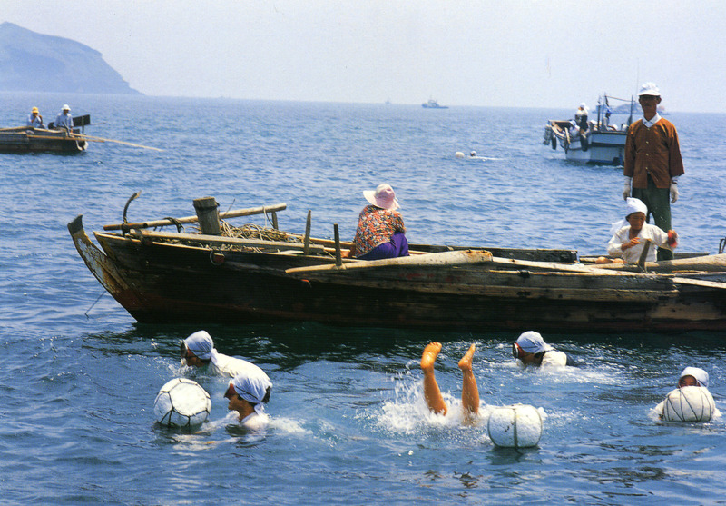
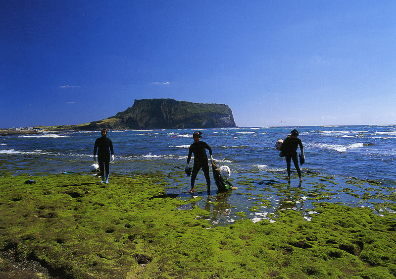

  <물질에 나서는 해녀들>  
  

  <물질을 마치고 뭍에 오르는 해녀들>  
  
  
토론문(2011. 11. 2.)

제주학의 글로컬化(glocalization), 그 모범적 선례의 수립을 지향하며  
  

                                                                             조규익(숭실대학교 교수)

지역학은 인문학, 사회과학, 자연과학 등 다양한 학문들이 참여하여 현대학문의 전향적 흐름인 통섭(統攝)이나 융합을 구현한다는 점에서 기존의 학문적 패러다임을 뛰어넘는 분야입니다. 제주학연구센터의 신설을 통해 제주지역학을 진작(振作)하려는 제주발전연구원의 미래지향적 도전에 경의를 표합니다. 주강현 교수님, 조동오 교수님의 발표와 ｢제주학연구센터 운영 기본계획｣[이하 ｢기본계획｣]을 잘 읽었습니다. 주 교수님과 조 교수님의 발표는 ｢제주학연구센터 운영 기본계획｣을 크게 보완해주시는 내용으로 생각되며, 저는 두 분의 말씀에 전적으로 동의합니다. 따라서 저는 두 분의 발표와 ｢기본계획｣을 읽은 소감 정도의 소박한 견해를 표명하는 선에서 토론자로서의 임무를 완수하고자 합니다.

\*\*\*

제주학연구센터를 포함하여 우리나라 각 지역에는 지역학을 연구하는 기관들이 상당수 있습니다. 무엇보다 중요한 것은 지역학연구소의 철학이나 비전이 시대정신에 맞게 제시되어야 하고, 활동의 방향성 또한 그에 맞추어 고안되어야 한다고 봅니다. 제주는 한국 속의 제주이기도 하고 세계 속의 제주이기도 합니다. 말하자면 제주라는 지역적 특수성과 한국 혹은 세계 안의 한 부분이라는 보편성을 동시에 지니고 있는 공간이어야 한다는 것입니다.

우선 문화적으로 본토 및 세계와의 적절한 관계를 바탕으로 할 때 비로소 제주의 정체성은 살아날 수 있고, 세계화와 지방화라는 일견 상충되는 방향성 또한 적절히 조화시킬 수 있다고 봅니다. 제주의 특수성만을 강조할 경우 제주학은 결코 멀리 나아갈 수 없습니다. 그렇다고 특수성을 몰각(沒却)한 채 보편성만 추구한다면, 제주도의 정체성은 사라지게 됩니다. 상반되는 두 방향성을 발전적으로 통합시키는 방법을 모색하는 길이 제주학연구센터의 성패를 가름하게 될 것이라 생각합니다.

우선 ｢기본계획｣의 모두(冒頭)에 밝힌 ‘계획수립의 배경’에서 저는 현실적인 고민을 발견했습니다. 제주지역이 풍부한 문화자원을 갖고 있지만, ‘세계화의 흐름과 국제자유도시 지향 속에 제주인의 문화적 정체성이 모호해지고 있다’는 점, ‘제주인들이 공감하고 동참할 수 있도록 제주학의 대중화 실현이 요구’된다는 점 등이 해당 내용의 핵심입니다. 이런 현실인식은 뒤쪽에 제시된 제주학연구센터 설립의 비전[“지역을 넘어 세계로 향하는 제주학 정립” : ｢기본계획｣, 64쪽]과는 약간 어긋난다고 봅니다. 말하자면 ‘제주인의 정체성을 확립해야 한다’는 당위와 ‘세계화의 흐름을 거역할 수 없다’는 현실의 상충을 ｢기본계획｣의 첫머리에서 발견하게 된다는 것입니다.

그러나 ｢기본계획｣의 도처에서 제주학연구센터의 차별화를 모토로 ‘다른 지역과 구별되는 지역 뿌리를 찾는 작업을 통해 지역의 정체성을 찾고, 지역주민에게 자긍심과 애향심을 고취하여 궁극적으로 지역발전의 견인차 역할’[｢기본계획｣ 67쪽]을 해야 한다거나, ‘제주지역을 대상으로 제주지역의 내재적 발전을 위한 실천적 활동을 지향하며, 제주의 과거를 바탕으로 현재를 조명하고 미래를 추구해야 한다’는 등 대상과 활동의 범주를 제주로 국한하는 논조는 일관성을 보여주고 있습니다. 그러면서도 공간적 범위를 한반도, 일본, 동남아, 몽골, 중국, 대만, 연해주 등을 포함한 동아시아와 전 지구로 확대해야 한다는 점 또한 강조하고 있습니다.[｢기본계획｣, 70쪽] 이처럼 ｢기본계획｣에서 발견되는 약간의 어긋남은 역설적으로 새롭게 출범하는 제주학연구센터가 유지해야 할 방향성을 보여준다고 생각합니다. 그 전제를 다음과 같이 세울 수 있다고 봅니다.

제주학의 중심은 제주이고, 한반도와 세계는 그 변방이다.

제주학의 특수성은 한반도와 세계 지역학의 보편성과 긴장의 관계를 갖는다.

탈식민의 시대인 지금, 그리움과 선망의 대상일지언정 제주를 변방으로 보는 본토인은 없을 것입니다. 마찬가지로 본토를 중심이라고 생각하는 제주인들도 그리 많지 않을 것입니다. 사실 서울⋅부산⋅인천 등을 제외한 어느 지역도 제주만큼 타 지역이나 타국과 교류가 많았던 곳은 없습니다. 그런 점에서 현재 제주인들 만큼 제주의 정체성에 대한 위기를 느끼는 지역민들도 없을 것입니다. 그러나 정체성은 ‘불변(不變)과 고착(固着)’에서 형성되지 않습니다. 오히려 이질적인 것들의 섞임과 변화를 통해 ‘내 것’을 좀 더 선명하게 구분해낼 수 있는데, 그것이 바로 정체성입니다. 본토나 세계 문화와의 교류를 기피할 이유가 없는 것도 그 때문입니다. 기존의 지역 연구소들이 정체된 모습을 보여주는 것은 사업의 대상이나 범위를 자신들의 영역만으로 한정해왔기 때문입니다. 그런 점에서 ｢기본계획｣의 ‘비전’은 대단히 도전적이면서도 타당합니다. 그런데, 핵심 분야나 구체적인 사업으로 들어가면 비전의 내용은 제대로 반영되고 있지 않습니다. 핵심 분야[｢기본계획｣, 64쪽]에 ‘본토 및 세계와의 연계사업’이 들어가야 하고, 세부사업 추진계획[｢기본계획｣, 78쪽]에 ‘본토와의 비교연구/다른 나라들과의 비교연구’가 추가되어야 합니다.

제주도는 인구의 유입을 통한 저변 확대가 필요하다고 보는데, ‘제주에서 출생한 사람’ 뿐 아니라 주제로 이주해온 사람은 당연히 제주인으로 넣어야 하고, 타지에 살면서 제주를 연구하는 등 제주에 일정부분 기여하고 있는 사람들도 ‘넓은 범위의 제주인’으로 넣어야 한다고 봅니다. 이 점은 연구팀 구성원을 제주도 내 인력에 국한하지 말고 본토나 외국인도 포함시킬 수 있는 근거로 삼을 수 있을 것입니다. 주 교수님께서 지적하신 바와 같이 연구 주체의 존재에 대하여 ‘대학-외부 연구주체, 대학-사회’라는 맥락에서 고민할 필요가 있는데, 제주 내의 연구자나 제주 외의 연구자들 가운데 상당수가 제주도 및 제주대 출신이거나 그와 연관하여 활동하고 있으며, 학문적 기반이 제주도를 제외하고는 설명이 불가능하다는 점은 큰 문제입니다. 그런 한계를 뛰어넘자는 것이 제 생각입니다. 이와 함께 ‘연구자체 사업’[｢기본계획｣, 86쪽]의 ‘제주도민 대상 제주학 교육사업 실시’에서 대상범위를 제주도민으로 한정한 것은 단견이라고 봅니다. 오히려 제주도 밖의 주민들까지도 대상으로 삼을 수 있어야 합니다. 이에 따라 ‘제주학 교육사업’[｢기본계획｣, 79쪽]은 아카데미즘(academism) 일변도를 지양해야 합니다. ‘해녀학교/제주 민요학교/제주 민속놀이학교’ 등 놀이와 일이 통합된 체험적 교육만이 의미를 지닐 수 있습니다. ‘제주 해양문화 연구’[｢기본계획｣, 80쪽]에도 ‘제주 거주 작자의 창작문학 연구’ 혹은 ‘제주를 소재나 공간으로 한 문학 연구’ 등이 포함되어야 합니다. 만약 이런 점들이 보완되면, ‘제주학연구센터의 단계별 발전과정’[｢기본계획｣, 76쪽]은 ‘제주학연구센터 독립기(2017)’에 ‘제주학연구센터 확장기(2020)’까지 추가될 수 있을 것입니다.

제주학의 대상지역을 제주만으로 한정하는 것도 문제가 있습니다. 토론자가 체험한 바에 의하면, 본토의 해안이나 오사카 등지에는 출가(出稼) 물질 후 눌러 살게 된 해녀들이나 그 후예들이 남아 있습니다. 중국의 해안에도 북한의 해안에도 러시아의 연해주 지역에도 제주 해녀들의 자취가 남아 있다고 합니다. 그들이 단순히 물질만 한 것은 아니었습니다. 그들은 민속문화의 매개자로서 노 젓는 노래, 물질하는 노래, 각종 설화 등 많은 문화적 콘텐츠를 그런 지역들에 유포시킨 공로자들입니다. 제주학의 아카이브 구축 사업은 이런 현장조사를 병행하면서 꾸준히 진행되어야 한다고 봅니다. 주 교수님께서 강조하신 아카이브 확충의 방법들은 반드시 실천에 옮겨져야 할 것입니다. 아카이브를 소홀하게 생각해온 것이 우리나라 지역학회나 연구소들의 공통된 폐단이었음을 생각한다면, 제주학연구센터는 그런 문제점의 해결을 가장 우선적인 과제로 삼아야 하리라 봅니다.

\*\*\*

주 교수님께서도 이미 언급하셨지만, 제주인에게 ‘변방의식의 극복’은 매우 중요합니다. 자기중심적 영역의 확보를 통한 정체성의 확립은 제주인들에게 가장 시급한 일입니다. 제주를 특별자치도로 설정한 것은 제주도민들의 변방의식을 떨쳐버릴 수 있는 첫 기회라고 봅니다. 진정한 ‘탈식민’으로 나아가기 위해서는 이런 행정조치와 함께 제주도민의 자생적 의식화 작업이 병행되어야 한다. 방언, 민속 문화, 고유한 생활양식 등 제주의 문화를 살리고, 그것들을 통해 제주인으로서의 자부심을 느끼게 하는 일이야말로 제주인들에게는 정신적 홀로서기의 바탕이라고 생각합니다. 제주학연구센터는 그 확실한 이론적⋅실제적 바탕일 수 있습니다. 센터를 중심으로 시대의 보편적 요구인 융복합적 연구를 수행하기 위해 본토나 해외의 경험 있는 학자들이나 컨설팅 분야의 인력들을 초치한다면 금상첨화일 것입니다. 외국으로부터 섬 문화의 활성화를 통해 이룩한 선례들을 활발하게 도입할 수만 있다면, 제주학연구센터의 발전 단계는 훨씬 앞당길 수 있다고 봅니다. 문제는 돈입니다. 다른 지역과의 형평성 등을 고려할 때 정부로부터 큰돈을 끌어오는 데는 한계가 있을 것입니다. 제주 연구자들의 인력풀을 확대하여 그들로 하여금 제주를 주제로 하는 프로젝트의 개발에 적극 참여하게 하는 것도 간접적인 투자방식으로는 매우 효과적일 것이라 봅니다. 그러기 위해서라도, 제주를 주제로 하는 프로젝트 팀을 꾸릴 경우 연구센터의 연구원이 공동연구자로 적극 참여하거나 소정의 절차를 거쳐 연구센터의 자료를 서비스하는 등 현실적인 지원을 제공하는 방법을 강구해야 할 것입니다.

그리고 이왕 제주학연구센터가 출범한 이상 제주 지역 내 기존의 학회나 연구소, 대학 등과의 역할 중복을 막기 위해서라도 그들과 발전적인 제휴를 맺고, 장기적으로는 통합의 방향으로 나아가야 할 것입니다. 이렇게 될 경우 제주학연구센터는 빠른 시간 안에 지역학의 글로컬化를 이룩한 모범적 선례로 자리 잡을 수 있으리라 믿습니다.

감사합니다.

공유하기

게시글 관리

**백규서옥\_Blog ver.**