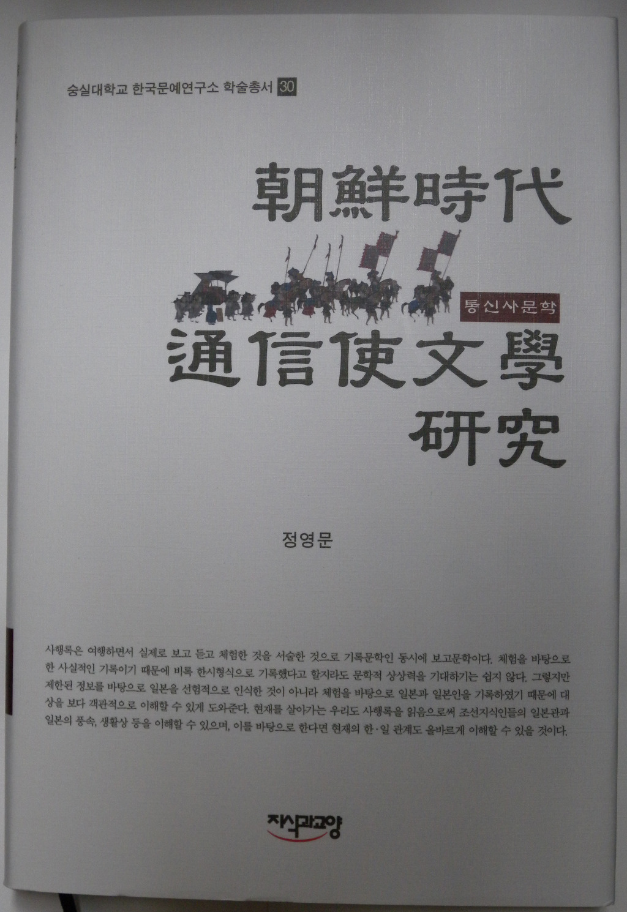
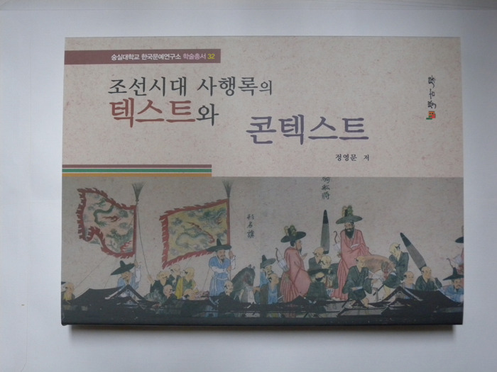
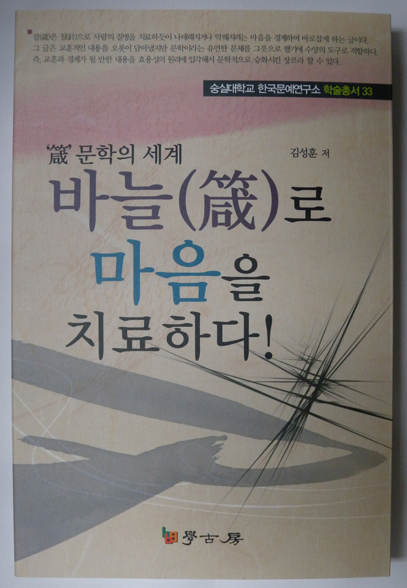
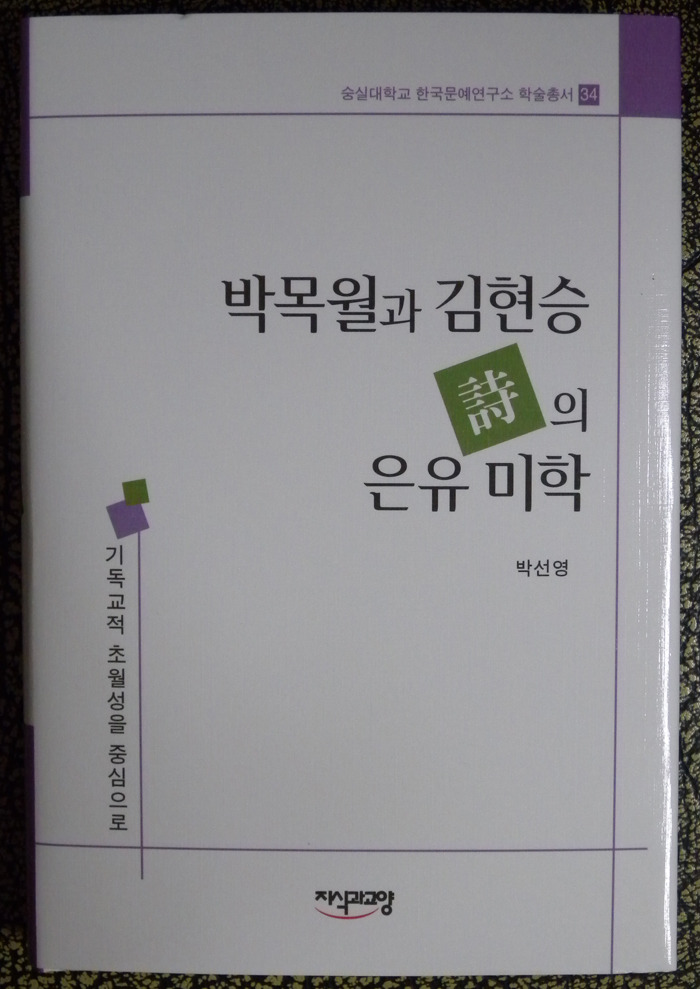
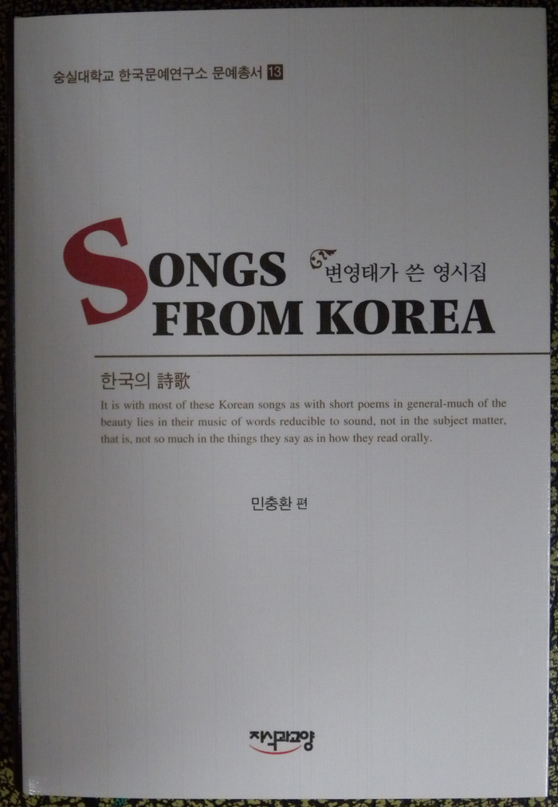

  

한국문예연구소, 이 가을에 풍성한 수확의 기쁨을 누리다!!!

이 가을 들어 한국문예연구소의 뛰어난 학자들이 좋은 책들을 발간했습니다.

정영문 박사가 <<조선시대 통신사문학 연구>>(지식과교양/학술총서 30)과 <<조선시대 사행록의 텍스트와 콘텍스트>>(학고방/학술총서 32)를, 김성훈 박사가 <<바늘(箴)로 마음을 치료하다!>>(학고방/\*학술총서 33)를, 박선영 박사가 <<박목월과 김현승 시의 은유미학>>(지식과 교양/학술총서 34)를, 민충환 교수가 <<변영태가 쓴 영시집 Songs From Korea>>(지식과교양/문예총서 13)을 각각 펴냈습니다. 내용도 내용이려니와 디자인도 깔끔하고 멋집니다. 축하의 말씀들을 전해주시면 고맙겠습니다.

각 저서들의 내용은 다음과 같습니다.

1. 정영문

<<조선시대 통신사문학 연구>>, 한국문예연구소 학술총서30으로 출간!!!

숭실대학교 한국문예연구소 학술총서로 발간된 <<朝鮮時代 通信使文學硏究>>(정영문, 지식과교양)는 조선시대에 일본을 여행했던 통신사의 발자취를 찾아가는 연구서이다. 한국과 일본은 고대국가가 성립되기 이전부터 교류가 있었지만, 이러한 교류는 자발적이고 개인적인 교류라기보다는 국가적인 필요에 의해 진행된 정책적인 성격이 강했다. 이러한 한ㆍ일간의 교류를 기록한 자료가 많지 않은 현재의 상황에서, 그나마 풍부한 자료를 수록하고 있는 <<해행총재>>는 중요한 자료적 가치를 지닌다.

<<해행총재>>를 텍스트로 삼아 조선시대의 한ㆍ일 교류사를 연구하고 있는 저자는 박사학위논문을 다듬어 <<朝鮮時代 通信使文學硏究>>로 출판하였다. 이 책은 8장으로 구성되어 있으며, Ⅱ장에는 통신사의 사행노정과 그 노정이 지니는 성격, 조선시대 통신사행의 시기별 분류와 각각의 성격을 제시하고 있다. 저자는 임진왜란, 1636년, 1682년 전ㆍ후로 통신사의 사행을 4분류하면서 각 시기를 대표하는 사행록을 제시하였는데, 건국직후에서부터 임진왜란 직전까지 사행했던 통신사의 대표적인 기록으로는 송희경의 <<일본행록>>과 김성일의 <<해사록>>을 제시하였다. 이들 사행록을 Ⅲ장에서 분석하고 있다. 1592(선조 25)년부터 1635(인조 13)년까지 사행한 통신사의 사행록은 Ⅳ장에서 분석 제시하였다. 1636(인조 14)년부터 1655(효종 6)년까지 사행한 통신사의 대표적인 기록으로는 김세렴의 <<해사록>>과 남용익의 <<부상록>>을 제시하고, 이들 사행록을 Ⅴ장에서 분석하였다. 1682(숙종 8)년부터 1811(순조 11)년까지 일본을 사행한 통신사의 대표적인 기록으로는 신유한의 <<해유록>>과 조엄의 <<해사일기>>을 제시하고, 이를 Ⅵ장에서 분석하였다. 이러한 분석을 바탕으로 저자는 통신사가 비록 시기마다 다른 특징을 보이지만, 왜구문제해결이라는 현실적인 필요성에서 점차 문화교류라는 형식적인 교류로 성격이 변모되어 갔다고 보았다.

조선시대에 외국을 여행하는 기회는 사행에 참여하는 방법이 거의 유일할 정도였다. 이런 까닭에 일본과 일본인에 대한 기록을 발견하기도 쉽지 않다. 조선시대에 주변국가와 그 나라 사람들에 대해 기록하고 있는 사행록은 여행하면서 실제로 보고 듣고 체험한 것을 서술한 기록문학인 동시에 보고문학이다. 체험을 바탕으로 한 사실적인 기록이기 때문에 비록 한시형식으로 기록했다고 할지라도 문학적 상상력을 기대하기는 쉽지 않다. 그렇지만 제한된 정보를 바탕으로 일본을 선험적으로 인식한 것이 아니라 체험을 바탕으로 일본과 일본인을 기록하였기 때문에 대상을 보다 객관적으로 이해할 수 있게 도와준다. 현재를 살아가는 우리도 사행록을 읽음으로써 조선지식인들의 일본관과 일본의 풍속, 생활상 등을 이해할 수 있다. 사행록에 대한 연구서이기에 <<朝鮮時代 通信使文學硏究>>도 한ㆍ일 관계를 이해하는데 약간이나마 도움을 줄 수 있으리라 생각한다.

도서춢판 지식과교양, 2011. 값 22,000원

2. 정영문

<<조선시대 사행록의 텍스트와 콘텍스트>>, 한국문예연구소 학술총서 32로 발간!!!

숭실대학교 한국문예연구소 학술총서 32으로 발간된 <<조선시대 사행록의 텍스트와 콘텍스트>>(정영문, 학고방)는 사행체험과 인식, 사행을 계기로 발전하였던 지방의 관변공연물에 관한 연구논문을 정리한 것이다.

조선에서는 중국과 일본으로 사신을 파견하여 외교를 진행하였는데, 이들 나라를 사행하고 돌아온 사신들은 자신의 견문과 감상을 기록하였다. 그 속에는 사행당시의 상황과 사행에 참여한 인물들의 인식만 아니라 사회, 문화, 외교, 경제 등의 다양하고 상세한 내용이 기록되어 있다. 그 기록 중에는 조선시대에 한양과 지방에서 다양한 공연이 이루어졌다는 사실도 발견할 수 있는데, 이러한 관변공연물에 대한 관심이 책으로 나온 것이다.

저자는 사행록을 텍스트로 하여 연구한 9편의 논문을 1부 연행사와 통신사의 기록과 인식과 2부 사행록과 문화적 배경에 나누어 수록하고, 사행록과 관련한 연구논저의 목록을 부록으로 첨부하였다.

사신행차는 정해진 노정을 따라 이동하였는데, 몇몇 지역에서는 사신을 위로하는 전별연이 있었다. 전별연은 숙소와 가까운 누각을 중심으로 이루어졌으며, 이 자리에서 주된 관심거리는 공연이었다. 이 공연을 관람하기 위해 주변의 여러 고을에서도 사람들이 모여들었기 때문에 공연무대 주변은 커다란 축제의 장이 되었다. 여기에서 공연되는 양상은 지역마다 차이가 있는데, 경상도 지역에서는 각 고을을 대표하는 기생과 악공이 모여들어 기량을 드러낸 반면에 평안도 지역에서는 경제력을 갖춘 일부 지역에서 독자적인 공연을 기획하였다. 그러므로 공연된 춤과 음악을 통해서 지역의 문화적 우열을 확인할 수 있었고, 공연물이 전국적으로 확대되는 계기가 되었다. 뿐만 아니라, 일부 공연물은 선상기를 통해 궁중에 소개되어 궁중정재로 정착되기도 하였다. 이러한 확산을 가능하게 한 것은 사신을 위로하는 전별연 등에서 공연된 관변공연물이 여러 해 동안 반복되면서 높은 수준의 형식미를 갖추었기 때문이다. 지금은 당시의 관변공연물이 전하지 않기 때문에 공연의 정확한 면모를 확인하기는 어렵지만, 오늘날의 지방축제처럼 조선시대에도 축제가 있었고, 지방민들도 이러한 축제를 통해 문화를 향유하였음을 이 책을 통해서 구체적으로 확인할 수 있다.

도서출판 학고방, 2011. 값 22,000원

3. 김성훈

『‘箴’문학의 세계, 바늘(箴)로 마음을 치료하다!』, 한국문예연구소 학술총서 33으로 출간!!!

잠(箴)은 침(鍼)과 통용되는 字義를 가지고 있는데, 오래 전부터 육체의 질병을 치료하거나 예방할 때 鍼을 놓았다. 이러한 의학적 효용성이 타인이나 자신을 규계(規戒)하는 목적을 지닌 문학 장르로 발전한 것이 바로 ‘箴’이다.

이에 의거하여 과거의 학자들 역시 마음속의 티끌을 미리 제거하고 예방하기 위해 ‘箴’이라는 장르의 글을 많이 창작했다. ‘箴’은 옛 성현들의 훌륭한 문구들을 가져다가 일상의 경계로 삼기에 매우 적합한 장르였으며, 그 글에는 교훈적인 내용을 오롯이 담아냈지만 문학이라는 유연한 문체를 그릇으로 했기에 수양의 도구로도 적합하다. 즉, 교훈과 경계가 될 만한 내용을 효용성의 원리에 입각해서 문학적으로 승화시킨 장르라 할 수 있다.

본고는 역대작가들의 箴작품을 대상으로 그 양식적 특성을 살피기 위해 사상적, 표현적 특질을 두루 연구한 것이다. 이를 통해 그간에 철학적인 성격이 짙은 글로만 여겨왔던 箴의 문학성도 추출해내는 계기가 되었다.

내용을 간략히 요약하자면, 2장에서는 箴의 발생 연원을 문헌적 측면과 개념적 측면으로 나누어 고찰했다. 문헌적 측면에서는 여러 문헌의 글을 살핀 결과, 箴이 三代에 발생하였으나 周代 이후에 더욱 뚜렷한 발전양상을 보인 것으로 판단했다. 개념적 측면에서는 허신의『설문해자(說文解字)』를 비롯한 몇몇 문헌을 통해서 箴이 효용성을 목적으로 하게 된 유래를 살폈다.

3장에서는, 箴의 종류가 관잠(官箴)과 사잠(私箴)으로 나뉘는 근거를 구체적으로 살폈고, 서로 주고받는 효용성을 다분히 가진 문학임을 확인했다. 또 경전류(經典類)의 전고(典故)를 활용하기에 적합한 장르임을 확인했으며, 心性 의인문학의 대표작품인「천군전(天君傳)」과 心性을 의인화한 箴을 비교하여 그 영향관계를 고찰했다. 더불어 五倫歌類의 교훈시가와의 비교를 통해 내용적 상관성을 살폈다.

4장에서는, 箴의 주제표현 양상을 직설적 경계와 비유적 경계의 두 부분으로 나누어 살펴보았다. 직설적 경계에서는 유학사상의 실천덕목과 유학적 정치관을 경계한 작품들을 주제별로 세분해보았다. 비유적 경계에서는 心性 의인화 표현이 보이는 箴을 고찰하여, 내용 전달의 효율성을 확인했다. 또 몇몇 사물 및 동물을 소재로 하여 비유적 표현을 구사한 작품들을 살폈다. 예를 들어, 거울의 속성을 비유해서 심성을 수양하는 箴의 내용을 확인했고, 사물 및 동물을 빗댄 풍유의 수사를 통해서도 箴의 문학성을 고찰했다.

5장에서는, 구약성서 ‘잠언’과의 비교를 통해 한문학 ‘箴’과의 공통적 요소를 살펴보았다. 잠언은 이야기 형식이 아니면서, 간결하게 표현되어 있는 속담ㆍ격언ㆍ옛말ㆍ금언 등의 형식적 특성이 있는데, 이 잠언은 고립된 사건에서 끌어낸 관찰들이 아니며, 고립된 사건에만 적용할 수 있는 것들도 아니다. 이러한 점은 箴도 마찬가지인데, 箴에 담긴 교훈적 의미는 시대를 초월해서 적용될 수 있는 소지가 충분하기 때문이다. 일상의 윤리적인 교훈을 주로 담아냈다는 점도 잠언과 箴의 공통점이라 할 수 있다. 또 형식ㆍ표현적 측면에서는 잠언과 箴 모두 암송에 적합한 對句형식을 활용했음을 확인했고, 잠언의 ‘지혜’ 의인화와 箴의 ‘마음’ 의인화도 서로 비슷한 이념을 담고 있음을 알 수 있었다.

6장에서는, 箴의 통시적 양상을 알아보았다. 우선 역대작가의 작품 일람을 통해 箴의 존재 양상을 살폈고, 箴이 역사적으로 어떤 전개 양상을 보였는지 역사 사료 및 문집의 기록을 통해 고찰했다.

연구 초기의 열정에 비해서는 많이 모자란 결과물이지만, 이 글이 ‘箴’ 장르를 널리 알리는 계기가 되어 조금이나마 학계에 보탬이 될 수 있다면 좋겠다. 더불어 ‘箴’은 올바른 삶을 살도록 권계하는 처세법을 담은 글이기에 일반인들에게도 친숙한 내용으로 다가갈 수 있으리라 본다.

도서출판 학고방, 2011. 값 18,000원

4. 박선영

<<박목월과 김현승 시의 은유미학>>, 한국문예연구소 학술총서 34로 출간!!!

숭실대학교의 한국문예연구소 학술총서(34)로 박선영의 <<박목월과 김현승 시의 은유 미학>>(지식과교양)이 발간되었다. 이 책에서 연구 대상으로 삼은 박목월 시인(1916~1978)과 김현승 시인(1913~1975)은 동시대에 살았으며 우리 현대시사에서 간과할 수 없는 중요한 위치에 놓여 있다. 이들은 기독교 정신에 뿌리를 두고 있는 대표적인 시인이기도 하다.

이 책의 저자는 지금까지 박목월과 김현승의 시에 관한 논의가 상당한 연구 성과를 거두었음에도 두 시인의 시세계 전반에 걸쳐서 연구가 활성화되지는 못하였다는 점에 대해 문제를 제기하고 있다. 저자는 박목월과 김현승에 관한 선행연구에서 초기시와 중기시에 비해 후기시에 관한 연구가 매우 부족한 실정임을 지적하였다. 그는 박목월과 김현승의 후기시는 이들의 시적 역정을 마감하는 시점으로서 여기에는 이들이 궁극적으로 지향했던 기독교적 초월성이 수렴된다는 점에서 매우 중요하다고 보았으며, 특히 두 시인의 유고시집은 기독교의식이 본격적으로 구현된다는 점에서 주시할 필요가 있다고 보았다.

이 책의 저자는 박목월과 김현승 시의 핵심이 초월성에 놓여 있다는 점에 천착하여 이를 고찰하였다. 초월성은 기독교 시인에게 있어 아주 보편적이면서도 본질적인 문제라고 할 수 있다. 두 시인의 경우에는 후기시로 오면서 초월성이 본격화되기에 이른다. 이에 저자는 두 시인의 시세계 가운데서도 기독교적 초월성이 극명하게 나타나는 후기시, 즉 박목월의 <<경상도의 가랑잎>>(1968), <<어머니>>(1968), <<무순>>(1976), 유고시집 <<크고 부드러운 손>>(1979)과 김현승의 <<김현승시전집>>(1974)에 수록된 <<날개>>, 유고시집 <<마지막 지상에서>>(1975)를 연구 범주로 삼고 있다.

이 책에서 저자가 주목한 것은 박목월과 김현승 시인이 지향하는 초월성이 정교한 은유적 의미망 속에서 전개되고 있다는 점이다. 박목월과 김현승은 격변기였던 근대적 시간을 살았던 시인들로서 동일성이 상실된 근대를 지나면서도 동일성의 시학을 고수하였다. 그래서 이들의 시에는 자아와 세계의 합일을 추구하는 은유적 세계관이 지배적으로 나타난다. 주지하다시피 은유는 단순히 표현 기법의 문제가 아닌 인식의 문제에 관련된 것으로 창조적인 의미생성에 관여하는 시의 본질적인 요소이다. 저자는 이러한 은유가 박목월과 김현승 시의 핵심적인 시적 원리이자 미학적 원리로 작용하고 있음에도 이에 관한 논의가 제대로 이루어지지 못했다는 점에서 연구의 필요성을 주장하였다. 이 책에서 저자는 두 시인의 시에 나타난 은유적 상상력을 총체화하기 위해 언술의 차원에서 은유를 파악하는 흐루쇼브스키의 은유 이론을 시분석의 방법론으로 활용하였다.

이 책은 총 4부로 이루어져 있다. 서론에 해당하는 Ⅰ부에서는 문제제기와 더불어 방법론을 간략하게 정리하였다. 그리고 Ⅱ부에 수록된 ｢<<경상도의 가랑잎>>의 사물화 양상｣, ｢<<사력질>>, <<무순>>에 나타난 죽음과 초월의 은유체계｣, ｢‘어머니’ 시에 나타난 은유 양상｣, ｢<<크고 부드러운 손>>에 나타난 초월성의 은유 미학｣은 박목월 후기시에 나타난 은유 양상을 분석한 것이며, Ⅲ부에 수록된 ｢후기시의 사물화 양상 -광물에 토대 한 사물을 중심으로｣, ｢후기시에 나타난 ‘동물’의 은유화 양상｣, ｢<<마지막 지상에서>>에 나타난 은유 미학｣은 김현승 후기시에 나타난 은유 양상을 분석한 것이다. 이를 토대로 하여 Ⅳ부에서는 박목월과 김현승 시인의 시에 나타난 은유적 인식의 차이를 고찰하고 있다. 이를 통하여 은유가 박목월과 김현승 시의 주된 미학적 원리임을 밝히고, 이들의 인식의 확장 및 갱신을 조명해내었다.

이 책은 지금까지 단어나 문장의 차원에서 논의되어 온 은유의 지평을 확대하여 언술의 차원에서 고찰하였다는 점에서 의의가 있다. 또한 박목월과 김현승 시의 은유적 상상력을 총체화함으로써 기존의 논의들과 뚜렷한 변별성을 확보하고 있다는 점에서도 의미가 크다고 하겠다.

도서출판 지식과 교양, 2011. 값 24,000원

5. 민충환

<<변영태가 쓴 영시집 Songs From Korea>>, 한국문예연구소 문예총서 13으로 출간!!!

<<변영태가 쓴 영시집 Songs From Korea>>가 한국문예연구소 문예총서 13으로 출간되었다. 이 책의 1부에는 영어로 번역한 옛 시조 102수를 실었고, 2부에는 자작 영시 33수를 우형숙 선생의 번역으로 실었으며, 책 전체는 민충환 교수가 편집했다. 변영태(1892~1969)는 큰 형 변영만[법조인이자 한학자], 동생 변영로[시인이자 교육자]와 함께 ‘삼변(三卞)’으로 불리던 정치가⋅학자⋅시인이었다. 그는 이승만 정권에서 외무부 장관과 국무총리를 지내면서 큰 공을 세웠고, 고려대학교 교수를 지내기도 했다. 그의 저술로 <<나의 조국>>(1956), <<외교어록>>(1959), <Songs From Korea>>(1948) 등이 있다.

이 책의 특징은 시조 영역의 선례(先例)들이 없는 상황에서 스스로 시조의 본질에 대한 탐구를 바탕으로 영역(英譯)을 시도함으로써 후대 인사들에게 시조 영역의 모범을 보였다는 점에서 찾을 수 있다. 창작 영시 또한 당시로서는 찾아 볼 수 없는 희귀한 작업이었다. 한국인으로서 쉽지 않은 영시의 본질에 대한 깨달음을 바탕으로 시를 창작하고 옛 시조를 번역했다는 점은 ‘한국문학의 세계화’를 지향하는 요즈음에도 무시할 수 없는 의미를 지닌다고 할 수 있다.

도서출판 지식과교양, 2011. 값 22,000원

공유하기

게시글 관리

**백규서옥\_Blog ver.**