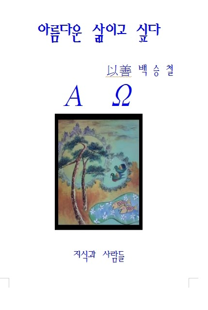

  
추천의 말  
  
존재의 자각, 그리고 간절한 신앙고백  
  
  
                                                 조규익(숭실대 교수/한국문예연구소장)  
  
  
조물주는 인간에게 영혼과 육신을 허락했으나, 영혼에 비해 육신은 덧없이 짧다. 대부분의 인간은 영적으로 성숙되기 이전에 육신을 잃고 만다. 인간의 삶을 이끄는 주체는 영혼이고, 그 영혼의 완성이나 구제는 신의 영역이다. 육신은 욕망의 근원이므로 육신에 집착하는 자에게 ‘육신은 굴레(bondage)’일 뿐이라는 것이 철학자 스피노자의 말이다. 과연 인간은 육신의 욕망을 탈각하고 정결한 영혼의 세계에서 노닐 수 있을까. 그래서 우리는 신의 손길을 갈망한다. 신의 손길만이 절망의 나락에 빠진 인간을 구할 수 있다. 그럼에도 머지않아 닥쳐 올 심판의 시간을 외면한 채 육신과 욕망의 노예가 되어 방황하는 인간들의 어리석음을 보라.   
     \*\*\*  
지금 이 순간, 시인 백승철의 신앙고백이 눈물겹도록 귀하다. 그는 몸을 불사르며 영혼의 완성을 간구하는 삶을 살고 있다. 그래서 그의 삶은 구도자의 그것이고, 그의 시는 편편이 신앙고백이다. 종교 역사 상 가장 뛰어난 신앙고백 <사도신경>의 핵심을 그의 시에서 발견한다. 전능하신 조물주와 그의 독생자 예수 그리스도에 대한 믿음, 빌라도의 박해 속에서 육신의 감옥을 벗어나 성령으로 임재하시는 예수 그리스도에 대한 믿음, 조만간 도래할 심판과 영생에 대한 믿음 등등. 그래서 그는 필사적이면서도 의연하다. ‘박해의 쓴 잔’을 물리치지 않고 부활의 기적을 보이신 예수님만 바라보기 때문인가. 그 역시 육신을 짓부순 고통에 좌절하지 않고 영혼의 완성에 매진한다. 육신보다 영혼의 불멸을 믿기 때문일 것이다. 영혼의 구원에 대한 믿음이 그로 하여금 육신의 굴레를 간단히 뛰어 넘을 수 있도록 했을 것이다. 내 뱉는 그의 말들 모두가 절절한 신앙고백인 것도 그 때문이다. 말하자면 <사도신경>의, 아니 성서 자체의 패러프레이즈라 할 수 있을 것이다. 예수님의 삶을 우러르며, 스스로의 삶 갈피갈피 묻어나는 고통과 회한을 순화시켜 가는 구도자의 고백이다. 그것이 바로 백 시인의 시편들이다. 다음과 같은 그의 시는 얼마나 처절한가.     
  
그래  
아무리 밉다 곱다 해도  
된서리에 쪼그라들어  
비굴해진다 해도  
뿌리 하나만큼은  
꿋꿋이 뻗치고 있으니  
또 어찌어찌  
견디게 되겠지  
오롯이 살아지겠지  
혹독한 겨울을 딛고  
한 치라도 더 파고들어  
이 세상  
한 줌 흙이라도 되겠지  
       -<겨울나기> 전문-  
  
우리는 흔히 ‘겨울나기’를 ‘월동(越冬)’이라 말한다. 그러나 나에게는 그 두 말의 내포가 사뭇 다르다. 어쩌면 우리가 심상하게 일컫는 ‘월동’이란 겨울을 뛰어넘은 그곳에 ‘당연히 기다리고 있을 봄’을 상정하거나 기대하는 말인지도 모른다. 그러나 백 시인의 ‘겨울나기’는 절망의 심연 그 자체다. 절망에 빠져 허우적대면서도 ‘어떻게 견디게 되겠지’라는 실오리만한 희망을 가져보기로 한 것이다. 매서운 추위에 줄기와 가지는 얼어 죽어도, 뿌리는 남아 있기에 나무는 새로운 부활을 꿈꿀 수 있는 것 아닌가. 그래서 결국 ‘이 세상 한 줌 흙’이라도 될 수 있을 거라는 희망을 가져보는 것이다. 그 희망은 믿음이다. 절망의 심연에 빠져 본 사람 만이 희망의 소중함을 알 수 있다. 백 시인은 지금 빠져 나오지 못할 줄 알았던 지난 시간대의 ‘모진 겨울’을 회감(回感)하고 있는 것인지도 모른다. 백 시인의 그 희망이 도타운 신앙의 심지가 되어 커다란 횃불로 타오르고 있는 모습을 이 시는 내포하고 있다.   
     \*\*\*  
학창 시절의 백 시인은 과묵했다. 말을 걸어도, 빙긋 웃을 뿐 끝내 말문을 열지 않았다. 대신 그의 말은 시가 되어 나왔다. 누에고치에서 비단실 풀려나오듯 그의 시들은 늘 빛나고 단정했다. 교단생활을 거치며 인간에 대한 관심으로 시의 폭은 넓어졌고, 신을 발견하면서 신앙고백으로 상승했다. 자아성찰을 바탕으로 신을 바라보는 그의 시안(詩眼)이 견고하다. 흡사 <사도신경>을 자신의 말로 풀어내려는 듯 그의 필치는 거침이 없다. 신의 존재를 발견하게 되었고, 결국 그에게 기대게 되었기 때문이다. 인간은 고통을 통해서만 성장할 수 있고, 고통 속에서만 신에게 다가갈 수 있는 존재라는 사실을 그에게서 확인한다. 고민과 고통 속에 허우적대본 경험이 있는 사람이라면, 백 시인의 시를 읽으며 막힌 가슴을 뚫어볼 일이다. <2011. 12. 17.>

공유하기

게시글 관리

**백규서옥\_Blog ver.**