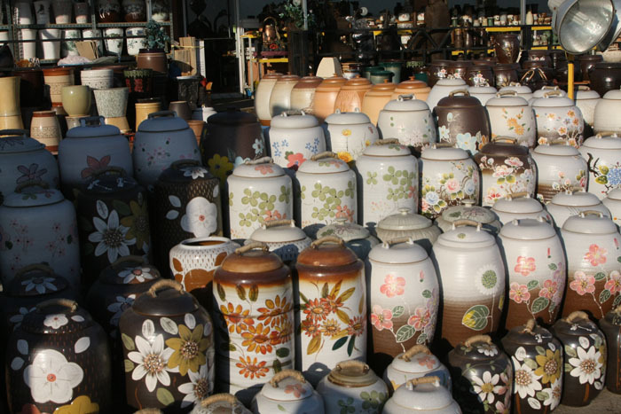
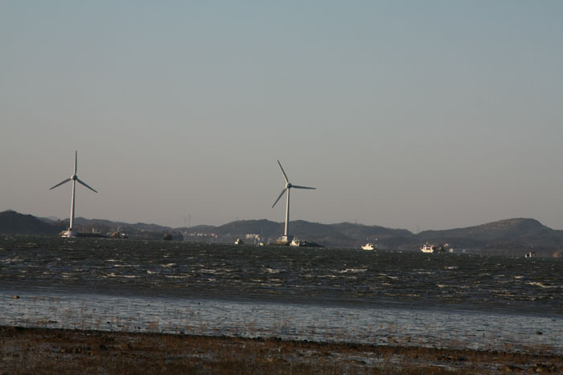
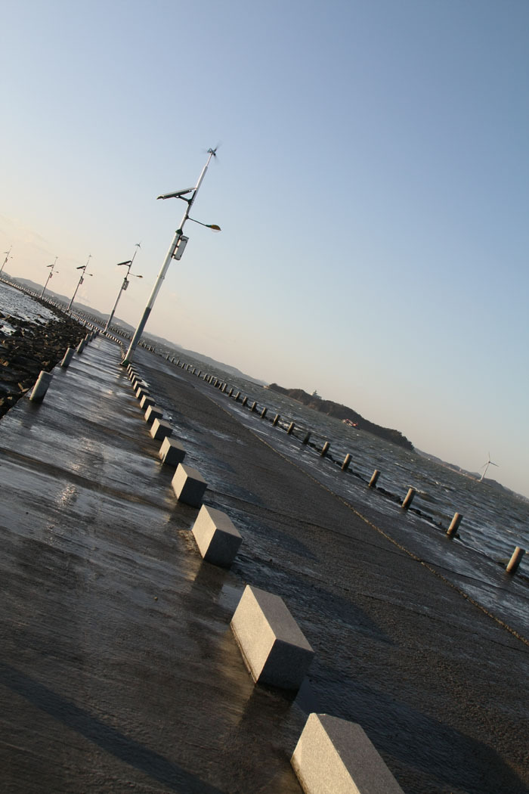
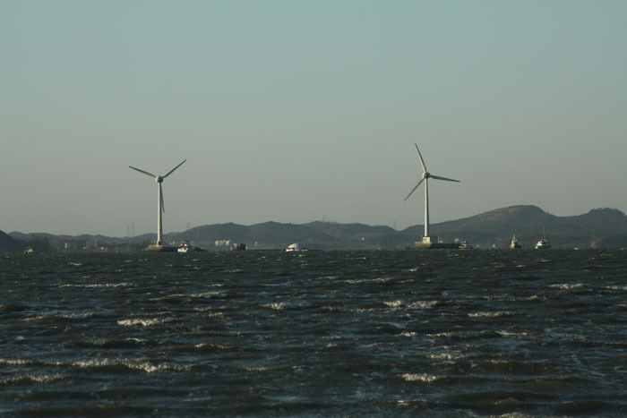
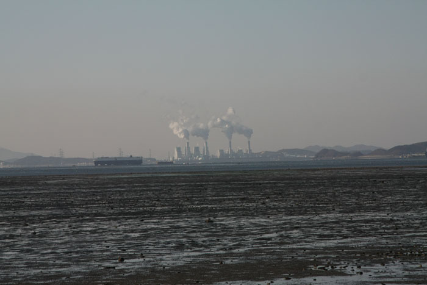
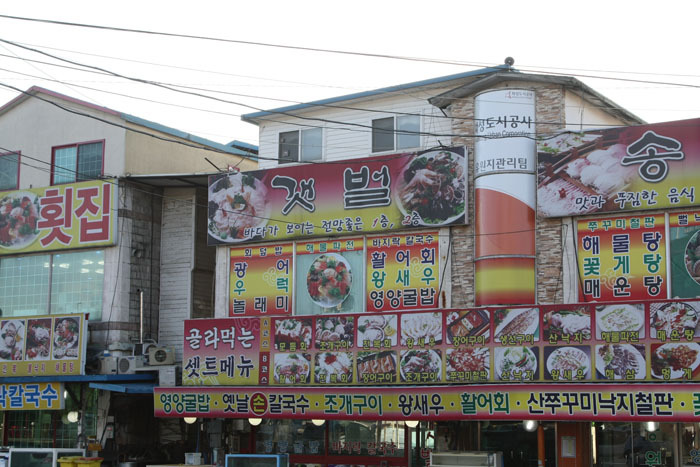
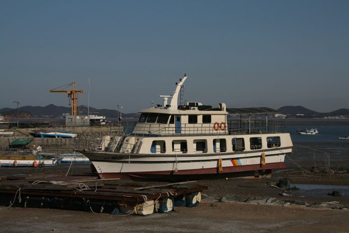
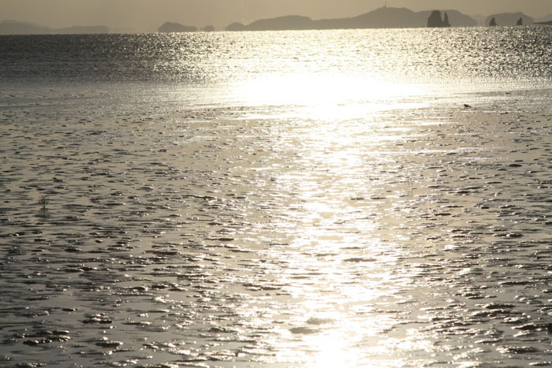
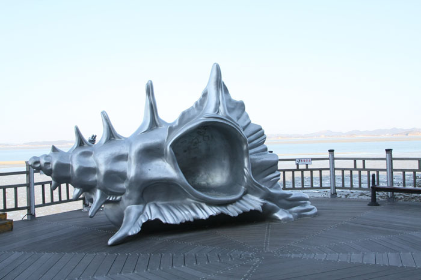

  

제부도 행

xml:namespace prefix = o ns = "urn:schemas-microsoft-com:office:office" /

백규

겨울의 제부도는 쓸쓸했다. 텅 빈 바닷가에 불어오는 바람, 그 바람결이 몹시 차가웠다. 차갑다 한들 살을 에기야 하겠냐만, 바람결에 봄기운의 약속은 단 한 오라기도 들어 있지 않았다. 그래도 좋았다. 하늘에선 깔깔한 햇살이 내려 쪼이고, 팔리길 고대하는 도자기들을 겹겹이 쌓아놓은 길가의 가게도 운치를 더했다. 경기도 화성시 서신면 송교리 해안에 도착한 것이 오후 3시 반쯤. 30분쯤 기다리니 제부도를 건너는 길이 열렸다. 물에 잠겼던 시멘트 길이 열린 것이었다. 사람들은 그것을 ‘모세의 기적’이라 불렀다. 조금 전까지 물에 잠겼던 증표일까. 번질번질한 길옆엔 검푸르게 질려버린 바닷물이 금방이라도 길바닥으로 넘어올 듯 철럼거렸다.

차를 몰아 2km를 건너는 5~6분 동안 ‘왜 제부도라 불렀을까’를 두고 오른쪽의 바닷물과 왼쪽의 갯벌은 무수한 말들을 교대로 들려주었다. 사람들은 ‘제(濟)’와 ‘부(扶)’를 들어 ‘제약부경(濟弱扶傾)’을 그 어원이라 했다. 즉 “송교리에서 제부도 사이의 갯고랑을 어린아이는 업고 노인들은 부축하고 건네 준 것을 '제약부경'이라 하였는데, 제자와 부자를 따서 제부도라 하였다”는 것이다. 말하자면 <<춘추정전(春秋正傳)>>에 나오는 ‘제약부경지의(濟弱扶傾之義)’로부터 명칭을 따왔다니 참으로 섬에 대한 명명치고는 너무 유식해서 재미없다. 물이 빠지면 어린아이 노인 할 것 없이 몰려 나와 바지락도 캐고, 낙지도 잡고, 망둥이도 잡았겠지. 그러다가 물이 들어올 때쯤이면 함께 손을 잡고 부축하며 갯벌에서 빠져 나왔을 것이다. 원래 ‘제부섬’이라 불러왔는데, 언젠가부터[아마 일제 때였을 것] 그 섬 이름을 한자로 등재하기 위해 고심하다가 그런 광경과 결부시켜 한자로 적다보니 ‘제약부경’의 의미까지 갖다 둘러  댄 것이리라. 어쩌면 그 옛날 해안에 살던 사람들은 봄이 오면 그 섬으로부터 제비 떼가 몰려오는 것을 목격했을지도 모른다. 아니면 사람들도 적고, 주변 갯벌에 먹이도 많아 제비들이 이 섬에 떼지어 살았을 가능성이 크다.  그래서 사람들은 이 섬을 ‘제비섬’이라 했을 것이고, 그것이 오랜 세월 ‘제부섬’으로 와전(訛傳)되었을 것이며, 결국에는 ‘제약부경’을 견강(牽强)하기에까지 이르게 된 것이나 아닐까.   
  
바다 멀리 풍력발전소의 바람개비들은 끊임없이 돌고, 바닷물은 이빨을 드러내고 다가들었다. 제부도에 들어가니 갯벌이 끝나는 곳까지 모래와 자갈이 깔려 있고, 그 위엔 환한 햇살 아래 어선 두어 척이 하품을 하고 있었다. ‘인영(人影)이 불견(不見)!’ 따스한 봄부터 늦은 가을까지 인파로 붐볐을 이곳이 이토록 텅 빈 것은 차가운 바람 때문은 아닐까. 숙박을 위해 들른 펜션도 추위에 질려 있었다. 방에 들어가 앉으니 가슴 위를 찬바람이 휭 하고 훑는다. 그래, 사람의 온기가 끊어진 몇 주일 간 그 빈자리를 이 찬 바람이 제멋대로 들락거렸구나. 차라리 바다에 맴도는 바람 맛이나 볼까. 해안으로 나오니 바다도 갯벌도 모래사장도 모두 추위에 질려 있었다. 그러나 바다 건너편을 바라보니 서해바다로 연결되는 목이 보이고, 그 언저리에 큰 배들이 조용히 떠 있었다. 아마 짐 가득 싣고 먼 길을 가는 중이었을 것이다. 가만히 팔을 벌려 보니 양 손 닿을 만한 곳에 큰 굴뚝들 두 셋이 흰 연기를 내뿜고 있었다. 아마도 화력발전소들이겠지. 전국의 바다 풍광 좋은 목들엔 어디고 할 것 없이 발전소가 서 있었다. 화력발전소에서는 뜨거운 폐수가 바다로 흘러나올 것이고, 그 뜨거운 물은 상큼한 주변의 바닷물을 뜨뜻하게 만들 것인즉 바지락이며 망둥이며 낙지가 견뎌낼 재간이 없을 것인데. 과연 그들은 이 바닥을 떠나 어디로 이사들을 간단 말인가. 비록 탈황을 했다고 해도 하얀 연기를 보는 순간 내 천식은 또 다시 발작을 하기 시작했다. 수천 년 사람들이 파먹고 뒤 엎어도 끈질기게 다시 생명을 내어놓곤 하던 갯벌이었다. 아침녘에 갯벌을 훑어가며 바지락을 캐내다가 지쳐 집으로 돌아가 하룻밤 자고 다시 가서 호미를 대면 언제 그랬느냐는 듯 싶게 다시 오글오글 바지락들이 들어차 있곤 했다. 그게 갯벌이었다. 왕성한 복원력을 자랑하는 현란한 생명의 현장이었다. 그 바닥이 지금 가슴 벅차게 내 눈 앞에 펼쳐지고 있지 않은가.   
  
제부도! 장어, 농어, 숭어, 망둥이 등이 뛰놀고, 굴과 바지락과 김을 키워내는 곳이다. 누천년 들락거리는 바닷물과 쓰다듬듯 불어대는 바람이 함께 이곳의 생명을 낳고 키웠으리라. 그 생명의 현장을 누군들 버리고 싶으랴? 너와 나의 끝없는 탐욕이 종국에는 이 갯벌도 삼켜 버릴 것임을 우리 모두는 깨닫지 못하고 있으니, 참으로 내 스스로가 가련한 존재 아니랴? 그저 수굿이 제 할 일만 하고 있는 제부도의 바닷물과 바람과 갯벌을 바라보며 반성이나 하다 갈 일이다.<2011. 12. 22.>

공유하기

게시글 관리

**백규서옥\_Blog ver.**