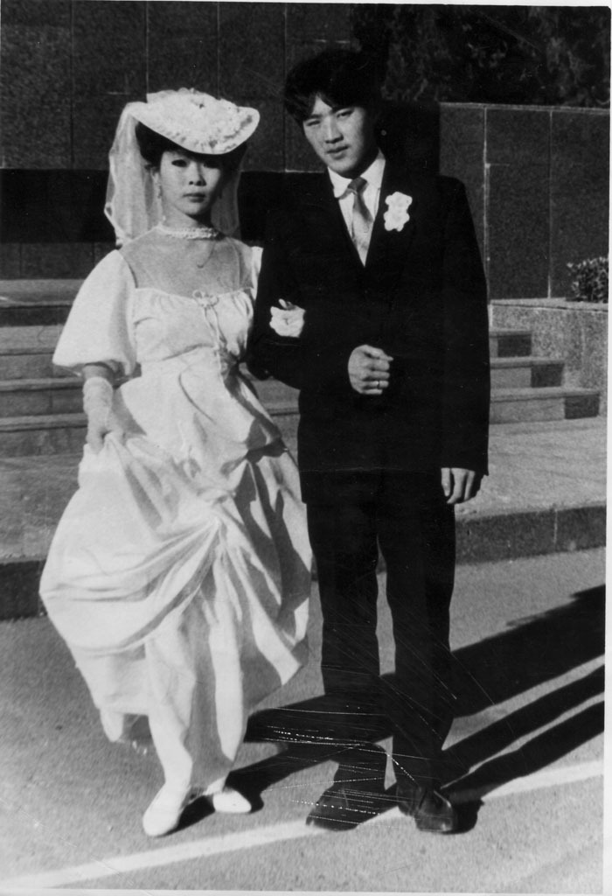

 <우즈베키스탄 고려인 커플의 결혼 사진(1970년대?)>  xml:namespace prefix = o ns = "urn:schemas-microsoft-com:office:office" /

                                                                                                                                                          백규

대학교수로 지내며 나이를 먹어가니 어쩔 수 없이 주례를 서야 할 경우가 생긴다. 제법 오랫동안 내 주변을 서성거리던 제자들이 결혼을 하겠다며 여자들을 끌고 와 읍소하는데 거절할 만한 강심장은 아니었다. 그래서 내키지 않지만, 몇 번 주례를 서 주었다. 그런데 우리와 그들의 관계는 그걸로 끝이었다. 결혼 전에는 종종 전화도 걸어 주고 찾아 주기도 하던 그들이었다. 그런데 그들은 왜 결혼식 이후로는 연락을 끊는 것일까. 혹시 내 주례사에 문제가 있었던가? 그동안 수많은 결혼식을 다녀보며 주례사를 들어보지만, 대개 하나마나 한 말들 뿐이었다. 말 그대로 ‘주례사를 벗어나지 못하는 주례사들’ 뿐이었다. 오죽하면 칭찬만 해대는 서평을 ‘주례사 서평’이라고 부르겠는가. 그런 주례사들을 접하면서 ‘앞으로 주례석에 안서면 안 섰지 저런 주례사는 안 하겠다’는 것이 내 결심이었고, 그간 몇 건의 주례사는 그런 내 생각을 비교적 잘 반영했다고 자부해오던 터였다.

그렇다면 하나같이 내가 주례를 서 준 제자나 후배들이 결혼식 뒤에 연락을 끊는 이유는 뭘까. 나름대로 추정을 해보니 두 가지 이유가 있는 듯 했다. 결혼 후 너무나 환상적인 짝꿍과 행복에 빠진 나머지 미처 주례선생에게까지 연락할 여유를 찾지 못하고 있는 것이 우선 생각할 수 있는 이유였다. 다른 하나는 참 떠올리기 싫은 ‘불편한 가능성’일 수 있는데, 그들 스스로 꿈꾸던 결혼의 환상이 결혼 후에 깨어져 버린 이유로 차마 주례선생을 찾아오거나 연락을 할 수 없었던 것은 아닐까.

늘 강조하는 것처럼 연애는 환상이나 결혼은 현실이다. 연애에서 결혼으로 버전이 바뀌는 순간 모든 것은 현실에 맞추어 재조정된다. 그래서 오죽하면 ‘결혼이란 연애와 사랑의 무덤’이란 극단적 표현까지 있겠는가. 그럼에도 젊은이들은 결혼을 하기 위해 애를 쓴다. 사실 연애에서 결혼으로 넘어가는 과정을 제대로 알고 밟는다면, 더 큰 행복을 맛볼 수 있고, 또 그래야 한다. 연애가 철없는 시절에만 통용되는 ‘무질서의 서사(敍事)’라면, 결혼은 철 든 이후에만 형성될 수 있는 ‘질서 있는 서사’이기 때문이다. 사실 안정감 있는 행복이야말로 ‘질서가 잡힌 서사’로부터 생겨날 수 있다. 그럼에도 젊은 시절의 나를 포함하여 대부분의 젊은이들은 결혼을 연애의 연장으로 생각한다. 그래서 그들은 결혼하고 나서도 ‘무질서의 서사’를 지속하려 하고, 그래서 상당수의 커플들은 좌절과 환멸을 경험하곤 하는 것이다. 그러다 보면 두 사람 사이에 투쟁과 갈등이 생겨나 분위기가 삭막해지거나 급기야 헤어지는 사태에 이르곤 하는 것이다. 내가 생각하기엔, 그래서 내가 주례를 서 준 대부분의 제자들이 결혼 후에 연락을 뚝 끊어버리는 것이나 아니었을까.

  \*\*\*

그래서 다시는 주례를 서지 않겠노라 결심하고 한 두 해를 잘 넘겼다. 그런데, 얼마 전에 미국 사는 친구가 공항 출국장에서 다급하게 전화를 걸어왔다. ‘아들놈 주례 좀 서 달라!’는 부탁이었다. 신부 쪽에서 주례를 세우겠노라고 해서 믿고 맡겼더니 출국 직전에 주례를 세울 수 없게 되었다는 통보가 왔다고 울상이었다. 그에게 어린 시절의 ‘밝히기 힘든’ 빚도 있고 해서, 이른바 ‘땜빵’이었지만, 승낙을 하고 말았다. 엉겁결에 승낙을 했지만, 이내 후회가 되었다. 그러나 미국행 비행기는 이미 태평양 상공을 날고 있었을 것이니, 하릴 없는 일이었다. 그래서 그 커플을 연구실로 불렀고, 점심을 함께 했다. 그들은 눈치를 못 챘겠지만, 면담과 점심을 통해 그들을 테스트해보자는 심산이었다. 담소를 곁들인 점심을 나누다 보니 둘 다 묘한 매력을 지니고 있었다. 잘 만 하면 멋지게 살아갈 수 있겠다는 믿음이 슬그머니 드는 것이었다. 참을성 없어 헤어지기를 밥 먹듯이 하는 요즈음의 커플들과는 많이 다를 수 있을지 모르겠다는 희망 섞인 판단도 생겼다. 그래서 주례사는 달콤한 말 대신 쓴소리를 담았다. 올해로 정확히 30년을 채운 내 결혼생활의 씁쓸한 경험을 바탕으로 한 ‘고백성사’와 같았기 때문일까. 결혼식이 끝난 뒤 친구들은 내게 달려 와 ‘어쩌면 그렇게 내 지난 시절의 실수를 점치듯 들려 줄 수 있느냐’고 눈들을 반짝이며 신기해했다. 어쩜 그건 내 얘기만도 네 얘기만도 아닌 우리 모두의 얘기이기 때문이었을 것이다.

‘결혼생활이란 결코 쉽지 않다’, ‘우리 모두에게 주어진 시간이 너무 짧다’ 는 것이 결혼 30년을 회고하면서 얻은 깨달음이다. 30년 전의 일이 바로 3개월 전의 일인 듯 생생한데, 그 짧은 시간을 ‘사랑만으로’ 살아오지 못한 것이 가장 후회스럽다는 것이 내 주례사의 골자였다. 사랑이란 부단한 인내를 먹고 사는 생물인데, 우리는 그동안 인내라는 사료(飼料)를 확충하는 데는 힘쓰지 못하고 사랑의 허상만을 찾아 헤맸던 것이다. 그래서 인내는 바닥 나고 사랑은 아지랑이처럼 허공에 흩어지고 만 것이나 아닐까.

‘입에 쓴 약’같은 주례사를 마치고 해맑은 두 사람의 얼굴을 쳐다보니, 마냥 즐거워하면서도 약간은 긴장되는 듯 얼굴에 그늘이 서려 있었다. 그래, 이번 커플을 믿어 보자. 이들이 내 말의 10%만 알아들었어도 대부분의 커플들이 맛 본다는 결혼 후의 환멸만은 피해 갈 수 있으리라. 그리고 조만간 자신 있는 목소리로 자신들의 안부를 전해 오리라. 그렇게만 된다면, 나도 앞으로 주례 부탁을 거부할 이유 또한 없으리라.<2012. 2. 12.>

공유하기

게시글 관리

**백규서옥\_Blog ver.**