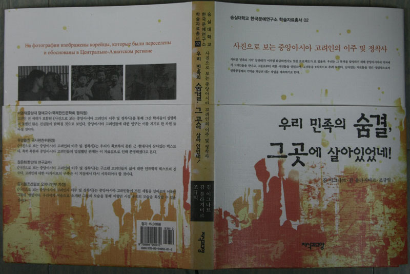
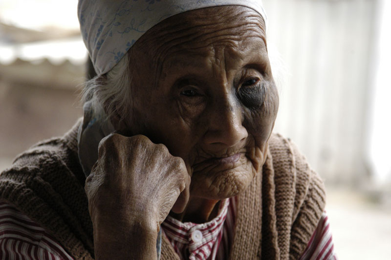
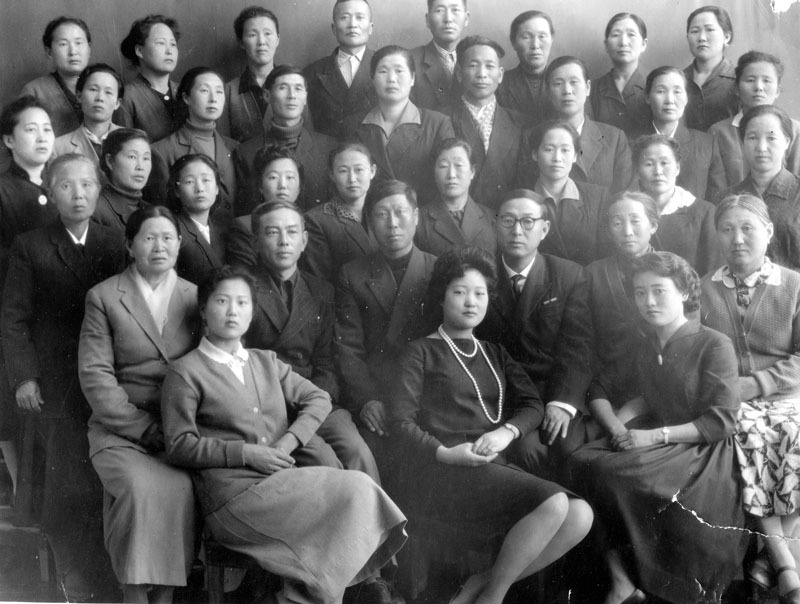
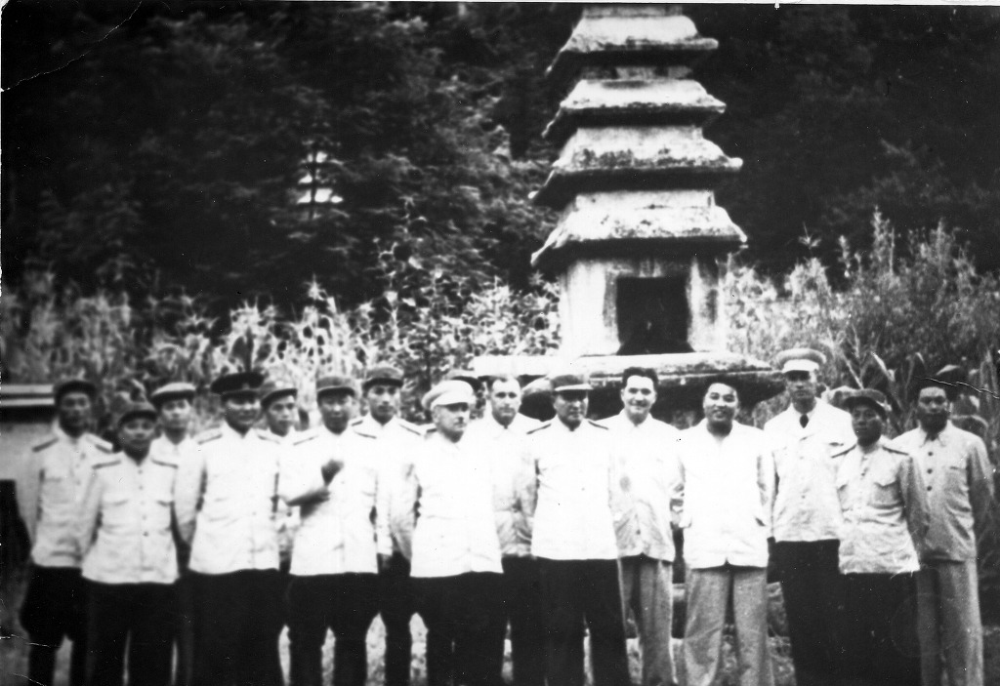

중앙아시아 고려인의 삶에 관한 사진자료집 출간!!!

  <발간된 책>  
  

  <우즈벡 지진허 마을의 백산옥 할머니(1909년생)>  

  <우즈벡의 프라우다 농장 학교 교사들(1960년대)>

<평양에서.  오른쪽 첫번째가 최 이반 알렉산드로비치, 오른쪽 네번째 인물이 김일성(1946년)>  
  
  
  
사진으로 보는 중앙아시아 고려인의 이주 및 정착사  
  
  
     우리 민족의 숨결,  
    그곳에 살아 있었네!

숭실대학교 한국문예연구소 학술자료총서 2  
김 이그나트, 김 블라지미르, 조규익 엮음   
도서출판 지식과교양, 2012. 3./ 15,000원

중앙아시아 고려인들의 지나온 세월을 생생하게 보여주는 사진자료집이 ‘숭실대학교 한국문예연구소 학술자료총서 2’로 출간되었다. 숭실대 조규익 교수(한국문예연구소장/국어국문학과 교수)는 우즈베키스탄의 고려인 지식인 김 이그나트 및 김 블라지미르 등과 함께 중앙아시아 고려인들[보통사람들로부터 유명인들까지]의 사진들을 수집하여 자료집으로 엮었다. 그동안 이 지역 고려인들에 관한 문서자료들은 꽤 출간되었지만, 두어 건의 작품사진집 이외의 사진자료집이 학술자료총서의 형태로 출간된 것은 처음이다. 그 내용은 다음과 같다.

  머리말 : 지워진 ‘민족의 기억’ 살려내기-조규익  
  1부 : 고려인들의 삶  
  2부 : 가르침과 배움  
  3부 : 일과 일터  
  4부 : 고려인 가족  
  5부 : 풍속[돌⋅결혼⋅회갑⋅장례]  
  6부 : 나라 밖의 북한인들, 북한의 고려인들  
  발문 : 우리는 돌아간다-김 블라지미르 씀/오두영 역

 1937년 강제이주 시기[몇몇 경우는 그보다 훨씬 이전의 자료도 있다]부터 최근까지 고려인들의 삶을 생생하게 보여주는 사진들을 선별했다는 점에서 중앙아시아 고려인들의 삶에 관한 어떤 연구서보다 구체적이고 사실적이다. 이 책에 실린 사진자료들을 통해 고려인 연구자들이나 그간 고려인들의 삶에 대하여 말로만 들어왔던 일반인들은 고려인들의 생활을 직접 눈으로 볼 수 있게 되었다.

 편자들은 그간 몇 년 동안 현지의 고려인들을 만나 그들로부터 그간에 겪은 고초를 들었고, 그들의 선조와 자신들이 남긴 기록들을 수집했으며, 미래의 소망을 확인할 수 있었다. 따라서 이 책은 편자인 조규익 교수가 그간 진행해 왔고 앞으로도 계속 진행할 자료정리 작업과 연구 작업의 한 부분으로 만들어진 것이다. 이미 확보한 사진자료만 1천 건이 넘기 때문에 기회 닿는 대로 나머지 사진들을 계속 출간하겠다는 것이 조 교수의 생각이다.

 구소련 체제 아래 우리와 단절의 역사를 지속해온 고려인이 우리 품으로 들어오기 시작한지도 벌써 20년이나 되었다. 그러나 그간 우리는 그들을 우리 민족의 일원이 아닌 ‘고려인’으로 타자화(他者化)하는, 잘못을 범해온 것이 사실이다. 이제 우리는 그들을 우리와 동등한 민족공동체의 일원으로 받아 들여야 하며, 그들의 마음을 잘 헤아려 그들과 우리가 정신적으로 합일을 이루어야 한다. 학술적 차원의 해석이나 연구보다 사진이나 기록물들을 일반인들이 쉽게 접할 수 있도록 배려하는 일을 우선해야 하는 것도 그 때문이다.

 조 교수는 머리말에서 다음과 같이 말했다.

“지워진 ‘민족의 기억’ 살려내기!  
이처럼 화급하면서도 멋진 프로젝트가 또 있을까. 외세의 침탈과 거센 역사의 소용돌이에 휩싸여 헤맨 디아스포라의 세월을 담담하게 객관화시킬 만큼 우리의 마음과 체력이 커진 것은 사실이다. 문제는 모두의 관심이다. 이산(離散)과 유랑(流浪)의 세월을 청산하고 민족 공동체로 거듭 나기 위해서 우리가 해야 할 일은 실수로 포맷된 컴퓨터의 하드디스크를 복원하듯 ‘지워진 기억을 되살리는 일’이다.“

조 교수가 머리말에서 강조한 것처럼 ‘지워진 민족의 기억’을 되살리기 위해서라도 이런 작업은 계속되어야 하며, 국민적 관심 속에 이런 작업들의 의미와 가치가 강조되어야 하리라 본다. 강호제현의 일독을 기대한다.

공유하기

게시글 관리

**백규서옥\_Blog ver.**