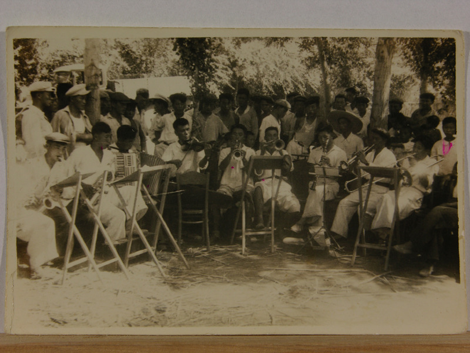
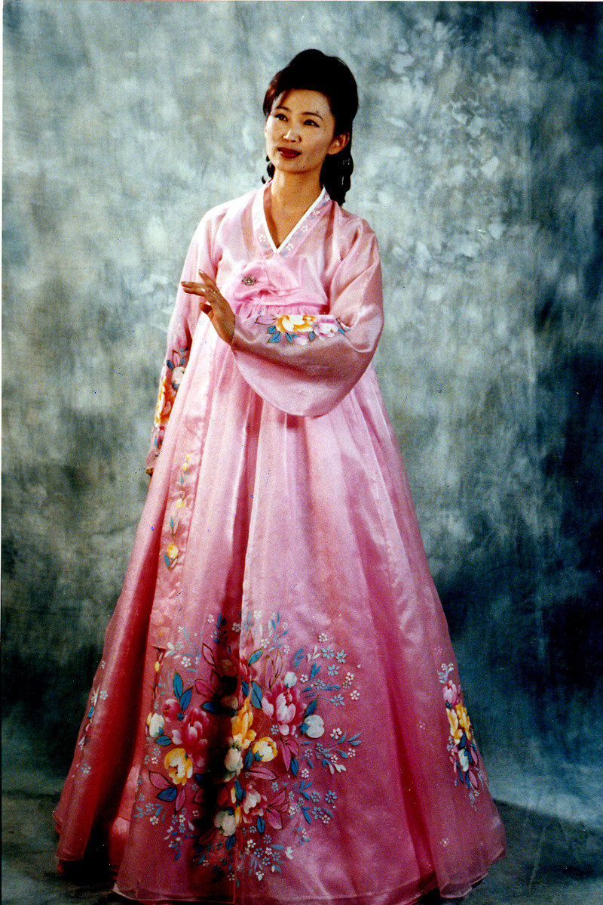

 <1945년 김병화 농장의 김남견과 레 베라 드미트로브나의 결혼식에서 연주하는 소인예술단(취주악단)>  

  <2002년 아리랑 극장의 가수 김 막달레나>  
  
  
지워진 ‘민족의 기억’ 살려내기  
                                                                   
  
고려인들의 자취를 찾아 제법 부지런히 돌아다닌 몇 년이었다.  
러시아⋅카자흐스탄⋅우즈베키스탄⋅키르키즈스탄⋅벨라루스 등 쉽게 갈 수 없는 나라들의 여러 도시와 마을들을 헤매고 다녔다. 그러나 ‘이제 고려인들은 없다!’는 것이 오랜 방랑 끝에 얻은 깨달음이었다. 대체 그들은 어디로 간 것일까? 빛바랜 사진 몇 장과 실실 부서지는 몇 권의 책자들에서나 그들의 모습을 훔쳐 볼 수 있을 뿐이다. 내가 상상 속에서 그려 온 고려인들의 모습은 더 이상 우리 곁에 머물러 있지 않다는 사실. 인정하기 싫지만, 인정할 수밖에 없는 현실이다. 마주 앉아 보아도 모습만 같을 뿐, ‘소통할 수 없는’ 타자(他者)로 남아 있을 따름이다.    
엄혹했던 구소련 체제에서 소수민족으로 살아야 했던 그들이었다. 절망에 갇힌 민족의 탈출구를 공산주의에서 찾고자 그 이념의 고향 소련으로 갔다가 불의의 죽음을 당한 조명희. 그를 추앙하여 문학에 빠져들었다가 22년 간 북극 유형 및 강제노동의 쓰라림과 후유증으로 인생을 마감한 강태수. 그들은 원동으로부터 가축이나 짐짝처럼 실려 중앙아시아의 황무지에 쓰레기처럼 부려진 고려인들의 황당한 집단체험을 극적으로 대변한다.    
  
오직 내가 원하는 바는  
네가 속히 귀여운 아기들의  
어머니가 되며  
남편의 던지는 웃음에  
두터운 정으로 대답하며  
또 우리에게만 부족되지 않던  
그 무엇으로 보태면서  
무한히 행복하기를!  
그리고 또 하나는!  
너는 나를 “죄인”이라고  
절대 부르지 말기를!  
이곳은 모두다 시대의  
불측한 장난일 줄 알어라  
하늘이 아무리 흐린들  
네철 내내 비가 내리겠는가.  
사납던 징기스한의 무덤은  
오늘도 나지지 않으며  
로마에 불지르고도  
“오, 나의 사랑하는 로마여!” 하고  
웨치던 네로의 혼은  
이날도 저주의 무쇠 탈 쓰고  
아마 지옥에서 헤매리라  
악은 백 년 후에도 발각되며  
선은 민중의 부르는 노래에  
오래오래 담겨진다.  
  
-강태수 <마음 속에 넣어 두었던 글> 중에서  
  
  
고려시인 강태수는 북극유형이란 마지막 길을 떠나며 자신의 연인에게 다른 사람과 결혼하여 여인으로서의 행복한 삶을 누려 달라고 부탁한다. 동시에 자신의 상황이 ‘시대의 불측한 장난’일 뿐, 자신은 죄인이 아님을 절규한다. ‘하늘이 아무리 흐린들 사계절 내내 비는 내리지 않을 것’이란 확신과 함께 징기스칸 및 네로의 악행을 예로 들었지만, 그가 여기서 언급하고자 한 인물은 징기스칸이나 네로가 결코 아니다. 그가 이들을 통해 암시하고 싶었던 인물은 스탈린이었다. 스탈린 치하에서 강제이주와 북극 유형을 통해 젊음과 사랑을 잃은 그였다. 그러니 그에게 스탈린보다 더 극악한 군주는 없었을 터. ‘저주의 무쇠탈을 쓰고 지옥에서 헤매리라’는 그 저주의 대상은 네로가 아니라 스탈린이었다. 인생의 막바지에서야 시인은 자신이 몸담아 온 공간, 그간 생존을 위해 인정할 수밖에 없었던 공산주의 체제에 대한 환멸과 증오를 이런 저주로 표출시킬 수 있었던 것이다. 어찌 조명희나 강태수만 그러했을까.   
\*\*\*  
1세대 고려인 한 분을 만나기로 약속하고 날아간 키르기즈스탄. 비쉬켁 국제공항에 도착해 연락하니 그 분은 병원 중환자실에서 오늘 내일 하시는 중이었다. 이처럼 어딜 가도 1세대 고려인을 만나기란 불가능했다. 만날 수 있는 대상은 기껏 2~3세대들이 대부분이었는데, 그들은 우리말을 거의 상실한 상태였다.  우리말을 잃으니 우리 역사를 잃게 되고, 우리 역사를 잃으니 민족의 정체성을 잃게 되며, 민족의 정체성을 잃어버리니 피차 민족적 동질감을 공유할 수 없었다. 찻집이나 식당에 마주 앉아도 그저 이민족을 만나듯 서로 데면데면할 수밖에 없었다. 절망이었다.   
그러다가 산업연수생으로 국내에 들어온 고려인 3~4세들을 만나게 되었다. 작업 현장에서 우리말을 배우며 급속히 민족적 동질감을 회복해가는 그들이 신기했다. 나라 밖에 흩어져 살며 정체성을 상실한 한민족 후손들에게 우리는 어떤 도움을 주어야 하는가. 그들을 보며 2천년의 지독한 디아스포라를 극복하고 민족 공동체의 강고한 모습을 과시하는 이스라엘 민족이 떠올랐다. 겨우 1~2세기의 디아스포라를 극복하지 못한다면, 우리의 체면은 말이 아닐 것이다. 이제 이산(離散)과 유랑(流浪)의 세월을 청산하고 민족 공동체로 거듭 나기 위해서 우리가 해야 할 일은 실수로 포맷 된 컴퓨터 디스크를 복원하듯 ‘지워진 기억을 되살리는 일’이다. 우리 민족의 DNA에 잠재되어 있는 말과 정신의 씨앗을 움틔우기 위해 우리는 할 수 있는 모든 일들을 해야 한다. 뒤통수에 와 닿는 의심의 눈초리를 무릅쓰면서 이들 나라들을 뒤지고 다니는 것도 혹시 우리 모두의 기억을 되살려 줄 ‘그 무엇’이 있지 않을까 하는, 작은 희망 때문이다. 그렇게 하다 보면 언젠가는 희미한 의식의 끄나풀이라도 찾아낼 수 있을 것이다. 사실 지금 단계에서 당장 먹고 사는 일보다 중요한 것은 민족의 미래를 개척하는 일이다. 개개인의 수명엔 한계가 있지만, 민족의 수명은 영원하다!   
\*\*\*     
지워진 ‘민족의 기억’ 살려 내기.  
이처럼 화급하면서도 멋진 프로젝트가 또 있을까. 외세의 침탈과 거센 역사의 소용돌이에 휩싸여 헤맨 디아스포라의 세월을 담담하게 객관화시킬 만큼 우리의 마음과 체력이 커진 것은 사실이다. 문제는 모두의 관심이다. 나라들 사이에 이념의 장벽은 희미해지고 있지만, 정작 개인들은 이해관계의 장벽을 나날이 공고하게 쌓아올리고 있는 것이 현실이다. 공동체보다 개인의 행복과 이익을 우선하는 개인주의[혹은 이기주의]의 물결은 민족주의를 능가할 정도다. 우리의 과제는 소아(小我)를 넘어 민족의 어제와 오늘을 발판으로 바람직한 내일을 건설하는 일이다. 우리의 기획은 그런 소망으로부터 시작된다. 중앙아시아의 각처에서 고려인들을 만나고 그들로부터 귀한 사진자료들을 구했으며, 그것들을 일일이 디지털 자료로 만들었다. 그것들 가운데 1차적으로 묶은 결과가 바로 이 책이다. 남아있는 자료들을 정리⋅발간함으로써 민족공동체의 기억을 되살려 내는 작업을 계속하기로 한다.   
강호 제현의 뜨거운 사랑과 관심을 고대한다.   
  
                               2012. 1. 1.  
  
                                                  한국문예연구소 소장  조규익    
  
\*이 글은 최근에 펴낸 <<사진으로 보는 중앙아시아 고려인의 이주 및 정착사 : 우리 민족의 숨결, 그곳에 살아있었네!>>의 머리말입니다.

공유하기

게시글 관리

**백규서옥\_Blog ver.**