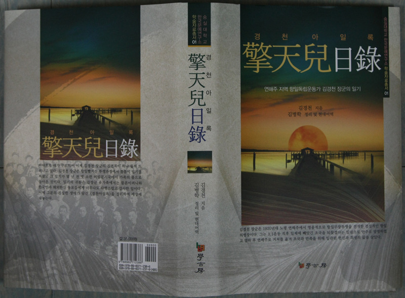
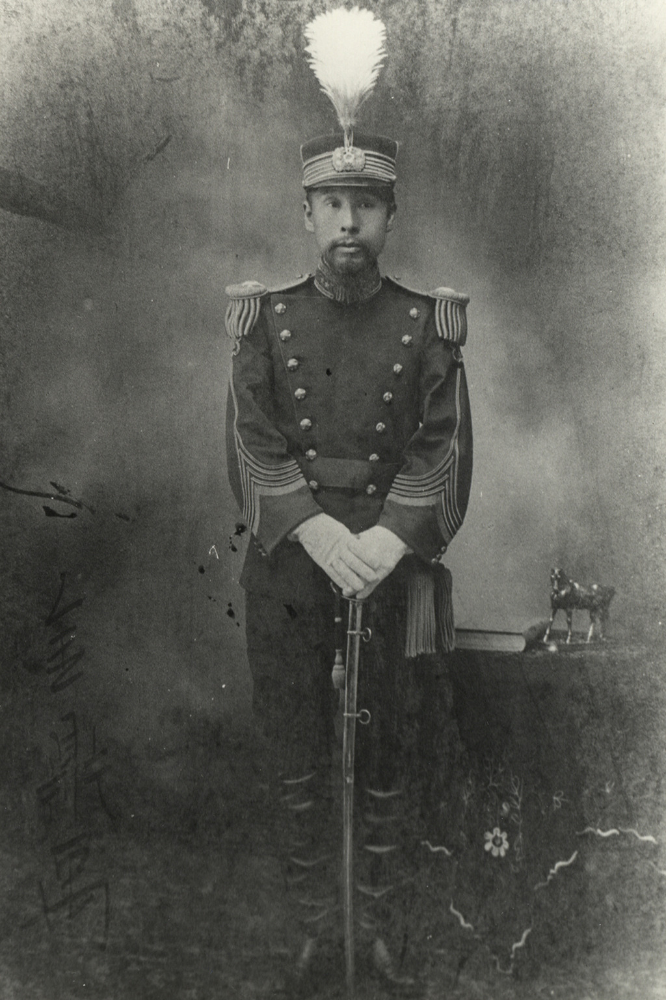
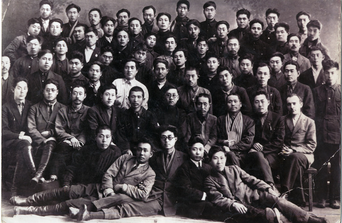
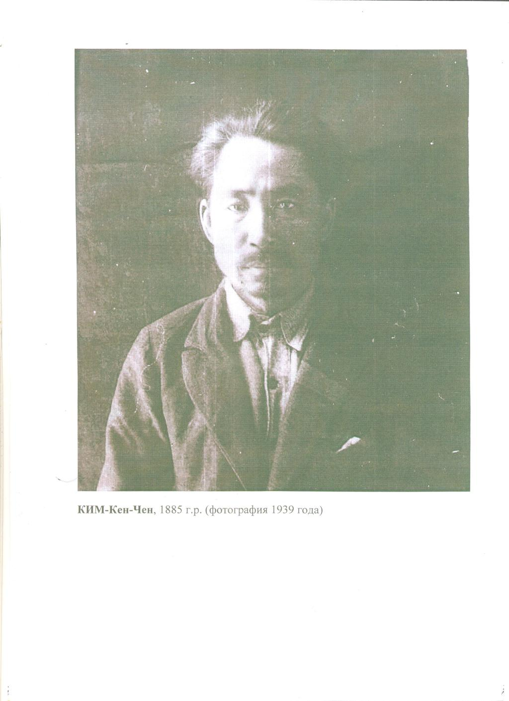
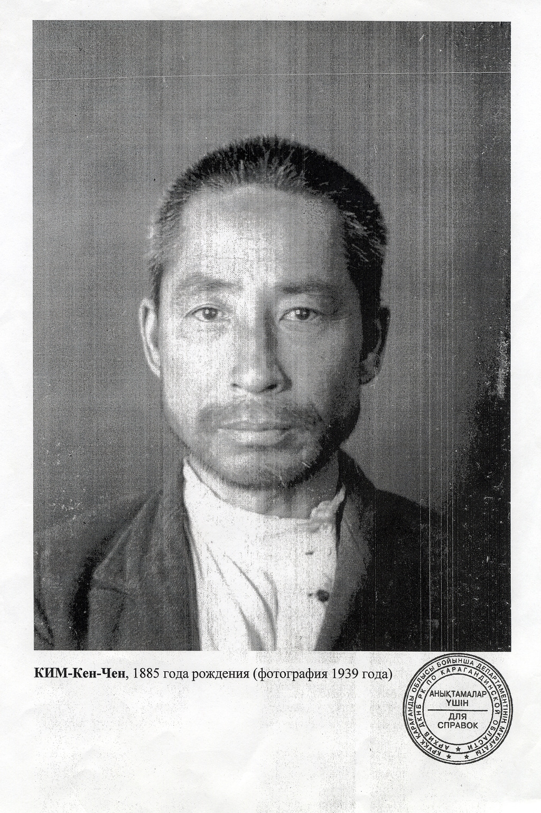
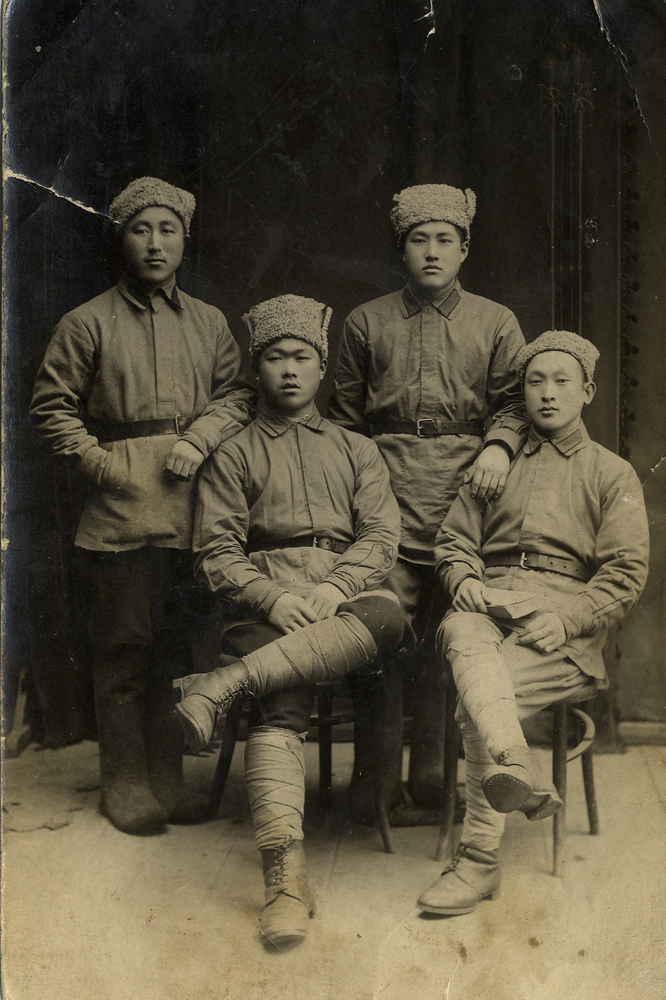
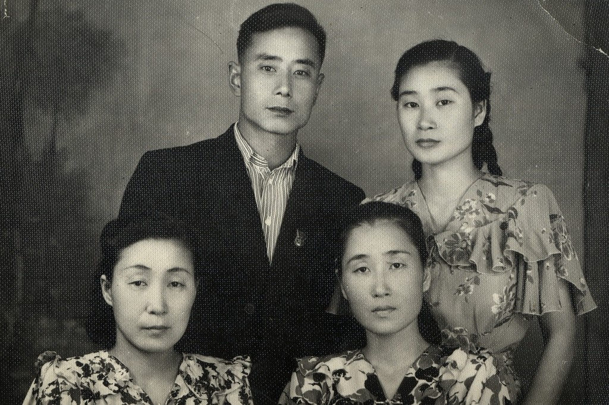

  <이번에 발간된 책 <<경천아일록>> 표지>  

  <김경천 장군의 아버지 김정우. 그는 35살의 늦은 나이에 일본에 유학하고 돌아와 대한제국 육군군기창장으로 일했다.(1900-1908년)>

  <1921년 3월 연해주 공산당 지역중앙위원회 고려인 부서의 제안으로 아무르 주 크라스노야르 마을에서 개최된 연해주 빨치산 활동가들의 제1회 모임. 여기에서 고려인 빨치산 부대들을 통합하여 연해주 인민혁명군 소속으로 합병시키자는 결의가 나왔다. 맨 뒷줄 왼쪽에서 세 번째가 김경천. 당시 김경천은 만주에서 연해주로 건너온 지 얼마 되지 않았고 아직 별다른 전투를 치르기 전이라 이름이 알려지지 않은 데다 또 공산당원이 아닌 탓에 맨 끝줄에 서있다. 하지만 이듬해 여름에 연해주 혁명군사위원회가 그를 뽀시예트 및 훈춘 구역 빨치산 총사령관으로 임명할 정도로 용맹한 군인으로 이름을 떨쳤다.둘째 줄 왼쪽부터 첫 번째는 창의회에서 활약한 안희재(1885-1943), 두 번째는 나중에 선봉신문 농업부장을 역임한 황동훈(1903-1938), 세 번째는 연해주 한인독립운동 지도자 이동휘(1873-1935), 네 번째는 한인 지도자로서 소비에트 당국에 한인의 권리를 적극 주장했던 한명세, 여섯 번째는 1930년대 뽀시예트 구역 당서기장을 역임한 김 아파나시, 셋째 줄 오른쪽에서 첫 번째가 1924년 니시 고려사범학교, 1931년 해삼고려사범대학을 설립하고 이듬해 조선극장 창립에도 관여하는 등 한인 문화교육부문에 지대한 공헌을 한 김만금, 넷째 줄 왼쪽(오른쪽)에서 다섯 번째는 중국과 한국에서 신문을 발행하고 지하활동을 하다가 체포되어 서울 서대문 감옥에서 옥고를 치렀던 채 그리고리(1891-1926), 맨 뒷줄 오른쪽에서 첫 번째는 제76 고려인 포병부대 정치교육장교를 역임한 김광택(1898-1957)이다.

  <간첩죄로 체포된 김경천 장군이 카자흐스탄 까라간다 유형소에 들어와 머리를 깎이기 전(1939년)>  

  <간첩죄로 체포된 김경천 장군이 카자흐스탄 까라간다 유형소에 들어와 머리를 깎인 후(1939년)>

  <1918-1922년 연해주 한인빨치산 군인들의 복장. 김경천 부대의 부대원들도 이와 똑같은 복장을 착용하고 전투를 치렀다>.

     <김경천 장군의 자식들. 앞줄 왼쪽부터 반시계 방향으로 맏딸 지리, 셋째딸 지란, 막내딸 지희, 맏아들 수범>  
  
  
  
연해주 지역 항일독립운동가 김경천 장군의 일기  
  
<<경천아일록(擎天兒日錄)>> 출간!!!  
  
연해주 지역 항일독립운동가 김경천 장군의 일기 <<경천아일록>>이 숭실대학교 한국문예연구소 학술자료총서 1권으로 출간되었다. 함경남도 북청에서 무관 가문의 막내아들로 태어난 김 장군의 본명은 김현충(金顯忠)⋅김광서(金光瑞)이며, 후에 신팔균⋅지청천과 함께 별명으로 '하늘 천(天)'자를 넣어 지은 김경천(金擎天, 金警天 또는 金敬天)⋅김응천(金應天) 등의 이름을 사용하게 되었다.

김 장군의 아버지인 김정우는 일본에 유학을 다녀온 구한국 육군의 엘리트 인사였는데, 아버지의 영향을 받아 어릴 적부터 군인이 되기를 꿈꾸었고, 한성부에서 중학교를 마친 뒤 관비 유학생으로 일본육군사관학교에 입학했다.

1911년 일본 육사를 제 23기로 졸업하고 도쿄에서 기병 장교로 근무하다가 1919년 기미 독립 선언 직후 지청천과 함께 만주로 망명하여 대한독립청년단에 가입해 활동했고, 서간도의 신흥무관학교에서 교관으로 근무했다.

1919년 김경천은 러시아 블라디보스톡에 머물면서 의용군을 모집하여 일본군의 지원을 받는 중국인 마적단과 싸웠으며, 창해청년단 총사령관으로 시베리아 일대에 이름이 알려지게 되었다. 1921년에는 수청의병대의 지도자가 되었고 러시아의 혁명 세력과 연합하면서 연해주 지역의 조선인 지도자로 소련의 인정도 받게 되었다.

1922년 수청의병대는 대한혁명단으로 개칭하고, 김경천은 사령관을 맡았으며, 그해 말 고려혁명군이 조직되어 김경천은 동부사령관을 맡았다. 1922년 이후 블라디보스톡 극동고려사범대학에서 강의를 하였고 국경경비대의 장교로 일하다가 1937년 스탈린 정권 하에서 간첩죄로 체포되었고, 1939년 재차 체포되어 두 차례 복역했다.

이 일기의 번역 및 정리자 김병학 선생은 이 책 출간의 당위성을 다음과 같이 요약⋅제시했다.   
 첫째, <<경천아일록>>은 이순신 장군의 <난중일기> 이후 전투에 참가한 군 지휘관이 현장에서 쓴 유일한 일기다. 현대적 의미의 최고급 군사전문가 중 한 사람인 김 장군의 지략과 용맹이 유감없이 드러나 있어, 동서양 전쟁사에서 그 유례를 찾기가 어렵다.  
 둘째, 광복 60년이 지나도록 친일유산의 청산이 되지 않고 있는 우리의 현실에서 김 장군의 행적이야말로 후손들에게 귀감이 될 만하다.   
 셋째, 이 일기가 국내 역사학자들의 단편적인 논문에만 인용되고 말기에는 그의 삶 자체가 너무나 눈물겹고 장대하고 아름답다.  
 넷째, 카자흐스탄과 러시아에 흩어져 살고 있는 김 장군의 후손과 뜻 있는 고려인들이 이 일기가 러시아어로 번역되어 나오기를 기다리고 있다. 그러나 그 분들이 일기를 러시아어로 읽으려면 먼저 번역이 가능한 현대 한국어로 정리되어야 한다. 국한문에 드문드문 알아보기 어려운 문체로 기록된 <경천아일록>이 한국에 알려진지도 벌써 다섯 해가 넘었는데, 그 분들을 더 이상 기다리게 하는 것도 도리가 아니다.

 이 책의 출간은 한국의 독립운동사가 보완되고, 더욱 새로워지는 계기가 될 것으로 보인다. 나라와 민족을 사랑하는 강호제현의 일독을 고대한다.

                        2012. 3. 1.

              한국문예연구소  소장   조규익   
  
  
  
[조선일보 관련기사 링크](http://news.chosun.com/site/data/html_dir/2012/03/01/2012030100258.html "[http://news.chosun.com/site/data/html_dir/2012/03/01/2012030100258.html]로 이동합니다.")

공유하기

게시글 관리

**백규서옥\_Blog ver.**