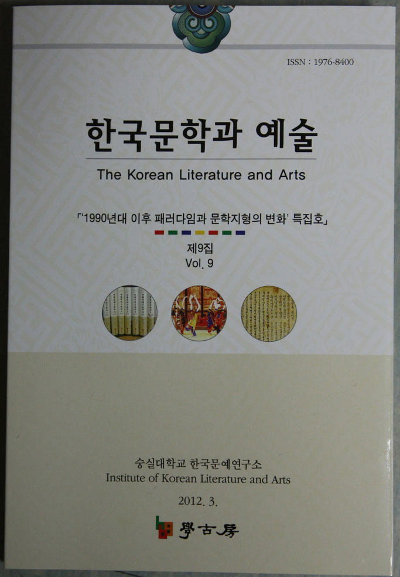

한국문예연구소 논문집 <<한국문학과 예술>>(9집) 출간!!!  
  
  
한국문예연구소에서는 반년간 학술지 <<한국문학과 예술>> 9집을 출간했다. 이번 호에는 “1990년대 이후 패러다임과 문학지형의 변화”라는 주제 하에 ｢한국전쟁에 대한 새로운 소설적 형상화｣(이경재), ｢1990년대 이후 한국 연극의 변화｣(백로라), ｢윤대녕 소설의 노스탤지어 미학 : <<은어낚시통신>>을 중심으로｣(백지혜), ｢멜랑콜리 시학｣(류신), ｢현대시에서의 그로테스크｣(이해운), ｢이미지에서 서사로, 악몽에서 일상으로-편혜영 소설의 변화와 2010년대 소설의 향방-｣(서영인) 등 6편의 특집논문과 1편의 일반논문[｢조선조 文宣王樂章 연구｣/조규익]을 실었고, ｢중국 석학이 바라 본 지난날의 우리 모습-<<해동삼유록>>(위욱승 지음)을 읽고-｣(소재영), ｢난해한 선천역학의 닫힌 문 열기-<<소강절의 선천역학(고회민 저/곽신환 옮김)>>을 읽고-｣(조희영), ｢한 식민지 엘리트 군인의 ‘노블레스 오블리주’-<<경천아일록>>(김경천 지음/김병학 옮김)을 읽고-｣(김기철), ｢발로 쓰는 학문태도의 정수-<<동아시아 문화 교류론>>(소재영 지음)을 읽고-｣(김태준), ｢사행록 텍스트 다양하게 곱씹어보기-<<조선시대 사행록의 텍스트와 콘텍스트>>(정영문 지음)를 읽고-｣(한태문) 등 5편의 서평과 자료 및 자료해제[｢가사로 풀어낸 조선왕조의 이면사-박순호 본 <한양가(1)> 소개-｣]를 실었다. 지금까지 <<한국문학과 예술>>에는 국내외 석학들에 의해 작성된 해당분야의 주목할 만한 논문들과 서평들, 해제들이 실림으로써 한국학의 발전에 큰 기여를 해왔다.

공유하기

게시글 관리

**백규서옥\_Blog ver.**