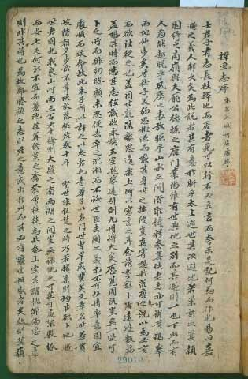
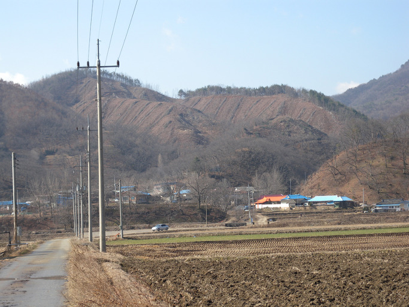
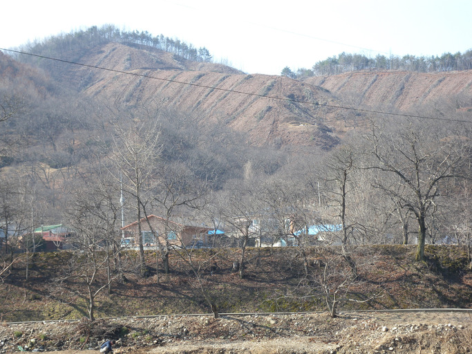

가거지(可居地)를 찾아

                                                                                                                                                          백규  
  
어릴 적 자신의 ‘주검 옷’을 미처 마련하지 못한 노인들이 초조해 하는 모습을 뵐 때마다, 그 분들의 마음을 도통 이해할 수 없었다. ‘아무리 못난 자식들이라 해도 당신 마지막 가는 길에 옷 한 벌 못해 입힐 것으로 생각하고 그렇게 안달하시는 걸까?’ 생각하며 그 분들의 속내를 가늠하지 못했다. 당신들 스스로의 손으로 최고의 주검 옷을 만들고 싶으신 마음, 그 옷을 입고 ‘고운 자태로’ 저 세상의 첫 문턱을 밟고 싶으신 그 마음을 철없는 나는 이해할 수 없었던 것이다. 악다구니처럼 뜯어갈 줄만 알았지 부모의 마음을 한 치도 헤아리지 못하는 자식 놈들, 제 가족이나 자신의 치장에는 돈 아까운 줄 모르면서 부모를 위해서는 푼돈을 아까워하는 자식 놈들, 바쁜 세상 탓만 하며 모든 걸 대강대강 장사치들의 손에 맡겨버리곤 ‘할 일 다 했다’고 손 터는 자식 놈들을 보며 이승을 떠나 저승으로 들어가는 여행길만큼은 스스로의 손으로 준비해야 한다는 강박관념을 이 땅의 어머니 아버지들은 매 순간 갖고 계시는 거다. 이 땅의 어떤 자식이 그 지극한 속마음을 헤아릴 수 있을까.   
  
우리나라 노인들이 땅에 발붙이고 말년을 살아가며 땅 속으로 들어갈 날을 준비하는 것은 오랜 세월 이어 내려 온 삶의 지혜이자 법칙이다. 번잡한 도회에서 하늘 높은 줄 모르고 떵떵거리다가 어느 순간 닥쳐 온 죽음 앞에 허둥대는 현대인들로서는 따라잡을 수 없는 철학이기도 하다. 노후나 죽음에 대한 대비의 전통이 끊어진 것은 산업화에 이은 고도정보화의 물결 탓이다. 요즘 그 격랑이 점점 잦아들어 평온을 되찾고 있기 때문인가. 일부이긴 하지만 이제 현대인들이 조부모나 부모세대까지 이어져 내려오던 지혜의 전통을 찾아 나서게 된 것도 그로부터 생겨난 성찰의 덕분이리라. 자식들을 독립시키고 직장에서 퇴임한 다음 잡답(雜沓)의 도시를 탈출하여 조용한 전원에서 스스로의 내면을 관조하려는 사람들이 늘고 있는 것은 아주 바람직한 일이다. 깨달음의 묵직한 보따리를 텅 빈 농촌에 풀어놓고, 잠시 후면 몰려 올 자식들의 귀향을 기다리며 살다가 슬그머니 흙 속으로 스며드는 것. 한 줌 흙이 되어 소나무를 잣나무를 밤나무를 키우는 거름이 될 수 있다면, 그 얼마나 행복한 삶일 것이냐.  
  
나이 사십 후반이라면, 틈틈이 전국의 산과 들판을 돌아다녀볼 일이다. 돌아다녀보면 안다. 우리를 키운 8할이 계곡의 바람과 고운 물, 보드라운 흙이고, 우리가 돌아가야 할 곳 역시 거기라는 것을. 그러기 위해서라도 욕망을 버리고 ‘살만한 곳’을 찾아야 한다. 그런 점에서 최고의 인문지리서 <<택리지(擇里志)>>를 쓴 이중환(李重煥 ; 1670~1756)이야말로 우리 역사상 드문 선각자다. 살 만한 곳의 조건으로 그는 네 가지를 제시했다. 지리(地理)⋅생리(生利)⋅인심(人心)⋅산수(山水)가 그것들인데, 그 가운데 하나만 빠져도 낙토(樂土)라 할 수 없다는 것이 그의 주장이다. 지리란 ‘장풍득수(藏風得水)’ 즉 풍수를 포함한 그 땅의 현실적⋅형이상학적 이치, 생리란 그 땅이 인간에게 허락할만한 경제적 가치, 산수란 산과 물이 조화를 이루어 인간의 마음을 어루만지는 경치다. 그러나 이 모든 것들을 갖추고 있다한들 그곳에 사는 사람들의 마음이 완악(頑惡)하다면 소용없는 일. 괜한 텃세로 들어와 정착하려는 사람들의 의지를 꺾어놓거나 사사건건 트집으로 괴롭힌다면, 차라리 사막 한 가운데서 선한 사람들과 함께 사는 편이 나을 것이다. 다녀보면 안다. 우리네 강토 안에서 이 네 조건 갖춘 땅 찾기가 얼마나 어려운지를!   
  
\*\*\*  
  
  정년퇴임한 곳 언저리에 미련을 버리지 못하고 얼쩡대는 인사가 있다면, 어리석은 후배들을 닦달하고 작당하여 소리(小利)를 탐하려는 자가 있다면, 고개 들어 마지막 광채를 불사르며 바다로 스며드는 태양을 응시해볼 일이다. 깨끗하지 못한 우리를 자신의 넓은 품에 받아들여 정화시키고, 마지막을 아름답게 해 줄 대자연이 우리네 삶터 바로 곁에 있지 않은가. 허탕 치는 나날이지만, 오늘 또 다시 ‘가거지(可居地)’의 탐색에 나서는 것도 바로 그 때문이다. <2012. 4. 21.>

공유하기

게시글 관리

**백규서옥\_Blog ver.**