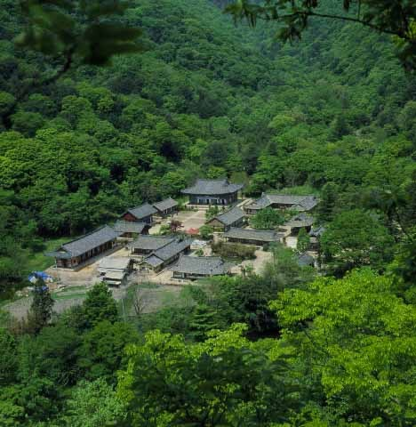

                                <위에서 내려다 본 백양사 전경>

요것들을 어찌 할꼬?  
  
  
                                                                                                            백규  
  
며칠 전 밤늦게 TV로 뉴스를 시청하다가 간이 떨어질 만큼 충격적인 광경을 접하게 되었다. 장성 백양사 인근의 한 특급 호텔 스위트룸. 반팔 속옷 차림의 승려들이 빙 둘러앉아 도박판을 벌이는 모습이었다. 언론매체의 보도에 따르면 조계종 중앙종회 의원 겸 조계사 주지와 부주지를 비롯 이른바 도가 높다고 일컬어지는 승려들 8명이 그들이었다. 때는 4월 23일 오후 8시부터 다음날 오전 9시까지. 술과 담배를 곁들인 억대의 포커 도박판이었다. 24일은 백양사에서 고불총림 방장 수산당 지종 대종사의 49재가 봉행되기로 예정된 날. 앵커의 설명과 화면은 즉시 나의 상상력을 가동시켰다. 당시 그 승려들은 절 근처 특급 호텔의 스위트룸에서 옷가지들을 벗어던진 채 담배를 꼬나물고 술[보아하니 양주로 짐작되었다!]을 병째로 들이키며, 억대의 판돈을 걸고 도박판을 벌이고 있었다. 하도 궁금하여 인터넷으로 백양사 근처의 호텔들을 검색해 본즉 2인 1실 기준 스위트룸 1박이 20만원 정도. 모처럼 객고(客苦)(?)을 풀기에 딱이었을 그런 좋은 곳에서, 더구나 돈이 넘쳐나는 그들이 방을 함께 쓰려 하지는 않았을 것이고, 각자 방을 얻은 다음 어느 한 방에 몰려 가 놀았을 가능성이 크다. 술상도 결코 쓸쓸하지는 않았을 게다. 온갖 산해진미가 그득하지 않았겠는가. 혹 술 따르는 여인들까지 곁에 있었는지는 알 수 없다.   
  
갑자기 정신이 아득해졌다. 심심하면 한 번씩 전국의 승려들이 조계사에 몰려들어 각목 들고 패싸움을 벌이던 일을 내가 잠시 잊고 있었던가. 겉옷을 벗어던진 채 담배를 피워 물고 술을 병째로 들이키며 포커 판을 돌릴 정도라면, 그 자리에서 오고 간 말들은 어땠을까 갑자기 궁금해졌다. 고상한 법문(法門)이나 경구(經句), 혹은 선문답(禪問答)들이라도 돌리고 있었을까. 아무리 생각해도 그건 아닌 것 같아, 몇 번 어깨 너머로 구경한 적이 있는 속한(俗漢)들의 고스톱 판을 떠올려 보았다. 대개 고스톱 판에서는 패가 잘 못 들어왔을 때 내뱉는 단발성 ‘쌍욕’들이 대부분이고, 어떤 경우는 지저분한 음담패설에 허접한 농담들이 대부분이다. 투전판이란 고상한 말들이 오고 갈 자리는 결코 아닌 것이다. 그렇다면, 참으로 난감한 일 아닌가. 함께 이 모습을 시청했을 아이들이나, 부처님 모시듯 ‘스님’들을 모시는 전국의 불쌍한 신도 할머니들에게 이 장면을 어떻게 설명해야 한단 말인가. 가끔 여행을 하다가 새참 시간에 맞춰 시골 마을에 들어가면 쫓아와 합장하며 들밥을 권하는 할머니들이 있다. 내가 삭발을 하고 다니니 그 분들은 나를 피곤한 탁발승으로 오인하곤 하신다. 합장을 하면서 ‘어느 절에서 이런 누추한 곳까지 오셨느냐?’고 정중하게 예를 표하시는 것이 신심 깊은 우리네 시골 할머니들이다. 그런 할머니들에게 승려들의 이런 수행 장면(?)을 어떻게 설명해야 한단 말인가. 그나마 그 화면에 말소리가 나오지 않은 것은 참으로 다행스러운 일이다. 당시 오고 갔을 것으로 추정되는 온갖 지저분한 음담패설들까지 방송되었더라면, 찬란한 한국 조계종의 역사는 그 순간에 멈춰버렸을 것이다!!!  
  
흔히 종교를 믿지 성직자를 믿는 게 아니라고들 말한다. 성직자도 사람인 이상 얼마든지 타락할 수 있음을 전제하는 말이다. 그렇다. 이 승려들 뿐 아니라, 심심치 않게 보도되는 외국 신부들의 성추문들, 간혹 교회를 사유재산처럼 자식들에게 물려주려고 온갖 꼼수를 부리거나 여신도들을 성폭행하는 목사들... 성직자도 인간인 이상 어느 순간 세속의 유혹에 빠져 들 수는 있을 것이다. 그러니 성직자를 보지 말고 종교의 참뜻을 바라보며 신앙심을 가지라고들 말한다. 그러나 그게 쉬운 일인가. 목자 없는 새끼염소들이나 선생 없는 어린아이들을 생각할 수 없듯, 성직자 없는 신앙인들을 생각할 수 없는 게 현실이다.   
  
승려들이 불교 입문을 원하는 사람들이나 신도들을 만나면 으레 삼독심(三毒心)을 버리라 한다. 삼독심 즉 ‘탐진치[貪瞋癡]’란 ‘탐욕[貪]/분노[瞋]/어리석음[癡]’ 등인데, 인간을 죄악의 구렁텅이로 빠뜨리는 원인적 요소들이다. 그러나 삼독심을 버리는 게 그리 쉽겠는가. 자신들은 삼독심에 빠져 허우적대면서 세속인들을 상대로 ‘삼독심을 버리라!’고 일갈(一喝)한들 그게 무슨 감동을 줄 것인가. 차라리 그 많은 불경들 가운데 좋은 경구라도 골라 들려주어 듣는 사람 스스로 발심(發心)하도록 하는 편이 훨씬 나을 것이다. 자신은 원수들을 죽도록 미워하면서 신도들에게 ‘원수를 사랑하라!’고 외친들 무슨 소용 있나? 자신은 재물에 끔찍한 애착심을 보이면서 ‘재물의 욕심을 버리지 않으면 천당 가기 어렵다!’고 외칠 수 있나? 차라리 “주의 말씀은 내 발에 등이요, 내 길에 빛이시니”[시편 119장 105절] 혼자서 열심히 성서를 읽고 묵상하며 실천하라는 가르침을 주는 것이 훨씬 낫지 않겠는가.    
  
  
승려들의 참담한 행태를 목격하고나서 밀려드는 허무감을 주체할 수 없는 나날이다.  

                                                                                                 <2012. 5. 11.>

공유하기

게시글 관리

**백규서옥\_Blog ver.**