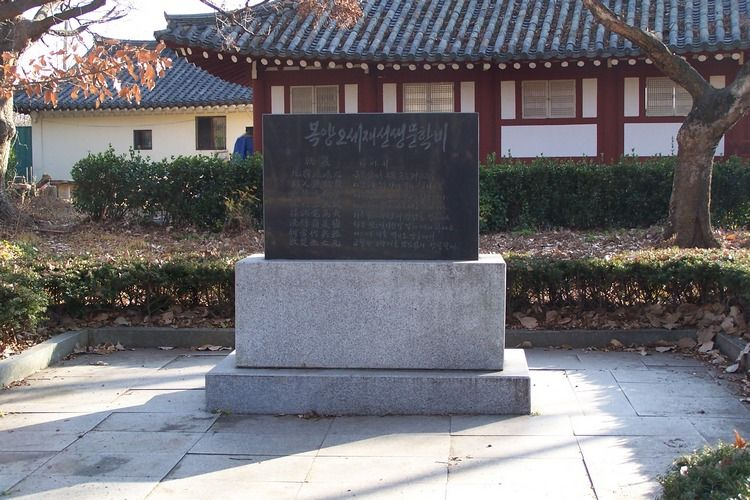

戟巖            극암              창바위

北嶺巉巉石  북령참참석    북쪽 산마루 우뚝솟은 저 바위를

邦人號戟巖  방인호극암    사람들은 모두 창바위라 부른다네.

逈樁乘鶴晋  형장승학진     까마득 멀어 선학타고 오르려하나

高刺上天咸  고자상천함    가파으게 높아 하늘 찌를듯 하구나.

揉柄電爲火  유병전위화    자루꽂아 휘두르며 번갯불 번뜩이고

洗鎽霜是鹽  세봉상시염     창끝 씻으면 서릿발 같이 예리하다오.

何當作兵器  하당작병기    어느때 이를 병기로 만들어서

敗楚亦亡凡  패초역망범    교활한 오랑캐를 남김없이 섬멸할까   해석: 숭실대교수 조규익

상기의 해석과 다소 차이가 난다.

오세재 문학비

 북쪽 산마루 높이 깎아지른 암석을

 옆사람이 창바위라 부르는데

 아득히 말뚝같이 뻗질러 학을 타고 가야겠고

 높이 솟아 하늘을 찌를 듯하 네

 자루를 휘면 번개로 불을 붙이고

 칼끝의 서리 씻으면 소금이겠는데

 어찌 반드 시 병기가 되게 하여

 초나라를 패멸하 고 또 범을 망치는가.

출처  http://www.andongkwon.or.kr/

       

3행의 晋:학을 탄 왕자 진-주나라 영왕의 태자로, 피리를 잘 불렀으며 신선이되어 학을타고 하늘로 올랐다 한다.

4행의 咸:중국 황제시대의 무당인 계함-季咸을 말함

8행의 凡:옛 주공-周公의 아들을 봉했던 하남성-河南省에 있던 나라.

상기 극암을 읽고 송나라 사람이 탄복을 하여

"지금 이사람이 살아 있는가? 지금 무슨 관직에 이러렀는가?

송나라에 이와같은 시를 짓는 자가 있으면 반드시 관직을 준다.

이 詩는 여한-餘閑에 지은 제영-題詠이 아니고 거의 남이 어려운 운자-韻字를 주어 -즉석에서- 짓게 강작한것일 것이다."

실지로 이시는 고의로 어려운 운자를 하여  즉석에서 지었다고 한다.

출처:대동운부군옥 8 - 한국학술진흥재단학술명저번역총서 동양편 18.

오 세재-吳 世才 (인종 11년.1133) ~ (명종 17년.1187).

            고려 중기 명종 때의 학자·문인. 본관은 고창(高敞). 자는 덕전(德全).

한림-翰林 학린-學麟의 손자이며, 세공-世功, 세문-世文의 아우로 문장가의 집안에서 태어났다.

무신란이후 집안이 몰락하여 궁색하게 되었다. 의종(1151)에 진사에 오르고,

명종12년(1182) 때 과거에 급제하였으나 성격이 소루-疎漏, 준철-俊哲하여 검속-檢束함이 적어 세상에 용납되지 못하였고,

친우 이인로-李仁老가 세번이나 추천하였으나 끝내 벼슬에 오르지 못하였다.

그는 당시 18세였던 이규보-李奎報에게 53세의 나이로 망년지교-忘年之交를 허락하였고,

이른바 해좌칠현-海左七賢:江左七賢의 한 사람으로 이인로 등과 시주-詩酒로 즐겼다.

만년에는 외할아버지의 출생지인 동경-東京:지금의 慶州-으로 제고사-祭告使의 축사-祝史가 되어

역마를 타고 가 이내 그곳에 살면서 서울로 돌아오지 않았고, 마침내 가난에 시달리다 죽고 말았다.

<주역>을 암송하고 다른 육경 서적을 박통할 정도로 유학 경전에 높은 식견을 가지고 있었으며,

시작품도 당시에 상당한 평가를 받았으니, 이규보는 그의 시를 '준매경준-遵邁勁俊'이라 하였고,

최자(崔滋)는 ‘풍섬혼후(豊贍渾厚)’라고 평한 바 있다. 또한 글씨에도 뛰어났으니,

경기체가 <한림별곡 翰林別曲> 제3장에서 말한 바,

"오생,유생 양선생 위 주필경 하여-吳生劉生 兩先生 偉 走筆景 何如-"에서 오생은 바로 오세재를 가리킨다.

결론적으로 그는 명종시대 문신수난기를 통하여 현실에 타협 내지는 조화하지 못하고

문학과 시주에 탐닉하므로써 자신의 고민을 해소하려 한 것이다.

그러한 그에게 이규보는 나이를 떠난 진정한 벗이었으며,

이규보 역시 그의 재주를 아끼고 삶을 애석히 여겨 <오선생덕전애사 吳先生德全哀詞>를 지어 추모하였다.

여기에서 이규보는 그를 복양선생이라 부르고,

친구 아닌 문하생의 입장에서 사사로이 현정선생-玄靜先生이라 시호하여 영전에 바쳤다.

현재 전하는 작품으로는 <동문선-東文選>에 오언율시 2편, 칠언율시 1편이 있다.

파한집-파한집, 보한집-보한집, 고려사, 동경지-東京誌등에

극암-戟巖, 병목-病目, 혜정시-惠政詩, 풍의종미행시-諷毅宗微行詩, 자서-自敍,

차운김무적견증-次韻金無迹見贈등 일부가 전해진다.

시호는 현정-玄靜, 호는 복양-濮陽.

참고문헌 

東國李相國集, 高麗史. <朴魯春〉 출처:엠파스

2001.10

한국문학비건립동호회 세우고 숭실대교수 문학박사 조규익 짓고 한성대  외래교수 농산 정충락 쓰다.

경북 경주시 황성동 황성공원에 있다.

한국을 빛낸 100명의 위인

노래중에 2절 죽림칠현(임춘. 오세재. 이인로. 조통. 황보황. 이담지. 함순)에 나온다.

출처-블로그  항구가 사는 이야기([http://blog.empas.com/pyo7803/12045457)](http://blog.empas.com/pyo7803/12045457)

공유하기

게시글 관리

**백규서옥\_Blog ver.**