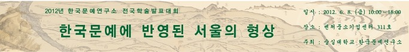

“한국문예에 반영된 서울의 형상”

2012년도 숭실대학교 한국문예연구소 전국 학술발표대회

일시 2102. 6. 8.(금) 10:00~18:00

장소 숭실대학교 벤처중소기업센터 311호

주최 숭실대학교 한국문예연구소

숭실대학교 한국문예연구소(소장 조규익 교수)에서는 2012년 6월 8일(금요일) “한국문예에 반영된 서울의 형상”이란 주제로 2012년도 전국학술발표대회를 갖는다. 문학과 음악, 미술 등 다양한 분야의 작품들에 나타나는 서울의 형상을 찾아 보는 논문들 7편이 발표되는데, 그 내용은 다음과 같다.

1. (기조강연) 고문헌 참색의 길에 만난 <한양가> : 박순호(원광대 명예교수)

2. <한양가>에 나타난 한양 경관과 장소애착성 : 최은숙(경북대)

3. <한양오백년가>에 나타난 역사인식 : 박연호(충북대)

4. 이본 대조를 통한 <한양오백년가>의 텍스트 고찰 : 정영문(숭실대)

5. <천변풍경(川邊風景)>과 <삼대(三代)> 속의 서울방언에 대하여 : 유필재(울산대)

6. 1970-90년대 서울 관련 대중가요를 통해 본 서울 풍경 : 장유정(단국대)

7. 조선후기 한양의 명승명소도와 국도(國都) 명승의 재인식 : 조규희(서울대)

공유하기

게시글 관리

**백규서옥\_Blog ver.**