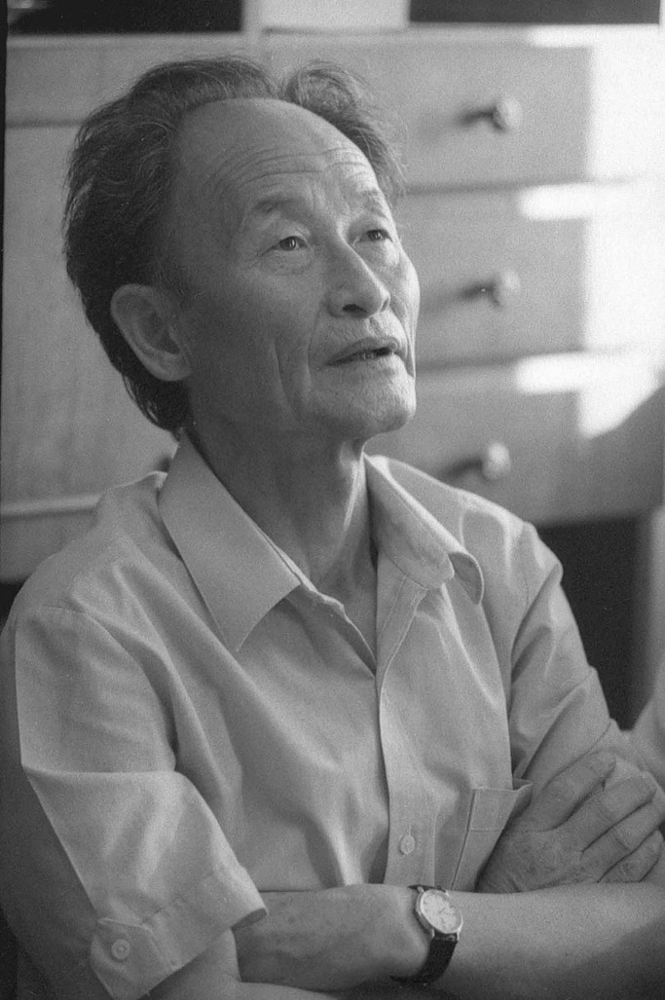
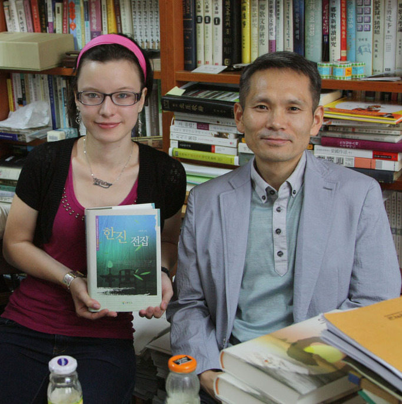

 <1980년대 한진의 모습, 사진제공:김병학>

                                           <한 율리아와 김병학 선생, 백규 연구실에서>

율리아와의 만남  
  
                                                                                                    백규  
  
몇 년 간 중앙아시아 이곳저곳을 헤매던 중, 고려인 극작가 한진을 알게 되었다. 그가 이승을 뜬 지 올해로 19년째. 말년까지 카자흐스탄의 국립고려극장 문예부장을 지낸 그였다. 10여 편의 희곡작품, 19편의 단편소설, 지인들과 주고받은 편지글 등을 오롯이 모아 카자흐스탄에 거주하는 김병학 시인이 정리했고, 내가 꾸려나가는 연구소에서 문예총서의 하나로 펴냈다. ‘도랑 치고 가재 잡는 격’인가. 책을 펴낸 지 얼마 후 국제한인문학회에서 연락이 왔다. ‘중앙아시아 고려인 문학 연구’라는 테마의 국제학술회의에서 기조발제**<**[**관련 글 보기**](http://www.kicho.pe.kr/zboard/view.php?id=paper&page=1&sn1=&divpage=1&sn=off&ss=on&sc=on&select_arrange=headnum&desc=asc&no=193)**>**를 해 달라는 것이었다. 그것도 고려극장에서 활약한 극작가를 중심으로 한다는 부연설명과 함께. 이미 한진의 작품들을 확보해 놓은 터에 마다 할 이유는 없었다. 그 소식을 들은 김병학 선생이 또 하나의 낭보를 보내왔다. 한양대학에서 공부하고 있는 한진 선생의 손녀 율리아에게 연락해 두었다는 것. 발표회장에서 그녀를 소개하는 것 자체가 한국의 학자들에게 신선한 충격일 수 있지 않겠는가. 그 자체가 멋진 퍼포먼스가 될 수 있다고 생각하며, 부지런히 텍스트를 읽었다. 작품을 읽는데, 모르는 사이에 간간 눈물이 흘렀다. 작품들의 행간에서 그의 외로움과 슬픔을 찾아냈기 때문이다. 갈등과 방황, 현실과의 밀고 당김을 통해 결국 민족을 발견하게 된 그의 집념이 감동적이었다.   
  
한진은 누구인가. 북한의 극작가 한태천과 모친 박성수 사이에서 1931년 태어난 그는 천재였다. 역사와 전통의 광성중학을 2년만에 마치고 평양제일고급중학교 3학년으로 편입했으며, 1948년 김일성 종합대학 노문학부에 입학했다. 거기서 만난 사람이 그의 지도교수이며 훗날 카자흐스탄에서 그의 후견인 역할을 한 정상진이었다. 정상진은 김일성종합대학 노문학부장(1948~1950)과 북한 문화선전성 제1부상(1952~1955)을 지낸, 당대 굴지의 재사였다. 정상진으로부터 문학원론과 세계문학을 배운 한진과 그의 친구 이진[이경진]은 당시 최고의 수재로 인정을 받던 북한의 꿈나무들이었다. 그러나 6⋅25가 일어나면서 대학 3학년에 재학 중이던 그는 전쟁에 참여했고, 1952년 여름 대학으로 돌아와 외국유학시험을 치르고 유학생 강습소에서 교육을 받은 뒤인 10월 모스크바 영화대학 시나리오 학과에 입학했다. 모스크바에 유학한 조선 최고의 수재들은 그들의 조국과 비교할 수 없을 정도로 자유로운 그곳의 분위기에 취하면서 비로소 조국의 현실에 눈을 뜨기 시작했다. 때마침 흐루시쵸프가 등장하여 스탈린을 비판하면서 그런 분위기는 더욱 고조되었다. 전쟁 후 김일성은 자신의 개인지배를 강화해 나갈 요량으로 남로당파, 연안파, 소련파 등을 속속 숙청하고 있었다. 마침 당시 연안파로 몰려 파직 당한 모스크바의 북한대사 이상조의 망명 소식은 소련의 심장부에서 자유의 맛을 본 지성인들을 흔들어 놓기에 충분했고, 한진의 경우는 더욱 그랬다. 몇 고비의 우여곡절을 거쳐  1958년 8월에 망명을 결행했고, 시베리아 바르나울시 TV 방송국 책임편집위원으로 파견되었으며, 그곳에서 러시아 여인 지나이다 이바노브나를 만나 결혼했다. 그 후 카자흐스탄의 크즐오르다로 옮긴 그는 영화사진연구소, 레닌기치 등을 거쳐 고려극장에 정착하게 되었다. 그 과정에서 소설과 희곡창작을 지속한 것은 물론이었다. 고려극장의 극작가로 활동하다가 말년인 1993년 7월 13일 ｢서울손님｣이란 희곡을 미완성으로 남긴 채 그는 잠들었다. [\*이상 한진의 전기적인 사실은 김병학의 '한진의 생애와 작품세계', <<한진전집>>(인터북스, 2011) 참조.]  
  
소련 고려인 문단의 최고 비평가 정상진도 인정한 바 있지만, 그는 고려인 문단의 군계일학(群鷄一鶴)이었다. 작품 형상화의 수준에서 여타 작가들은 그를 따라 잡을 수 없었고, 지금은 더더욱 그렇다. 이처럼 소련의 고려인 문단을 통틀어 미학적 차원에서 우리가 건져 올릴만한 작가로 그가 유일하다는 사실이 새삼 우리를 슬프게 한다.    
  
한진과 러시아 여인 지나이다 이브노브나 사이에 안드레이와 드미트리가 태어났고, 율리아는 안드레이와 러시아 여인 마리나 사이에서 태어났다. 그 한진의 손녀 율리아가 러시안의 외모를 갖고 우리 앞에 나타난 것이다. 북한 지식층의 자녀로 북한에서 태어나 북한 최고의 교육을 받았고, 전쟁에서 우리를 적으로 삼아 총부리를 들었던 한진. 그러나 넓은 세상에 나와 이념의 허망함과 남녘 동포의 존재를 새롭게 깨닫게 된 것을 체제 경쟁에서 남쪽의 승리를 입증하는 결과로 받아들여야 하는가? 아니면 언제나 현실이 이상을 압도한다는 인간세상의 자명한 진리를 보여 준 생생한 사례로 보아야 하는가?  
  
어쨌든, 우리의 품으로 돌아와 자신이 걸어야 할 미래의 길을 진지하게 묻고 있는 그의 손녀 율리아를 바라보며 흐뭇하고 짜릿한 쾌감을 느끼는 건, 나 혼자만의 행복한 ‘오버센스’인가? <2012. 6. 7.>  
  
\*사진 위는 1980년대 한진의 모습  
\*사진 아래는 한 율리아와 김병학 선생(백규 연구실)

공유하기

게시글 관리

**백규서옥\_Blog ver.**