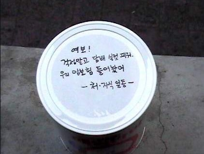

                                <신세대문화예술교류단의 금연포스터 모음(<http://cafe.daum.net)에서> 퍼옴>

담배  
    
                                                                                                                                               백규  
  
며칠 전, 운전 중이었다. 앞서 달리던 고급 외제차의 운전석 문이 스스로 열리고 섬세한 손가락들이 맵시 있게 움직이더니 담배꽁초[그것도 길쭉한 장초] 하나가 우아한 포물선을 그으며 길바닥으로 내동댕이쳐지는 것이었다. 살벌한 불티들은 사방으로 날리고, 자칫했으면 열려 있던 내 차 안으로 들어왔거나 내 차의 어딘가를 탁 때릴 뻔한 순간이었다. 그녀는 담배를 피우는 내내 수시로 문을 열고 재를 떨어댔을 것인데, 마지막 꽁초를 처리하는 순간을 바로 뒤에서 내가 목격한 것이었다. 그렇게 능숙한 솜씨로 뒤처리 하는 모습을 보니, 그간 반들반들하게 포장된 도심의 길바닥을 재떨이 삼아 만인 환시리(環視裏)에 흡연의 쾌락을 만끽해왔을 그녀의 고약한 행태가 눈에 선했다. 일순 치미는 분노를 참지 못하고, 그 ‘몰상식흡연운전녀’의 얼굴 좀 가까이 보려고 가속페달을 밟아 다가 간 즉, 도도하고 세련된 미모의 여인이 새초롬하게 앉아 운전대를 잡고 있는 게 아닌가. 설마 수 십 초 전의 일을 잊지는 않았겠지 생각하며 경적을 한 번 울렸으나, ‘어디서 들려오는 각설이타령이냐?’는 표정으로 힐끔 돌아보곤 저만치 앞서 달려가고 말았다. 어찌 그녀뿐이랴. 차를 몰다 보면 길바닥을 재떨이로 착각하는 운전자들이 ‘하수구 속 꽁초들’의 숫자만큼이나 많은 것을.

      \*\*\*

내가 관찰한 바로는, 90년대 초까지만 해도 여대생들 가운데 흡연자가 많지 않았을 뿐 아니라, 담배를 피우더라도 화장실에서 피우거나 누가 오면 숨기는 시늉이라도 하는 것이 일반적이었다. 그런데 어느 시점부터 당당한 포즈로 담배를 즐기는 여학생들이 부지기수로 늘었다. 멋진 자태로 담배를 ‘꼬나물고’ 생각에 잠기거나 남학생들을 그윽히 내려다보는 여학생들을 캠퍼스 구석구석에서 목격하는 요즈음이다. 물론 그 주변은 꽁초로 어수선하고, 벤치에 들러붙은 ‘연초 향’ 또한 대단하다. 그것 역시 전투적 페미니스트들이 그간 주창해온 ‘여권(女權)’ 투쟁의 한 전리품인지는 알 수 없으나, 조만간 그녀들이 갖게 될 2세들이 걱정이다.

       \*\*\*

사실은 나 역시 담배의 처절한 피해자다. 내 아버지도 이른바 ‘체인 스모커’이셨다. 어린 시절 좁은 시골 방은 늘 매캐한 담배 연기로 자욱했었다. 초등학생 때 아버지 담배 심부름으로 학교 옆의 점방을 ‘풀 바구니에 생쥐 드나들 듯’ 해왔고, 외지에서 공부하다가 가끔 고향에 갈 때면 용돈 아껴 ‘괜찮은 담배 한 보루’를 사들고 가는 것이 효도라고 생각했다. 그러나 부모 사이에 생겨나는 불화의 90%가 아버지의 담배 때문이라는 사실을 깨달으면서 담배로 인한 부자간의 갈등도 생겨났다. 아들은 아버지의 단연(斷煙)을 끈질기게 읍소(泣訴)했으나, 폐암으로 돌아가시는 순간까지 아버지는 담배를　끊지 못하셨다. 담배의 유혹조차 이기지 못하는 ‘인간 의지의 나약함’에 절망하게 되었고, 그 뒤로는 담배를 인간 판단의 잣대들 가운데 하나로 삼게 되었다. ‘오죽 못났으면 제 의지로 담배 하나 못 끊을까?’라는 안타까움으로 주변의 흡연자들을 바라보게 되고, 범죄의 혐의자로 오해 받는 사람들 가운데 흡연자들이 많다는 ‘편견’에 어쩔 수 없이 동조하게 되었다.   
 왜 흡연자들은 한사코 지하철 환풍구나 하수구에 꽁초를 던져 넣어야 후련하다고 생각하는 걸까. 왜 그들은 호기롭게 꽁초를 던져 버리거나 기껏 발바닥으로 두어 번 짓눌러 버려 모두가 사용하는 길바닥을 더럽히는 것이며, 거리낌 없이 길바닥에 가래침들을 뱉는 것일까. 왜 그들은 뒤처리를 부실하게 하여 힘들여 가꾼 산림을 순식간에 잿더미로 만드는 것일까. 그래서 흡연자들을 ‘잠재적 범죄자들’로 여기는 내 친구의 견해를 수긍하게 되는 요즈음이다. 바야흐로 담배를 끊어야 인간대접을 받는 시대가 된 것이다.<2012. 6. 17.>

공유하기

게시글 관리

**백규서옥\_Blog ver.**