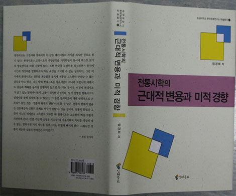
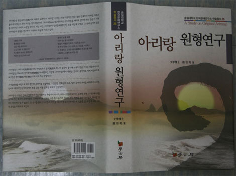
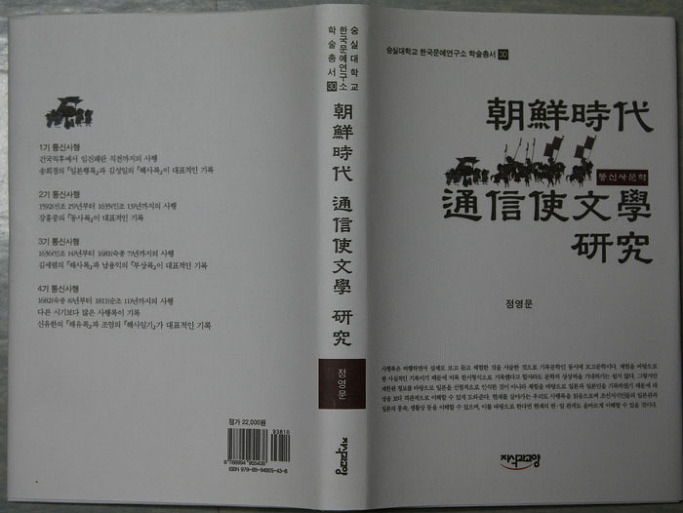

 

1. 엄경희 교수의 <<전통시학의 근대적 변용과 미적 경향>>(학고방, 2011/한국문예연구소 학술총서 27)이 2012년도 문화체육관광부 우수학술도서로 선정!!!

엄경희 교수의 <<전통시학의 근대적 변용과 미적 경향>>(한국문예연구소 학술총서 27)이 2012년도 문화체육관광부 우수학술도서로 선정되었다. 이 책에는 전통이란 개념으로 고전과 현대를 아우르고자 한 저자의 관점이 분명하게 드러나 있다. 1부[현대시조의 흐름과 전망], 2부[현대시의 하위장르로서의 자연시의 경향] 등 두 부분으로 나뉘어 있는 이 책은 전통시가와 현대시의 연속성을 찾으려는 연구자들에게 좋은 길잡이가 되리라 본다.

2. 정영문 교수의 <<조선시대 통신사문학 연구>>(지식과교양, 2011/한국문예연구소 학술총서 30), 2012년도 문화체육관광부 우수학술도서로 선정!!!

정영문 교수의 책 <<조선시대 통신사문학 연구>>(한국문예연구소 학술총서 30)가 2012년도 문화체육관광부 우수학술도서로 선정되었다. 이 책은 조선시대 일본을 여행했던 통신사의 발자취를 찾아가는 연구서다. 조선시대에 외국 특히 일본을 여행할 수 있는 기회란 통신사 사행에 참여하는 방법이 거의 유일했다. 이런 이유로 일본과 일본인에 관한 기록을 발견하기란 쉽지 않다. 조선시대에 주변국가와 그 나라 사람들에 대해 기록하고 있는 사행록은 여행하면서 실제로 보고 듣고 체험한 것을 서술한 기록문학인 동시에 보고문학인데, 이 책은 조선시대부터 현재까지 한일 관계를 이해하는데 큰 도움을 주게 되리라 본다.

3. 조용호 박사의 <<아리랑 원형 연구>>(학고방, 2011/한국문예연구소 학술총서 25)가 2012년도 문화체육관광부 우수학술도서로 선정!!!

조용호 박사의 <<아리랑 원형 연구>>(학고방, 2011/한국문예연구소 학술총서 25)가 2012년도 문화체육관광부 우수학술도서로 선정되었다. 현재 학계나 일반인들 사이에서 <아리랑>은 끊임없이 거론되고 있으나, 그 말의 뜻은 물론 노래가 의미하는 텍스트 상황도 정확히 모르는 것이 현실이다. 조용호 박사는 오랜 기간 한민족의 혼이자 민족의 노래를 대표하는 <아리랑>을 체계적으로 연구하고 분석해 왔는데, 그 결과를 집대성한 것이 바로 이 책이다. 이 책을 기점으로 학계의 <아리랑> 연구는 비로소 본궤도에 접어들 수 있으리라 본다.

공유하기

게시글 관리

**백규서옥\_Blog ver.**