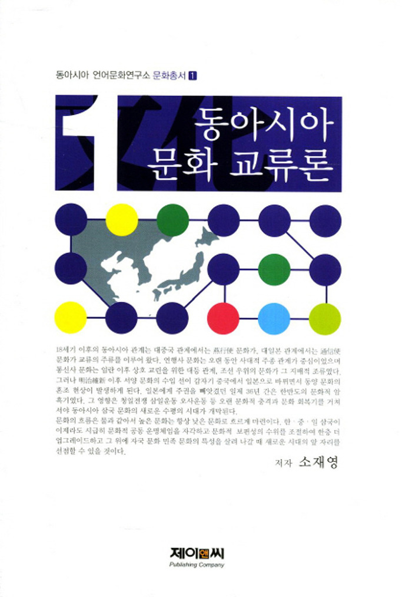

숭실대학교 인문대학 국어국문학과 소재영 명예교수의 <<동아시아 문화 교류론>>(제이앤씨, 2011)이 2012년도 문화관광체육부 우수학술도서로 선정!!!

숭실대학교 인문대학 국어국문학과 소재영 명예교수의 저서 <<동아시아 문화 교류론>>이 2012년도 문화관광체육부 우수학술도서로 선정되었다. 이 책은 한국소설을 중점적으로 연구해온 저자가 일본⋅중국을 넘나드는 여행체험과 함께 동아시아 학계와 관련을 맺어 온 그간의 체험을 바탕으로 이룩한 ‘한⋅중⋅일 비교문화론’의 결실이다. 이 책은 ‘강(江)과 동아시아 문명론’을 포함한 제1편, ‘동아시아적 시각에서 본 한국문화’를 포함한 제2편, ‘내가 걸어온 한국과 평생의 길(위욱승, 북경대학 명예교수)’을 포함한 제3편 등으로 이루어져 있는데, 한국문학이나 동아시아문학에 관심을 갖고 있는 후학들이 반드시 읽어야 할 노작이다.

공유하기

게시글 관리

**백규서옥\_Blog ver.**