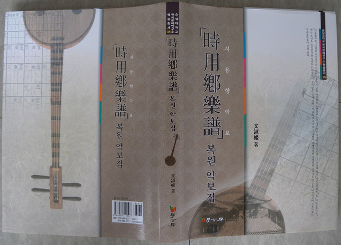

문숙희 박사의 새 책 <<시용향악보(時用鄕樂譜) 복원 악보집>>이 한국문예연구소 학술총서 35로 발간!!!

한국문예연구소 문숙희 박사가 <<시용향악보(時用鄕樂譜) 복원 악보집>>(도서출판 학고방)을 한국문예연구소 학술총서 35로 출간했다. <<시용향악보>>는 조선조 명종 대에 만들어졌을 것으로 추정되는 악보로서 고려 말~조선 전기의 민간과 궁중에서 애창되던 노래들이 수록되어 있다. 그 이전부터 존재하던 <<세종실록악보>>와 <<세조실록악보>>에 조선의 건국을 칭송하는 악장들이 실려 있는 것과 달리, 이 악보에는 주로 그 시대에 유행하던 고려가요 및 궁중의 나례(儺禮)의식에 사용되던 무속음악들이 실려 있다. <<시용향악보>>의 ‘향악(鄕樂)’이란 삼국시대부터 불리던 우리의 음악이라는 뜻으로서 ‘당악(唐樂)’ 즉 중국에서 들어온 음악에 대칭되던 용어인데, 이것을 오늘날의 용어로 말하면 ‘국악’의 뜻이 된다. 문 박사는 <<시용향악보>>에 실려 있는 26곡 전곡(全曲)을 복원하여 책으로 엮었는데, 이 가운데 <사모곡>⋅<서경별곡>⋅<청산별곡>⋅<가시리>⋅<이상곡>⋅<상저가>⋅<낙양춘>⋅<보허자>⋅<납씨가>⋅<대국>⋅<구천>⋅<별대왕> 등은 음반[<<노래박물관 특별전>>]으로 공개한 바 있다. 이 책의 발간을 계기로 우리의 옛 노래들의 악보 전모가 밝혀질 수 있게 되었다. 국악 및 국문학 연구자나 감상자들 모두 필수적으로 곁에 두어야 할 책이다.

공유하기

게시글 관리

**백규서옥\_Blog ver.**