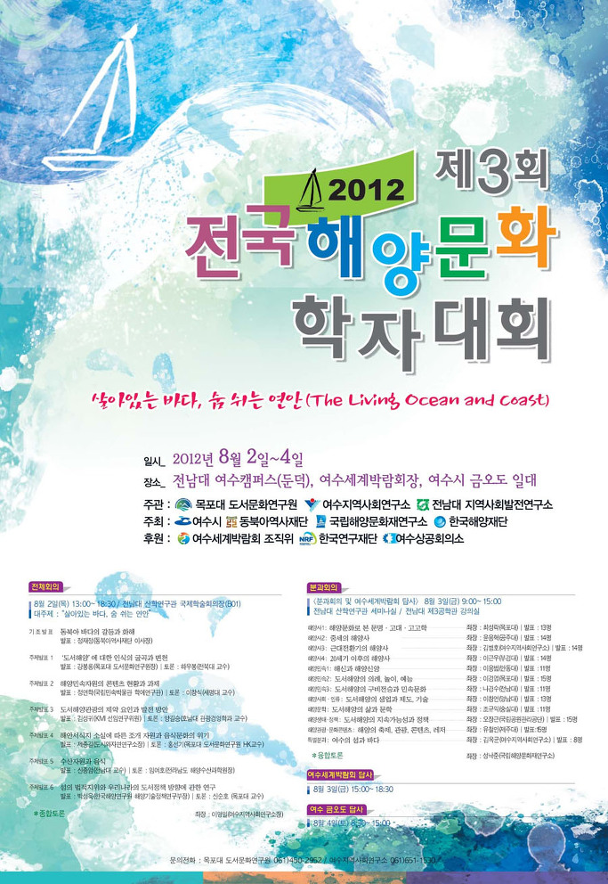

2012 제3회 전국해양문화학자대회 취지문

살아있는 바다, 숨 쉬는 연안(The Living Ocean and Coast)

2012년 여수세계박람회를 기념하는 전국해양문화학자대회를 개최한다. 2009년 제1회 목포대회를 시작으로, 2011년 삼척시와 울릉도 일대에서 개최된 제2회 대회에 이어 세 번째 여수대회를 추진한다. 두 차례의 대회 동안 250여명의 해양문화학자들이 모여 도래하는 신해양 시대를 화두 삼아 학술난장을 펼쳤다. 제2회 삼척대회는 이사부축제와 연계하여 이사부와 장보고를 재조명하면서 독도 문제에 대한 법적, 문화적, 국제 관계적 이슈를 한반도 주변 섬의 중요성과 관련하여 환기시키기도 했다.

이제 2012년 제3회 전국해양문화학자대회에서는 “살아있는 바다, 숨 쉬는 연안”이라는 여수세계박람회 슬로건을 전체 주제 삼아 전체회의, 분과회의 및 융합토론, 공동답사를 진행하게 된다. 우리는 이 대회를 통해 해양문화의 중요성과 해양강국의 위상을 다시 점검해보고자 한다. 세부적으로 기존의 해양문화 분야 외에 해양자원, 기후변화와 대응, 연안보존과 개발의 이슈, 해양의 지속가능한 이용과 개발, 해양환경의 보전, 해양산업의 발전, 해양과학기술 및 신재생에너지 등의 테마들을 통해 왜 이 시대 우리가 총체성으로서의 해양문화를 말해야 하는지 그 해답을 추적하게 될 것이다. 해양이 그리고 해양문화가 인류의 미래와 매우 밀접하게 관련되어 있다고 판단하기 때문이다.

전국해양문화학자대회는 참가자 전원이 발표와 토론에 참여하는 열린 학술대회(Open Forum)이다. 기왕의 대회에 참여하였던 학자들은 물론 그 외의 학자들의 참여도 환영한다. 이 시대 해양문화의 중요성을 절감하고 그 학술적 난장을 공유하고자 하는 모든 학자들이 이 대회의 주인공이다. 우리는 이미 도래한 신해양시대의 문턱에 서있다. 여기서 논의되는 다양한 주제들은 필경 우리 사회의 주요 담론으로 승화될 것이다. 전체 주제는 여수세계박람회 슬로건으로 정해져 있지만, 분과 주제는 자유다. 도서해양과 직간접적으로 관련된 의제면 족할 뿐 발표주제 설정의 자유를 제한하지 않는다. 대회준비위는 다만 자리를 깔 뿐이다. 세 번째 맞는 전국해양문화학자대회에 참여하여 도서해양 중심의 학술난장을 이끌어주시길 소망한다.

제3회 전국해양문화학자대회 조직위원회

<행사 내용>

전체회의

 8월 2일(목) 13:00~18:30/전남대 산학연구관 국제학술회의장

대주제 : “살아있는 바다, 숨 쉬는 연안”

기조발표 : 동북아 바다의 갈등과 화해

발표 : 정재정(동북아역사재단 이사장)

주제발표 1 : ‘도서해양’에 대한 인식의 굴곡과 변천

발표 : 강봉룡(목포대 도서문화연구원장), 토론 : 하우봉(전북대 교수)

주제발표 2 : 해양민속자원의 콘텐츠 현황과 과제

발표 : 정연학(국립민속박물관 학예연구관), 토론 : 이창식(세명대 교수)

주제발표 3 : 도서해양관광의 제약 요인과 발전 방안

발표 : 김성귀(KMI 선임연구위원), 토론 : 양길승(호남대 관광경영학과 교수)

주제발표 4 : 해안 서식지 소실에 따른 조개 자원과 음식문화의 위기

발표 : 제종길(도시와자연연구소장), 토론 : 홍선기(목포대 도서문화연구원)

주제발표 5 : 수산자원과 음식

발표 : 신종암(전남대 교수), 토론 : 임여호(전라남도 해양수산과학원장)

주제발표 6 : 섬의 법적 지위와 우리나라의 도서정책 방향에 관한 연구

발표 : 박성욱(한국해양연구원 해양기술부장), 토론 : 신순호(목포대 교수)

종합토론 좌장 : 이영일(여수지역사회연구소장)

분과회의

8월 3일(금) 09:00~15:00/전남대 산학연구관 세미나실, 제3공학관 강의실

해양사 1 : 해양문화로 본 문명⋅고대⋅고고학 / 좌장 : 최성락(목포대), 발표 13명

해양사 2 : 중세의 해양사 / 좌장 : 윤용혁(공주대), 발표 14명

해양사 3 : 근대 전환기 해양사 / 좌장 : 김병호(여수지역사회연구소), 발표 14명

해양사 4 : 20세기 이후의 해양사 / 좌장 : 이근우(부경대), 발표 14명

해양민속 1 : 해신과 해양신앙 / 좌장 : 이용범(안동대), 발표 11명

해양민속 2 : 도서해양의 의례, 놀이, 예능 / 좌장 : 이경엽(목포대), 발표 15명

해양민속 3 : 도서해양의 구비전승과 민속문화 / 좌장 : 나경수(전남대), 발표 11명

해양사회⋅인류 : 도서해양의 생업과 제도, 기술 / 좌장 : 이창언(영남대), 발표 13명

해양문학 : 도서해양의 삶과 문학 / 좌장 : 조규익(숭실대), 발표 11명

해양생태⋅정책 : 도서해양의 지속가능성과 정책 / 좌장 : 오장근(국립공원), 발표 15명

해양관광⋅문화콘텐츠 : 해양의 축제, 관광, 콘텐츠,

레저 좌장 : 유철인(제주대), 발표 15명

특별분과 : 여수의 섬과 바다 / 좌장 : 성낙준(국립해양문화재연구소)

여수세계박람회 답사

8월 3일(금) 15:00~18:30

여수 금오도 답사

8월 4일(토) 08:30~15:00

공유하기

게시글 관리

**백규서옥\_Blog ver.**