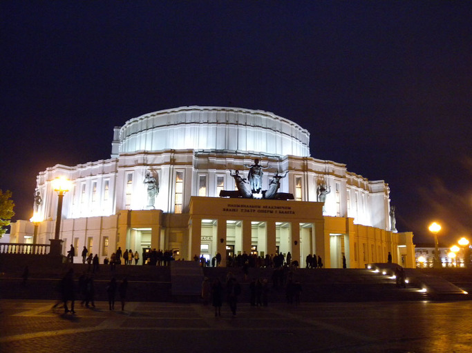

<민스크의 벨라루스 오페라 극장>

‘저녁이 있는 삶’  
  
                                                                                                                                                          백규  
  
 정치의 계절이 돌아왔다. 여름만 되면 어김없이 ‘각다귀 떼 날아다니듯’ 지금 수많은 말들이 난무하는 것도 그 때가 되었음을 알리는 신호다. 영혼이 지워진, 공허한 말들이 귓전을 때리고 사라지는 가운데, 얼마 전부터 우연히 내 마음에 여운을 남기는 한 마디가 있다.  
  
   ‘저녁이 있는 삶’!  
  
 알고 보니 통합민주당 대통령 경선 후보 손학규 선생의 캐치프레이즈였다. 그가 드물게도 정치인들 가운데 내가 호감을 갖고 있던 인사라서 그랬을까. 그 말을 듣는 처음부터 무턱대고 콧방귀를 뀌지는 않았지만, 그렇다고 무릎을 친 것도 아니었다. ‘한국의 정치권’. 바닥이 바닥인지라 처음엔 그저 시큰둥할 수밖에 없었다. 그러나 갈수록 그 말이 내 마음에 일으킨 파문은 파도로 커져갔다. 그러다가 결국 가수 이태원이 세상 사람들에게 넌지시 타이르듯 불러주던 <솔개>의 삶을 동경해온 내게 ‘저녁이 있는 삶’이란 이 말은 참선 수행장(修行場)에서 고승이 질러대던 일종의 ‘할(喝)’\*로 바뀌고 만 것이다.   
최근 그의 말은 책으로 출판되었다 한다. 그러나 나는 그 책을 사지 않았다. 책을 읽으면 어쩔 수 없이 인간의 현학적 허세가 만들어내는 ‘언어의 감옥’에 갇힐 것 아닌가. KS로 호칭되는 국내 최고의 중⋅고⋅대학을 거쳐 세계적으로 유명한 대학에서 박사학위를 받고, 가끔 대중 스피치에서 그 점을 드러내고 싶은 유혹에 시달리는 듯한 그의 모습에서 그가 책에 풀어 놓았을 현학의 덫을 예상할 수 있었다. 아수라장 대선 판에서 모처럼 쓸모 있는 말 한 마디를 건졌는데, ‘현학의 수사(修辭)’로 망칠 일이 있겠는가.    
   \*\*\*  
 몇 년 전 러시아 생뜨 뻬쩨르부르크의 마린스키 극장에서 <백조의 호수>를 관람한 적이 있었다. 입장료가 비싼 극장이었는데, 시민들과 관광객들이 반반이었다. 저녁 무렵 정장차림으로 좌석을 가득 메운 시민들이 인상적이었고, 장면 장면 ‘브라바!’를 외치는 그들이 신기했다. 물론 그들 모두가 잘 사는 사람들은 아니었으리라.     
 얼마 전 다녀 온 벨라루스의 수도 민스크. 저녁시간에 그 유명한 오페라하우스를 찾았다. 컴컴한 시 외곽지역에 환하게 불을 밝힌 원통형의 그 건물이 인상적이었다. 더 놀란 것은 혹시 빈자리가 날까 기대하며 밖에서 줄을 서서 기다리는 시민들의 모습이었다. 무대 위의 공연에 몰두하던 어떤 할머니는 뒷좌석에서 소곤대던 여학생들에게 엄지손가락을 입에 대며 눈을 부라리기도 했다. 참으로 품위 있어 부러운 그들의 ‘저녁 시간’이었다.   
 대조적으로 미국의 도시들은 ‘알 수 없는’ 저녁시간들을 보내는 것 같았다. 6시쯤 되자 도시들의 다운타운은 약속이나 한 듯 텅 비어 버리는 것이었다. 텁텁한 고요와 노숙자들의 활보만이 그 공간들을 채우고 있었다. 그들의 저녁은 어디에 있는 걸까, 지금도 풀 수 없는 수수께끼다.  
   \*\*\*  
 몇 번 늦은 밤에서 새벽까지 종로와 명동 거리를 걸어본 적이 있다. 그곳에 생생한 ‘한국의 저녁’이 있었다. 불야성을 이룬 술집들, 해장국집들, 음침한 간판의 룸살롱들, 모텔들... 비틀거리는 취객들, 택시를 잡기 위해 도로 한 복판까지 나와 손을 흔드는 사람들, 빵빵거리는 승용차와 택시들이 뒤엉긴 채 거리를 메우고 있었다. 어떻게든 낮 시간을 보냈을 그들이 무슨 힘으로 이렇게 ‘찬란한 저녁[혹은 밤] 시간’을 보내는지 같은 한국인인 나도 알 수 없는 광경이었다.   
   \*\*\*  
 아이들을 다 키워놓은 최근에서야 저녁시간의 소중함을 알게 되었다. 비뚤어진 아이들 가운데 상당수가 한결같이 어린 시절 부모와 함께 ‘다정한 저녁시간’을 갖지 못했다는 언론매체들의 보도를 접하고 나서였다. ‘낮에는 학생들을 가르치고, 저녁에는 연구실에서 불을 밝혀야 하는 것’이 교수직이라고 생각해오던 내게 일종의 충격적인 깨달음이었다. 아, 나는 출처불명의 그런 말 한 마디에 매여 지금까지 내 가족으로부터 ‘저녁시간’을 빼앗았구나! 나는 ‘나 혼자만의 저녁’을 위해 ‘우리 모두의 저녁’을 희생시켰구나!   
 때늦은 후회였다. 아이들은 이미 다 커서 나름대로의 세계를 가꾸고 있고, 아내는 그런 나를 체념의 시선으로 바라보고 있지 않은가. 닭장을 벗어난 병아리들을 모이로 유인하여 불러들이듯, 새삼 그들을 우리 안으로 다시 데리고 들어 올 수도 없는 현실. 미물로서 어찌 해볼 수 없는 게 위대한 시간의 작위(作爲)인데, 나는 지금 시간의 준엄한 일갈(一喝) 앞에 무슨 같잖은 저항이라도 해볼 심산이란 말인가. 어쩌면 그들의 마음 한 구석에는 커다란 구멍이 하나씩 뚫려 있을지 모른다는 깨달음이 후회와 함께 밀려들었다. 그 구멍을 지금 와서 어떻게 메운단 말인가. 내 알량한 저서와 논문 한두 편이 역사와 사회를 바꾸는 것도 아니고, 민족의 장래를 비춰주는 것도 아닌데, 좁좁한 연구실에 갇혀 젊은 날의 찬란한 저녁시간들을 불태우고 말았으니, 이 미련한 처사를 어떻게 변명할 수 있단 말인가.    
   \*\*\*  
 손학규 선생이 대통령 후보로 선출되든 그렇지 않든, 아니 대통령으로 선출되든 그렇지 않든 ‘저녁이 있는 삶’은 지금껏 대한민국 국민들이 잊고 있던 소중한 삶의 지표로 가꾸어 나가야 할 것이다. 누가 대통령이 되든 이 표어를 국민들의 마음에 각인시키는 정치를 펴야 할 것이다. 이 표어를 대선의 국면에서 벗어났다고 쓰레기통에 쳐 박아서는 안 된다. 대통령 후보들은 이 표어를 소중히 갖고 있다가 당선되는 순간 새 정부의 국정지표 맨 위쪽에 놓아야 할 것이다. <2012. 7. 28.>    
  
  
\*불교 선종(禪宗)에서 고승이 참선하는 학승들이나 사람들을 지도하면서 질타하는 일종의 고함소리. 언어로 표현할 수 없는 깨달음이나 진리를 나타내기 위하여 발하는 것. 즉 말⋅글⋅행동 대신 드러내는, 깨달은 자의 소리를 말함.

공유하기

게시글 관리

**백규서옥\_Blog ver.**