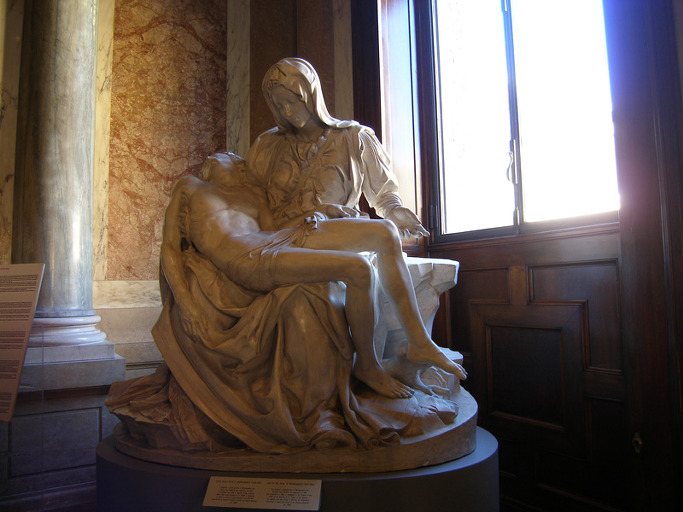
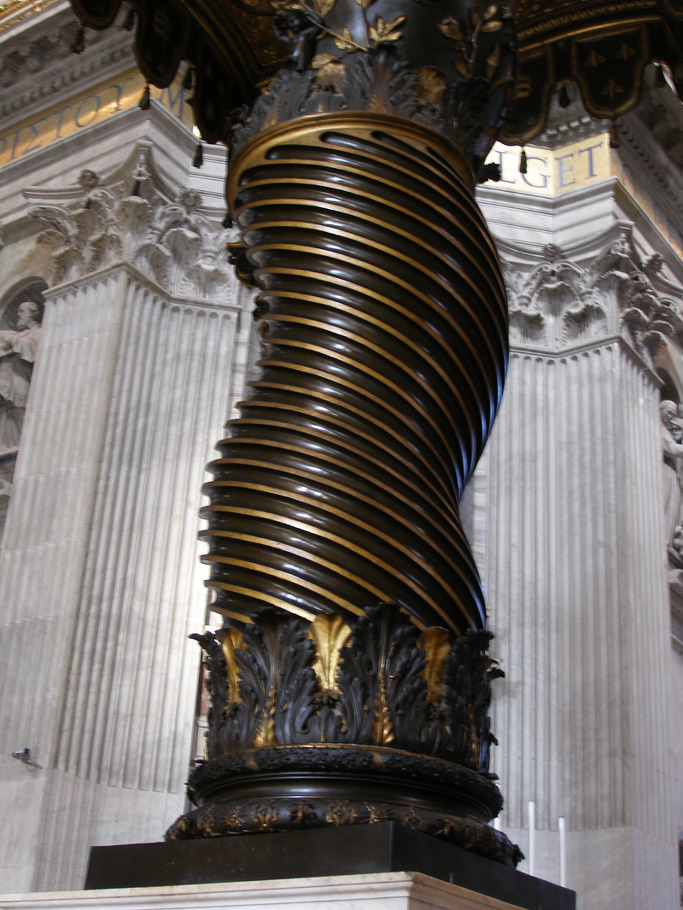
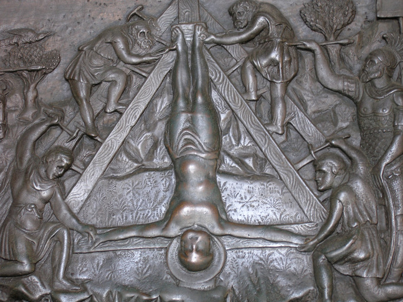
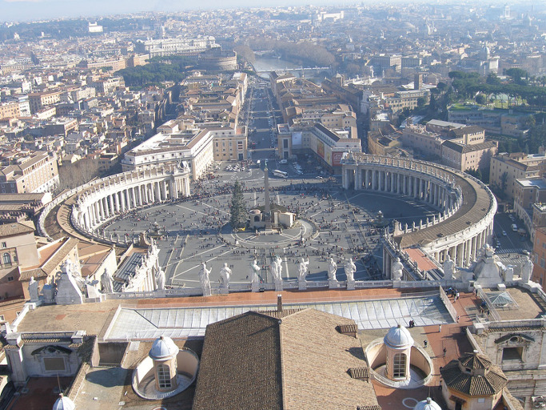

    <베드로 성당에서 감동적으로 만난 피에타상>     <베드로 성당 안에 있는 천계[天階, 발타키노]

    <십자가에 거꾸로 매달려 죽은 베드로 성인>

     <베드로 성당 큐폴라에서 내려다 본 바티칸 시티>   

김기덕은 반역자인가?

-영화 ‘피에타’를 맛보고-

                                                                                                                                                         백규

 김기덕의 영화 ‘피에타’를 보았다. 제69회 베니스국제영화제에서 황금사자상을 받았다는 소식을 들은 지 24시간도 안 된 시점이었다. 되새기기 싫은 장면들과 메시지가 내 안의 알량한 양식(良識)과 벌이는 갈등이 해소되지 않는 한 이 영화에 대한 단 한 줄의 글도 쓸 수 없으리라는 비관적 전망이 나를 우울하게 했지만, 그럼에도 쓴 약을 한 봉지 털어 넣고 도리질하며 차가운 물을 마시듯 몇 자 남길 수밖에 없다. 앞으로 이 감독이 새롭게 내놓을 또 다른 영화를 소화시키기 위해서라도 최소한 내 비위를 강하게 단련시킬 필요는 있다고 본 것이다. 그 정도로 이 영화에 대한 내 나름의 해석을 내려야 한다는 과제는 일종의 고문이었다. 영화를 접한 지 한 달이나 넘은 지금 몇 자 그적거리는 것도 그 때문이다.

  사실 흥행에 성공한 작품이 별로 없지만, 그의 영화들은 늘 화제를 몰고 다녔다. 나도 그 가운데 몇 편 접하긴 했으나, 늘 개운치 못했다. 그다지 절절하지 못한 이유로 때려 부수거나 치고받다가 마지막에 행복의 카타르시스를 만들어 내는, 속 편한 영화들의 문법. 그런 문법에 익숙해진 내 범속성(凡俗性)의 한계 때문이리라. 그러지 않아도 매사에 의미를 부여하며 살아가노라 피곤한데, 돈 내고 영화를 보면서까지 천근 무게의 메시지를 새겨야 한다면 억울한 일 아닌가. 깔깔 웃음이나 후련한 해결을 통해 내 안의 찌꺼기를 맘껏 풀어내는 배설의 장소가 바로 영화관이 아니던가. 그런데, 영화를 보며 배설의 쾌감을 맛보기는커녕, 오히려 무거운 과제를 받아 와야 한다면? 참으로 고약한 일이 아닐 수 없다.

 그래서 떨떠름한 기분으로 영화관에 들어섰던 것이다. 과연 첫 장면부터 구역질이 나왔다. 한때 세상에서 불지옥으로 죄인들을 끌어 올리는 데 쓰였음직한 갈고리가 소름 끼치는 소리를 내며 말려 올라가고, 한 생명이 종말을 고하는 단말마에 내 가슴은 오그라들었다. 보이지 않는 죄악의 근원들이 똬리를 틀고 있는 듯한 주거환경이나 청계천 철거예정지역의 공작소가 보여주는 살풍경. 잔인무도한 표정과 어투의 ‘강도’ 이정진. 모두가 인간성 말살의 빗나간 이 시대의 ‘천민자본주의’ 혹은 그 터전을 대변하는 존재들이다. 불법 채권추심업의 비인간성을 온몸으로 보여준 이정진. 그는 우리 사회가 만들어낸 악마의 표본으로 제시된 존재였다. 자식을 죽인 원수 이강도에게 엄마를 가장하고 접근하여 복수를 시도하는 조민수의 무겁고 처절한 연기는 또 얼마나 섬뜩한가.

 돈 때문에 남을 죽여야 하고, 자신이 죽어야 하는 세상은 말 그대로 지옥이다. 음습한 철공작소의 소품들이 빚어내는 살풍경과 무거운 공기. 그 속에서 단말마의 비명을 질러대며 사라지는 생명을 통해 감독은 무엇을 그려내고자 했을까. 자식을 죽인 원수를 만나 세속적인 복수의 방정식을 실천하는 대신 자신과 그를 함께 묶어 죽음으로 결산하는 서사를 통해 감독은 무슨 메시지를 전하려 했을까. 세상의 죄악을 대신 짊어지고 죽음을 당한 예수. 그를 무릎에 앉히고 무한 슬픔에 잠긴 성모 마리아. 왜 조민수는 지금 세상의 가장 극악한 범죄자, 자신의 아들을 죽인 원수를 죽음으로 회개시키면서까지 나 같은 범인들이 전혀 예상치 못한 구원의 방식을 세상에 내 보이고자 한 것일까. 강도의 처소에 들어간 뒤 음료나 음식물 속에 독약이라도 넣어 그를 죽여 버림으로써 세상의 어머니가 실천함직한 ‘범속한 복수’를 행하지 않고 그렇게 난해한 고차방정식을 풀어나간 것일까.

 단언컨대, 단순히 감독 자신의 미학을 화면에 구현시킨 것이 이 영화의 전부는 아니다. 어쩌면 이 영화의 진정한 주제나 사건들의 의미를 감독 스스로도 깨닫지 못하고 있(었)을지 모른다. 새롭게 발견되는 의미가 ‘텍스트의 살아있음’을 입증하는 유일한 단서라면, 감독은 자신이 던진 화두가 세상에 부딪쳐 되돌아오는 목소리들을 통해 그를 확인하고자 했을 뿐, 그가 결코 단정적인 메시지를 던진 건 아니었으리라. 그런 점에서 베드로 성당의 피에타를 통해 세상 사람들이 흔히 읽어내는 메시지, 그 스테레오 타입을 멋지게 전도시킨 김 감독이야말로 얼마나 ‘멋진 반역자’인가!

  <2012. 9. 23.>

공유하기

게시글 관리

**백규서옥\_Blog ver.**