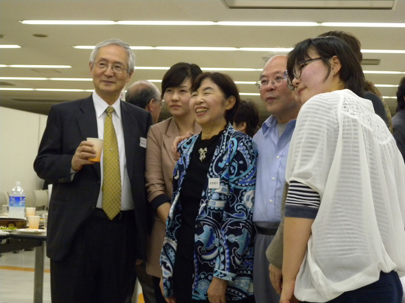
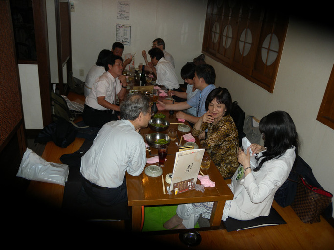
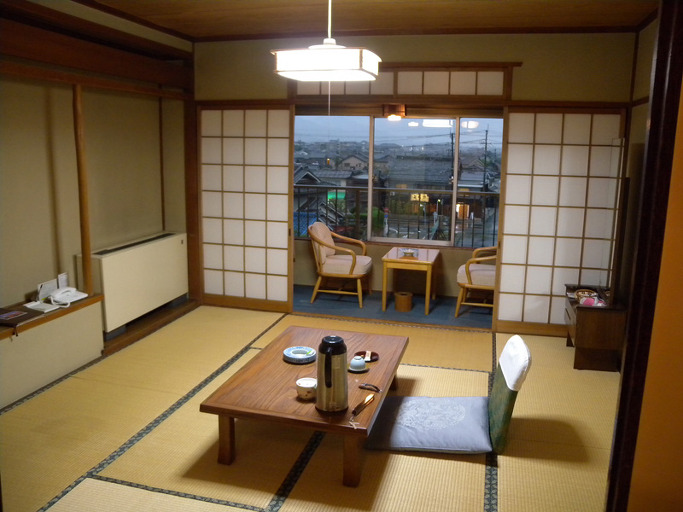

<조선학회 간친회(懇親會)장에서, 앞 줄 왼쪽이 후지모토 유키오(藤本幸夫) 교수)  발표 후 이자카야(居酒屋)에서 만난 일본 학자들일본 천리시의 정갈한 호텔방

일본을 어찌 할 것인가?

                                                                                                                                                               백규

작년 늦가을, 일본 천리대학에서 열린 조선학회에 발표자로 참석했다. 첫날 저녁 이자카야의 선술집에서 몇몇 일본학자들과 어울렸다. 술잔이 오고 가던 중 그들 가운데 한 사람이 ‘한국학을 하는 일본인들은 모두 친한파(親韓派)’라고 하자 다른 학자들이 맞장구를 치는 것이었다. 좌중의 유일한 한국인인 나를 의식한 ‘외교적 언사’임을 모르진 않았지만, 그 후에도 ‘친한파’란 말의 여운은 오랫동안 내 뇌리에서 사라지지 않았다. 지금도 나는 가끔 ‘친한파’와 ‘지한파(知韓派)’란 용어의 같고 다름을 혼자 헤아려 보며 고개를 갸웃하곤 한다.

 그간 우리 언론들은 일본 정치인들에 대하여 툭하면 ‘지한파’란 용어를 갖다 붙이곤 했다. 요즈음 등장하는 정치인들이야 대개 전후(戰後) 세대로서 일본 우익(右翼)의 입맛에 맞게 ‘맞춤식으로 사육(飼育)된 전사(戰士)들’이 대부분이지만, 내가 자랄 때만 해도 나름대로 ‘선이 굵은’ 정치인들이 일본을 이끌어 왔다. 그래서 그랬던가. 그들이 정권을 잡을 때마다 우리 언론들은 그들의 이름 앞에 ‘지한파’란 용어를 붙이기 일쑤였다. 그러나 한-일 양국이 충돌하는 경우 그들이 예외 없이 보여주는 ‘몰역사적(沒歷史的) 파렴치’를 목격하며, 나는 ‘지한파’란 용어의 불순한 함축성을 깨닫게 되었다. 말하자면 ‘친한(親韓)’과 ‘지한(知韓)’은 현격하게 다른 의미를 갖고 있으며, ‘친한’이든 ‘지한’이든 적어도 일본인들과 우리 사이에는 운명적으로 넘을 수 없는 선이 있다는 사실 또한 어렵지 않게 깨달았다.

 총독부의 철권통치를 통해 ‘악랄하다’ 할 정도로 철저하게 우리를 집어삼키고자 한 일본. 우리의 국토나 해양을 이 잡듯 뒤진 일이야 만인 공지의 사실이니 그 극악함은 재삼 반복할 필요 없을 것이다. 최고로 명민한 자국 학자들을 동원하여 우리의 정신문화를 철저히 연구⋅분석해온 저들의 자취를 찾아가다 보면 정말로 소름이 끼칠 정도다. 그 일본 어용학자들은 이 땅의 젊은 학자들을 자신들의 도구로 끌어들여 이른바 ‘식민사관’을 공고히 했고, 지금까지 우리의 정신문화를 조종하는 ‘보이지 않는 손’으로 남아 있다. 그러니 그들이 길러낸 어용학자들이나 그들의 후예를 ‘지한파’로 보는 것이 정확한 판단일 것이다. 적어도 다른 나라나 민족을 지배하기 위해서는 그들의 정신까지 속속들이 알아야 하는 것은 당연한 일. 우리의 내면까지 속속들이 알고 있는 ‘지한파’ 일본인들을 어떻게 우리의 친구로, 선린(善隣)으로 가까이 할 수 있단 말인가.

지금 중국의 동북공정이나 일본의 역사왜곡에 대하여 제대로 항변할 줄 아는 강단의 사학자들을 목격하기 어려운 것도 그 원초적인 씨앗이 이제 큰 나무로 자라나 우리의 땅을 뒤덮고 있다는 무서운 증거일 것이다.

 우리는 일본이 독도를 갖고 ‘장난을 친다’고 여긴다. 말도 안 되는 일에 억지를 부리는 그들의 꼴이 우리의 눈에는 우습게 보이기 때문일까. 독도가 우리 땅이라는 역사 기록들이 꽤 많으니 걱정할 일 없다는 것일까. 그들에게 내 땅을 통째로 빼앗긴 채 40년 가까운 세월을 허송한 바로 직전의 역사는 앞 세대의 일일 뿐, 지금의 나[우리]와는 상관없다고 보기 때문일까. 그러나 조금만 자세히 살펴보라. 그들은 수시로 독도에 잽을 날리는 일을 ‘목숨을 건 도박’으로 생각한다. ‘장난을 치는 일’에 목숨을 거는 바보는 없다. ‘목숨을 건 도박’은 말 그대로 목숨을 걸어야 한다. 우리는 일본이 독도를 거론할 때마다 한심하고 딱하다는 듯 ‘저 새끼들 또 지랄한다’는 반응을 보이기 일쑤다. 그냥 대꾸하지 않고 넘기다 보면 장난꾼이 제풀에 지쳐 그만 두듯 포기하리라 믿는 것이다. 순진한 한국인들은 ‘대다수의 일본인들은 그렇게 생각하지 않는데, 일부 극우주의자들이 자신의 정치적 필요 때문에 그런 말도 안 되는 짓들을 벌인다’고 말하며, 사태를 아주 낙관적으로 보기 일쑤다. 이 이상 더 ‘대책 없이 순진한 낙관주의’가 있을 수 없다. 그들이 언젠가 있을지 모르는 ‘독도대첩(獨島大捷)’을 위해 해⋅공군력을 무한 증강하고 그 칼날을 벼려 온 역사가 얼마인데, 우리들 가운데 일부 불순한 무리들은 제주도에 해군기지를 만드는 일조차 필사적으로 막으려 한다. ‘평화’를 위해 해군기지를 만들면 안 된다는 것이다. 참으로 해괴한 일이다. 우리 스스로 무장해제를 해가면서 어떻게 이웃의 강도들로부터 우리 스스로를 방어한단 말인가.

 최근 일본총리 노다 요시히코(野田佳彦)란 자가 앞장서서 ‘독도 분란’와 댜오위다오(釣魚島) 분란을 야기시키고 있다. 그 덕분에 그는 꺼져가던 그의 정치생명을 되살리는 데 성공했다. 황당하기로 노다에 비해 한 술 더 뜨는 아베신조(安倍晋三)란 자는 최근 자민당의 총재로 선임되었다. 나이를 갖고 따지는 일이야말로 젊은이들이 흔히 비칭으로 사용하는 이른바 ‘꼰대’들의 잘못된 관행이겠지만, 노다는 나와 같은 1957년생(56세), 아베는 약간 위인 1954년생(59세)이다. 우리 할아버지와 아버지가 겪은 일제시대, 대동아 전쟁, 6⋅25 동란 등을 한 번도 겪지 않고 등장하여 나라의 경영을 맡게 된 첫 세대가 바로 내 또래의 정치인들이다. 말하자면 일본이나 우리나 ‘철따구니 더럽게 없는’ 세대가 바로 우리 또래들이다. 전후에 제대로 처리되지 못한 역사의 노폐물들을 접하며 현실적 이해관계의 잣대나 들이대며 ‘불뚝거리는’ 세대가 바로 지금 나라를 경영한다는 내 또래의 정치인들이다. 제대로 된 철학도 경륜도 갖추지 못하고 감정과 투쟁의 혈기만 넘치는, 바로 그 세대다.

그런데, 노다의 정치생명 연장이나 아베의 총재 취임은 누구에 의해 이루어졌는가. 바로 일본 국민들에 의해서다. 그간 순진한 우리나라 언론들은 독도 분란이나 댜오위다오 분란이 일부 일본의 극우세력에 의해 야기된 일이라고 떠들어 댔다. 내가 보기에 우리나라 언론들의 무책임한 선정성이나 과도한 낙관주의는 참 기네스북에 올려도 될 정도다. 지금도 노다나 아베의 재등장을 일부 극우주의자들의 작품이라고 떠들 자신이 있는가? 아니다. ‘독도도 댜오위다오도 자신들의 것이었으면’ 하는 것이 일본 국민 전체의 마음이라는 것을 이제 깨달아야 한다.

그런 가운데 최근 일본의 일부 지성인들이 자국의 위험한 움직임에 대하여 경고의 멘트를 날린 것은 다소 위안이 되는 일이다. 핏발 선 눈으로 미쳐 날뛰는 극우주의자들, 인간의 탈을 쓰고 차마 겉으로 말은 못하면서 ‘우리 것이었으면’ 하는 욕심을 마음속에 품고 있는 대다수 일본 국민들과 달리, 그들이 잘못 된 길을 가고 있음을 지적한 소수 지식인들은 세계 지성사에 아로새겨야 할 ‘보석 같은 존재들’임에 틀림없다. 그러나 현실적으로 그런 소수가 무슨 힘이 있는가. 과연 그들의 양심이나 양식이 거대한 집단의 흐름을 막는 보(洑)가 될 수 있다고 보는지?

\*\*\*

 우리의 무책임한 낙관주의는 재빨리 청산되어야 한다. 상대방이 창을 들고 나서면 우리는 두꺼운 방패로 막은 다음 더 강한 창을 마련해야 한다. 제주에도 두어 군데 해군기지를 만들어 두 방향에서 밀려오는 적[일본과 중국]을 막아야 한다. 우리가 도서관 서고에서 찾아낸 옛 문서를 들고 아무리 흔들어도 일본의 독도 침탈은 막을 수 없다. 댜오위다오를 두고 일본과 싸움을 벌이는 중국이 싸움을 걸어올 다음 차례는 우리의 이어도다. ‘역사가 반복된다’는 경험칙만 바라보며 넋을 잃고 앉아 있을 틈이 없다. 오나라의 부차와 월나라의 구천이 남긴 ‘와신상담(臥薪嘗膽)'의 교훈을 우리 스스로 실천하지 못한다면, 중국와 일본에 의해 당한 구한말의 치욕은 바로 오늘의 일로 재현될 수도 있다. <2012. 9. 27.>

공유하기

게시글 관리

**백규서옥\_Blog ver.**