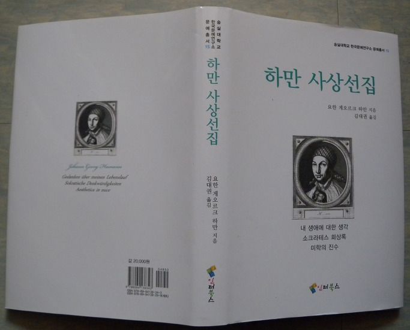

‘한국문예연구소 문예총서 15’로 김대권 교수의 번역서 <<하만 사상전집>> 출간!

하만은 헤르더와 더불어 독일의 질풍노도 문학운동을 주도했던 사상가이다. 그의 글은 단편이 주종을 이루는데, 김대권 교수(독어독문학과)가 그중에서 세 편을 골라 국내에서 최초로 번역했다.

먼저 <내 생애에 대한 생각>은 하만의 자서전으로, 여기에서 하만은 자신의 유년시절, 학창시절, 가정교사 활동, 런던과 리가에서의 생활 등 29세까지의 삶을 기술하고 있다. 무엇보다도 이 자서전에는 하만의 신앙고백이 들어있어, 성서에 근거한 하만의 사상을 이해하고, <소크라테스 회상록>과 <미학의 진수>의 의미를 파악하는 데 일종의 밑거름 역할을 한다.

하만 이전에도 소크라테스 전기를 쓴 사람은 많았다. 그리고 소크라테스를 성서 유형학적인 측면에서 선지자나 의인 혹은 예수에 비유한 전통도 있었다. 그러나 하만은 <소크라테스 회상록>에서 일반적인 의미의 소크라테스 전기를 쓰기보다는 그의 생애에서 “기억할 만한” 점만을 골라 간략하게 기술한다. 그리고 당시의 계몽주의자들과는 달리, 이 고대 그리스 철학자를 자신의 멘토이자 본보기로 삼는 데만 그치지 않고, 나아가 자신을 소크라테스에게 투영하여 오만한 이성의 마력에 휘둘린 계몽주의의 지적 풍토에서 기꺼이 소크라테스적인 역할을 담당하고자 한다.

<미학의 진수>에서는 창조, 타락, 구원, 재림이라는 성서의 큰 틀 속에서 ‘미학’ 문제가 논의된다. 여기에서 ‘미학’이란 바움가르텐이 정의한 “감각적 인식에 관한 학문”이라는 의미와 더불어 예술이론이라는 뜻을 함축하고 있다. ‘미학’ 문제는 주로 추상 위주의 시대경향에 대한 비판과 추상에 의해 배제된 자연, 감각, 정열을 복권하려는 측면에서 논의된다. 저서의 제목과는 달리 ‘미학’은 본격적이고 체계적으로 논의되지 않고, 단편적으로 스쳐지나가듯이 언급되어 여설적인 느낌을 준다. 하지만 이성 중심적인 18세기의 전반적인 문화현상에 대한 ‘미학’의 측면에서 제기한 촌철살인은 주목할 만하다.

강호제현의 일독을 권한다.

하만 사상선집: 요한 게오르크 하만(지음)/김대권(옮김). 인터북스 2012. 값 20,000원

공유하기

게시글 관리

**백규서옥\_Blog ver.**