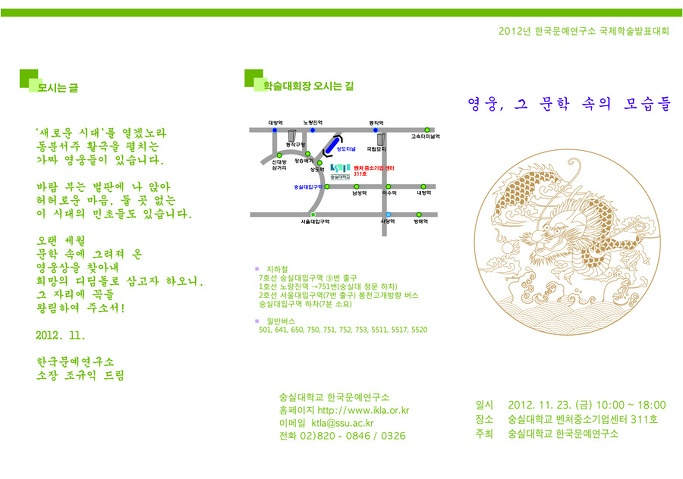
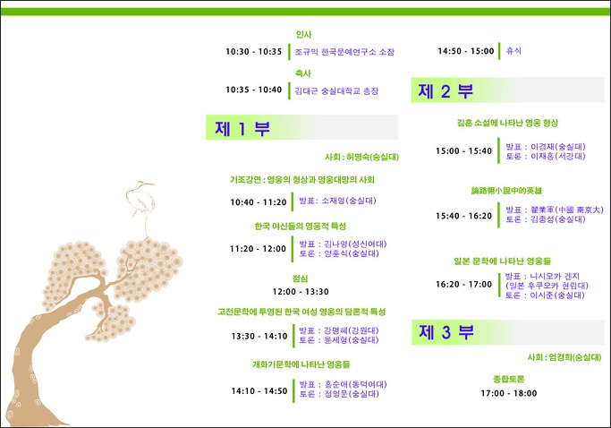

---------내  용---------

1. 행사명 : 2012년 한국문예연구소 국제학술발표대회

 2. 주   제 : 영웅, 그 문학 속의 모습들

 3. 일   시 : 2012. 11. 23. (금)  10:00~18:00

 4. 장   소 : 숭실대학교 벤처중소기업센터 311호

 5. 주   최 : 숭실대학교 한국문예연구소

 6. 연락처 : 02)820-0326, 0846

 7. 발표내용

        \*제1부               사회  허명숙(숭실대)

         1)  기조강연 : 영웅의 형상과 영웅대망의 사회--발표 소재영(숭실대)

         2)  한국 여신들의 영웅적 특성--발표 김나영(성신여대)/토론 양훈식(숭실대)

         3) 고전문학에 투영된 한국 여성영웅의 담론적 특성--발표 강명혜(강원대)/토론 윤세형(숭실대)

        4) 개화기문학에 나타난 영웅들--발표 홍순애(동덕여대)/토론 정영문(숭실대)

      \*제2부                사회  허명숙(숭실대)

       1)  김훈 소설에 나타난 영웅 형상--발표 이경재(숭실대)/토론 이재홍(서강대)

       2)  論路翎小說中的英雄--발표 翟業軍(中國 南京大)/토론 김종성(숭실대)

       3)  일본문학에 나타난 영웅들--발표 니시오카 겐지(일본 후쿠오카 현립대)/토론 이시준(숭실대)

      \*제3부   종합토론                    좌장  엄경희(숭실대)

공유하기

게시글 관리

**백규서옥\_Blog ver.**