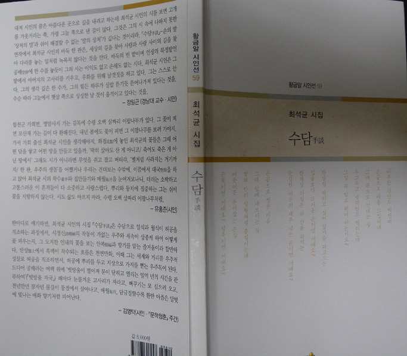
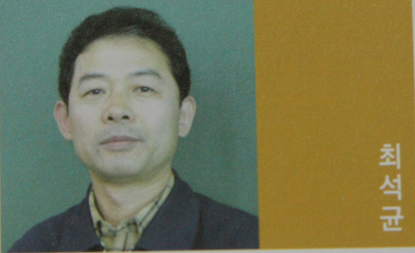

제자의 시집을 받아들고

                                                                                                                                                           백규

영국의 정치가 핼리팩스(Halifax) 백작은 “가르치는 일에 따르는 허영심은 가끔 인간으로 하여금 자신이 바보라는 사실을 잊게 만든다”고 했다. 강의실에서 학생들을 만나 스스로 묘한 열기에 휩싸일 경우, 나 자신이 ‘매우 모자란 인간’임을 잊을 때가 많다. 강의실로부터 조용한 연구실로 돌아와 열기가 식으면, 그때서야 내 생각과 말을 직시하게 되고, 가끔 등짝에 식은땀이 흐르곤 한다. 그래서 인간에게 매우 긴요하고 귀한 일이되 스스로를 자만과 착각에 빠뜨리기도 하니, 누군가를 가르친다는 것은 양날의 칼과 같은 일이다.

\*\*\*

오후 잠깐 들른 우편함에 아담한 책 한 권이 놓여 있었다. 최석균 시인의 <<수담(手談)>>이란 시집. 최석균이라? 순간 학부 4학년의 앳된 얼굴이 번개처럼 지나갔다. 꿈같이 흘러버린 25년의 세월, 경남대학 시절의 그를 떠올릴 수 있었다. 중저음의 그는 차분한 성격을 갖고 있었다. 온몸에서 풍기는 성실함이 경상도 억양과 어울려 묘한 매력을 발산하던 친구였다. 그렇던 그가 그 사이에 중견 시인으로 자라나 두 번 째의 멋진 시집을 내고, 내게 ‘감당할 수 없는 헌사(獻辭)’까지 달아 보내 준 것이었다. 30년 가까운 세월의 강을 격(隔)한 지금, 그 시절 그와 만나던 마산시 월영동의 강의실을 떠올리려 애를 써본다. 나는 과연 그와 그들에게 무슨 말을 했을까. 내가 뱉어낸 말들 가운데 단 한 마디라도 기억해주는 친구가 있을까. 혹시 내가 젊은 시절의 혈기와 격정으로 세상을 저주하는 말을 내뱉었고, 그 말들 때문에 세상에 대하여 부정적인 인상이나 심어준 것은 아닐까.

\*\*\*

사실 나는 지금도 강의실에 들어가면 당황스럽다. 준비해온 말들은 입 안에서 맴돌다 사라지고, 학생들의 표정과 내 시선이 마주치는 지점에서 비로소 말문은 새롭게 열리곤 한다. 그러니 제대로 정돈되지 못한 말들이 튀어 나가는 건 당연한 일. 가끔은 나 자신도 믿을 수 없을 정도의 멋진 멘트가 튀어나가기도 하지만, 대개 뱉고 나서 후회되는 말들이 적지 않다. ‘자신이 바보라는 사실을 순간순간 깨달으면서도 바보임을 잊은 채 살아가는 인간이 선생’이라는 것도 그 때문에 나온 경구(警句)인 듯 하다.

\*\*\*

20년의 세월을 지내고도 나를 기억해준 제자가 이 순간 나를 감동시키기도 하고, 나를 부끄럽게 만들기도 한다. 지난날의 부끄러운 추억은 대부분 치기(稚氣)어린 열정의 소산임을 자인한다. 그런 온축(蘊蓄) 없이 성마르기만 했던 열정으로부터 내 제자들은 과연 무엇들을 배웠을까. 일찍이 도연명(陶淵明)은 말했다. “지금까지 마음은 육신의 부림을 받았으니 어찌 홀로 슬퍼하리오. 지난 일의 부질없음을 깨달았고, 앞일을 따를 수 있음을 알았다네. 실로 길을 잃어버림이 아직 멀지 않으니, 지금이 옳고 지난날이 그른 줄을 깨닫는다네[旣自以心爲形役 奚惆愴而獨悲 悟已往之不諫 知來者之可追 實迷途其未遠 覺今是而昨非]”라고. 선생으로서의 내 과거는 부끄러움으로 점철된 시간대이나 이제 그 그릇됨을 깨달았으니, 지금부터라도 올바로 살아갈 만한 기틀을 마련했다고 할 수 있는가.

\*\*\*

최 시인의 시집 제목은 수담(手談)이다. 그것이 ‘손의 말’이든 ‘손으로 하는 말’이든, 입은 닫은 채 샘솟는 마음을 손끝으로 풀어놓는 반상(盤床)의 서사(敍事)임에 틀림없다. 세상사 복잡함도 가로 세로 각 19줄• 361개 교차점으로 이루어진 바둑판에 모두 그려낼 수 있는 것을, 우리는 무엇을 찾아 아등바등하는가. 그는 아마도 바둑을 통해 세상의 이치를 모조리 터득한 듯, 그의 안목이 자못 형형하다. 반상을 통해 우주와 세상의 이치를 들여다보는 최 시인의 혜안을 감상들 하시라고, 독자 제위께 한 작품만 보여드리고자 한다.

화점(花點)

점에서 꽃이 핀다

하얀 꽃 검은 꽃 그 틈새에

여백의 꽃들이 눈을 뜬다

우화羽化한 날갯짓 잉잉거리며

누운 꽃들의 꿈을 퍼 나른다

묵인과 오판 속에서

바꿔치기와 꽃놀이패 속에서

꺾고 꺾이는 꽃의 향기들

생사를 오가는 꽃의 길들이

아찔아찔 뒤엉켜 자란다

딱히 살아도 산 게 아니고

죽어도 죽은 게 아닌 땅에서

깍지 끼듯 얽힌 이율배반의 손과 손이

저승과 이승 경계점을 넘나든다

툭 던져진 손톱만한 꽃눈이

꽃눈 속에 숨은 모래만한 씨앗이

달만큼 자라서 별처럼 사라지는 거기까지

한판, 우주의 생몰이다

재차 새판을 짜기 위해

가지런히 누워 봄을 기다리는

한 점, 한 점 낙화의 잔영이다.

\*화점(花點) : 바둑판에 표시된 아홉 군데의 점.

  최석균 시집, 황금알 시인선 59/<<수담手談>>, 황금알, 2012.

공유하기

게시글 관리

**백규서옥\_Blog ver.**