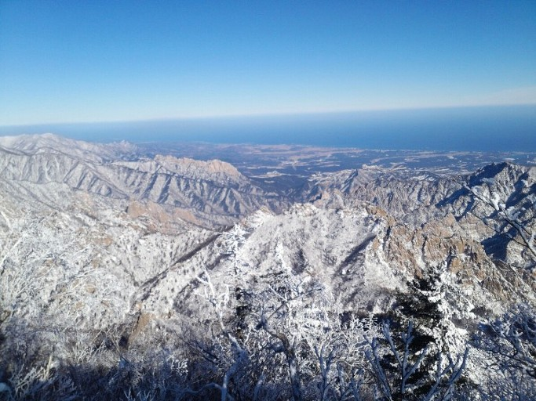
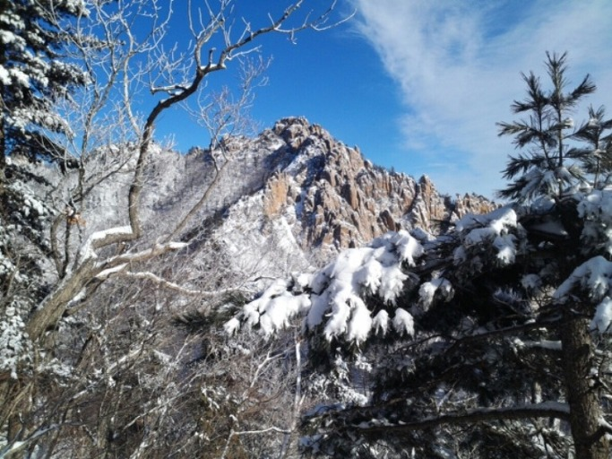
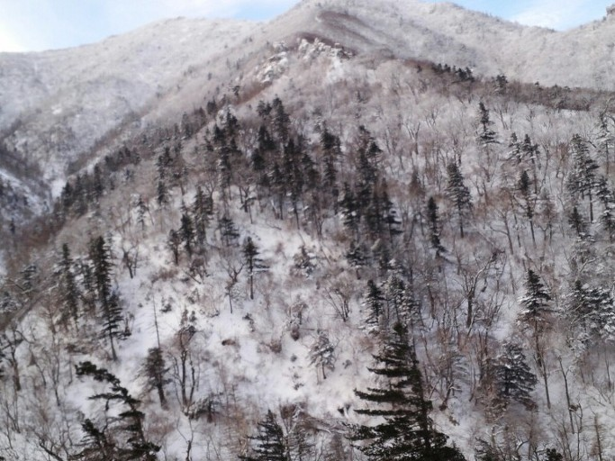
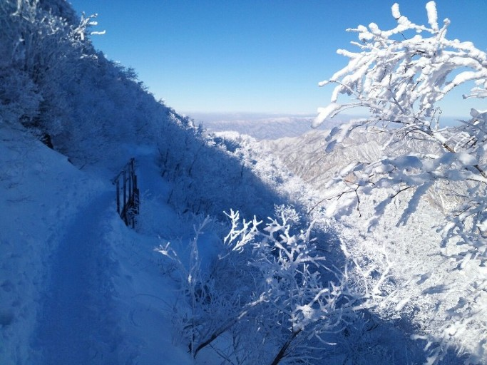
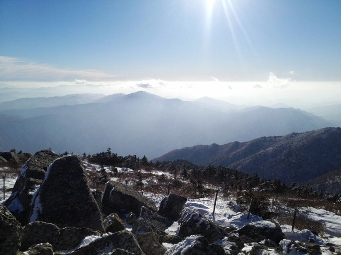
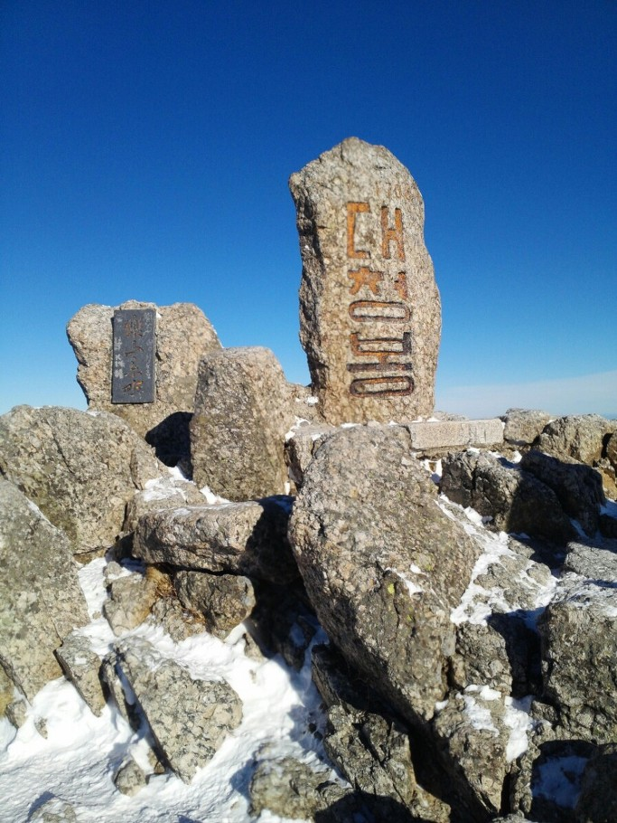

  2013. 1.1. 새벽/숭실대 국문과 06학번 박형준 촬영 전송  2013. 1.1. 새벽/숭실대 국문과 06학번 박형준 촬영 전송  2013. 1. 1. 새벽/ 숭실대 국문과 06학번 박형준 촬영 전송  2013. 1. 1. 새벽/숭실대 국문과 06학번 박형준 촬영 전송  2013. 1. 1. 새벽/숭실대 국문과 06학번 박형준 촬영 전송  2013. 1. 1. 새벽/숭실대 국문과 06학번 박형준 촬영 전송                                        

 2009년 겨울/백규 촬영(양양 솔비치 해변)

새해인사

계사년 새해가 밝았습니다.

그동안 저와 인연을 맺어 온 모든 분들께 머리 숙여 새해 인사를 올립니다.

새해에도 더욱 건강하시고 가정이 평안하시길 빕니다. ‘뱀이 무성한 풀밭을 쑥 빠져 나가듯’ 바라시는 모든 일들을 순조롭게 이루시길 빕니다.

저 개인적으로나 국가적으로 지난해 참 많은 일들이 일어났습니다. 자세히 말씀드리긴 뭣합니다만, 어렴풋하나마 앞으로의 삶에 대한 통찰을 얻게 되었고, 참하고 ‘이쁜’ 며느리를 얻었으니, 나름대로 선전(善戰)한 한 해였다고 할 수 있습니다. 또한 안정적이라 평가 받는 인물을 대통령으로 뽑은 점도 국가를 위해 무척 다행한 일이었다고 봅니다. 물론 만족스럽지 못한 부분도 없지 않습니다. 지난 해 연말쯤 중앙아시아 고려인 문학 분야의 책을 낼 생각으로 노력해왔습니다만, 막판에 약간 주춤거리면서 금쪽같은 시간들을 허비하다가 그 계획은 무산되었고, 결국 올해로 이월하게 된 점은 무엇보다 후회스럽습니다. 쌓아놓은 벽돌이 빠지면서 담벼락이 무너지듯, 연구 스케줄의 한 부분이 무산되거나 연기될 경우 다른 부분들이 줄줄이 밀리게 되니, 복구에 많은 정력이 소비될 것은 당연한 이치이지요.

요즈음 강의실에서 젊은 학생들을 만날 때마다 느끼는 점이 많습니다. 무엇보다 그들의 표정에서 읽어내는 ‘좌절과 자신 없음’이 가장 아픈 부분입니다. 저는 젊은이들이 모인 강의실에서라면 ‘중구난방(衆口難防)’도 용인되어야 한다고 봅니다. 아니, 오히려 권장되어야 한다고 보는 것이 제 철학입니다. 전공 지식이 모자란다 해서, 세상을 보는 안목이 모범답안으로부터 좀 어긋난다 해서, 무슨 문제가 되나요? 그런데, 왜 그들은 입을 닫고 있는 걸까요? 흡사 한 마디라도 실수하면 일을 그르칠까봐 전전긍긍하듯이 말입니다. 교수의 눈을 피해 속닥속닥 ‘문자질’은 잘들도 하면서 교수와 친구들 앞에서 자신의 견해를 당당히 펴지 못하는 이유는 뭘까요? 다른 대학의 교수들도 비슷한 말들을 하는 걸 보면, 그게 아마 지금 젊은 세대의 일반적인 모습 같기도 하군요. 젊은이들의 기가 살아 있어야 하는데, 참 안타까운 일입니다.

새해엔 우리네 삶이 더욱 팍팍해질 거라는 전망들이 많습니다. 무엇보다 젊은이들의 일자리가 획기적으로 늘어나야 하는데, 걱정입니다. 캠퍼스 그득 들어찬 젊은 제자들의 가슴에 더 이상 좌절을 안겨주지 말아야 하는데, 큰 걱정입니다. 세계정세와 긴밀하게 맞물려 돌아가는 우리나라의 정치⋅경제⋅외교 등의 분야를 보면, 세계가 편안해져야 우리도 편안해진다는 사실을 새삼 깨닫게 됩니다. 새 대통령이 현 정부나 집권자의 문제점을 잘 알고 있는 만큼, 똑 같은 어리석음을 범하지는 않을 것이라는 믿음을 가져 보기로 합니다. ‘혹시나’ 했다가 ‘역시나’로 끝난 지금까지의 경험들은 일단 잊기로 했습니다. 쓴 경험들이 이번에도 반복된다면, ‘역사의 전환’을 개인에게 기댄다는 것이 얼마나 어려운 일인가를 다시금 확인하고 좌절하게 되겠지요. 그러나 그럴 일은 없을 것이라 단호히 믿어 보겠습니다.

세밑에 홀연 우리 곁을 떠난 ‘신바람 전도사’ 황수관 선생의 부음을 접하면서, ‘삶의 덧없음’과 ‘살아 있음의 고마움’을 함께 느낍니다. 아마 그 분도 우리가 모르는 사이에 건강의 이상을 겪고 계셨으리라 추측해봅니다. 그래서 평소 건강관리가 중요하고, 그러기 위해서라도 ‘욕심을 줄이는 일’이 무엇보다 소중하다는 점을 새삼 깨닫습니다.

새해 더욱 건강하시고, 댁내 두루 평안하시길 빕니다.

계사년 정초

백규 조규익 드림

\*사진은 숭실대학의 멋진 제자 박형준 군(국문과 06학번)이 새해 첫날 새벽 설악산에 올라 찍어 보내준 ‘새해 첫 선물’입니다. 박형준에게 고마움을 표하며, 저 혼자 간직하기 미안하여 이곳에 올립니다.

공유하기

게시글 관리

**백규서옥\_Blog ver.**