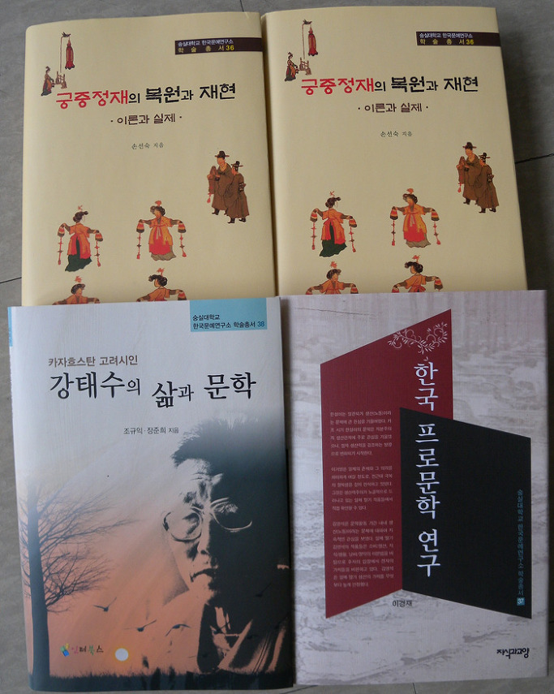

**한국문예연구소, 새로운 학술총서 세 권 발간!!!**

한국문예연구소에서는 최근 <<궁중정재의 복원과 재현-이론과 실제>>(손선숙/한국문예연구소 학술총서 36)⋅<<한국프로문학 연구>>(이경재/한국문예연구소 학술총서 37)⋅<<카자흐스탄 고려시인 강태수의 삶과 문학>>(조규익⋅장준희/한국문예연구소 학술촐서 38) 등 세 권의 의미 있는 학술서들을 발간했다. 내용을 간단히 소개하면 아래와 같다.

￭ <<궁중정재의 복원과 재현-이론과 실제>> : 이 책은 <<악학궤범>>과 <<정재무도홀기>> 등의 기록들을 바탕으로 궁중 정재들을 충실하게 복원⋅재현하기 위한 이론과 실제를 꼼꼼하게 살핀 역저다. 그간 <<궁중정재 용어사전>>, <<궁중정재 교육방법론>>, <<궁중정재 용어연구>>, <<궁중홀기 속의 우리 춤과 음악 찾기>> 등 주목할 만한 저작들과 다수의 논문들을 통해 궁중정재의 본질 모색과 재현에 주력해온 저자는 이 책을 통해 자신의 연구 성과를 야심적으로 펼쳐 보이고 있다. 제1부 ‘궁중정재의 복원 및 재현을 위한 이론’[궁중정재 무원 구성의 변화양상/조선 후기 정재 춤 동작의 분포현황/정재 춤 동작의 변화와 계승/<<악학궤범>>에 수록된 정재무도의 기록양상/<처용무> 춤 동작의 문헌 기록 양상, 제2부 ‘궁중정재의 복원 및 재현을 위한 실제’[정재 무보체계의 보완과 방안 연구/정재 사(詞) 동작의 이론적 토대 마련과 실기 방안/<<악학궤범>>을 토대로 한 <처용무> 재창작] 등 궁중 정재 전 분야에 대한 논의가 이 첵에 담겨 있다. 연구자나 실연자(實演者)들이 자신들의 주장을 중구난방으로 펼치고 있음은 물론 심지어 국가기관인 국립국악원마저 정립된 이론체계를 갖지 못한 현실에서 손 박사의 이 책은 궁중정재의 연구나 실연에 최선의 길잡이 역할을 해주리라 본다.

￭ <<한국 프로문학 연구>> : 이 책은 한국 현대문학 초창기의 이념적 산물로서 문학과 현실의 상관관계를 논할 때마다 빠짐없이 거론되는 ‘프로문학’, 그 중에서도 ‘생산력 주의’라는 새로운 개념을 집중적으로 조명한 연구물이다. 그간 <<단독성의 박물관>>, <<한설야와 이데올로기의 서사학>>, <<한국현대소설의 환상과 욕망>>, <<끝에서 바라본 문학의 미래>> 등 주목할 만한 평론집과 학술서들을 통해 문학 혹은 한국현대소설의 바탕을 살펴 온 저자는 이번의 저서를 통해서는 이념과 문학의 현실적 거리를 치밀하게 천착한 것으로 보인다. 독자들은 이 책에서 ｢한설야 소설에 나타난 생산력 주의｣, ｢한국 전쟁의 기억과 사회주의적 개발의 서사｣, ｢일제 말기 이기영 소설에 나타난 생산력 주의｣, ｢이기영의 ‘처녀지’ 연구｣, ｢이기영 소설에 나타난 만주 로컬리티｣, ｢일제 말기 생산소설의 정치적 성격 연구｣, ｢김영석 소설 연구-생산의 문제를 중심으로｣ 등 싱싱한 문제들과 해명을 만날 수 있게 될 것이다.

￭ <<카자흐스탄 고려시인 강태수의 삶과 문학>> : 이 책은 젊은 시절인 일제시대에 ‘살기 위해’ 고국을 떠났다가 구소련 스탈린 체제의 폭력에 의해 ‘강제이주-유형-타국 정착’의 복잡다단한 디아스포라를 겪은 고려인 강태수 시인의 삶과 문학, 사진 및 작품자료 등을 함께 묶어 공개한 학계 최초의 저작이다. 단순히 운명이나 역사의 장난으로 돌려 외면하고 말기에는 그의 삶이 지나치게 비참하고 극적이라는 점, 그리고 그런 그의 삶이 문학 속에 고스란히 녹아 있는 한 그의 문학을 단순한 상상력의 소산으로만 볼 수 없다는 점, 개인이 당한 역사의 모순이나 부조리는 민족 공동체의 집단적 경험이므로 충실히 되살려 미래에 대한 교훈으로 삼아야 한다는 점 등에 대한 인식이 이 책의 바탕이 되었음을 조규익 교수는 서문에서 밝히고 있다. 독자들은 이 책을 통해 고려인들이 고난 속에서 꾸려온 삶과 상상력의 진정한 관계를 이해할 수 있게 될 것이다.

공유하기

게시글 관리

**백규서옥\_Blog ver.**