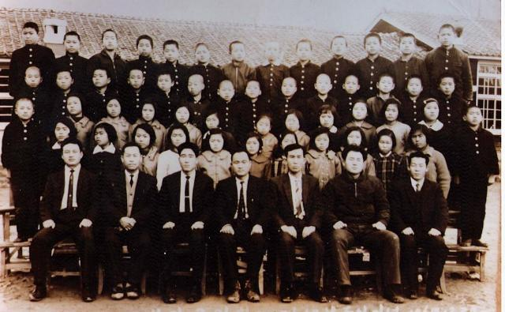

                        \*1968년도에 찍은 필자의 방갈국민학교 졸업기념 사진

장학사 유감

                                                                                                                                                          백규  
  
#60년대 중반. 나는 대한민국에서 가장 궁벽한 시골의 국민학교(지금의 초등학교)에 다니고 있었는데, 한 학기에 한 두 번씩 조용한 학교가 뒤집어질 때가 있었다. 바로 장학사가 ‘뜨는’ 때였다. 그 옛날 암행어사는 예고도 없이 뜨는 ‘무서운’ 존재였지만, 당시 장학사는 ‘예고하고 뜨는’ 암행어사였다. 차라리 예고 없이 뜨면 마음이라도 편하련만, 미리 예고를 하고 뜨는 바람에 흡사 ‘날짜 받아 놓은 사형수’처럼, ‘뜨거운 여름 날 양철 지붕 위의 고양이’처럼, 모두들 불안하고 어수선한 나날을 보내야 했다. 교장, 교감 선생님을 비롯한 모든 선생님들이 장학사 왕림 일주일 전부터 우왕좌왕하며 코흘리개 아이들을 닦달했다. 군데군데 칠이 벗겨진 창틀은 닦을수록 칠 부스러기들만 묻어 나왔고, 더덕더덕 때 낀 4면의 벽과 군데군데 못이 빠지고 뒤틀려 밟을 때마다 삐걱거리는 교실 바닥의 널빤지들은 그야말로 속수무책이었다. 늘 습기와 지독한 냄새에 쩐 재래식 화장실, 그곳을 무시로 드나드는 강아지만한 시궁쥐들은 참으로 처치 곤란이었다. 무심한 시간은 흘러 장학사님이 왕림하시는 날. 늙으신 교장 선생님과 모든 선생님들, 버짐 핀 얼굴에 끊임없이 흘러내리는 두 줄기 콧물을 훔쳐내는 한편, 덕지덕지 때 낀 손들을 숨기느라 늘 뒷짐을 져야했던 우리들은 길게 도열하여 ‘암행어사보다 무서운 장학사님’을 영접하곤 했다. ‘어사 출도’의 결과가 어땠는지는 알 수 없었지만, 장학사가 돌아가고 난 교정은 또 다음번의 ‘어사 출도’가 있기 전까지 고요 속으로 빠져드는 것이었다.   
  
#70년대 후반의 어느 해 3월. 사범대학을 갓 졸업한 나는 경기도의 한 고등학교에 병아리 교사로 부임했다. 유신 정권이 막바지로 접어 든 시기였다. 부임 후 두어 달이나 지났을까. 장학사가 온다고 학교 전체가 난리가 난 듯 했다. 그 모습이 초등학교 학동시절과 하나도 달라진 게 없었다. 청소는 물론이고 각 분장업무 별 공문 정리, 수업지도안 보완 등 어수선한 두어 주를 보낸 뒤 장학사를 맞았다. 그는 젊어 보였다. 꼭 다문 입술이 단정했고, 말도 깍두기처럼 각이 져 있었다. 교감 이하 전 교사가 교무실을 가득 메웠고, 장학사는 맨 앞 반 층 높은 자리에 제왕처럼 앉아 전체 교사들을 내려다보는 자세로 앉았다. ‘고압적’이라는 말의 뜻을 눈앞에서 깨닫는 순간이었다. 두려움과 긴장으로 팽팽해진 교감과 교사들의 얼굴이 보였다. 그 시각쯤 교장은 교장실에 앉아 좌불안석이었을 것이다. 물 끼얹은 듯 좌중은 고요했다. 장학사 손에는 교사들의 명단이 들려 있었다. 갑자기 장학사가 “○○○선생!”하고 불렀다. “네!”하고 일어나 부동자세로 선 그 교사에게 장학사는 “이 학교의 학교운영방침과 교훈을 말씀하고 설명해 보시오!”라고 물었다. 그 교사는 교훈은 그런대로 말했으나 학교운영방침은 생소했는지 대답을 하지 못했다. 나도 가슴이 덜컥했다. 교사라면 학교운영방침 쯤은 알고 있어야 한다는 것을 그 순간에 깨달았기 때문이다. 낮고 음침하면서도 깍두기 같은 질타가 장학사의 입에서 튀어나왔고, 그 교사는 사색이 되어 있었다. 장학사는 다른 교사 두 명을 호명하여 ‘수업지도안’을 갖고 나오라 했다. 대충 한 두 페이지를 넘겨보던 그는 장황하게 문제점을 지적하기 시작했다. 참으로 ‘영명하신’ 장학사였다. 교사들이 힘들여 작성했을 지도안을 그 짧은 순간에 어찌 그리도 ‘당당하게’ 짚어낼 수 있단 말인가. 자연히 장학사의 말 가운데 칭찬보다는 질타, 훈계가 압도적이었다. 흡사 그는 학교의 약점을 잡아 교사들을 겁주려고 찾아 온, 일종의 ‘저승사자’처럼 보였다. 초등학교 시절 형성된 장학사의 이미지가 교사가 된 후에도 그대로일 줄은 모르고 있던 나였다. 참으로 무서운 것이 장학사란 직책의 고압적인 분위기였다. 공부를 더 해야겠다는 이유로 교단을 떠났지만, ‘장학사-교장-교감-부장’ 등 교육계의 고압적 관료시스템이 주는 불만과 좌절도 크게 작용했음을 요즘 들어 더 깨닫게 된다.   
  
#그 후 장학사에 대한 두려움이 없어지게 된 것은 순박하고 성실한 내 친구들이 장학사, 장학관 등으로 진출하는 것을 보면서였다. “아, 저런 친구들이 장학사의 계급장을 달고 일선학교에 나가 병아리 같은 학동들과 순진한 선생님들 앞에서 목에 힘을 주었던 것이로구나!”라는 깨달음이 오면서 장학사에 대한 두려움을 비로소 버릴 수 있게 되었다. 어쩌면 군사정권 시절부터 장학사나 장학관은 국가 권력의 대행자쯤으로 자처하며 교직사회를 지배해 온 게 아닐까.  
  
#최근 충남 교육청의 ‘장학사 임용시험 비리’가 불거지면서 그간 나를 지배해왔던 장학사들의 정체 상당 부분이 드러나고 말았다. 들려오는 소문에 의하면, 그런 비리가 충남 교육계만의 문제는 아니라고 한다. 교육계도 사람 사는 세상의 한 부분일 뿐이다. 교사도 월급 받아 가정을 꾸리는 생활인이고, 남들보다 잘 살고 싶고 높은 자리에 앉고 싶은 ‘장삼이사(張三李四)’들일 뿐이다. 욕망의 도가니에서 아귀다툼하며 살아가는 우리들이 교사들에게만 욕망을 버릴 것을 강요할 수는 없다. 교사들 사이에 벌어지는 갈등과 반목도 다른 공동체 못지않다는 사실을 교직에 몸담고 있는 친구들에게 듣는다. 물색 모르는 사람들은 ‘교사들 사이에 무슨 갈등과 반목이 있을 수 있는가?’라고 묻게 된다. 다른 공동체와 마찬가지로 교직사회도 본질적으로 ‘계급’에 의해 지탱되는 질서를 갖고 있다. 지위의 고하에 의해 형성되는 계급은 ‘재화(財貨) 획득의 차등’을 결정한다. 교사 또한 물질이 행복의 가장 중요한 전제조건으로 통용되고 있는 우리 사회의 ‘중요한’ 구성원이다. 그런 상황에서 누군들 동료 교사보다 높아지려는 시도를 하지 않겠는가. 그런 과정에서 타고난 재주와 후천적인 노력보다 쉬운 것이 ‘부정한 방법’이라는 사실을 저절로 깨닫게 될 것이고, 결국 위아래 할 것 없이 헤어날 수 없는 수렁에 빠지고 마는 것이다.  
  
아름답던 학창시절의 추억과 미래세대의 꿈이 오롯이 보존되었으면 하는 마음에 교육계의 비리가 ‘여기서 끝!’이었으면 좋겠다. 그러기 위해서라도 불거진 상처는 예리한 칼로 정확하게 도려내야 할 것이다. 고름이나 암종(癌腫)의 한 부분이라도 남는다면, 조만간 그게 커져 또 다시 더 큰 칼을 대야 할 비극이 도래할 것이기 때문이다. ‘장학사 선발 비리’를 보면서 참으로 뒤숭숭해지고 슬퍼지는 요즈음이다. <2013. 2. 23.>

공유하기

게시글 관리

**백규서옥\_Blog ver.**