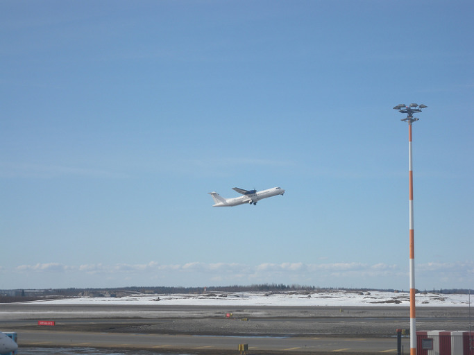  
<헬싱키-반타 공항 모습>

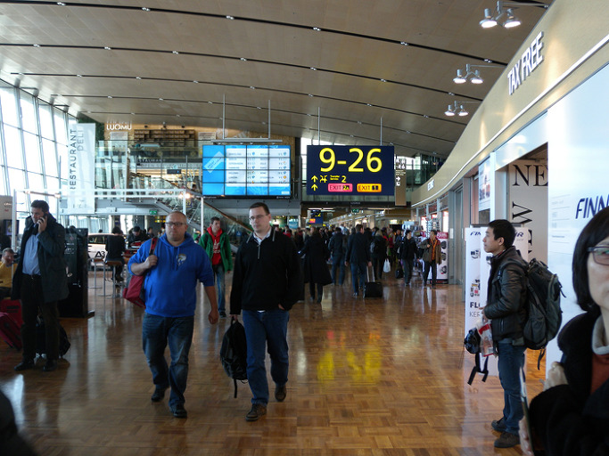  
<헬싱키-반타 공항 내부>

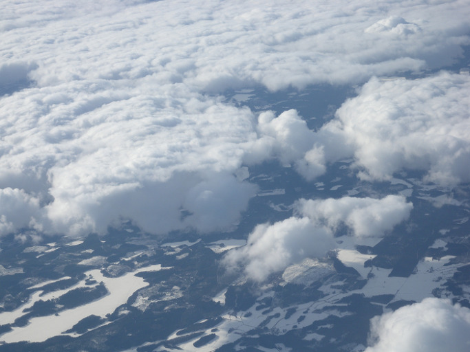  
<헬싱키에서 로바니에미로 가는 비행기에서 내려다 본 핀란드 산하>

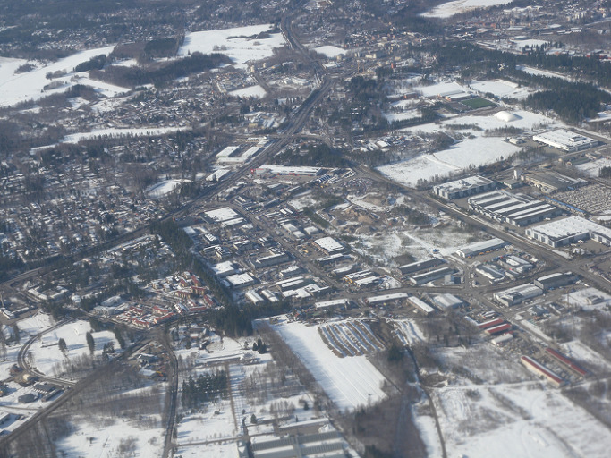  
<비행기에서 내려다 본 헬싱키 근교>

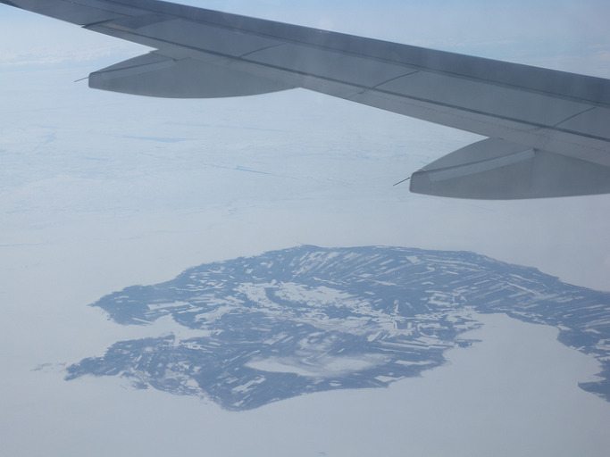  
<헬싱키에서 로바니에미로 가는 도중에 내려다 본 핀란드 산하>

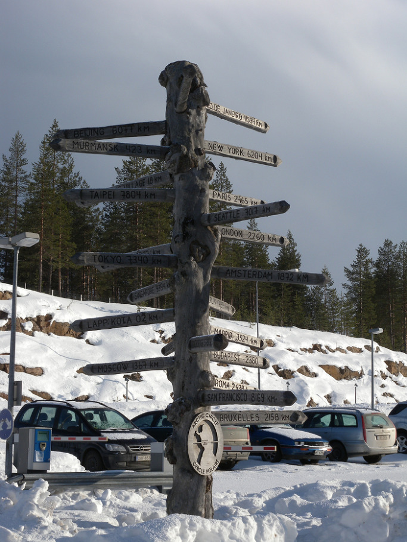  
<로바니에미 공항 바깥에서 만난 이정표>

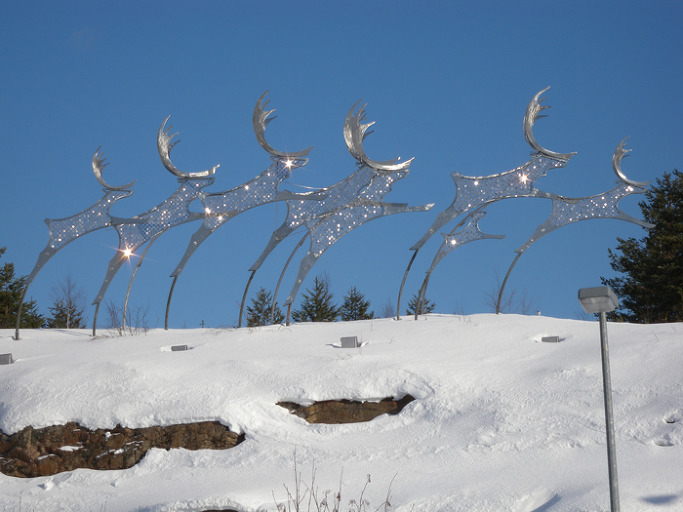  
<로바니에미 공항 바깥 언덕에 세워진 순록 상>

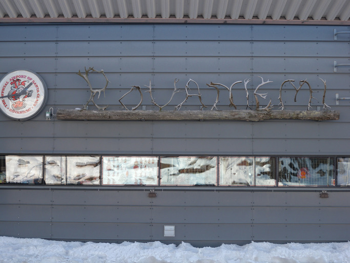  
<로바니에미 공항의 앙증스런 간판-순록의 뿔로 만들었음>

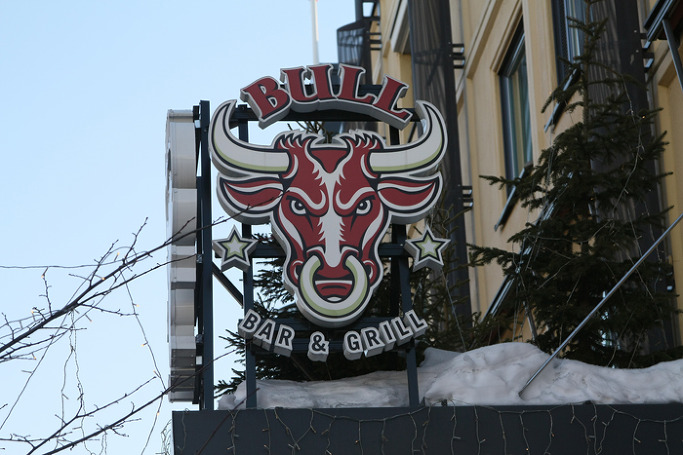  
<로바니에미 첫날 저녁식사를 한 식당 BULL>

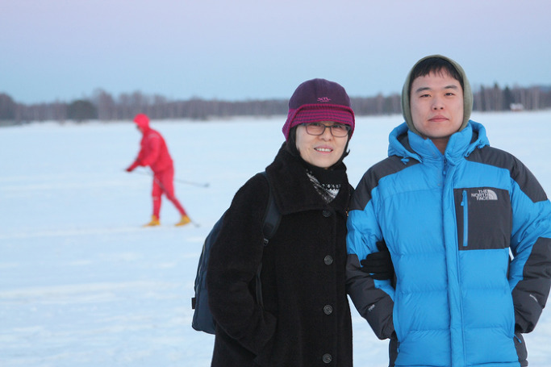  
<로바니에미 오우나스 강과 께미강이 합류하여 이루어진 호수같은 강에서-미숙, 경현>

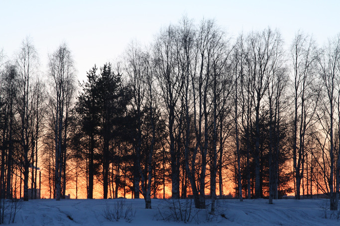  
<오우나스-께미 주변의 자작나무 숲 뒤로 석양은 불타고...>

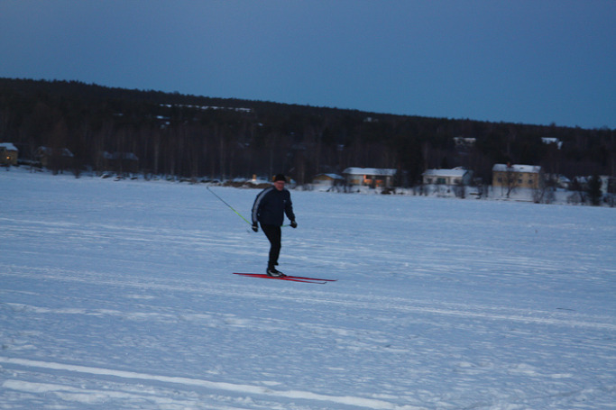  
<오우나스-께미에서, 외로운 스키어>

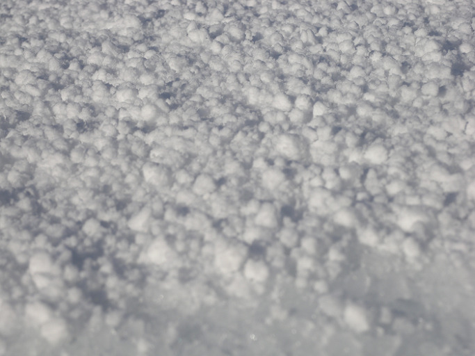  
<로바니에미에서 목격한 눈의 모습>

아직도 눈에 덮인 북극권의 낙원

참으로 먼 곳이다.

 새벽 5시에 기상, 인천공항 행 리무진에 오른 시각이 6시 45분. 공항에서 아침식사 해결 후 핀에어에 탑승한 시각이 10시였고, 이륙한 시각은 10시 30분이 넘어서였다. 베이징 상공, 모스크바 상공, 쌩뜨 뻬쩨르부르그 상공 등을 거쳐 발트해 상공에 들어선 것이 이곳 시각 오후 3시 가까이. 3시 5분경 헬싱키-반타 국제공항에 착륙했다. 한국과의 시차는 6시간. 짐을 찾은 후 로바니에미 행 비행기 출발 시각인 4시 20분 전에 탑승구 22A에 도착하고 나서야 한숨을 돌릴 수 있었다. 두어 해 전 북유럽 여행팀에 합류하여 잠시 거쳐 갔을 뿐인 이곳. 이번에 큰맘 먹고 그 속살을 보고 싶었다. 스웨덴에 650년간, 러시아에 200년간 통틀어 850년을 남의 지배 아래 살아왔으면서도 자신들의 정체성을 지켰을 뿐 아니라 지배자들의 문화를 발전의 거름으로 삼아온 나라. 2차 대전에 독일과 러시아 사이에서 ‘줄을 잘못 선’ 죄로 철저히 파괴되었고, 전후 소련에 천문학적인 배상금을 기한보다 훨씬 앞당겨 갚아 버리고, 그 후 몇 년 만에 올림픽을 유치하기까지 한 나라. 면적은 남북한의 1.5배쯤 되지만 인구는 500여만 밖에 되지 않는 북유럽의 강소국. 아이슬란드에 이어 세계 두 번째로 북극에 가까워 국토의 30%가 북극권에 들어가 있는 나라. 이 나라의 비밀은 무엇인가. 그 점이 궁금했다.

\*\*\*

헬싱키에서 로바니에미로 날아가는 1시간 30분 동안, 아직도 하얀 눈에 덮여 잠들어 있는 핀란드의 자연을 음미했다. 구릉 하나 보이지 않는 평원에 다닥다닥 둥근 공간들이 하얗게 널려 있는 건 핀란드 전역에 수만 개나 있다던 바로 그 ‘눈 이불을 덮고’ 얼어버린 호수들이었다. 그 뿐이랴. 온 평원엔 백설을 뒤집어쓴 전나무와 삼나무 숲이 들어차 있고, 누가 그었는가? 그 사이사이로 핏줄처럼 도로들이 교차하며 끝없이 뻗어 있었다. 호수와 숲의 나라. 그런데 아직 한겨울의 단잠에 빠져 있었다. 이 겨울잠을 누가 있어 깨울 것인가? 나그네의 마음속 떠오른 부질없는 걱정과 의문이었다. 도회의 냄새는 로바니에미 인근에 도착할 무렵에서야 맡을 수 있었다. 사뿐히 공항에 내리니, 참으로 한적하고 ‘이쁜’ 시골 공항이었다. 공항 건물 앞 언덕 위엔 순록의 모형들이 달릴 듯 서 있고, 순록의 뿔을 이어 붙여 만든 공항 간판은 건물 뒤쪽에 숨듯이 달려 있었다. 렌터카를 몰고 나온 경현의 안내로 시티호텔에 여장을 푼 뒤 본격 탐사가 시작되었다. 호텔 옆 BULL에서 시장기를 지운 우리는 밤인데도 대낮같이 환한 시가지를 거쳐 꽁꽁 얼어붙은 오우나스강(Ounasjoki)과 께미강(Kemijoki)이 합쳐져 호수를 이룬 곳에 들어갔다. 텅 빈 얼음판엔 하얀 눈만 한 길 싸여 있고, 간혹 스키어들만 외롭게 그 공간을 왕래했다. 자작나무 숲 사이로 그제서야 넘어가는 석양이 불타듯 스며들었고, 아주 조금씩 우리의 품속을 파고드는 어둑발과 함께 숙소에 들어왔다. 시차를 극복하지 못하여 몸은 천근이었으나, 마음은 새털처럼 가벼운 로바니에미의 첫 밤이다.

공유하기

게시글 관리

**백규서옥\_Blog ver.**