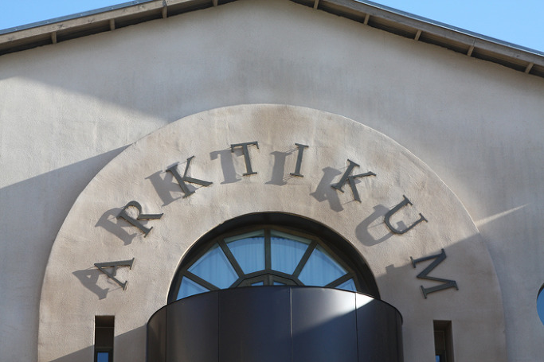  
                                                                        <아르크티쿰 정문 간판>

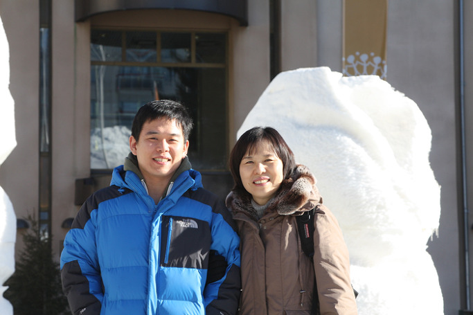  
<아르크티쿰 정문 앞에서-임미숙, 조경현>

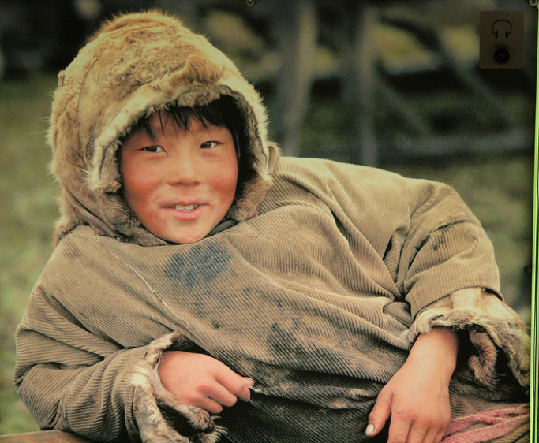  
<아르크티쿰에서 사진으로 만난 사미족 소년>

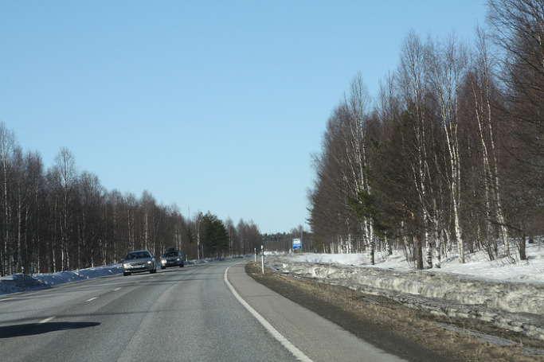  
<께미 가는 길>

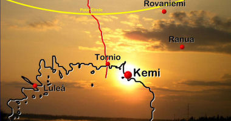  
<께미 가는 길 표시>

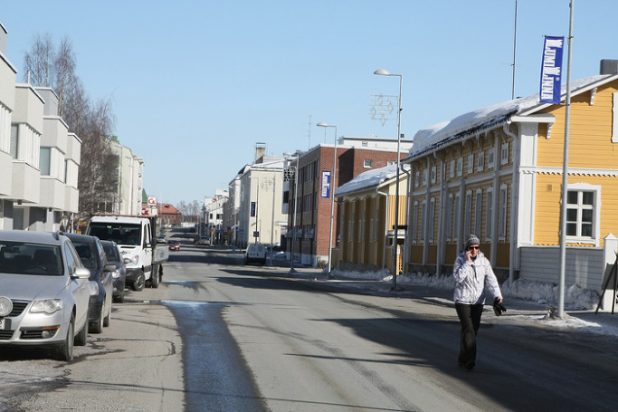<한적한 께미 시가지>

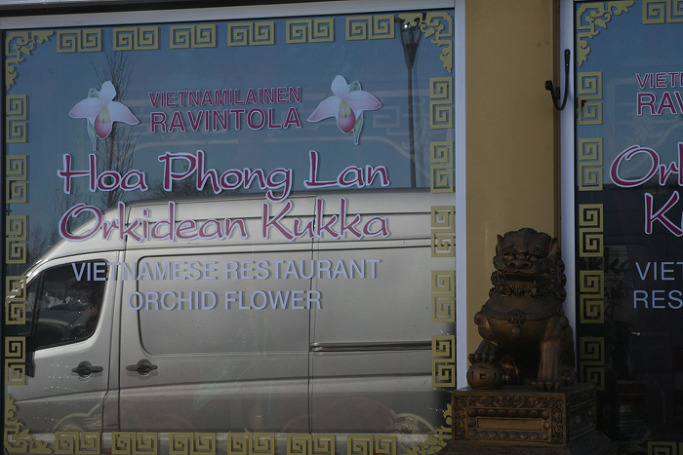  
<께미 시가지에서 만난 베트남 식당>

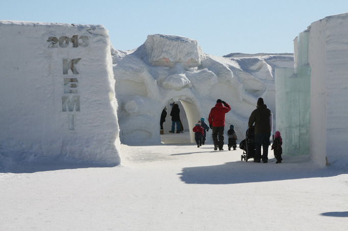  
<스노우 캐슬 입구>

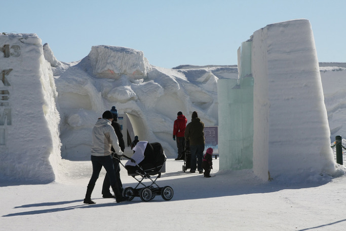  
<스노우 캐슬 입구-엄마와 아가>

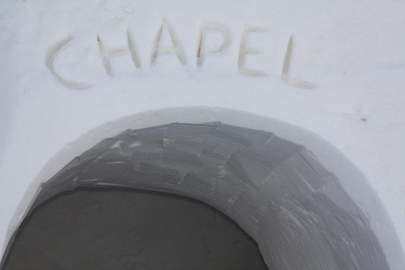  
<스노우 캐슬 채플 입구>

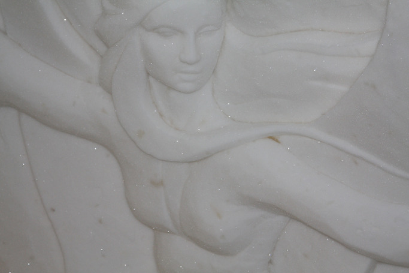  
<스노우 캐슬 내부에 부조된 여인상>

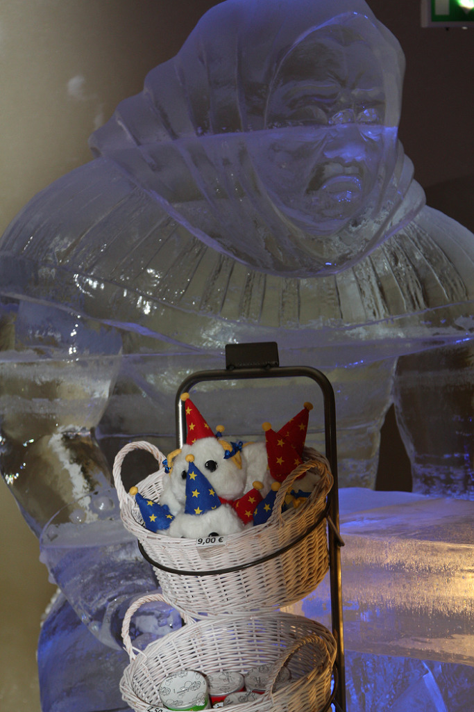  
<스노우 캐슬 안에 소조된 마귀할멈(?)>

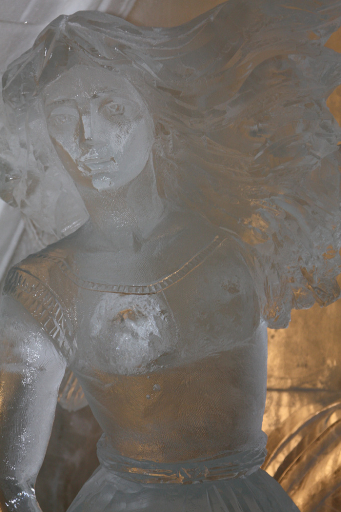  
<스노우 캐슬 안의 여인상>

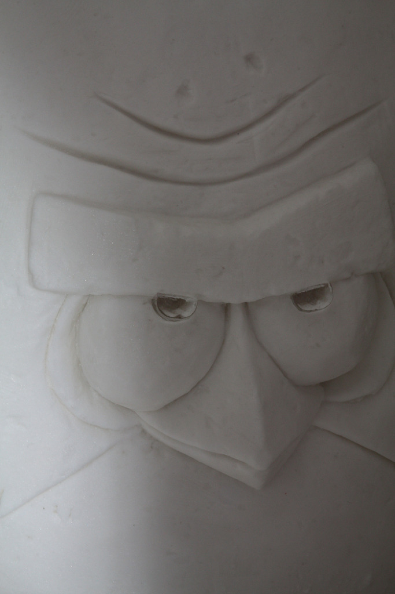  
<스노우 캐슬 안에 조형된 앵그리버드>

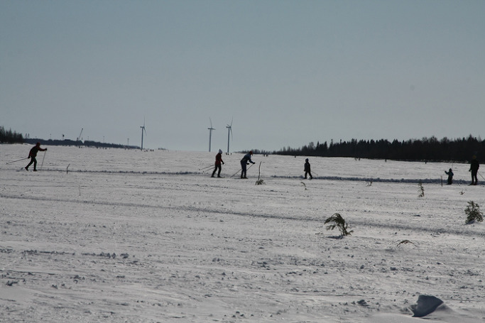  
<스노우 캐슬 밖 설원의 스키어들>

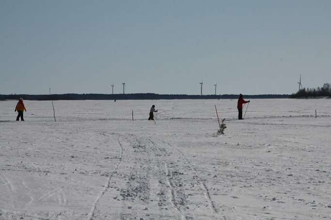  
<열심히 스키를 타는 꼬마>

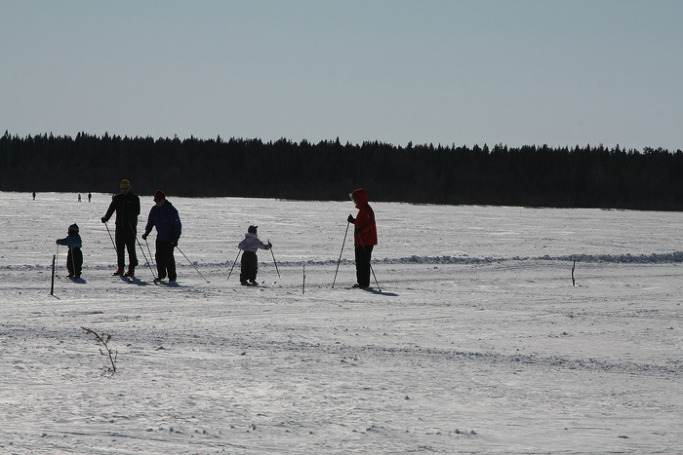  
<스키를 가르치는 아버지와 배우는 아들>

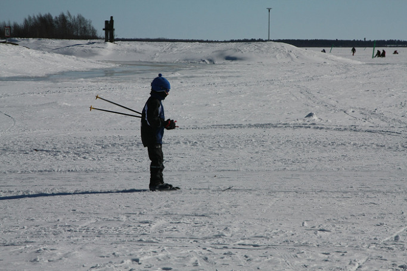  
<당당한 꼬마 스키어>

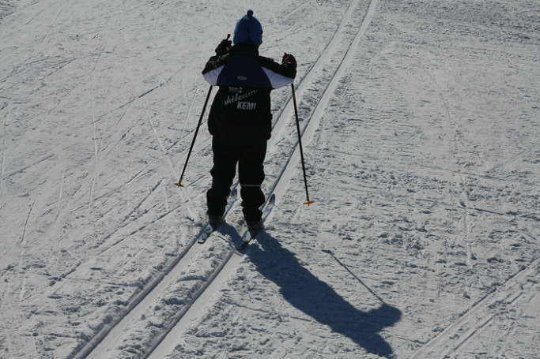  
<당당한 꼬마 스키어>

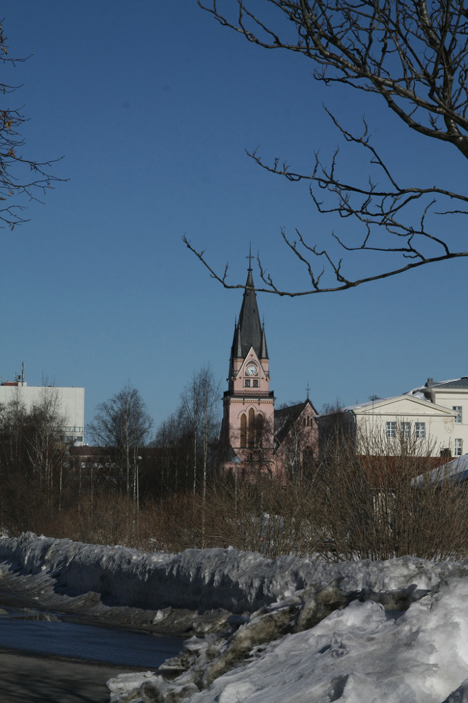  
<께미에서 만난 루터 교회>

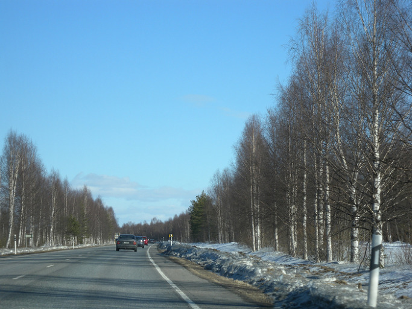  
<께미에서 로바니에미로 돌아오는 길>

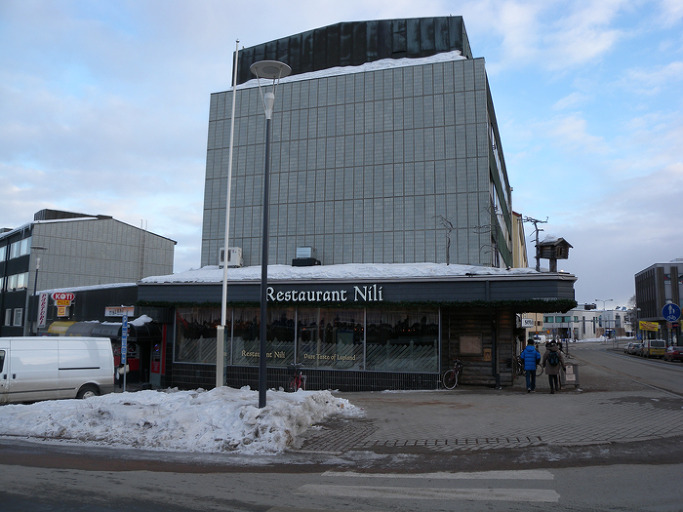  
<맛있는 저녁식사의 추억 : 레스토랑 니리>

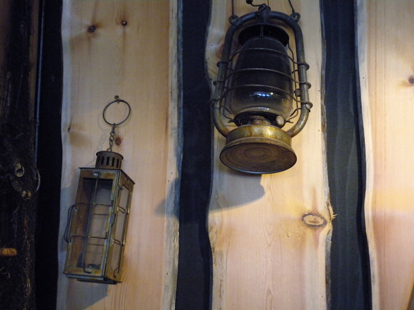  
<레스토랑 니리의 벽에 걸린 옛 등>

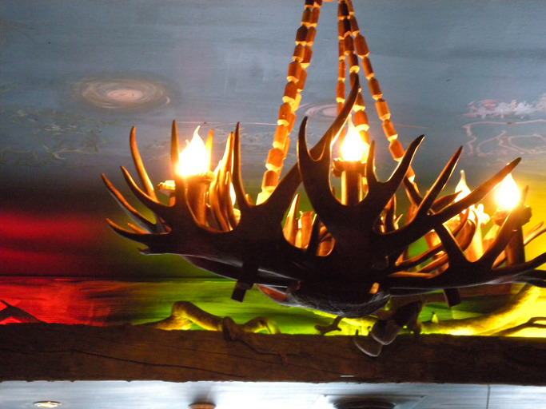  
<레스토랑 니리의 천정에 걸린 멋진 등>

꿋꿋한 사미족, 얼음에 피를 돌게 하는 핀란드인들

4월 16일 아침. 창밖으로 햇살이 밝게 비친다. 북극선상에 놓여 있기 때문일까. 햇살이 살아있을수록 기온이 차갑다는 이곳 날씨의 특성을 피부로 느낀다. 한낮에는 올라가겠지만, 영하 10도의 추위가 창밖에 아지랑이마냥 어른거린다. 그 추위에 대한 두려움을 풍성하게 차려진 호텔 식당의 아침식사로 한껏 눅일 수 있었다. 갓 구운 빵과 각종 치즈, 베리(berry) 쥬스와 스프, 야채, 과일 등의 풍미가 나그네의 허기를 채워준다. ‘핀란드 빵이 형편없다’는 내 선입견이 일거에 무너져 내리는 순간이다.

식후 찾은 아르크티쿰(Arktikum). 우리말로 번역하자면 ‘극지(極地) 자연 및 생활문화사 박물관’쯤 될까. 시가지 한켠의 눈벌판에 오똑 세워진 건물 모습이 참했고, 입구 앞에 눈을 뭉쳐 세운 조형물들이 이채로웠다. 사미족의 어제와 오늘이 고스란히 살아 우리의 마음을 움직였다. 북유럽 어느 나라를 돌아보아도 존재가 뚜렷한 사미족. 그들은 스칸디나비아 북부에서 핀란드 북부, 러시아의 콜라 반도에 걸친 광범한 지역에 거주한다. 흔히 랩(Lapp)족으로도 불리는 그들은 현재 3만 명 정도가 남아 있는데, 핀란드에 사는 2,300여명은 주로 순록을 방목하고 사냥이나 물고기 잡이를 주로 하는 ‘삼림(森林) 랩’이다. 이들의 종교는 북유럽을 지배하는 루터파 신교가 대부분이고, 러시아 정교를 믿는 이들도 꽤 된다고 한다. 이들의 말인 랩어는 핀(Finn)계와 전혀 다르다고 하니, 그들이 생활․문화․역사의 면에서 핀란드인들과 판이하게 다른 종족인 것만은 분명하다. 말하자면 사미족은 라플란드의 원주민인데, 그들과 ‘행복하게’(?) 공존하는 핀란드인들의 마음이 신기했다.

박물관에 전시된 사미족의 생활사를 목격하면서 미국 여행 중 둘러본 적이 있는 ‘인디언 보호구역’이 생각났다. 미국에 300여개의 인디언 보호구역이 있다지만, 내가 보기에 그것들은 ‘보호구역’ 아닌 ‘인디언 확장 억제 구역’이었다. 그들은 합법적으로 카지노 사업을 할 수 있는 등 혜택을 받고 있는 듯 했지만, 전통적 삶의 방식과 미래에 대한 꿈마저 상실한 표정에서 정복자 백인들이 갖고 있는 ‘인디언 보호의 진심’이 어디에 있는지 깨달을 수 있었다. 비록 박물관에 전시되어 있긴 하지만, 그들만의 전통을 유지하고 있다는 점에서 사미족은 행복해 보였다. 살아있는 사미족으로부터 공존의 지혜을 생각하며 로바니에미로부터 130km이상 떨어진 께미(Kemi)로 달렸다. 오늘이 마지막 날이라는 눈과 얼음의 축제[‘스노우 캐슬(SNOW CASTLE)’]를 목격하기 위해서였다. 자작나무와 전나무, 소나무의 바다를 가르며 고속도로는 뻗어 있었다. 이 추운 북국에 서있어야 비로소 아름다움과 기품을 드러낼 수 있는 것이 자작나무라는 생각이 들었다. 자작나무가 돋보이는 주변의 숲들은 신이든 인간이든 ‘누군가에 의해’ 잘 디자인된, 하나의 작품이었다. 가끔은 단조로움도 아름다움일 수 있다는 사실을 핀란드의 자작나무 숲을 통해 비로소 깨닫게 되었다.

\*\*\*

우리로 치면 소읍(小邑) 정도의 시골 도회로서 바다를 낀 항구도시 께미. ‘SNOW CASTLE’ 축제 종료 전날이어선지, 마침 휴일이어선지, 도시 전체가 한적했다. 시장 끼를 지울 셈으로 널려있는 햄버거집들 피해 찾아낸 곳이 베트남 식당이었다. 모처럼 동양인을 만나서였을까. 우리를 맞는 호치민 출신 베트남 아가씨의 미소가 은근했다. 고추기름 얹은 베트남 국수가 별미로, 모처럼 땀을 뺄 수 있었다. 식후 바닷가의 스노우 캐슬을 찾았다. 장관이었다. 과연 눈과 얼음의 왕국답게 멋지게 세운 성채의 아이디어가 환상적이었고, 구조와 규모 또한 놀라웠다. 큰 예배당과 수십 개의 숙소들[싱글룸/스위트룸/단체룸 등], 레스토랑 등이 만들어져 있고, 곳곳에 각종 동화들의 세계가 부조되어 있어, 그곳은 하나의 별천지였다. 몇 년 간 수 백 쌍의 결혼식이 채플에서 이루어졌으며, 성수기에는 얼음숙소를 예약조차 할 수 없을 만큼 인기라는 말을 듣고는 더 할 말이 없었다. 차가운 눈과 얼음에 피를 돌게 하고 스토리를 새겨 넣은 장인(匠人)의 솜씨가 놀라웠다. 시간의 흐름에 따라 ‘눈 녹듯’ 사라질 ‘허무한 형상’이긴 했지만, 예술적 창조를 지향하는 인간 상상력의 한계가 어디까지일까 새삼 궁금해지는 현장이었다. 숨 막히는 아름다움과 놀라움의 도가니에서 빠져나와 두껍게 눈 덮인 바다 위 얼음판으로 나왔다. 아, 그곳엔 핀란드인들의 모험과 강인한 삶의 근원적 단서들이 펼쳐지고 있었다. 그 가운데 압권은 이제 막 걸음마를 뗀 꼬마들이 부모와 함께 크로스컨트리 스키를 즐기는 모습이었다. 차마 카메라에 담을 수 없을 만큼 어린 꼬마의 스키 걸음마가 내겐 부러운 충격으로 다가왔다. 이 추위에도 움츠리지 않고 설원을 달리는 힘과 지혜를 자식들에게 전수하는 삶의 현장이었다.

\*\*\*

콧수염에 고드름이 주렁주렁 달리는 라플란드 지역의 추위에도 꿋꿋하게 자신들의 전통적인 삶의 방식을 고수하는 사미족. 상상력이란 도구로 차가운 눈과 얼음에 피를 돌게 한 핀란드 인들, 스키를 신고 얼음판에서 걸음마를 배우는 아가들. 이들 모두가 내 선생님들이었다.

공유하기

게시글 관리

**백규서옥\_Blog ver.**