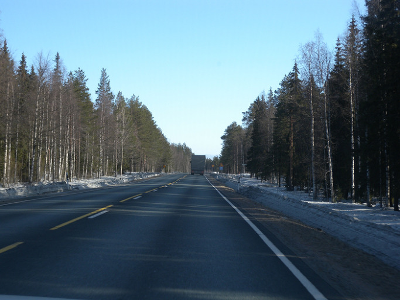  
<로바니에미에서 께미야르비로 가는 길>

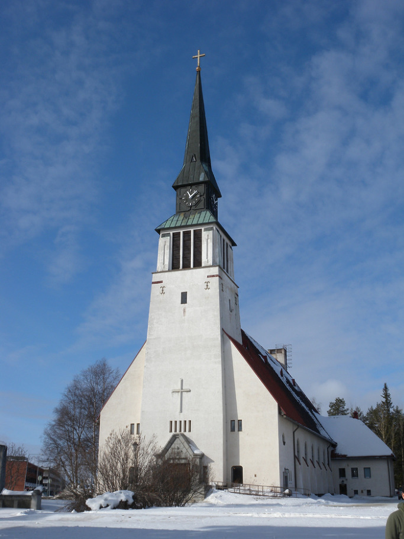  
<께미야르비의 루터 교회>

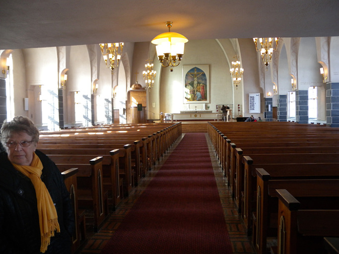  
                                                                          <께미야르비 루터 교회의 내부>

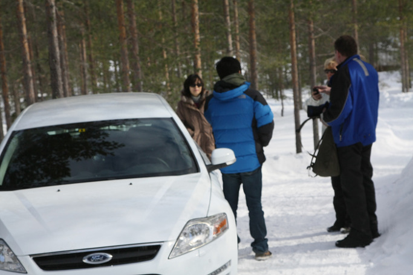  
                                                            <코르타바아 전망대에 오르다가 눈길에 빠져 현지인들의 도움을 받는 모습>

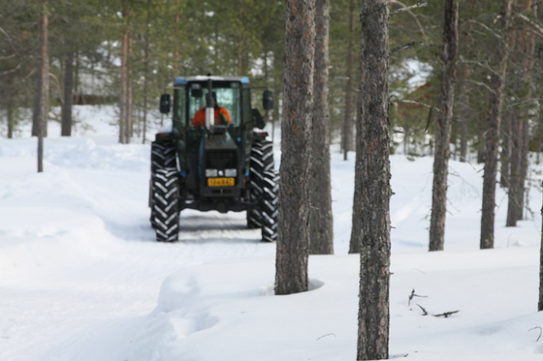  
<연락을 받고 트랙터를 몰고 오는 현지 주민>

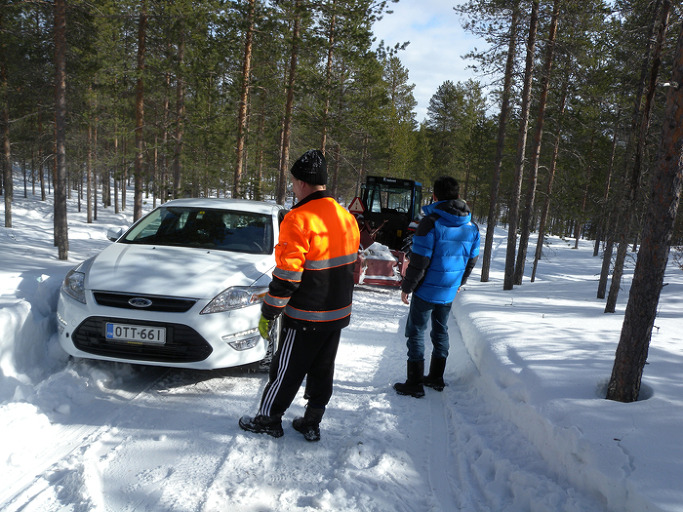  
                                                                          <차를 살펴보는 현지 주민>

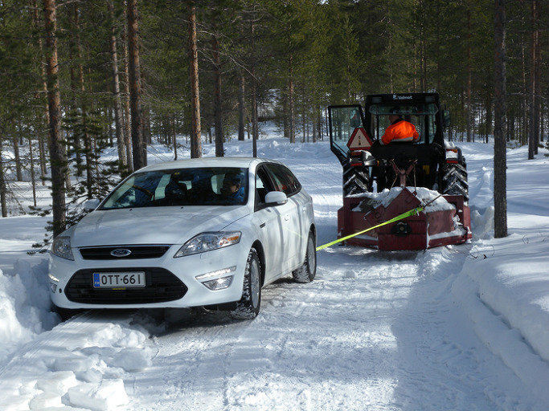  
 <트랙터에 끈을 묶고 차를 구해내는 현지 주민>

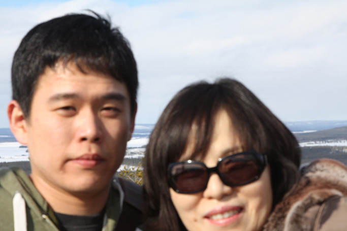  
<코르타바아 전망대에서 조경현과 임미숙 모자>

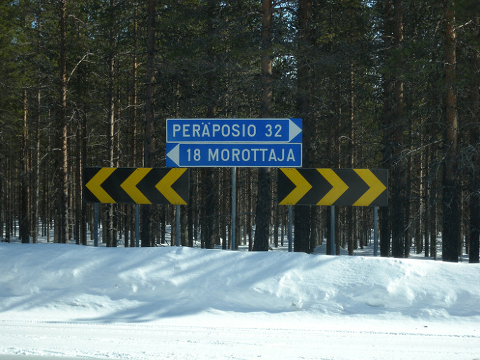  
                                                              <뽀시오 가는 갈림길>                               
                                                                         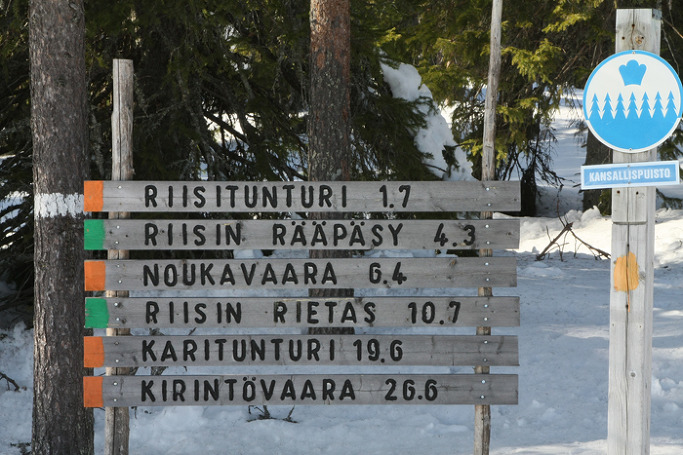  
                                                                   <리시툰투리 국립공원의 이정표>

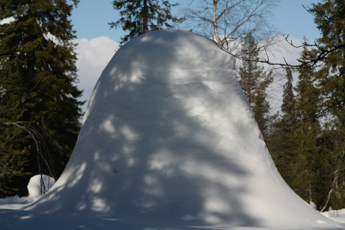  
 <리시툰투리 국립공원, 눈과 얼음에 뒤덮인 나무>

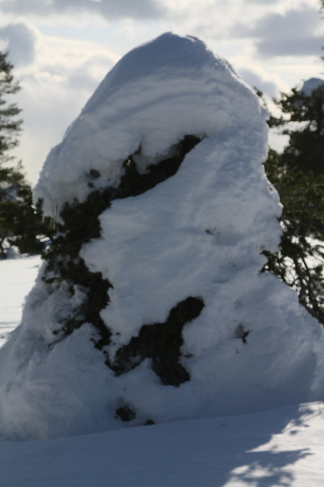  
< <리시툰투리 국립공원, 눈과 얼음에 덮인 나무>

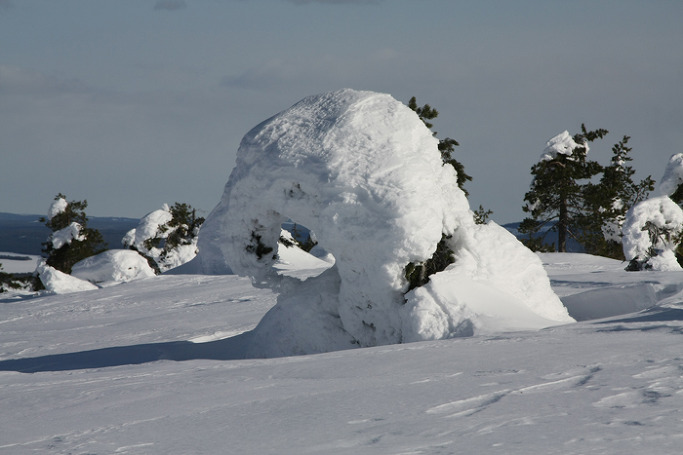  
                                                                     <리시툰투리 국립공원, 눈과 얼음에 덮인 나무들>

께미 야르비와 뽀시오의 설경, 그 가르침

호텔에서 아침식사를 든든히 마친 다음, 사흘째 핀란드 속살 탐험 길에 나섰다. 눈 덮인 300km 여정이니 만만치 않은 길이었다. 우선 향한 곳은 로바니에미 동북방으로 100km쯤 떨어진 인구 8천명의 소읍 께미야르비. ‘야르비’란 호수란 뜻인데, 께미 강이 발원되는 곳을 말한다. 과연 꽁꽁 얼어붙은 엄청난 호수가 자그마한 도회를 감싸고 있었다. 도시 한복판에 하늘을 찌르 듯 루터교회가 서 있었다. 마당에 들어서니 마침 오전 예배가 끝났는지 신자들이 몰려 나왔고, 멈칫거리는 우리에게 어떤 아주머니가 손짓으로 들어오라신다. 성전은 과연 깨끗하고 넓었으며, 성단 뒤 벽 중앙에 예수고상이 걸려 있었다. 젊은이들이 꽤 여럿 보였는데, 중․남부 유럽에서 볼 수 없는 현상이었다.

교회를 뒤로 하고 4~5km쯤 떨어진 코르타바아 나카또르니(Kortavaa nȁkȍtorni) 전망대로 향했다. 눈 다져진 길을 지나 산길로 접어들자 바닥의 눈은 더 두꺼워졌고, 아차 하는 순간에 차가 눈에 빠지고 말았다. 팬벨트 타는 냄새가 진동하도록 액셀러레이터를 밟아대며 수렁으로부터 빠져 나오려 노력했으나 허사였다. 렌터카 사무실도 전화를 받지 않아 망연자실해 있는 순간, 거짓말처럼 점잖은 노부부가 산을 올라오고 있었다. 그들은 우리를 보자마자 마을사람에게 전화를 걸어 주었다. 잠시 후 마을 주민 한 분이 트랙터를 몰고 올라왔다. 영어가 한 마디도 통하지 않는 그와 손짓 발짓으로 소통하며 어려움 끝에 차를 구해낼 수 있었다. 눈구덩이에서 무사히 빠져 나온 뒤 한사코 사양하는 그에게 가까스로 얼마간의 수고비를 건넬 수 있었지만, 돈으로 따질 수 없는 고마움이었다. 우리는 차가운 눈 바닥에 무릎을 꿇고 앉아 끈을 묵고 비좁은 길에서 커다란 핸들을 조작해가며 자신의 일처럼 도와주는 그를 보며 핀란드 인들의 순박하면서도 고운 심성을 경험하게 되었다. 참 고마운 사람들이었다. 어려운 순간에 말 한 마디 통하지 않는 외국인이라도 선뜻 나서서 도와야 한다는 가르침을 ‘도움 받는 입장’에서 확인하게 되었다.

\*\*\*

전망대에 올라 둘러 본 께미 야르비는 온통 흰 눈에 덮여 있었다. 보이는 건 띄엄띄엄 몇 채의 집들과 나무들이 전부였다. 색깔만 달랐다 뿐, 흡사 온천지가 물에 잠겨 사이사이로 몇 채의 가옥들만 간신히 모양을 드러낸 우리네 장마철의 모습이었다. 북극의 찬 기운이 여기서 만들어지는 듯 세상은 꽁꽁 얼어붙어 있는데, 유독 나무들만 꿋꿋하게 푸름을 잃지 않고 있었다. 필시 신의 조화일 자연의 위력 앞에서 나약한 인간의 자리는 어디쯤일까.

\*\*\*

눈 길 기백 리를 달려 도착한 뽀시오(Posio)의 리시툰트리 국립공원(Riisituntri National Park)에서 우리는 자연 질서의 엄정함을 재확인하게 되었다. 끝없이 평원만으로 이어지는 핀란드 국토 가운데 비교적 높은 곳에 위치한 이 공원에서 자연의 위력과 사투를 벌이다가 살아남거나 죽어가는 생명의 진실을 목격하게 된 것이다. 전나무들이 도열한 사이로 눈이 수북 쌓인 산을 올랐다. 적자생존 원리의 발현일까. 눈밭에는 세 종류 나무들의 모습이 눈앞에 펼쳐졌다. 말라죽은 나무들, 아직 눈에 갇혀 가쁜 숨을 몰아쉬는 빈사 상태의 나무들, 생생하게 살아 있는 나무들. 이번 겨울[이곳은 아직 겨울이 진행중이다!] 이곳에 엄청난 눈이 쏟아졌었나 보다. 어떤 나무는 그야말로 눈으로 뒤덮여 나뭇잎 하나 밖으로 내보이지 못하고 있었다. 어쩜 그 속에서 내내 비명을 지르다가 벌써 숨이 끊어졌을지도 모르지만, 힘없는 나그네로서 도움을 줄 수 없는 현실이 야속했다. 설사 한 그루의 나무에 작은 도움을 준다 해도, 온산에 널려 있는 생명의 아우성들을 어찌 할 수 있단 말인가. 나무를 옥죄고 있는 눈 더미를 가만히 관찰해 보았다. 겉만 보드라운 눈일 뿐, 속은 단단히 얼어 있었고, 나뭇잎들도 줄기도 모두 함께 얼어붙어 있었다. 얼음 녹기만 기다리던 나무들은 결국 질식해 숨지고, 나무가 숨진 것을 확인한 뒤에야 얼음과 눈은 결박을 풀어 나무들의 초라한 나신을 만천하에 드러내 놓는 것 같았다. 그보다 형편이 나은 것들은 가지 끝, 옆구리 등 일부에만 눈과 얼음덩이들을 달고 살그머니 소생의 자신감을 드러내고 있었다. 아마 이 언덕에 다시 쏟아져 내리는 눈만 없다면, 이들은 6월쯤 찾아올 환희의 계절에 새로운 가지와 잎을 피우리라.

그리고 마지막 부류. 당당하게 가지와 잎들을 하늘로 뻗어 올리고 선 나무들이었다. 그들의 오연한 패기가 교회의 종소리처럼 설원에 흘러 내렸다. 범접할 수 없는 승자의 힘과 기개는 죽은 자들의 침묵과 대비되며 바람마저 숨을 죽인 산등성이에 절묘한 하모니를 조성해놓고 있었다.

\*\*\*

그러나, 보라. 산 자가 언제까지 산 자일 것이며, 죽은 자 또한 영원히 죽은 자일 것인가. 새로운 계절 칼바람이 불고 눈발과 얼음이 엄습하여 산 자들의 의지를 꺾어 놓을 날도 있을 것이다. 산 자들의 기세에 눌려 사는 게 죽느니만 못한 경우도 있을 것이고, 눈과 얼음의 결박에 질식되는 날도 있을 것이다. 어제까지의 영광이 오늘부터 오욕으로 치환되는 일이 이 공간의 생명들 사이에서도 비일비재할 것이니, 어느 한 순간인들 오만에 사로잡힐 수 있으랴. ‘말없는 웅변’으로 보여주는 죽은 자들의 비극이야말로 이 땅의 산 자들에 대한 최고의 가르침이 아닐까. 핀란드 라플란드, 그 죽음과 삶의 향연 앞에서 전쟁 같은 삶터를 잠시 탈출해온 동쪽의 나그네 백규는 새삼 옷깃을 여민다.

공유하기

게시글 관리

**백규서옥\_Blog ver.**