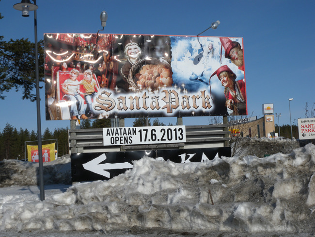  
<올해 6월에 개장하는 로바니에미의 산타 파크>

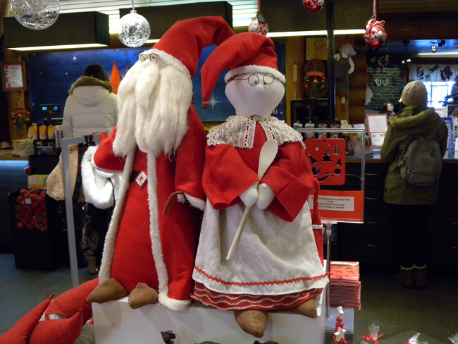  
<산타마을 매장에서>

  
<산타마을에서>

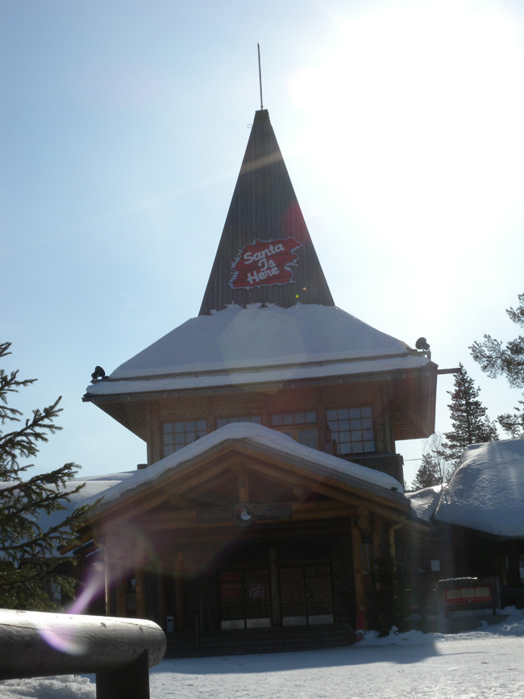  
<산타마을에서>

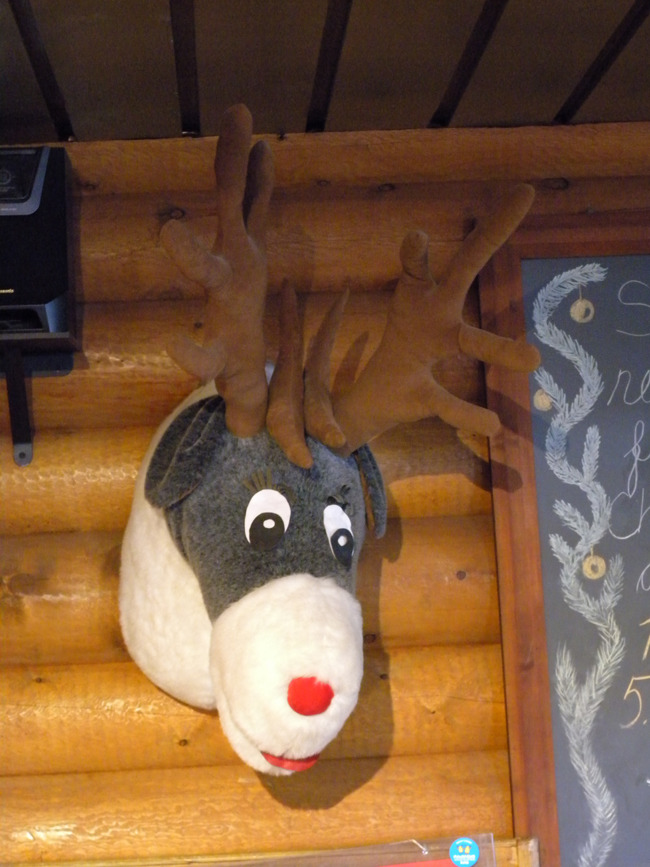  
<산타 파크에서>

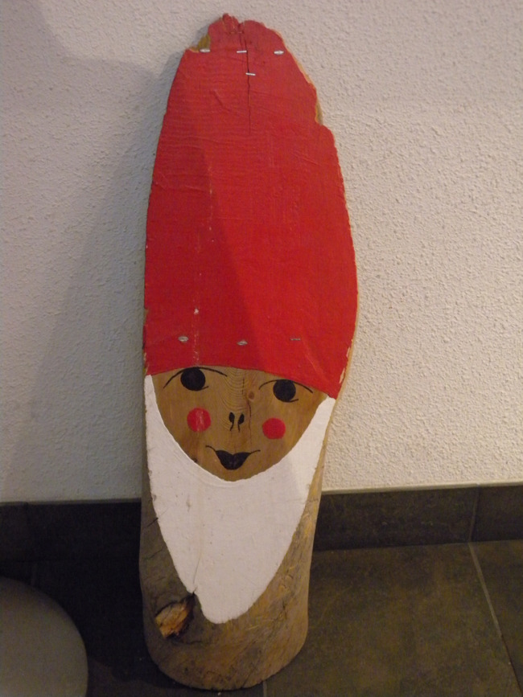  
<산타마을에서>

  
<각국의 시민들이 산타에게 보낸 편지들, Etela-Korea, South Korea>

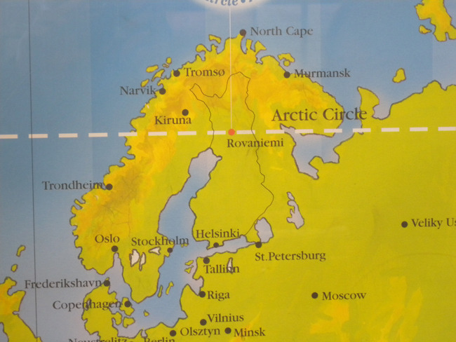  
<지도에 표시된 북극권>

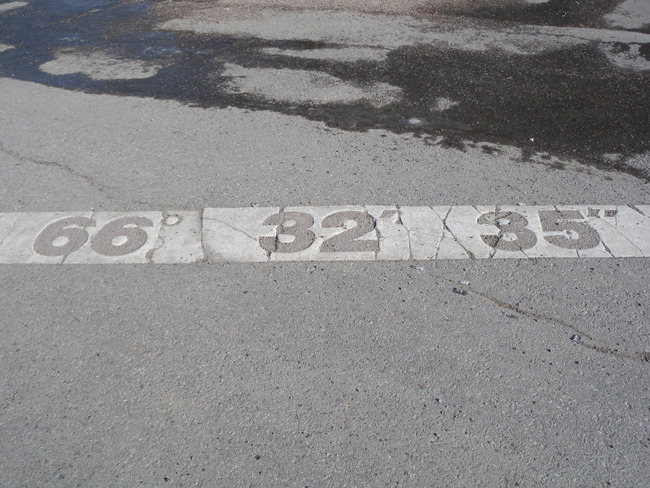  
<산타마을의 위도>

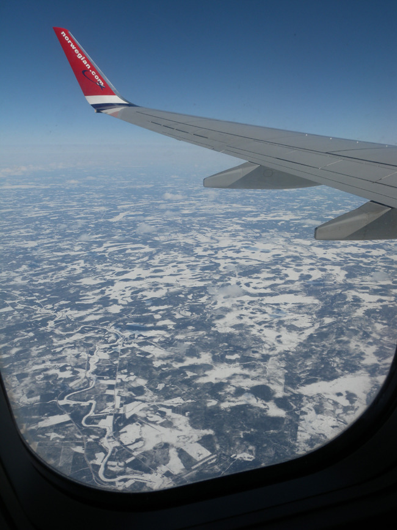  
<로바니에미에서 헬싱키 가는 비행기에서 내려다 본 핀란드 산하>

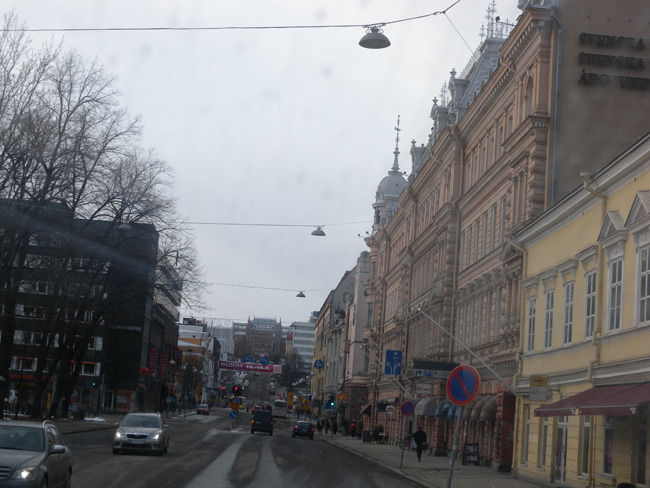  
<뚜르꾸 시가지>

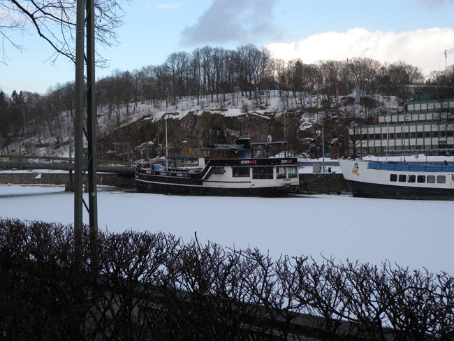  
<뚜르꾸의 아우라 강>

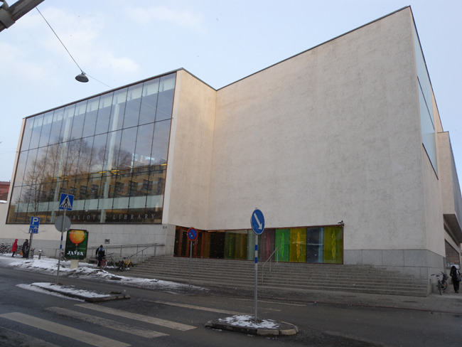  
<뚜르꾸 시립도서관>

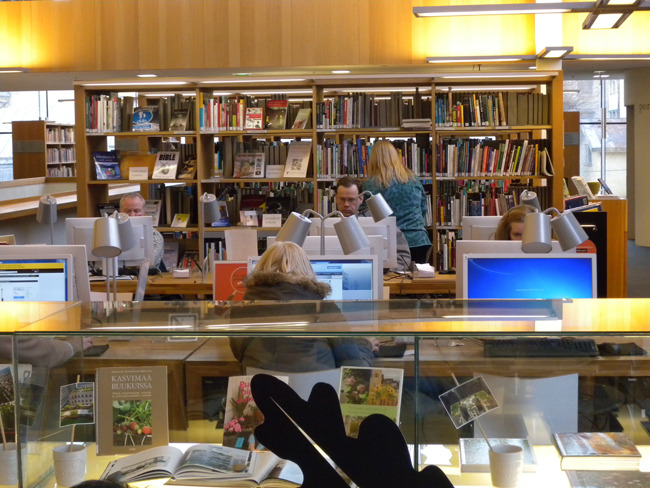  
<뚜르꾸 시립도서관>

  
<뚜르꾸 시립도서관>

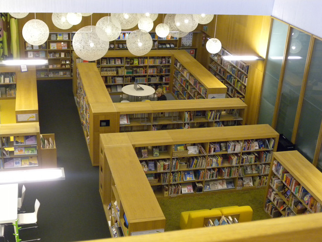  
<뚜르꾸 시립도서관>

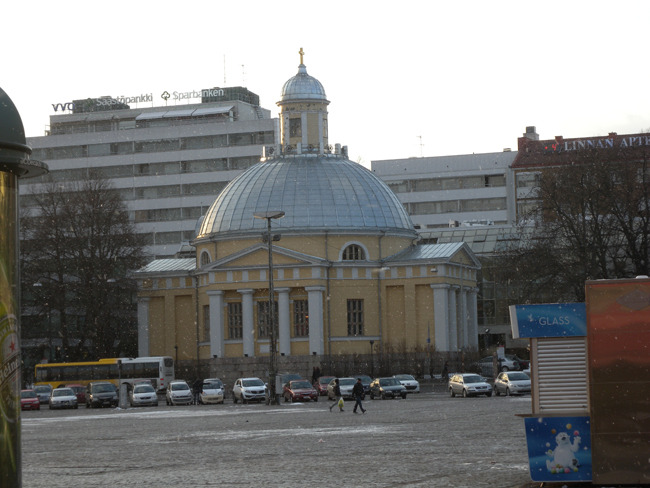  
<뚜르꾸 러시아 정교회>

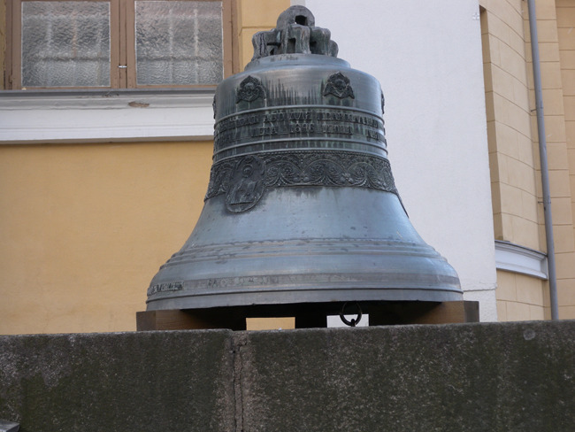  
<러시아 정교회 정문에 놓인 종> 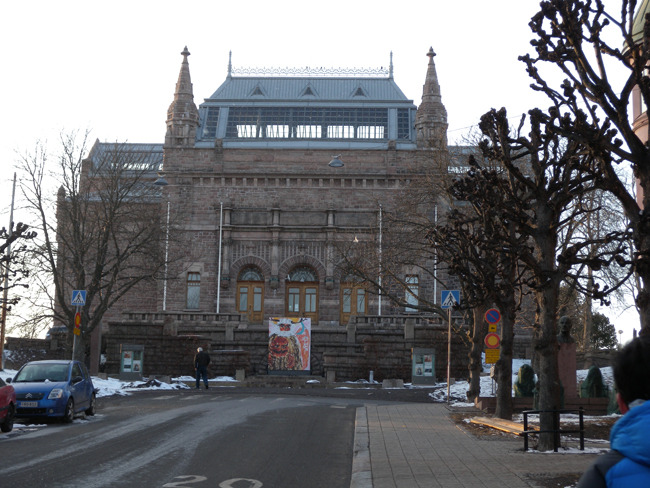  
<뚜르꾸 Art Museum>

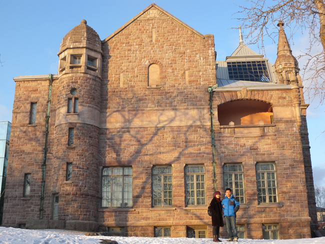  
<뚜르꾸 Art Museum>에서

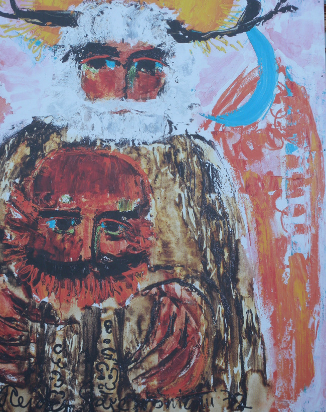  
<뚜르꾸 Art Museum에 내걸린 작품>

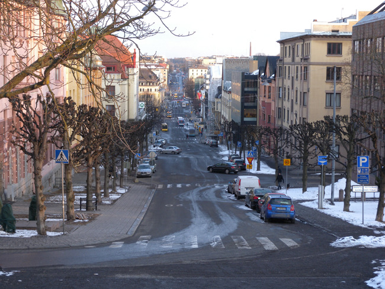  
<뚜르꾸 Art Museum으로부터 시내를 관통하는 도로>

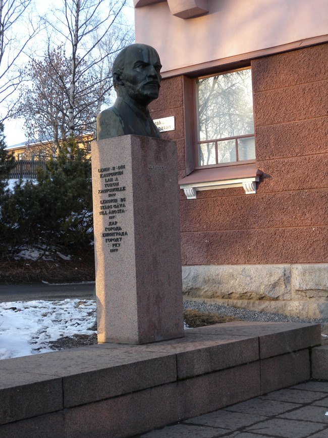  
<Art Museum hill에 위치한 레닌 흉상-레닌 망명시절의 집터>

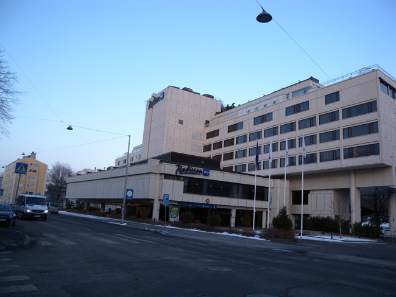  
                                                                             <4월 8일 1박을 한 래디슨 호텔>

현실과 환상을 넘나든 산타마을, 영욕의 역사 현장 뚜르꾸(Turku)

사흘간의 로바니에미 체류를 마무리하기 위해 산타마을에 들렀다. 산타클로스! 꿈과 기대로 아이들을 설레게 하여 어렵던 시절을 무사히 넘기게 했던 환상 속의 존재였다. 산타를 대망(待望)하던 아이들이 자라나 지금 세계 곳곳의 중추로 자리 잡고 있으며, 또 그들의 아이들이 산타를 기다리며 자라고 있다. 누구는 만개(滿開)한 상업정신의 대표 장소로 산타마을을 꼽지만, 마냥 비판만 할 일은 아니다. 찬 공기 넘나드는 전나무와 소나무, 자작나무들이 주변을 둘러 있고, 단 몇 달을 뺀 나머지 기간엔 늘 눈과 얼음에 덮여 있는 이곳. 그나마 산타 할아버지의 인자한 얼굴을 형상하는 것 외에 무슨 희망이 있었을까. 그 환상을 세계 아이들과 공유하며 그들과 함께 성장기의 고뇌들을 넘어 미래에의 꿈과 희망을 갖게 할 수만 있다면, 그것이 상업화된다 한들 무슨 상관있단 말인가. 가게 진열대들을 그득 채우고 있는 산타 관련의 온갖 캐릭터 상품들, 아이들의 상상력을 자극할만한 각종 동물 형상들과 의상들, 산타에게 소원을 빌기 위해 각국에서 보내온 크리스마스 카드들[그런데, 우리나라에서 보내온 카드들이 많았다!]. 무엇보다 크리스마스 카드를 미리 써서 보낼 수 있다는 우체국 서비스가 재미있었다. 이곳을 여행하는 사람이 가족이나 친지들에게 보낼 카드를 미리 써서 부치면 산타클로스 우체국 마크를 찍어 크리스마스 즈음에 전달해준다는 것이었다. 재미있는 발상들에 잠시 세상의 번뇌를 잊어보는 순간이었다.

북위 66도 32분 35초. 북극의 추위에 다져진 때문일까. 라플란드 지역의 핀란드인들은 다소 무뚝뚝한 표정 속에 성실하고 다감한 내면을 감추고 있었다. 형상을 가진 모든 것들은 얼어붙어 있었지만, 그들의 마음에는 따스한 난로가 하나씩 갖추어져 있음을 여행 중 여러 곳에서 목격할 수 있었다. 추위 속에서 빛나던 그 난로 하나를 마음으로 얻은 우리는 찾아온 길을 되짚어 헬싱키 행 비행기에 몸을 실었다. 구도(舊都) 뚜루꾸로 가기 위해서였다.

\*\*\*

예상했던 대로 뚜르꾸는 참하고 한적한 도시였다. 대(大) 화재로 모두 부서진 뒤, 1800년대에 새로 지었다는 도심의 건물들은 나름대로 고풍(古風)을 간직하고 있었다. 순간적으로 러시아의 쌩뜨 뻬쩨르부르그나 동유럽 도시들에서 가졌던 느낌이 되살아났으나, 그 이유를 딱히 짚어낼 수는 없었다. 호텔[Radisson] 뒤편의 아우라 강 (Auranjoki) 도 꽁꽁 얼어 레스토랑이나 까페로 쓰이는 큰 배들이 제자리에 묶여 있지만, 넘실대는 여름날의 푸른 물 위에 불야성을 이룰 모습들을 상상하기에 어렵지 않았다. 강 건너에 높은 언덕 중턱에 박물관이, 그 너머엔 뚜르꾸 대학이 있었으며, 자그마한 옛 성도 있었다. 아우라 강을 따라 발트 해로 연결되는 뚜르꾸의 전략적 가치에 주목한 지배자 스웨덴 인들과, 스웨덴을 멀리 하려 헬싱키로 통치의 중심을 옮겨버린 또 다른 지배자 러시아인들의 갈등이 눈에 보이듯 도시 곳곳에 새겨져 있었다.

호텔에 여장을 풀자마자 시립도서관으로 향했다. 최신식 건물에 따스하고 안락한 분위기였다. 독서 삼매경에 빠진 사람들의 모습이 신기하고 부러웠다. 무엇보다 몇 권의 책을 안고 들어와 반납한 뒤 새로 대출해가는 점잖은 신사들의 모습이 이채로웠다. 아마 퇴근 후 들른 것이리라. 우리나라에서 퇴근 후 몰려드는 직장인들 때문에 예산을 들여 도서관을 증축할 수밖에 없다는 소식이 각 지방자치단체들로부터 들려오는 날은 그 언제일까. 우리의 진정한 르네상스는 그런 날로부터 시작될 것이라는 점을 이곳 뚜르꾸의 시립 도서관에서 깨달았다.

\*\*\*

도서관을 나와 ‘손바닥 만한’ 뚜르꾸 시가지를 체험하는 도중 언덕 위에 우뚝 선 ‘Art Museum'을 만났다. 문이 잠겨있어 들어갈 수는 없었으나, 건물의 모습은 물론 시가지를 내려다보고 서 있는 위치가 범상치 않았다. 뮤지엄이 서 있는 언덕 아래로 시원하게 뚫린 대로(大路)가 그대로 도시를 관통하여 아우라 강을 자르며 맞은편 언덕으로 이어지는 형국이었다. 그런데 더욱 놀란 건 그 뮤지엄 바로 밑에 레닌의 흉상이 서 있는 일이었다. 아, 그곳이 바로 10월 혁명 이전 몇 차례의 거사에 실패하여 짜르에게 쫓긴 레닌이 망명생활을 하던 곳 이었다! 이상한 열기가 몸에 전해진다 싶었는데, 혁명가의 열정이 아직도 살아남아 벌떡거리는 박동을 느끼게 하는 곳이었다. 혁명의 와중에 유일하게 적군이 백군에게 패한 곳이 핀란드였는데, 레닌이 바로 그곳에 망명해 있었다니! 놀라운 일일 수밖에 없어, 귀국하면 그 역사를 다시 들춰 봐야겠다고 마음을 먹는다. 핀란드와 가까운 곳에 레닌그라드[현재 쌩뜨 뻬쩨르부르그]가 있고, 도시 전체에서 미미하나마 러시아나 동유럽의 기풍을 감지한 내 첫 느낌이 그 사실과 어떤 연관성을 갖고 있을지도 모른다는 섣부른 생각이 드는 것은 왜일까?

내일 이곳에서 가장 크다는 교회와 박물관을 찾아 이 느낌의 합리성을 따져 보기로 한다.

공유하기

게시글 관리

**백규서옥\_Blog ver.**