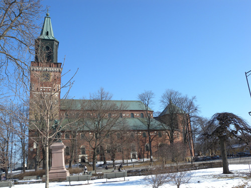  
<뚜르꾸 대성당>

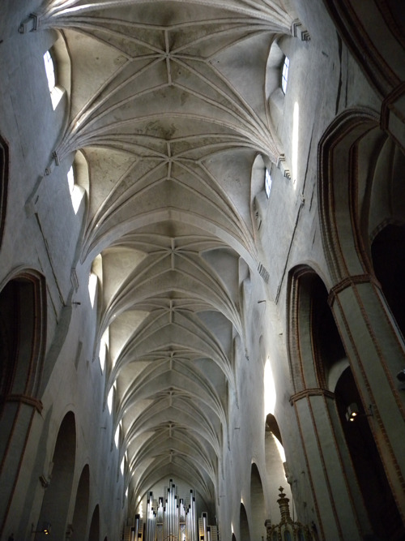  
<뚜르꾸 대성당의 천정과 파이프 오르간>

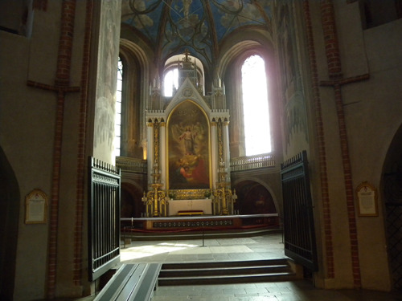  
<뚜르꾸 대성당의 제단>

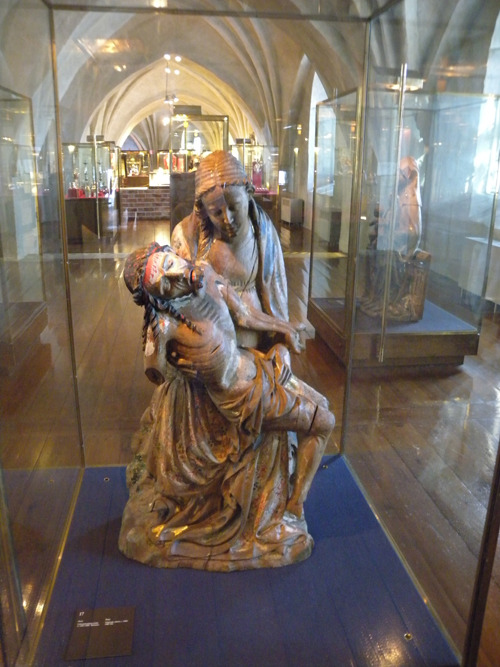  
<뚜르꾸 대성당 박물관의 피에타상>

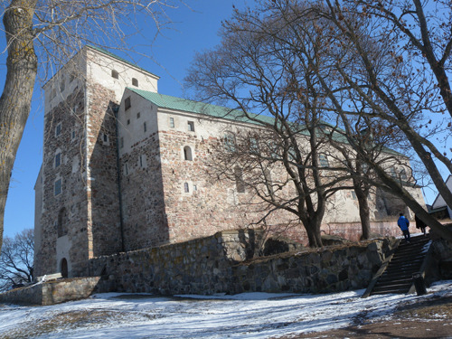  
<뚜르꾸 성>

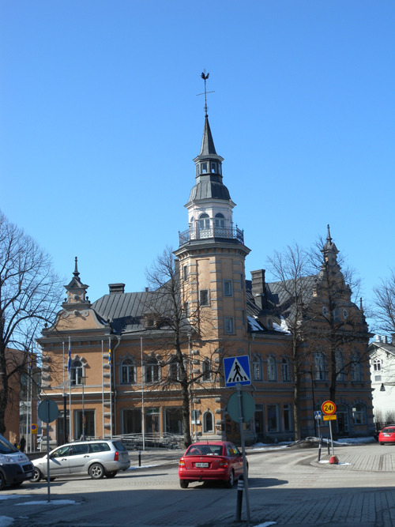  
<올드 라우마(Old Rauma)의 인포메이션 센터가 들어 있는 고건물>

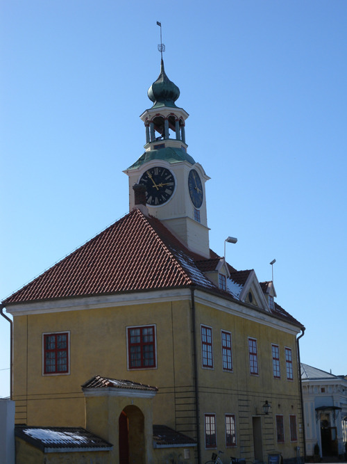  
<라우마의 박물관>

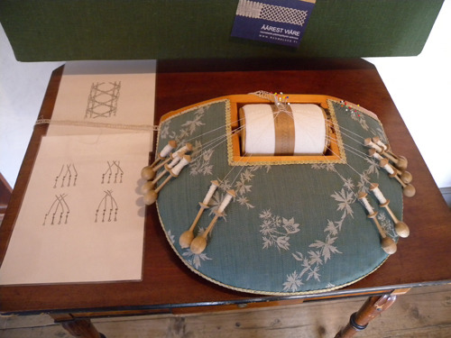  
<라우마 박물관의 자수 도구와 작품>

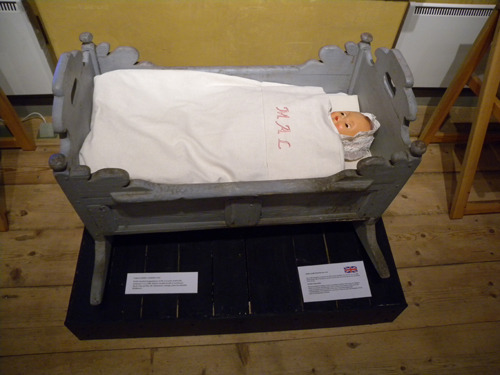  
<라우마 박물관의 요람>

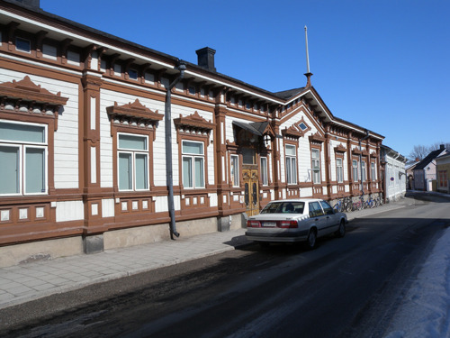  
<라우마의 마렐라(Marela)>

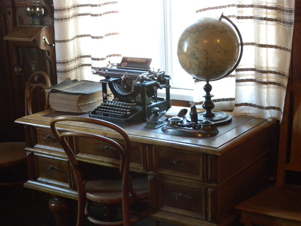  
<마렐라의 서재>

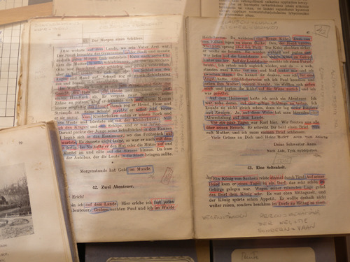  
<마렐라에 전시된 옛날 교과서>

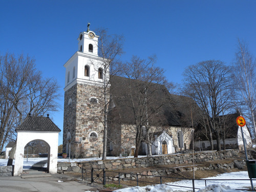  
<라우마의 성 십자가 교회>

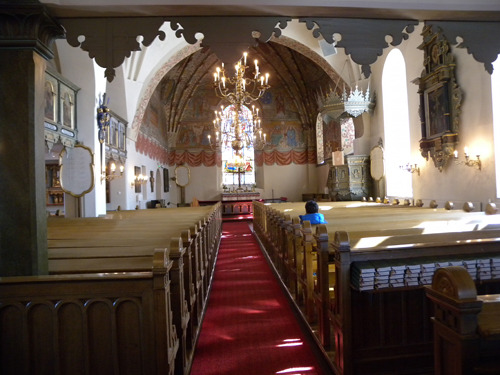  
<라우마 성 십자가 교회 성전>

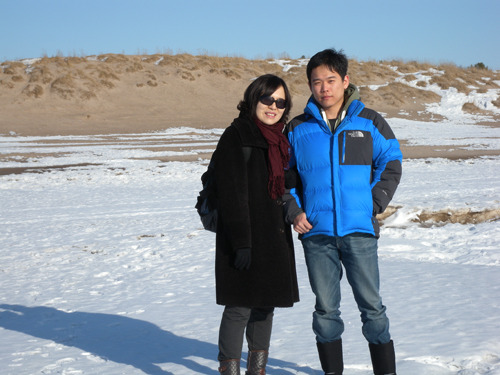  
<얼어붙은 Yyteri 해변에서 임미숙, 조경현 모자>

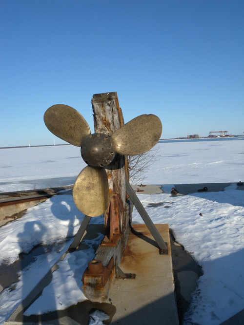  
<레포사아리(Reposaari)-조선소의 흔적>

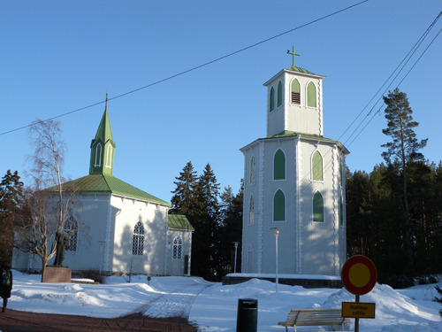  
<레포사아리(Reposaari)의 루터 교회>

교회와 고성(古城), 옛 도시에 살아 숨 쉬는 핀란드 정신을 찾아

라우마(Rauma)를 거쳐 뽀리(Pori)까지 가는 날. 그간 끝없이 펼쳐지는 수해(樹海)와 잘 보존된 자연 속에서 삶을 이어가는 핀란드 인들의 행복을 훔쳐 보기 위한 일정의 연속에 지루해진 것일까. 방향을 약간 틀어 역사와 정신의 자취를 느끼기로 했다. 호텔에서 이른 조반을 마친 우리는 카우 광장의 동쪽 강변에 서 있는 뚜르꾸 대성당을 찾았다. ‘핀란드 루터 교회의 어머니’격인 뚜르꾸 대성당. 14세기에 착공하여 16세기에 완공되었다니, 200년 대역사(大役事)의 산물이 아닌가? 그로부터 5세기. 세월의 강을 묵묵히 건너가고 있는 성당은 엄청난 위용을 자랑하며 녹청으로 아로 새겨진 시간의 허물을 뒤집어 쓴 채 고고하게 서 있었다. 정문 앞에 세워진 초대 비숍 미카엘 아그리콜라(Mikael Agricola) 상 주변을 쓸고 있던 성당 관리자로부터 자부심 묻어나는 설명을 들으며 성당 내부를 둘러보았다. 성전 안 곳곳에 다양한 채플들[Tigerstedt-Wallenstierna Chapel/Mayor's Chapel/Chapel of All Souls/Gezelius Chapel/Tavast Chapel/Kijk Chapel]이 마련되어 있었고, 연륜과 달리 현대적인 느낌을 주는 스테인드 글라스, 하얗게 빛나는 파이프 오르간 또한 강한 인상을 주었다. 분명 핀란드 정신과 역사는 이곳 뚜르꾸 대성당에 압축되어 있었다.

다음으로 찾은 곳이 아우라 강 하구의 뚜르꾸 고성. 600여년 핀란드를 통치하던 스웨덴이 세운 성채로, 유럽의 다른 지역에서도 흔히 볼 수 있는 외관을 갖고 있었다. 규모는 크지 않으나 소박하면서도 견고한 인상을 갖추고 있어 몇 년 전 둘러본 슬로바키아의 오라바 성과 흡사한 모습의 요새였다. 그리고 그것은 핀란드 인들의 아픈 과거가 새겨진 역사의 물증이기도 했다.

\*\*\*

뚜르꾸를 떠나 30분쯤 달렸을까. 옛 도시의 모습을 고스란히 갖춘 라우마[Vanha Rauma/Old Rauma]가 눈앞에 닥친다. 1991년 유네스코 세계유산에 통째로 등재된 ‘올드 라우마’. 라우마의 알트슈타트(Alt Stadt)는 걸어서 한 시간 안에 섭렵할 수 있을 만큼 작았지만, 상가와 주거를 겸한 600여 채의 목조주택에 800여명의 주민이 살고 있는 아름다운 중세 도시였다. 양파 모양 첨탑의 박물관, 성십자가 교회(Church of the Holy Cross), 19세기 생활사를 보여주는 마렐라(Marela) 등이 우리가 꼽은 이 도시의 핵심들이었다. 걸을 때마다 마룻바닥의 삐걱대는 소리가 귀에 거슬리긴 했으나, 박물관 안에는 옛 주민들의 삶을 보여주는 정겨운 물건들이 그득했다. 이 박물관이 제공하는 감동의 포인트는 수백 가닥의 미세한 실을 바늘에 꿰어 짜 나가는 레이스 예술이었다. 여인들의 섬세한 손가락이 날듯이 오가며 한 땀 한 땀 짜 나아가는 환영(幻影)이 유리 케이스에 얼른거렸다.

다음으로 찾은 곳이 마렐라. 마렐린[Abraham Marelin]이 18세기 후반에 살았던 집을 박물관으로 개조하여 그들이 남긴 생활사의 자료들을 전시한 곳이었다. 옷, 책, 책상, 타자기, 장신구, 교과서, 요람, 침구, 그릇 등등 지난 시대 이곳 주민들의 삶을 생생하게 보여주는 현장이었다. 거기서 몇 골목 지나 작은 다리를 건너니 성십자가교회가 참하게 자리 잡고 있었다. 뜰에는 아씨시의 프란체스코 성인이 비둘기를 안은 채 교회를 바라보고 있었다. 루터 교회로 바뀌었지만, 원래 15세기에 프란체스코 수도원으로 세워졌던 곳이다. . ‘성삼위 교회(Church of the Holy Trinity)’가 1640년의 화재로 파괴된 뒤 루터 교회로 되었으며, 작년에 500주년 기념식을 가졌을 만큼 역사를 자랑하는 교회였다. 정갈하면서도 고요한 성전에 들어가 앉았을 때 비로소 지금껏 지속되는 올드 라우마의 정신을 확인할 수 있었다. 시간의 격랑에 휩싸여 사라지는 것이 역사는 아니며, 삶의 모습이 바뀐다하여 사라지는 게 정신이 아니라는 가르침을 올드 라우마는 성십자가 교회의 고적한 성전, 그 울림을 통해 나그네에게 전해주고 있었다.

\*\*\*

올드 라우마로부터 40여분을 달려 도착한 곳이 바로 지금 이곳 뽀리(Pori)다. 라우마와 마찬가지로 평원을 그득 채운 목조주택들이 햇살에 산뜻한 모습을 드러낸 곳. 호텔이 여의치 않아 펜션으로 개조한 뽀리 주민의 집 한 채를 빌려 하루를 묵게 된 것이다. 정갈하게 꾸민 침실과 주방, 화장실 등에 선진국 핀란드 인들의 안목은 묻어나고, 말없는 주인장의 미소에서 핀란드 인들의 정이 피어난다. 오후 늦게 찾은 핀란드의 최장[6km] 모래해안 Yyteri. 트레킹이나 크로스컨트리 스키를 즐기는 핀란드 인들만 간혹 오갈 뿐 꽁꽁 얼어붙은 바닷가의 텅 빈 모래사장엔 얼음만 가득하고, 모래사장을 출발 자작나무 숲을 지나 도착한 레포사아리(Reposaari)의 해변에는 옛 조선소의 영광을 증언하는 스크류 하나만이 훈장처럼 내 걸려 찬 기운에 떨고 있었다.

그렇다. 역사와 정신은 함께 가는 것이다. 우리가 짚어나가는 곳곳에 그 둘은 손에 잡힐 듯 배어 있었다. 그것들을 바탕으로 핀란드의 정신이나 역사의 속살을 느껴보려는 우리가 만용을 부리는 것일까. 대강 지나며 곁눈질로 바라보는 우리의 여행을 ‘장님이 코끼리 더듬듯 한다’는 이유로 웃는 이도 있을 것이다. 그러나 어찌 국 맛을 알기 위해 한 솥의 국을 모두 마실 필요가 있겠는가?

공유하기

게시글 관리

**백규서옥\_Blog ver.**