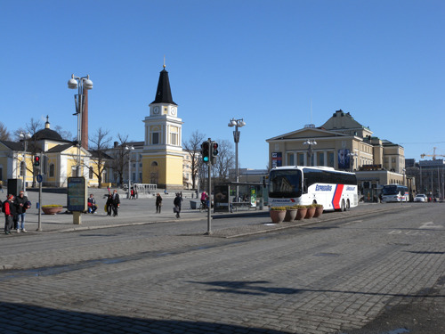  
<땀뻬레 시가지>

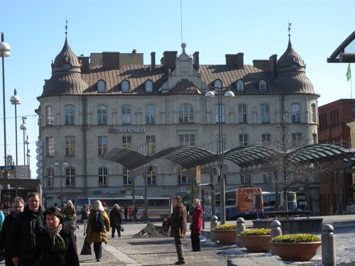  
<땀뻬레 시가지>

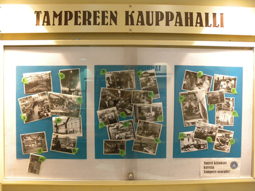  
<땀뻬레 상설시장>

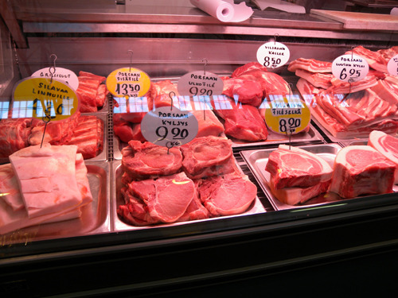  
<땀뻬레 상설시장의 육류가게>

  
<땀뻬레 상설시장의 빵가게>

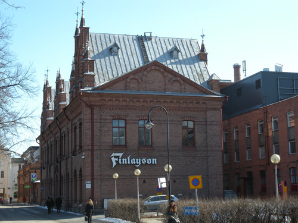  
<핀레이슨 산업단지>

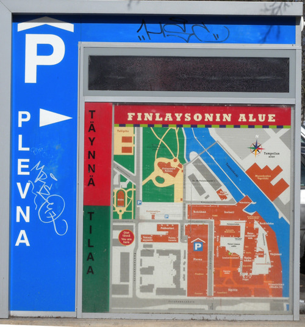  
<핀레이슨 산업단지 주차장 표시 및 구역도>

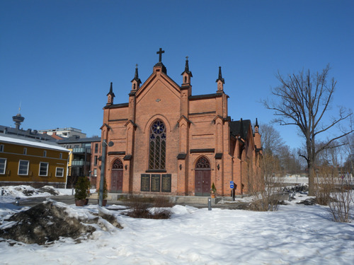  
<핀레이슨이 지은 교회>

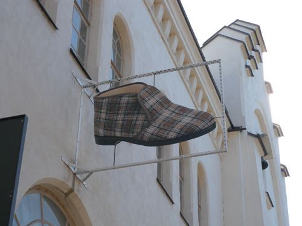  
<핀레이슨 산업단지 내 신발가게>

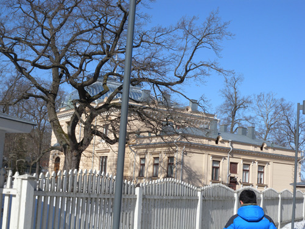  
<땀뻬레 핀레이슨 저택>

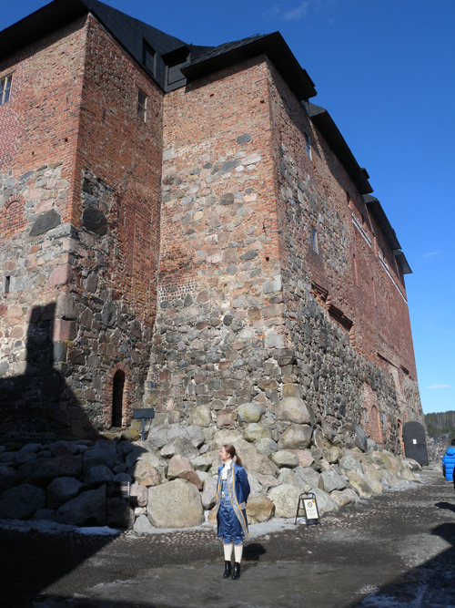  
<하메 성 입구>

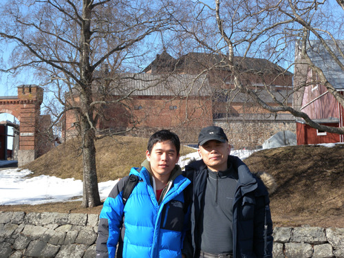  
<하메 성에서 조경현과 백규>

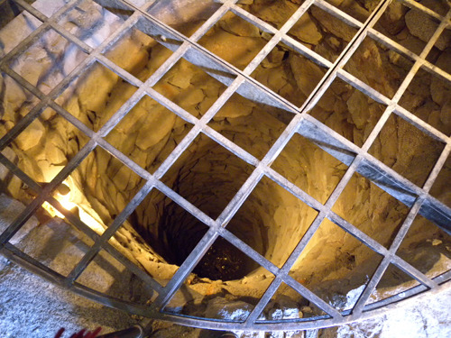  
<하메 성 안의 우물>

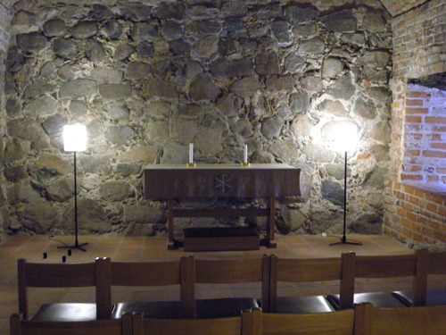  
<하메성 안의 채플>

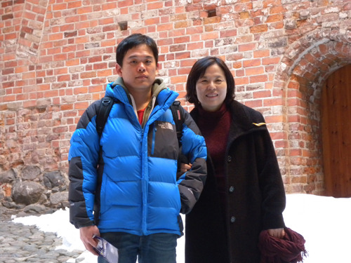  
<하메성 안에서, 임미숙과 조경현>

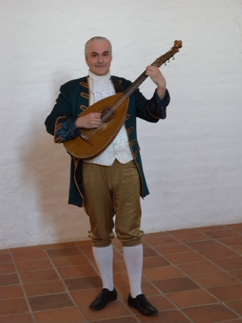  
<하메 성에서 만난 악사>

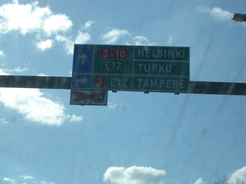  
<다시 헬싱키로>

  
<핀란드의 국민적 영웅 칼 구스타프 만네르하임 장군 상>

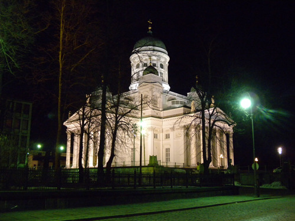  
<핀란드의 루터교회>

산업화, 외세와의 투쟁, 그리고 미래의 꿈

뽀리(Pori)의 아름다운 추억을 마음 가득 충전한 뒤 다시 향한 곳은 헬싱키. 이번 일정의 막바지에 가까워진 것이다. 바쁜 일정에서 10여일을 덜어 다른 나라의 핵심 지역들을 순력(巡歷)하는 건, 우리 나름의 ‘장정(長征)’일 수 있었다. 아랫 날씨는 쌀랑했으나, 위에서는 태양이 빛났다. 로바니에미 인근과 달리 시원하게 뚫린 고속도로에 차들이 제법 많았다. 아직도 몸서리쳐지는 추위 속에서 허우적대는 북쪽과 달리 이곳 길가의 자작나무들에는 녹색이 돌기 시작했다. 국토를 따스하게 감싸고 있는 나무들이 봄볕의 세례 아래 몸을 풀기 시작한 것이다.

\*\*\*

규모로 보아 핀란드 제2의 도시 땀뻬레(Tampere)에 들렀다. 네시 호수와 퓌헤 호수를 잇는 작은 물길이 지나는 항구도시. 방직공장, 피혁공장, 제재소, 각종 기계공장, 아이티 업체 등 내용은 공업 중심의 현대 도시였으나, 모든 공장들은 자연환경과 완벽한 조화를 이루고 있었다. 화석연료 대신 풍부한 수력을 이용하기 때문일까. 대기오염이 전혀 감지되지 않는 곳이었다. 18만에 육박하는 인구도 넓은 지역에 흩어져 사는 관계로 도심에서 약간의 인파를 목격할 수 있을 뿐 전반적으로 한산한 느낌을 받는 건 다른 지역과 마찬가지였다.

맨 처음 찾은 곳은 이 도시의 상설시장. 각종 먹거리 중심의 살아 있는 생활문화를 보기 위해서였다. 빵과 생선, 각종 패션용품 등 모든 것들이 공존하며 그들의 풍요로운 현재를 증거하는, 생생한 공간이었다. 우리가 어딜 가나 들르는 ‘과거 혹은 죽은 자들의 박물관’ 아닌 보통 사람들이 등장하여 보여주는 ‘지금 혹은 산 자들의 박물관’이었다. 그 다음으로 찾은 곳이 도심의 큰 부분을 점유하고 있는 섬유재벌 핀레이슨(Finlayson)의 산업단지. 그는 가고 없었지만, 그가 살아가던 저택도 신을 만나던 교회도 아직 생생하게 남아 있고, 그의 꿈을 구현하는 각종 업무 공간들이 이 시대 산업화의 인력들에 의해 유지되고 있는 곳이었다. 그 한 복판에 자리 잡고 있는 매장에서는 쉴 새 없이 쏟아져 나오는 핀레이슨 디자인의 각종 생활용품들이 팔리고 있었다. ‘디자인 천국’으로 자처하는 핀란드 인들의 자부심, 그 근원을 알려주는 곳이었다. 과거와 현재, 그리고 미래가 어떻게 연결되어야 하는지를 명확하게 보여주는 곳이 바로 핀레이슨 산업단지였고, 그곳을 품고 있는 공간이 땀뻬레였다.

\*\*\*

땀뻬레로부터 40여분을 달린 뒤, 굳건한 핀란드 국방의지의 상징적 표상 ‘하메 성(Häme Castle)’을 만났다. 지배세력인 스웨덴에 의해 13세기 후반쯤 지어진 중세의 성으로, 최근까지 보수(補修)를 거듭해 온 역사적 공간이었다. 차에서 내려 보니 육지와 연결된 호수 안의 섬이었다. 중세 전반만 해도 이곳에는 여러 개의 섬들이 있었고, 스웨덴 지배 이전 즉 가톨릭이 들어오기 이전에는 이 지역의 핀족 원주민들에 의해 공동묘지나 시장터 등으로 사용되던 곳이라 한다. 지금은 껍데기만 남아 있지만, 단단한 암석과 벽돌들을 여러 겹으로 쌓아 만든 성벽은 나그네로 하여금 다채로운 ‘역사적 상상력’을 발동하게 했다. 지배자들이 자신들의 안전을 도모하기 위해 투자했을 많은 노력들이 우리로 하여금 시간의 여울을 뛰어넘게 했다. 그들이 추위와 배고픔, 외적의 약탈에 하루도 편안한 날이 없었을 성 밖의 백성들을 얼마나 생각했을지 알 수는 없다. 그러나 이렇게 두터운 성벽 안에서 자신들의 영화가 언제까지나 유지될 수 있으리라고 믿었을 그들의 우매함이 서글퍼지는 순간이었다. 화려한 카펫에 각종 명화들로 장식된 빛나는 내부, 따뜻한 벽난로와 고량진미의 행복 속에 펼쳐지는 화려한 무도회, 성 밖 전투에서 한 팔을 잃고 돌아온 기사에게 건넸을 형식적인 위로의 말 한 마디, 추수 때 들어온 세곡의 부족을 질책하던 노여운 음성 등등. 그 공간엔 역사의 환영(幻影)들이 끝없이 명멸하고 있었다. 오랜 세월 피지배의 질곡에서 고통 받다가 가까스로 독립하여 민족적 자존심을 세워가고 있는 핀란드 인들의 영욕(榮辱)이 나그네의 눈앞에서 파노라마로 재현되고 있었다. 바로 그 역사의 질곡을 확인하기 위해 여섯 시간 시차의 땅에서 9시간 비행의 고통을 참아가며 이곳에 왔다고 한다면 지나친 말인가.

\*\*\*

다시 돌아온 헬싱키. 겨울에 내려 쌓인 눈은 녹을 생각조차 하지 않고 있다. 바람결이 찬 걸로 미루어 이 눈이 따스하고 달디 단 봄물로 흐르기까지 아마 두어 달은 족히 걸리리라. 헬싱키 현대 미술관 KIASMA 앞에 당당한 모습으로 서 있는 칼 구스타프 만네르하임 장군 곁을 지나며 핀란드 인들의 정신적 지표를 상상한다. 핀란드 내전과 겨울전쟁 등에서 소련과의 전쟁을 이끌어 많은 전과를 올린 만네르하임 장군. 결국 약소국이었던 핀란드의 패배로 끝나긴 했지만, 만네르하임이 보여준 불굴의 군인정신이야말로 오늘날의 핀란드를 이룬 초석이었을 것이다. 만네르하임 장군 곁에서 하룻밤을 묵고 내일은 에스또니아(Estonia)의 딸린(Tallin)을 향해 발트해를 건넌다.

공유하기

게시글 관리

**백규서옥\_Blog ver.**