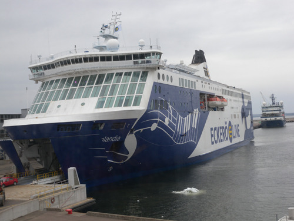  
<딸린항에 도착한 핀란디아호>

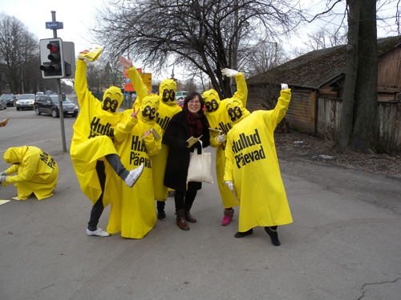  
<딸린에서 만난 Stockmann백화점의 홍보단>

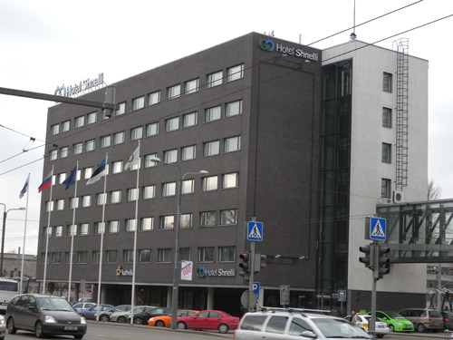  
<딸린에서 1박을 한 슈넬리 호텔>

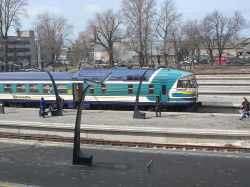  
<호텔 창밖으로 보이는 기차 역>

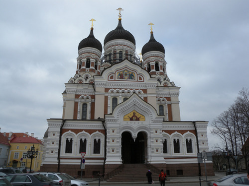  
<St. Alexander Nevsky Cathedral>

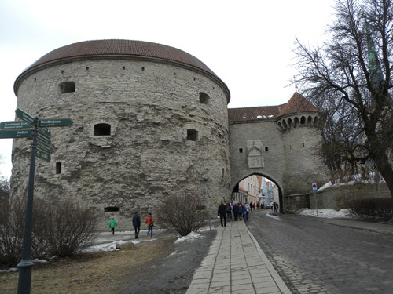  
<구시가지 들어가는 문>

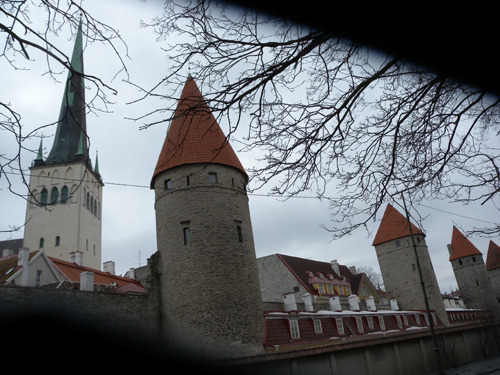  
<성벽 밖에서 본 구시가의 건물들>

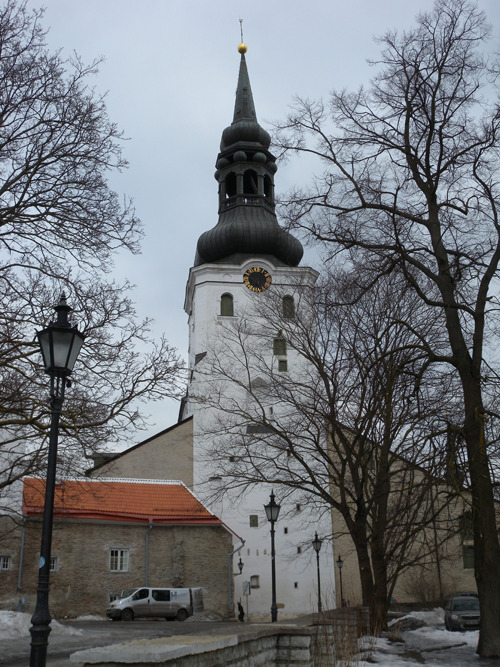  
<Cathdral of Saint Mary The Virgin>

  
<딸린 항에서 바라본 St. Olaf's Church 원경>

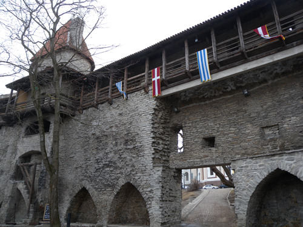  
<성벽 위의 까페>

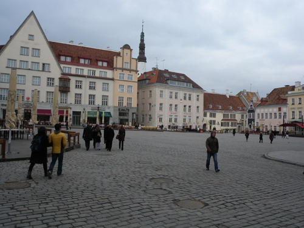  
<구 시가지 마켓 광장>

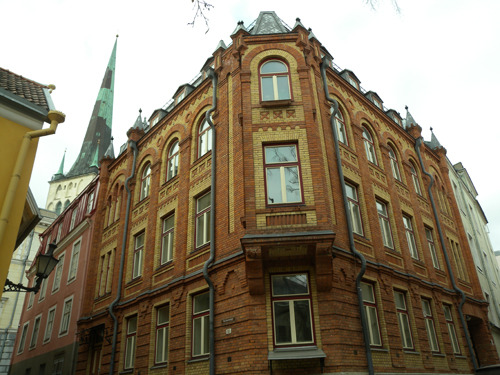  
<구시가의 한 건물>

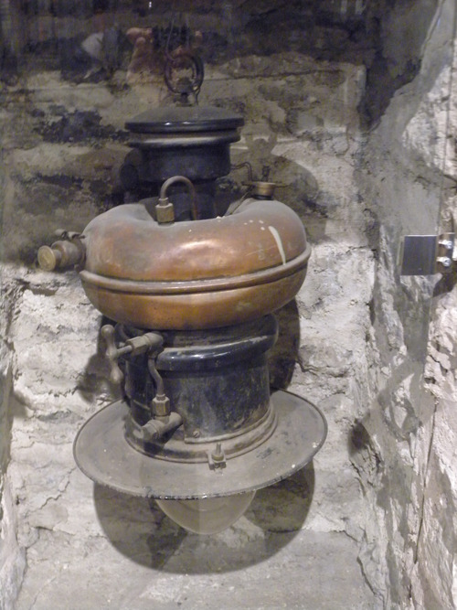  
<해양박물관 소장품>

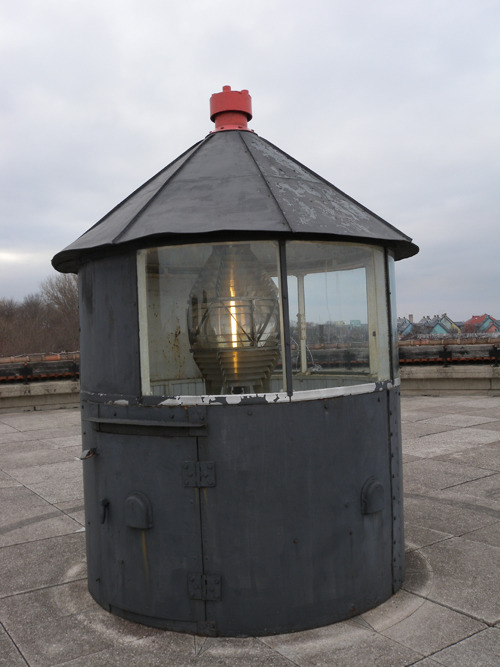  
<해양박물관 옥상의 등대>

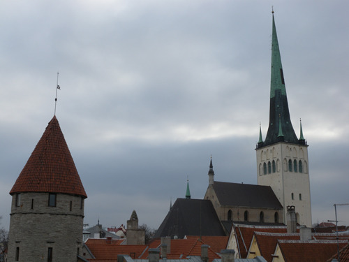  
<St. Olaf's Church의 원경>

  
<중세식 식당 Olde Hansa의 간판>

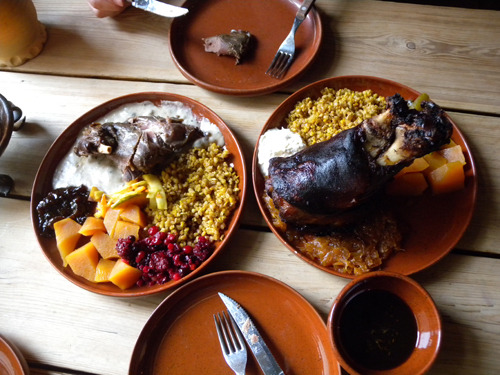  
<Olde Hansa에서, 중세식으로 요리되었다는 돼지고기와 토끼고기>

발트해의 보석 에스또니아 딸린(1)

내 마음에 각인된 유럽의 추억 때문이었을까. 한동안 벽에 붙여놓은 유럽 전도를 보면서 화려한 상상의 나래를 펼치곤 했다. 곳곳에 펼쳐진 옛 문화와 역사의 흔적들이 내 추억에 불을 붙이고 마음을 흔들어 놓기 때문이었다. 고스란히 남아있는 옛 역사의 자취들 속에서 삶을 이어가는 그들이 부러울 뿐이었다. 몇 걸음만 옮겨도 기원전 로마시절의 문화유적들이 즐비하고, 지금도 중세 때의 돌집에서 살아가는 그들. 단 하루만이라도 그런 역사의 잔존물로 이루어진 보금자리에 내 천박한 의식이나마 편안히 누이고 발효시킬 수만 있다면, 황무지 같은 지식사회의 일원으로 내던져져 진보에 대한 아무런 희망조차 없는 지금의 처지에서 무슨 호사를 더 바란단 말인가.

그런 꿈을 꾸어오는 동안에도 에스또니아는 내 안중에 아예 없었다. 북유럽과 일의대수(一衣帶水) 발트해로 연결된 에스또니아의 딸린에 다녀오라는 헬싱키 지인의 권유에도 불구하고, 에스또니아나 딸린이 지닌 의미에 대하여 그리 진지하게 알아보지 못한 건 전적으로 내 지적 천박성 때문이리라. 아침 일찍 헬싱키 항에 나가 수만 톤은 족히 될 정도의 거대한 여객선 ‘핀란디아(Finlandia)’에 오른 것도 그간의 내 편견에 대한 발 빠른 반작용에 지나지 않았다. 배 이름이 그랬던 만큼 배 앞머리에 새겨진 오선보 역시 시벨리우스의 악보에서 따온 소절일 것이다. 시벨리우스를 생각하며 쇄빙선이 그어놓은 뱃길을 따라 불과 80km 떨어진 딸린으로 건너가며 2시간 반이 넘는 동안 안개 자욱한 발트해를 느껴보는 것도 그리 나쁘지 않았다.

\*\*\*

선상 공연 무대의 음악 소리와 관중들의 환호에 취한 채 두시간 반을 달리고 나서야 딸린 항에 도착했다는 방송이 흘러나왔다. 여객들 틈에 끼여 느릿느릿 밖으로 나오자 유럽의 여느 항구들과 마찬가지로 산덩이만한 크루즈선들이 정박하여 만남과 이별의 정취를 조금은 가볍게 날려대고 있었다. 그러다가 시내 쪽으로 고개를 돌리니, 날카롭게 하늘을 찌를 듯 교회의 녹청색 첨탑이 솟아 있고, 그 밑으로 고색창연한 건물 지붕들이 나지막하게 열 지어 있는 모습이 눈 가득 들어왔다. 마음속에 갑자기 생겨난 묘한 기대와 함께 내 편견의 한쪽 벽이 무너지기 시작했다. 나중에 알았지만, 그 첨탑이 바로 딸린의 전망대이자 랜드마크인 ‘성 올라프 교회[St. Olaf's Church]’였다. 그 첨탑을 통해 비로소 이곳에도 ‘알트슈타트(Altstadt)’[Old City 즉 ‘구시가지’]가 있음을 알게 되었다. 8년 전 5개월 동안 유럽 전역을 돌아다니며 매혹되어 있던 그 ‘알트슈타트'가 이곳에도 있어 이 나라의 역사성과 문화적 수준을 증거하고 있음을 깨닫게 된 것이다.

호텔에 여장을 풀고 점심을 해결한 다음 즉시 알트슈타트의 탐사에 나섰다. 깨끗하게 보존된 중세 도시가 눈앞에서 약여(躍如)하게 살아 움직이고 있었다. 성 밖의 신시가지와 행복한 조화를 이루며 펼쳐져 있는 것이 바로 딸린의 알트슈타트였다. 알트슈타트 안에서 방위마다 거의 정확하게 솟아 있는 거대한 교회들, 칼날 하나 들어갈 수 없을 만큼 빈틈없이 빽빽하게 들어찬 건물들, 거미줄처럼 4통8달된 골목길들, 숨듯이 곳곳에 틀어박혀 자신의 임무를 수행하는 공공기관, 각 급 학교, 박물관, 약국, 서점, 문방구, 커피 점, 제과점, 갤러리, 꽃 가게, 레스토랑, 선물가게, 패션가게, 이발소 및 미용실 등등. 모든 것을 갖추고 있는 삶의 충실한 현장이었다. 그 뿐인가. 사람들이 모여 축제를 벌이며 친교를 나누었음직한 작고 큰 광장들도 곳곳에 널려 있었다. 교회의 경우 이르게는 12~3세기에 지어진 것들도, 늦게는 18~9세기에 건축된 것들도 있는데, 그 규모와 아름다움이 나그네의 정신을 압도하기에 충분했다. 루터교회, 러시아 정교회 등 대충 헤아려도 50여에 달하는 이 거대한 교회들을 대체 누가 다 세웠으며, 그 공간을 누가 있어 다 채웠단 말인가.

\*\*\*

4만 5천여 평방킬로미터의 면적으로, 작지만 국토의 절반 이상이 숲으로 덮여 있고, 3500여㎢에 달하는 큰 호수[페이푸스(Peius)]를 갖고 있는 아름다운 에스또니아. 라트비아 및 러시아와 국경을 맞대고 있으며, 독립을 지키고 정체성을 지키려는 투쟁의 과정에서 소련과 나치 독일 등 주변의 강국들에게 심한 박해를 받아온 나라다. 1920년 소련과의 평화협정서는 휴지조각이 되었고, 결국 1939년 독소불가침 조약에 의해 소련의 지배 아래로 들어갔으며, 제2차 세계대전을 통해 독립을 완전히 상실한 채 소련의 한 부분으로 예속된 비운의 나라였다. 그 뿐인가. 스탈린에 의해 극동의 고려인들이 중앙아시아로 강제이주 되었듯이 에스또니아 사람들 역시 강제이주의 쓰라림을 맛보게 된 것. 1920년 이후 강제이주 시기까지 50여만 명의 인구가 학살을 당했으니, 그 사실이 현재 인구가 150만 명에 불과하다는 점의 한 이유가 될 수 있을까.

어쨌든 소련 대통령 고르바초프의 페레이스트로이카와 자신들의 노력에 힘입어 1991년 8월 결국 독립을 쟁취했고 UN에 가입했으며, 2004년에는 EU에 가입함으로써 이 지역 강소국의 하나가 되었으니, 시련과 고통만이 한 국가와 민족을 강하게 만든다는 역사의 원리를 보여준 사례라고나 할까. 그 적은 인구 150만도 에스또니아인․러시아인․우크라이나인 등으로 나뉘며, 수도 딸린의 인구 또한 44~5만 정도라 하는데, 나라 전체로 따져도 기껏 우리나라 대전광역시의 인구와 맞먹는 정도가 아닌가. 그 옛날엔 이보다 덜하면 덜했지 더 많았을 리는 결코 없었을 것이니, 무슨 수로 이런 대규모의 교회들을 채웠던 말인가. 참으로 불가사의한 일이다. <계속>

공유하기

게시글 관리

**백규서옥\_Blog ver.**