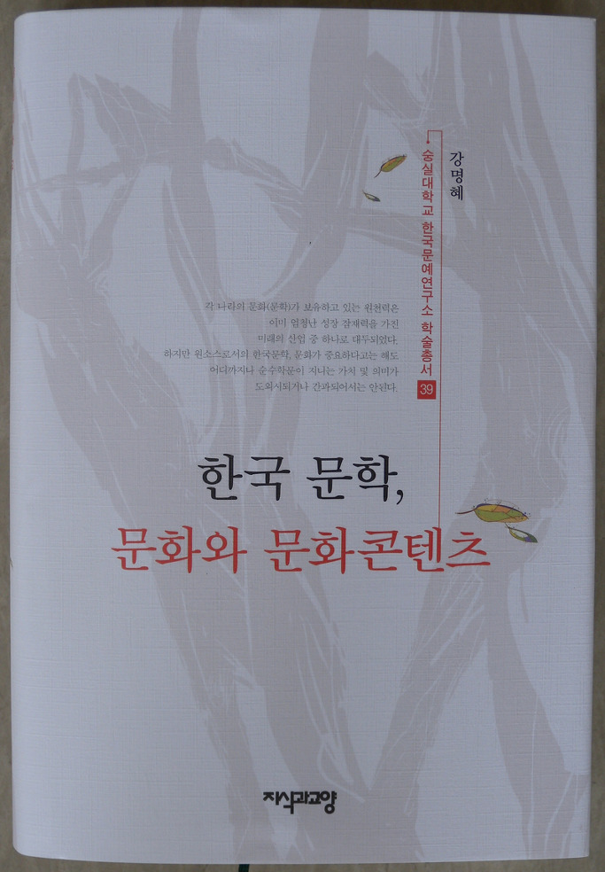
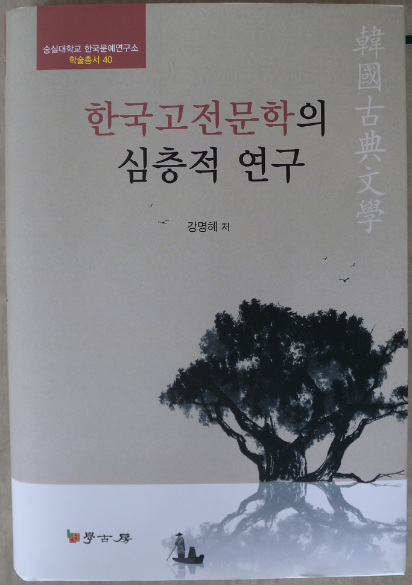

강명혜 박사(한국문예연구소 연구원), <<한국문학, 문화와 문화콘텐츠>>와 <<한국고전문학의 심층적 연구>>를 한국문예연구소 학술총서 39⋅40으로 발간!!!

의욕적이고 창의적인 한국문학자 강명혜 박사가 이번에 <<한국문학, 문화와 문화콘텐츠>>를 한국문예연구소 학술총서 39로, <<한국고전문학의 심층적 연구>>를 동 학술총서 40으로 각각 펴냈다. 전자는 강 박사가 그간 연구해 온 고전문학을 문화콘텐츠로 가공하는 과정이나 의미를 천착한 응용적 차원의 결실이고, 후자는 그의 연구 분야를 보다 심화시켜 이루어낸 결실이다. 1부[고전문학의 문화콘텐츠화 양상 및 문화콘텐츠화를 위한 수업모형/고전시가와 스토리 텔링/<만전춘별사>의 스토리텔링화/허난설헌⋅윤희순의 현실 대응 방식 및 스토리텔링화/좌절과 소망의 미학/재일동포 한국어 작가의 시조연구 및 문화콘텐츠 방안]와 2부[전통 무예(武藝) 양상의 현대적 변용 및 콘텐츠화 방안/지역설화의 의미, 특성 및 스토리텔링화/서(書 )와 화(畵)에 투영된 북한강의 특성 및 물 원형상징과의 상관성/북한강 스토리텔링 및 콘텐츠화 방안/용산공원 스토리텔링]로 나누어진 전자는 한국문학이나 문화를 실생활이나 교육에 즉각 응용할 수 있도록 하는 현실적 방안을 담고 있다. 마찬가지로 1부[<단군신화> 새롭게 읽기/죽음과 재생의 노래 <공무도하가>/상대시가의 의미 및 기능/고전시가에 나타난 산 숭배사상/<<삼국유사>>｣의 편찬의도 및 전략/<<삼국유사>>의 언술방식/여음을 통한 고려가요의 의미 연구/조선조 서민 여성 작가의 세계관과 문학적 특성 및 가치]와 2부[<<역주 해관자집>>에 나타난 제의 양상 및 특징/<<역주 해관자집>>에 나타난 춘천의 세시풍속/민족정서의 지속과 변이 양상/강 민속에 나타난 여성/<해녀 노 젓는 소리>의 통시적⋅공시적 고찰/남한강의 특징 및 민속/광공업 생산민속 신앙의 현황과 실제/양구 인물설화의 의미 및 기능/생업형 지명의 고장 화천/산간지역 주민의 의식구조적 특성]로 나누어진 후자는 고전문학이나 민속에 대한 기존 해석들의 평면성을 극복하고, 새로운 차원의 의미를 설득력 있게 읽어낸 연구결실이다. 이 두 저작을 통해 고전문학에 대한 저자의 새로운 시각을 만날 수 있으리라 본다. 강호제현의 일독을 권한다.

<<한국문학, 문화와 문화콘텐츠>>, 지식과 교양, 2013, 값 28,000원/ <<한국고전문학의 심층적 연구>>, 학고방, 2013, 값 35,000원

공유하기

게시글 관리

**백규서옥\_Blog ver.**