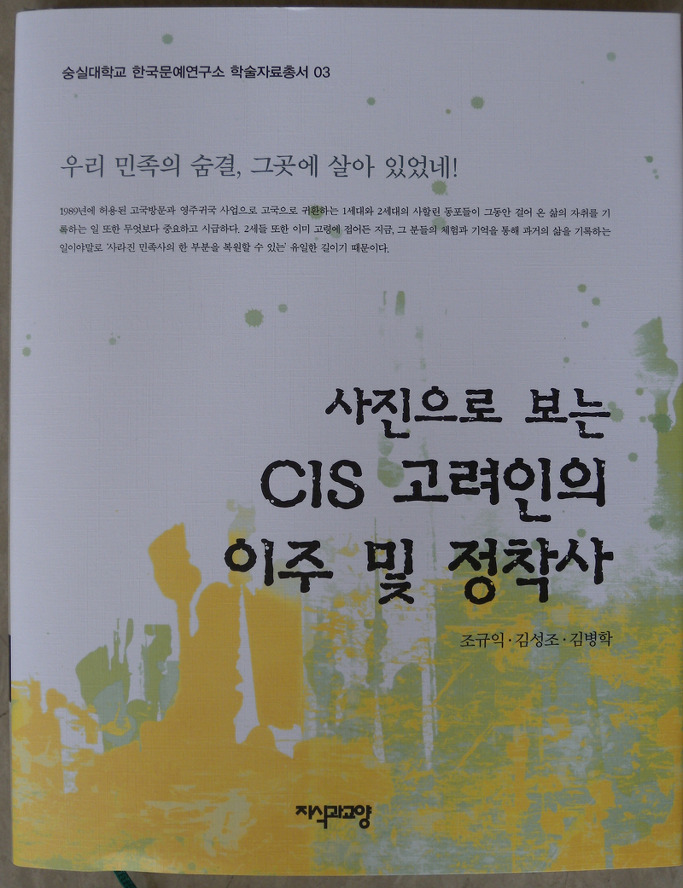

<<사진으로 보는 CIS 고려인의 이주 및 정착사>>를 한국문예연구소 학술자료총서 3으로 발간!!!

조규익 교수[한국문예연구소 고문]는 김성조⋅김병학 선생과 함께 <<사진으로 보는 CIS 고려인의 이주 및 정착사>>를 한국문예연구소 학술자료총서 3으로 발간했다. 이미 <<우리 민족의 숨결, 그곳에 살아 있었네!>>를 학술자료총서 2로, <<경천아일록>>을 학술자료총서1로 펴낸 바 있는 조 교수는 이번의 학술자료총서 3의 귀한 사진자료들을 통해 사할린 동포들이 중앙아시아 등으로 이주하여 정착한 역사를 설명하고 있다. 강제징용 등으로 사할린에 있던 우리 동포들은 일본 패망 후 귀국하지 못한 채 억지로 소련 국민이 되었으며, 그로부터 이들은 각기 살길을 찾아 소련의 각지로 흩어지게 되었다. 70여년 가까운 이산의 고통을 겪다가 1989년에 허용된 사할린 동포 고국방문과 영주귀국 사업으로 1, 2세대의 고령 동포들이 귀국하고는 있으나, 그들에 대한 예우가 흡족치 못한 것이 사실이다. 더구나 이들의 과거를 보여줄 만한 각종 자료들도 수집되지 못하고 있는 실정이다. 그런 현실을 감안하여 숭실대학교 한국문예연구소에서는 현지를 답사하며 이들의 사진자료들을 수집해왔고, 그것들을 연차 계획에 따라 발간하고 있다. 이런 일은 사실 국가에서 나서서 해야 할 작업이지만, 아무도 사진자료의 중요성은 물론 존재조차 알지 못하고 있는 것이 현재의 상황이다. 향후 학계가 나서야 할 일이라고 보며, 강호제현의 관심과 도움을 간절히 청한다.

<<사진으로 보는 CIS 고려인의 이주 및 정착사>>, 지식과 교양, 2013, 15,000원.

공유하기

게시글 관리

**백규서옥\_Blog ver.**