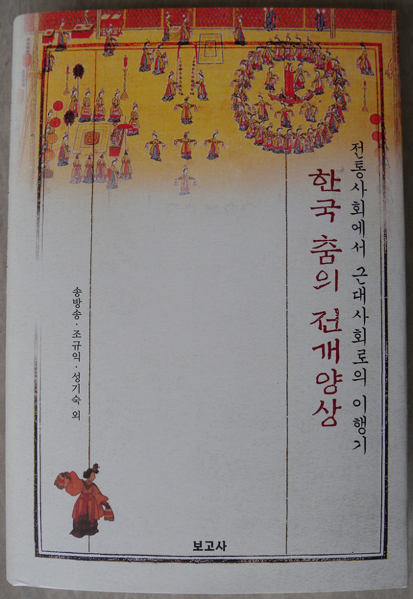

<<전통사회에서 근대사회로의 이행기 한국 춤의 전개양상>> 출간!

전통시대에서 근대로 넘어가는 이행기 혹은 과도기에 한국 춤이 어떤 전개 양상을 보였는지를 한 눈에 확인할 수 있는 연구서가 출간되었다. 대체로 순조대왕이 즉위한 이후 19세기 말을 거쳐 근대까지 한국 춤에 나타난 변화의 양상은 그 이전의 시기들에 비해 현격한 모습을 보여준다. 이 책에는 다음과 같은 글들이 실려 있다.

조규익, 악장과 정재의 미학적 상관성

조규익, 익종(翼宗) 악장 연구

송지원, 조선후기 음악의 문화담론 탐색

이의강, 19세기 초 궁중무용의 미학적 전환

송방송, 조선후기 선상기(選上妓)의 사회제도사적 접근

김은자, 조선후기 평양교방의 규모와 공연활동

조경아, 순조대 정재 창작양상

성기숙, 조선후기 정재의 극장공간성과 공연미학

손태도, 조선후기 탈춤의 주체

김예호, 전환기 한국 공연예술의 흐름과 근대화 지향성

송방송, 대한제국 시절 진연과 교방사의 공연활동

이병옥, 재인 한성준의 삶과 무용사적 의의

이 송, 신무용의 기점과 문화사적 의의

유민영, 한국근대공연예술사에서 조택원의 위치

성기숙, 근대 신여성의 표상, 최승희

보고사, 2013. 정가 30,000

공유하기

게시글 관리

**백규서옥\_Blog ver.**