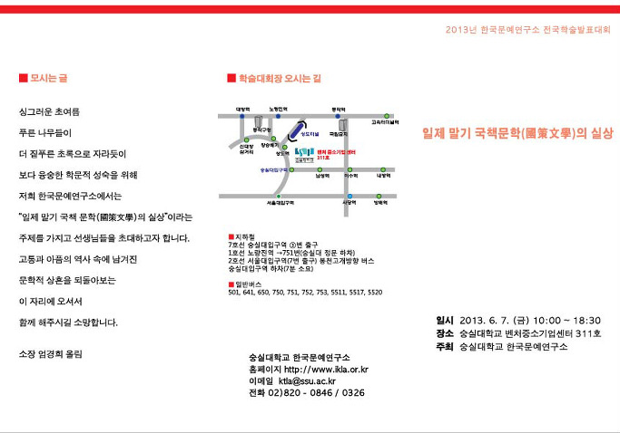
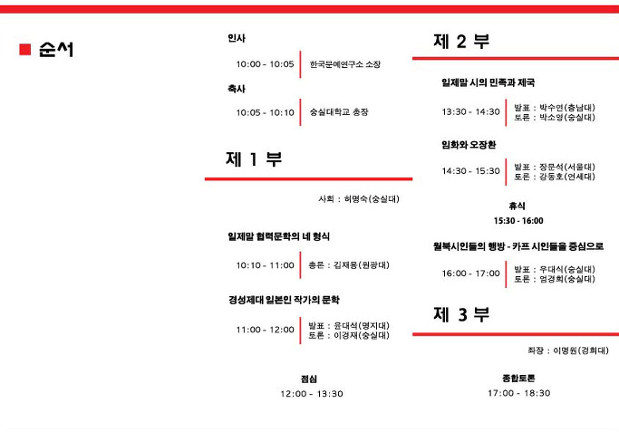

2013년도 숭실대학교 한국문예연구소에서 학술발표대회를 아래와 같이 갖습니다. 많이들 오셔서 좋은 의견들 나누시기 바랍니다.

\*일시 : 2013. 6. 7. (금) 10:00~18:30

\*장소 : 숭실대학교 벤처중소기업센터 311호

\*발표내용

 제1부

  일제말 협력문학의 네 형식  :   김재용(원광대)

  경성제대 일본인 작가의 문학  :  발표 윤대석(명지대) /토론 이경재(숭실대)

  제2부

  일제말 시의 민족과 제국 : 발표 박수연(충남대) / 토론 박소영(숭실대)

  임화와 오장환  :  발표 장문석(서울대) / 토론 강동호(연세대)

  월북시인들의 행방-카프 시인들을 중심으로  :  발표 우대식(숭실대) / 토론 엄경희(숭실대)

  제3부

  종합토론  :  좌장  이명원(경희대)

공유하기

게시글 관리

**백규서옥\_Blog ver.**