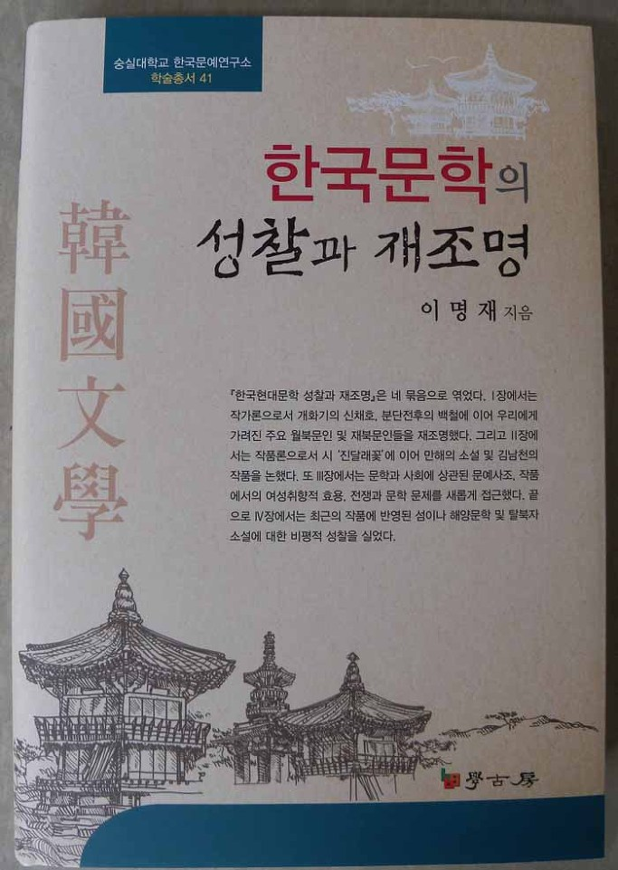

이명재 교수, <<한국문학의 성찰과 재조명>>을 한국문예연구소 학술총서 41로 출간!

이명재 교수(중앙대 명예교수)의 책[<<한국문학의 성찰과 재조명>>]이 한국문예연구소 학술총서 41로 출간되었다. 한국 평론계를 대표하는 이 교수는 그간 많은 학술서와 현장비평으로 활약해왔으며, 이 책은 그간의 학술활동을 총체적으로 보여줌과 동시에 후학들에게 새로운 전망을 제시하는 의미를 지니고 있다. 이 책은 1장[단재 신채호의 문학/백철의 삶과 휴머니즘 문학/월북 및 재북 문인 조사연구], 2장[‘진달래꽃’의 짜임새와 의미/만해 한용운의 소설/김남천 문학의 특성 연구], 3장[리얼리즘과 자연주의 논고/여성취향성의 문학적 효용/문학에서의 전쟁 대응 양상], 4장[문학작품에 담긴 바다와 섬, 연안/문학 텍스트의 정전화 문제/여성작가 구혜영 문학작품론/현안의 탈북자 소설에 대한 성찰] 등 네 부분으로 나누어져 있다.

도서출판 학고방, 2013. 5. 31. 25,000원

공유하기

게시글 관리

**백규서옥\_Blog ver.**