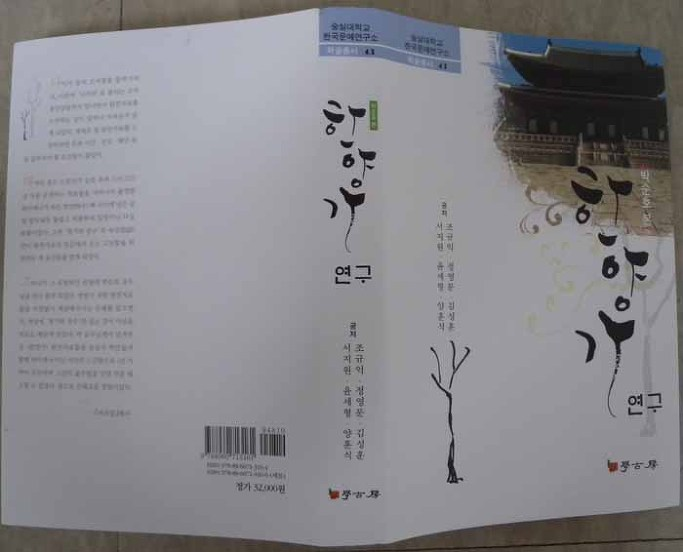
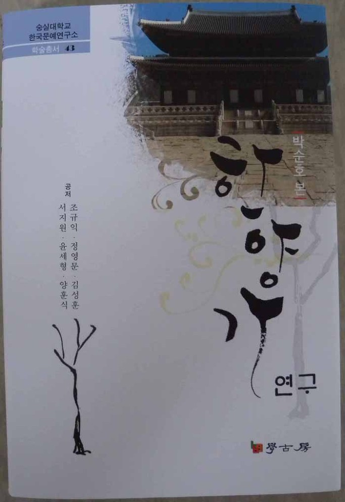
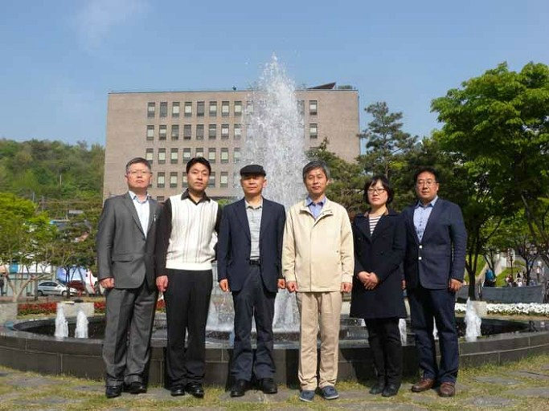

  
   <공저자들: 좌로부터 정영문, 김성훈, 조규익, 윤세형, 서지원, 양훈식>

조규익 교수(숭실대)와 정영문⋅김성훈⋅서지원⋅윤세형⋅양훈식 등 6인의 학자들은 최근 <<한양가 연구>>(학고방)를 숭실대학교 한국문예연구소 학술총서 43으로 출간했다.

구한말의 대표적 장편가사인 <한양가>를 종합적으로 분석한 것이 <<한양가 연구>>다. 조 교수를 비롯한 공저자들은 모두 숭실의 학인들로서 박순호본 <한양가>를 텍스트로 삼아 상당 기간 함께 토론해 왔고, 그 결과를 묶은 것이 바로 이 책이다. 이 책은 본문[‘<한양가>의 이본들’(정영문)/‘<한양가>와 삽입한시’(윤세형)/‘<한양가>의 특수 이본 <궁즁도회가>’(조규익)/‘<한양가>에 나타난 고종조의 역사의식’(서지원)/‘<한양가>의 윤리담론’(양훈식)/‘<한양가> 연구동향’(김성훈)]과 <한양가> 원문 및 영인 등 크게 세 부분으로 이루어져 있다. <한양가>는 당시 이름을 알 수 없는 지식인이 각 조대(祖代)의 부정적 사실(史實)들로부터 조선조 망국의 원인을 진단한, 대표적 영사가사(詠史歌辭)인데, 당대 지식계층의 역사관과 가사문학의 효용성 등을 뚜렷하게 보여준다. <한양가>를 대상으로 이본이나 주제의식, 연구동향 등을 분석하여 종합해 놓은 최초의 업적이라 할 수 있다.

공유하기

게시글 관리

**백규서옥\_Blog ver.**