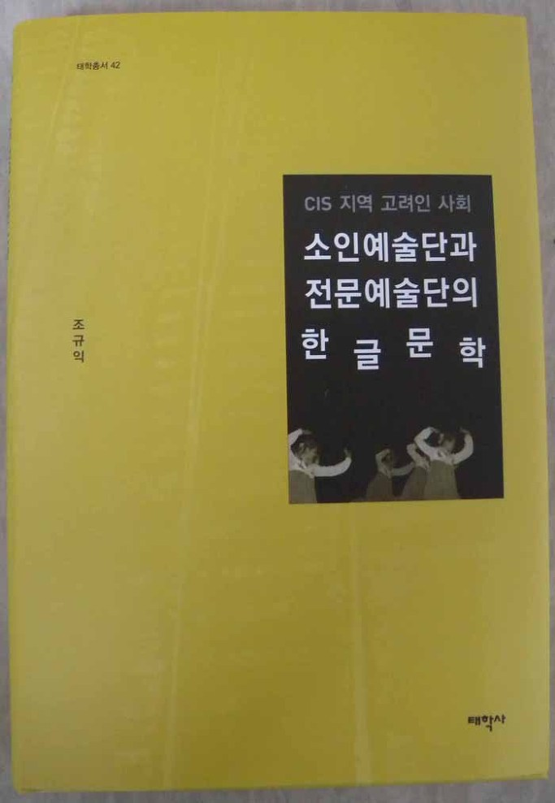
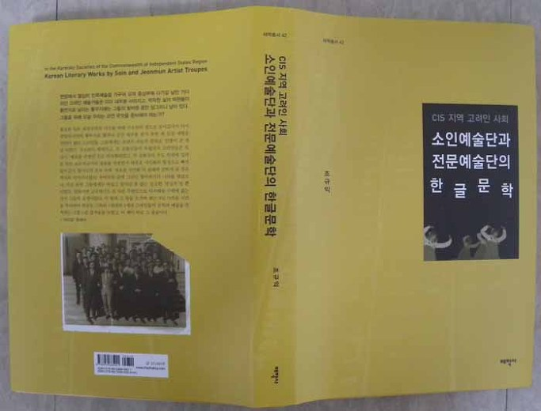

<<CIS 지역 고려인 사회 소인예술단과 전문예술단의 한글문학>>[태학총서 42/태학사]이 출간되었다.

CIS(Commonwealth of Independent States/독립국가연합) 즉 구소련 지역에 거주해 오는 고려인들의 한글문학을 종합적으로 연구 분석하여 출간한 것이 <<CIS 지역 고려인 사회 소인예술단과 전문예술단의 한글문학>>이다. 구소련 고려인 사회 대중 공연예술의 생산 및 소비 체제는 정부에서 관장하던 전문예술단(혹은 기관)과 함께 각 지역의 꼴호즈나 솝호스 등 생산단위 별 소인예술단들이 담당하던 두 축으로 이루어져 있었다. 즉 카자흐스탄 극성 꼴호즈의 ‘가야금 가무단’이나 뽈리뜨옫젤 꼴호즈의 ‘청춘 가무단’ 등 꼴호즈를 비롯한 생산현장이나 고려인 일반대중 사이에서 활동하던 비직업적 예술집단이 소인예술단이며, 1932년 원동의 블라디보스톡에 처음으로 세워진 ‘원동변강 조선극장’을 모태로 여러 지역으로의 이전과 개명(改名)의 과정들을 거쳐 1968년 카자흐 공화국 내각 결정에 의해 알마틔로 옮겨져 ‘카자흐스탄 공화국 국립 음악극 고려극장’으로 최종 정착된, 이른바 고려극장이 전문예술단(혹은 기관)이다. 이들 예술단에서 창작⋅공연한 한글 노래들과 드라마 등을 분석하여 주제의식과 문예미학 등을 찾아낸 것이다. 목차는 다음과 같다.

제1부 총서: 고려인의 문예미학, 그 정맥을 찾아

제2부 소인예술단과 한글문학

제1장 소인예술단 국문노래의 존재양상과 이념적 지향

Ⅰ. 생산현장과 소인예술단

Ⅱ. 소인예술단 국문노래의 생산 및 향유방식

Ⅲ. 구소련의 미학과 국문노래들의 주제의식

Ⅳ. 민족적 형식과 대중미학

제2장 고려인 노래의 전통노래 수용

Ⅰ. 전통노래와 변이의 당위

Ⅱ. 고려인들의 전통 민요와 변이의 단서

Ⅲ. 지속과 변이, 그리고 문화접변 현상

Ⅳ. 문화접변과 보편정서

제3장 고려인의 한글노래와 디아스포라의 정서

Ⅰ. 디아스포라의 존재와 당위

Ⅱ. 디아스포라의 경험과 문학적 형상화

Ⅲ. 디아스포라 의식의 관습성

제3부 전문예술단[고려극장]의 한글문학

제1장 고려극장의 존재의미와 가치

Ⅰ. 고려극장과 고려인

Ⅱ. 고려극장의 발자취

Ⅲ. 공연된 연극의 내용과 흐름

Ⅳ. 민족의식, 연극, 고려극장

제2장 고려극장에서 불린 한국어 노래들의 의미

Ⅰ. 전문예술집단으로서의 고려극장

Ⅱ. 가창된 노래들의 텍스트 양상 및 갈래

Ⅲ. 주제의식의 양상

Ⅳ. 고려인 민족예술미학의 메카, 고려극장

제3장 고려극장 1세대 극작가 연성용의 희곡과 고전 수용 양상

Ⅰ. 고려극장의 개척자, 연성용

Ⅱ. 예술적 성과에 관한 평가

Ⅲ. 고전의 발견과 재해석 향상

Ⅳ. 고전의 재해석과 변용

제4장 극작가 태장춘의 희곡과 역사 수용양상

Ⅰ. 고려극장과 태장춘

Ⅱ. 작품에 대한 당대의 인식과 평가

Ⅲ. 텍스트의 성립과 내용적 짜임

Ⅳ. 작가의식 및 주제

Ⅴ. 연극 미학적 해석의 모범적 선례

제5장 한진 희곡의 미학과 문학세계

Ⅰ. ‘새 고려인’으로서의 한진

Ⅱ. 언어와 민족문학, 고려인 문단에 대한 관점

Ⅲ. 주제적 관심과 미학적 성취

Ⅳ. 새로운 연극미학의 수립

제6장 한진 희곡의 미학과 문학세계

Ⅰ. 고전을 통한 현실의 해석

Ⅱ. 새로운 인물형의 창조를 통한 봉건체제 비판

Ⅲ. 봉건 착취에 대한 비판과 디아스포라의 정서

Ⅳ. 두 작품의 공시적⋅통시적 위상

Ⅴ. 고전의 해석과 연극미학의 수립

제4부 총결: 민족 문예미학으로 피어난 디아스포라의 역정

참고문헌

Summary

찾아보기

공유하기

게시글 관리

**백규서옥\_Blog ver.**