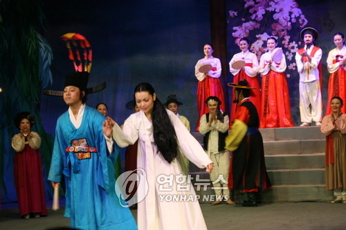
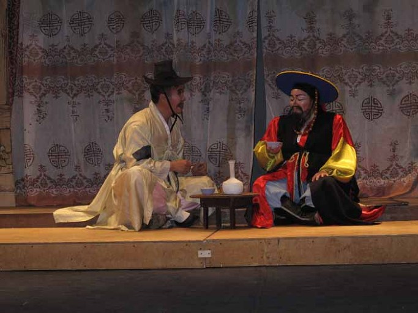
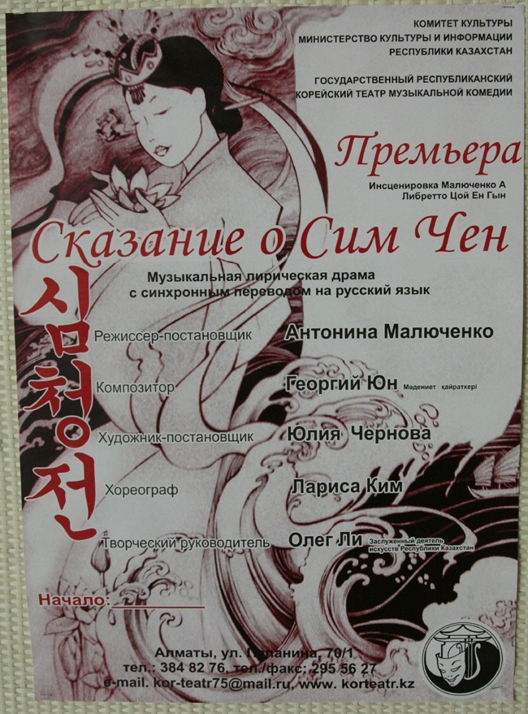
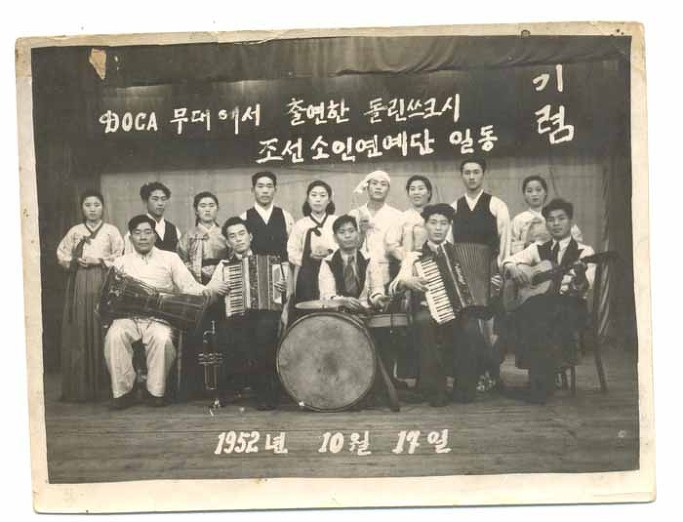
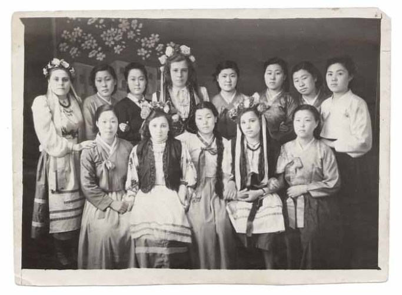
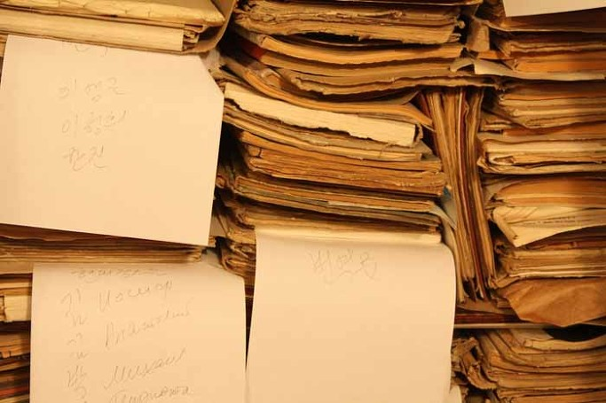

   
<2007년 카자흐스탄 고려극장 창립 75주년 기념공연 <춘향전>-연합뉴스 2013. 7. 18.>>

  
<최근 카자흐스탄 고려극장에서 공연된 <춘향전>의 한 장면>

  
<고려극장의 <심청전> 포스터>  
     <소련군 장교 구락부 무대에 출연한 돌린스크시 조선 소인예술단 단원 신동식, 김진화, 노태석, 김해인, 윤상순 등 (1952년 10월 17일 돌린스크시)>

  
<한인-러시아인 합동예술단>

  
<고려극장 창고에 가득 쌓인 연극대본들>

**조규익 교수, '…소인예술단과 전문예술단의 한글문학' 출간**

(서울=연합뉴스) 고미혜 기자 = 내년이면 이주 150년을 맞는 고려인의 역사는 고난의 연속이었다.

조선 후기 빈곤과 기아를 피해 연해주 등지로 내몰렸고 1937년 스탈린의 강제이주 정책으로 다시 중앙아시아로 쫓겨갔다. 자신의 의지와 무관하게 이곳저곳으로 돌아다니며 끊임없이 먹고 살기의 고단함과 소수민족에 대한 차별에 시달려야 했다.

이러한 이들의 애환을 조금이나마 달래주고 실낱같은 민족정신의 명맥을 이어가게 한 것은 바로 예술이었다.

조규익 숭실대 교수가 펴낸 'CIS 지역 고려인 사회 소인예술단과 전문예술단의 한글문학'(태학사)은 독립국가연합(CIS) 지역에 사는 고려인들이 향유했던 공연예술의 텍스트를 통해 이들의 문예미학을 살펴본 책이다.

고려인 사회 대중 공연예술의 두 축은 집단농장과 같은 생산현장이나 일반 대중들 사이에서 활동하던 '소인예술단'과 정부가 관장하던 '전문예술단'이었다.

아마추어 예술집단인 소인예술단은 주로 집단농장에서 증산(增産)을 독려하기 위해 활용됐다. 후렴구는 대부분 공산주의 체제 선전구호를 방불케 할 정도였다.

그러나 소인예술단에서 활동하던 고려인들은 사회주의 사상을 내용으로 하는 노랫말에 민요를 비롯한 우리 전통노래들의 음곡을 붙여 부르는 방식 등으로 민족 정서의 끈을 놓지 않았다.

대표적인 전문예술단인 고려극장은 1932년 블라디보스토크에서 설립된 후 카자흐스탄으로 자리를 옮겨 지금까지 200편이 넘는 연극을 무대에 올렸다.

구소련의 폭력적인 동화정책 속에 잊혀가는 모국어를 무력하게 바라봐야 했던 지식인과 예술인들은 고려극장의 연극을 통해 박탈감을 보상받으려 했다.

조 교수는 "고된 생산의 현장에서 괴로움을 달래준 동시에 민족적 동질감을 확인시켜준 무명 예술인 집단이 소인예술단이었고 탁월한 예술적 재능으로 민족의 애환을 대신 표출함으로써 고려인들을 정서적으로 결집시킨 것이 전문예술단이었다"고 설명했다.

그는 "중심부, 즉 고국에 다가갈 날만 기다리면 변방, 즉 구소련 지역에서 열심히 자신들의 민족예술을 가꾸어오던 고려인 예술인들은 진정한 민족주의자"라고 평가했다.

[mihye@yna.co.kr](mailto:mihye@yna.co.kr)

<저작권자(c)연합뉴스>2013/07/18 10:43 송고

공유하기

게시글 관리

**백규서옥\_Blog ver.**