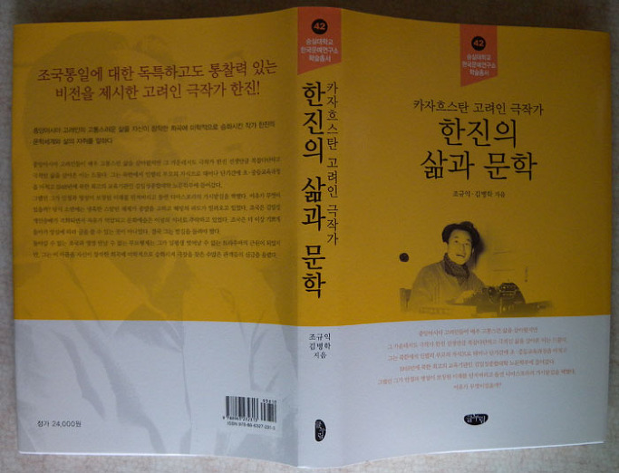
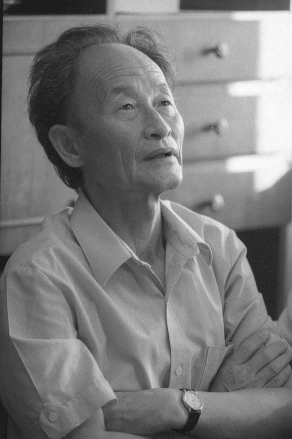
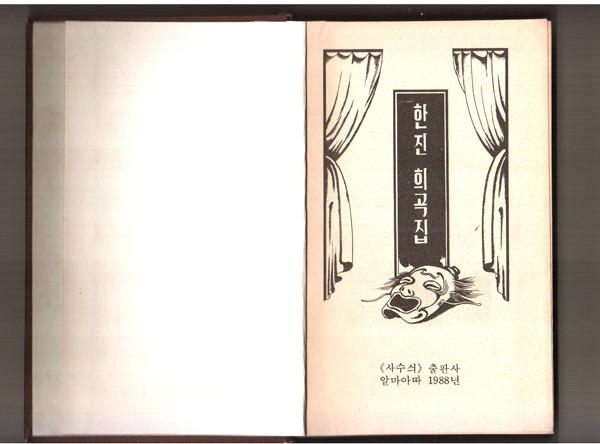
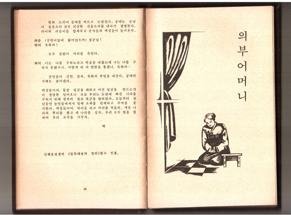
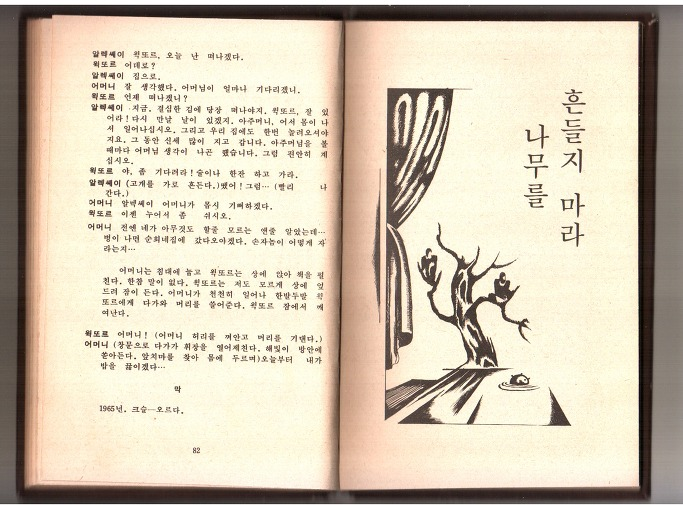
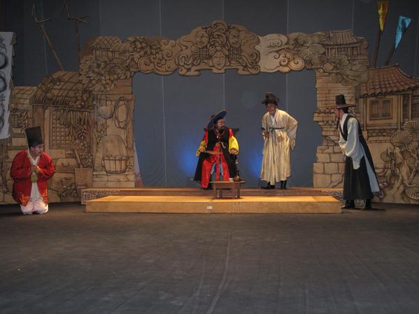
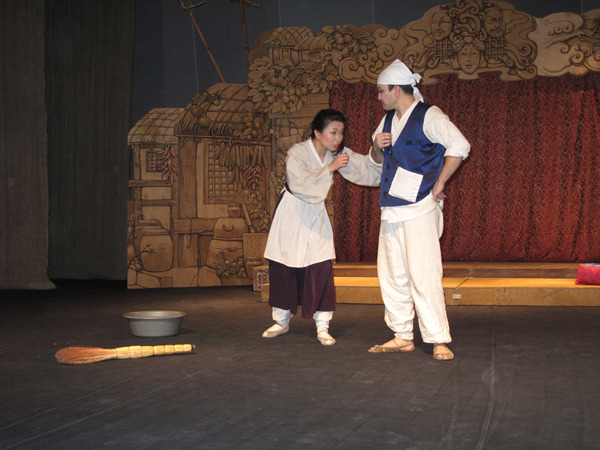
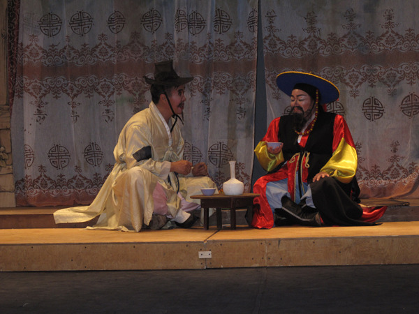
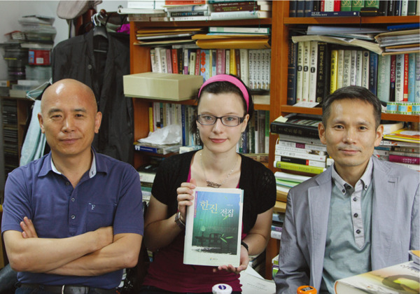

  
책 표지

  
1980년대의 한진

  
                                                        1988년에 펴낸 <<한진 희곡집>>

  
1965년작 <의부어머니>

  
1991년 작 <나무를 흔들지 마라>

  
최근 고려극장에서 상연된 <량반전>의 한 장면

  
최근 고려극장에서 상연된 <량반전>의 한 장면

  
최근 고려극장에서 상연된 <량반전>의 한 장면

  
2011년 8월 백규 연구실에 만난 한진 선생의 손녀 율리아(한양대 박사과정 재학)와 저자들

조규익 교수(숭실대 국어국문학과)와 카자흐스탄에서 활동 중인 김병학 선생이 <<카자흐스탄 고려인 극작가 한진의 삶과 문학>>[글누림, 2013. 7.]을 한국문예연구소 학술총서 42로 펴냈다.

중앙아시아 고려인들이 매우 고통스런 삶을 살아왔지만 그 가운데서도 극작가 한진 선생만큼 복잡다단하고 극적인 삶을 살아온 이는 드물다. 그는 북한에서 인텔리 부모의 자식으로 태어나 단기간에 초⋅중등교육과정을 마치고 1948년에 북한 최고의 교육기관인 김일성종합대학 노문학부에 들어갔다. 공부에 취미가 남달랐던 그는 곧바로 학업성적에 두각을 나타내며 천재성을 인정받았다. 그러던 중 6⋅25동란이 일어나자 인민군으로 참전했고 전쟁의 와중에 국가 장학생으로 선발되어 모스크바로 유학을 떠났다. 거기서도 변함없이 최우등의 학업성적을 보였다. 시쳇말로 그는 ‘최고의 스펙’을 쌓은 전도유망한 청년학도였다. 그의 앞에는 장밋빛 미래가 보장되어 있었다. 그랬던 그가 안정과 명성이 보장된 미래를 던져버리고 돌연 디아스포라의 가시밭길을 택한 것은 김일성 개인숭배가 격화되면서 자유가 억압되고 문화예술은 이념의 시녀로 추락하고 있던 조국이 더 이상 기쁘게 돌아가 양심에 따라 글을 쓸 수 있는 곳이 아니었기 때문이다.

한진의 작품들은 그의 의식이 성숙해가는 과정을 따라 네 단계로 나뉜다. 망명과 정착 과정에서 갖게 된 콤플렉스를 ‘원 모성으로부터의 절리(切離)와 새로운 모성의 발견 및 정착’으로 형상화시켰다고 보는데, 이것을 1단계의 이면적 주제의식[새로운 조국과 이념의 발견]이라 할 수 있고, <의부어머니>, <고용병의 운명> 등이 이에 속한다. 정착지에서 그를 끊임없이 괴롭힌 것은 지극한 사모(思母)의 정이었고, 어머니를 만날 수 없게 만든 조국 북조선의 현실이었다. 이것을 문학적으로 구현한 것이 2단계의 이면적 주제의식[모정에 대한 그리음과 북한 체제에 대한 비판]이었고, <어머니의 머리는 왜 세였나>, <량반전>, <산부처> 등이 이에 속한다. 2-80년대에 들어서면서 고르바초프에 의해 천명된 페레스트로이카나 글라스노스트 등은 소련의 분위기를 바뀌어 놓았고, 그에 따라 그로 하여금 다양한 주제의식과 미학을 추구할 수 있게 했다. 비록 풍자와 같은 간접적인 방법이긴 하지만 체제의 모순을 비판할 수도 있게 되었고, 보다 직접적인 어법으로 조국의 현실에 대한 비판적 인식을 드러낼 수도 있게 되었다. 3단계의 이면적 주제의식[주제의 다각화와 다양한 미학의 추구]이 가능했던 것도 그런 상황의 변화 덕분이었고, <토끼의 모험>, <나 먹고 너 먹고>, <폭발> 등이 이에 속한다. 4단계에 이르러 소련의 체제가 붕괴되고 새로운 민족주의가 대두됨으로써 조국의 미래에 대한 통찰 또한 새롭게 가질 수 있게 되었다. 한진으로서는 이념이나 힘의 우위가 아니라 동질성에 입각한 ‘분열된 민족의 통합’만이 가장 바람직한 조국의 미래라는 깨달음을 얻게 되었고, <나무를 흔들지 마라>를 통해 이 시기의 이면적 주제의식[민족통합의 당위성 추구]을 구체화할 수 있었다. 그가 망명지에서 표면상 극작가 혹은 소설가로 살아갔지만, 이면적으로는 일관되게 민족정신이나 정서를 추구한 민족주의자로 살아갔다고 본다. 그 결과 그는 민족의 미래에 대한 통찰을 제시할 수 있었고, 그에 따라 그의 극작품들은 독특한 미학을 구현할 수 있었던 것이다.

그는 밝혀진 것만 해도 12편의 희곡, 19편의 단편소설 및 소품, 5편의 단행본, 16편의 번역극, 수 미상의 평론 등 많은 작품들을 남겼으며, 창작 및 번역 희곡들 대부분은 최근까지 고려극장을 통해 상연되었다.

돌아갈 수 없는 조국과 영영 만날 수 없는 부모형제는 그가 일평생 벗어날 수 없는 트라우마의 근원이 되었지만, 그는 이 아픔을 자신이 창작한 희곡에 미학적으로 승화시켜 극장을 찾은 수많은 관객들의 심금을 울렸다. 특히 그가 말년에 쓴 희곡 ｢나무를 흔들지 마라｣는 오직 한진 자신만이 보여줄 수 있는 조국통일에 대한 독특하고도 통찰력 있는 비전을 담아낸 역작이다. 그는 이 작품에서 마치 예언자처럼 하나가 되기를 갈망하는 남과 북의 우리가 궁극적으로 찾아내야 할 해답을 선취해서 보여주고 있다. 이는 동족상잔의 전쟁에 직접 발을 담갔던 한진이 소련에 유학하던 첫해부터 자신을 되돌아보며 평생을 붙들고 다듬어온 구상으로, 그는 이것을 우리에게 소중한 유산으로 남겼다.

이 책의 전반부에는 어릴 적부터 만년에 이르기까지 그와 관련된 사진 및 원고사진들을, 후반부에는 그의 삶과 문학에 대한 저자들의 분석과 연구를 각각 실음으로써, 우리 민족이 배출한 구소련의 뛰어난 극작가 한진의 전모를 보여주게 되었다고 본다. 목차는 다음과 같다.

차례

머리말

제1부 사진 및 기록자료

1장. 사진

1. 평양 시절

2. 소련 모스크바 유학 시절

3. 러시아 바르나울 시절

4. 카자흐스탄 크즐오르다 시절

5. 카자흐스탄 알마틔 시절(전반기)

6. 카자흐스탄 알마틔 시절(후반기)

2장. 편지

3장. 육필 원고

4장. 신문 게재 원고

5장. 책․잡지 게재 작품 및 글

6장. 기타 자료

7장. 작품 목록

1. 희곡

2. 단편소설․소품

3. 직접 편찬했거나 편찬을 주도한 단행본

4. 번역 작품

제2부 한진의 생애와 문학

1장. 한진의 생애와 작품 세계

2장. 한진 희곡의 미학과 문학 세계

3장. 한진 희곡의 고전수용 양상

4장. 한진의 연보

5장. 참고문헌

공유하기

게시글 관리

**백규서옥\_Blog ver.**