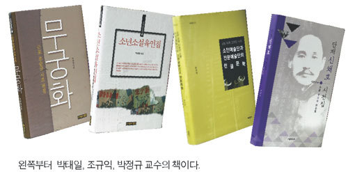

전공 분야의 우물 깊은 곳에서 만난 새로운 영역들 … “작은 것에도 의미가 있죠”

-박태일·조규익·박정규 교수의 어떤 시도들-

                         

                                                              

                                                                                                                                    윤상민 기자 <교수신문>    

시 전공자의 지역 문학 연구, 고전문학 전공자의 고려인 한글문학 연구, 신문방송 전공자의 시 전집 편역… 이 세 사람의 공통점은? 종래의 국문학 연구 분야의 새로운 지평을 열어가고 있다는 점이다.

최근 『근포 조순규 시조 전집』, 『소년소설육인집』(도서출판 경진 刊)을 발간한 박태일 경남대 교수(국어국문학과), 『CIS 지역 고려인 사회-소인예술단과 전문예술단의 한글문학』(태학사 刊)를 상재한 조규익 숭실대 교수(국어국문학과), 『단재 신채호 시전집』(기별미디어 刊)를 내놓은 박정규 전 청주대 교수(신문방송학과)가 그 주인공이다. 자신의 주 전공 분야를 가로질러 새로운 분야에 발을 딛는 이들의 작업은 어떤 의미일까. 지난 3, 5월에 『근포 조순규 시조 전집』, 『소년소설육인집』을 발간한 박태일 교수의 작업은 지역문학총서 시리즈 15, 16권이다. 말하자면 지역문학연구의 일환으로 시작한 셈이다.

박 교수는 오랫동안 계속됐던 일국주의 문학연구에 대한 반성적인 성찰로 지역문화연구를 시작했다. 기존의 국가주의 체제에서 소외됐거나 도태됐던 중견 작가나 지역 작가들의 작품을 다시 우리의 민족문학이라는 큰 전통 속에 남기고 복원할 수 있도록 하기 위해서다. 국가주의 체제에서 소외됐던 지역작가 발굴 사실 박 교수의 지역문화 연구는 이미 1990년대 후반에 경남·부산 지역을 연구하면서부터 시작됐다. <지역문학연구>라는 학술지를 14집까지 낼 만큼 열정적으로 매달렸지만, 학술진흥재단의 변화로 원고 수급이 어려워지면서 중단됐었다. 하지만 지난해 한국지역문학회(회장 김동근 전남대)를 창립하면서 그의 연구는 오히려 전국권으로 확대됐다. 제주, 전남, 충청, 인천에서 뜻을 같이 하는 교수들이 뭉친 것이다. 이렇게 형성된 네트워크로 <한국지역문학연구> 총서를 2권까지 발간했다.

그렇다고 경남, 부산지역의 연구가 미진해진 것은 아니다. 이번에 출간된 15, 16권에 이어 그의 예전 작업들의 결실이 계속해서 총서로 출간될 예정이기 때문이다. 박 교수의 지난한 작업의 결과물과 그 과정 속에서 뜻을 공유한 이들의 활동은 이렇게 한국지역문화연구의 풍성한 열매로 맺히고 있다. 처음부터 쉬운 것은 아니었다. 박 교수는 “지역 문학을 연구하면 유명한 사람들이 아니라 작품의 상업성이 떨어져서 출판이 매우 어렵다. 입력부터 편집, 교정까지 주변 지인과 제자들과 함께 알음알음 하고 있고, 출판에 따른 모든 부담도 편역자 본인이 져야 한다”라고 말했다. HK사업이니 BK사업은 그들의 작업과 상관이 없어 보인다. 이번에 출간한 『근포 조순규 시조 전집 무궁화』에 그가 부여하는 의미는 뭘까. 경남 지역의 중요한 작가의 발굴이라는 점은 차치하고라도, 美文主義의 전통을 가진 한국 시조의 전통과는 다른 사회학적인 시의 모습을 볼 수 있다는 점이다.

그가 엮어낸 『소년소설육인집』 은 1920년 자생적 계급주의 문학을 몇몇 문학가가 독점했다는 국문학계의 통념의 반대편에 서있다. 그는 이 책을 통해 아동문학, 지역문학가의 저변을 찾아냄으로써 계급주의 문학에 대한 반성을 시도했다. 올해 출간될 총서 17권은 1950년 이전까지 부산지역에서 나왔던 동인지에 대한 연구다. 잊힌 혹은 뭍힌 매체를 발굴해내기 위해 오늘도 연구실 불을 밝히는 박 교수는 말한다. “작은 것이라고 해서 의미 없는 것은 아니다.”

고려인 1, 2 세대의 한글문학은?

해군사관학교, 경남대를 거쳐 현재 숭실대에서 국문학을 가르치고 있는 조규익 교수. 그는 지난달 『CIS 지역 고려인 사회-소인예술단과 전문예술단의 한글문학』을 펴냈다. 2008년부터 2011년까지 이른바 CIS(독립국가연합: Commonwealth of Independent States)에 속한 몇몇 나라들을 돌아다니며 고려인이 겪어 온 ‘탈향과 이주’의 역정을 추체험했다. 모든 소수민족들은 러시아인이 돼야 한다’는 스탈린의 폭압적인 동화정책, 오랜 디아스포라의 고됨으로 우리 말과 문학과 역사를 잃은 고려인 2, 3세대를 만나고 온 이야기를 그는 이 책에서 풀어놨다. 문학과 역사의 경계를 넘나드는 작업이었다.

조 교수는 외모와 약간의 생활양식, 그리고 ‘고려인’이라는 민족의 칭호만 뺀다면 그들을 동족으로 생각할만한 요소를 발견하기도 힘들었다고 회고한다. 일본 제국주의를 피해 이주한 고려인은 구소련의 다수민족에 의해 또 다른 식민지인으로 타자화됐고, 중앙아시아의 황무지에서조차도 ‘주변인’으로서의 삶을 살았다. 구소련 해체 후, 각 공화국들이 독립될 때도 ‘새로운 주변인’일 뿐이었다. 꿈에 그리던 할아버지의 나라를 찾았지만, 이곳 역시 그들에게는 비집고 들어갈 틈이 없는 공고한 ‘중심부’일 뿐. 조 교수는 3년의 긴 여정 끝에 한글로 기록된 1세대와 2세대 고려인들의 문학과 예술을 추적해냈다.

학부에서는 정치외교학을, 대학원에서는 신문방송학을 전공한 박정규 전 청주대 교수(신문방송학과)가 지난 2월 펴낸 『단재 신채호 시전집』도 그의 광범위한 연구 이력의 일면을 보여준다. 그는 청주대 교협회장 당시 학내 민주화를 요구하다 해직되기도 하는 굴곡진 삶을 살았지만, 그의 연구 지평은 계속해서 확장돼 가고 있다. 당시 민족문화추진회의 고전번역 1기생인 그는 박사과정에서 조선왕조시대의 신문을 연구했던 신문방송학자는 지역 언론, 한국신문학사 등의 연구 속에 1999년 신채호를 만났다. 단재가 지은 시가를 새롭게 발굴하고 기존에 발표됐던 국문시, 시조, 한시들을 정리해 『단재 신채호 시집』을 출간했다. 이때부터 지금까지 그는 신채호에 푹 빠져있다. 개화기 암울한 민족적 시련기에 활발한 언론활동과 독립운동, 아나키즘 운동에 매진했던 단재는 감옥에서 순국함으로써 그의 주옥같은 시들 역시 빛을 보지 못하고 역사 뒤켠으로 사라졌다. 박 전 교수는 신체시의 효시로 불리는 육당의 「해에게서 소년에게」(1908.11)보다 훨씬 이전에 단재가 <황성신문>과 <대한매일신보>에 적지 않은 시가를 발표했으며, 한시나 새로운 형식의 시가를 소개함으로써 전통 시가의 맥을 계승하고 이를 변용해 근대적인 시가를 모색해냈음을 이 책을 통해 말하고 있다.

어쩌면 학문이란 이처럼 전공 분야의 우물을 깊게 파내려가며 만나는 수많은 학문의 뿌리들이 뒤엉켜 더불어 뻗어나가는 굵은 뿌리처럼, 결국 하나의 학문이란 이름에 도달하는 것이 아닐까. 이들의 다음 저서가 궁금하다. <교수신문 2013. 7. 29. 3면>

공유하기

게시글 관리

**백규서옥\_Blog ver.**