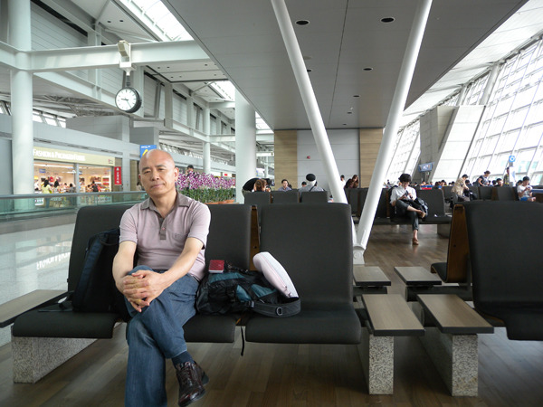
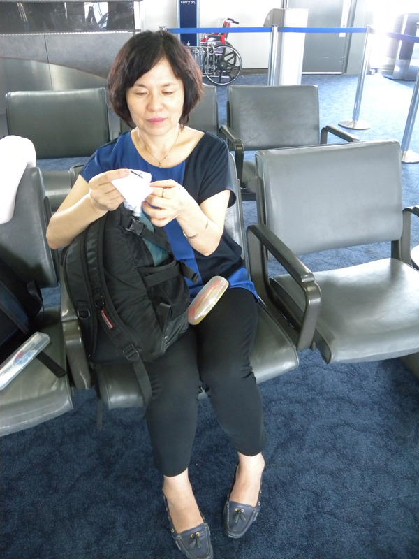

  
인천공항 출국장에서

  
인천공항 출국장에서

다시 미국에 가며

도전과 힐링!

사실 도전과 좌절이야말로 인생을 엮어가는 날줄과 씨줄일 텐데, 그 좌절을 힐링으로 바꿔치기하는 세상의 지혜를 새삼 배우기로 한다. 도전을 통해 희망을 그리면서도 그 실현이 쉽지 않음을 깨닫고 좌절하거나 더 멋진 신기루를 찾아나서는 게 인간 아닌가. 지금 생각하면 나 역시 그러했다. 국문학도로서의 외길을 걸어오며 내 지적 능력이 허용하는 한계 안에서 사유와 모색을 끊임없이 반복해왔고, 그것들이 바로 ‘도전과 좌절’이라는 최대공약수로 수렴된다는 사실을 알게 되었다. 그 과정에서 만난 내 분야의 블루오션이 ‘해외 한인문학’임을 깨달았고, 몇 년간의 여행을 마친 후 최근 <<CIS 지역 고려인 사회 소인예술단과 전문예술단의 한글문학>>이란 책 한 권을 냄으로써 또 한 단계의 모색과 방랑을 가까스로 마무리하게 되었다. 해외 한인들의 문학을 제외할 경우 한국문학사에 대한 내 나름의 비전을 실현시킬 수 없다는 깨달음을 통해 비로소 나의 대책 없는 방랑벽을 잠재울 수 있었다. 결국 15년 전 UCLA에서 만난 재미 한인문학을 이번 기회에 다른 차원으로 모색하고 싶다는 욕망과 도전의 결기(決起/決氣)가 나를 추동하고 말았던 것이다.

\*\*\*

최근 Fulbright Commission에서 내 과제를 선정해 줌으로써 ‘Fulbright Researcher’ 혹은 ‘Visiting Fulbright Scholar’라는 ‘영광스런 타이틀’로, 선망하던 미국의 대학가를 다시 밟게 되었다. 15년 전 선발되어 캘리포니아의 UCLA에서 나를 새로운 세계로 입사시킨 LG 연암재단의 해외연구교수와는 또 다른 의미의 학문적 커리어가 아닌가. 과연 1998년 이후 15년 동안 ‘모색과 수정’, 아니 ‘대책 없는 지적 방랑’을 거듭해오던 연구도정에 내 나름의 새로운 이정표를 세울 수 있을까. 인식의 깊이와 폭을 넓히려는 무작정의 새로운 도전보다는, 그간 벌여놓은 너절한 공사판을 깔끔하게 정리하여 후배들과 담소를 나눌만한 언턱거리라도 만들어 놓을 수 있을까. 아내와 함께 17시간 비행의 고통을 감내하며 이곳에 날아온 이유다.

공유하기

게시글 관리

**백규서옥\_Blog ver.**