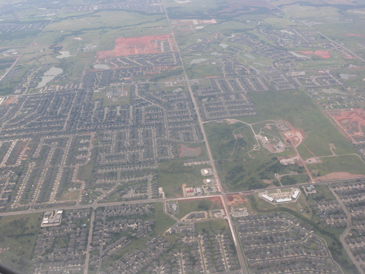
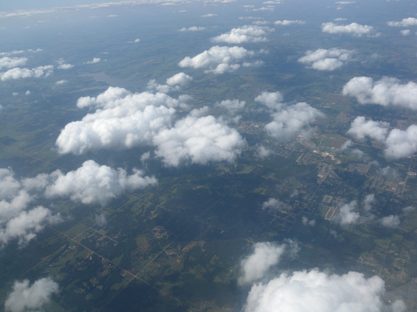
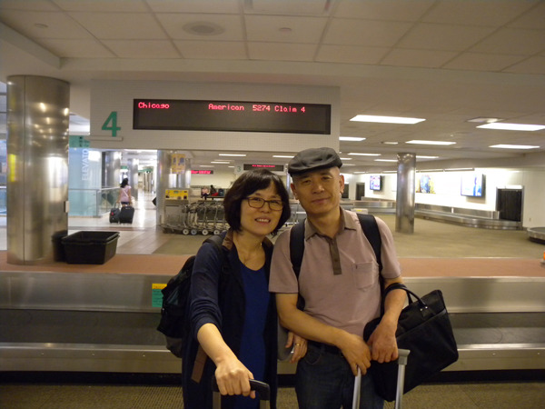
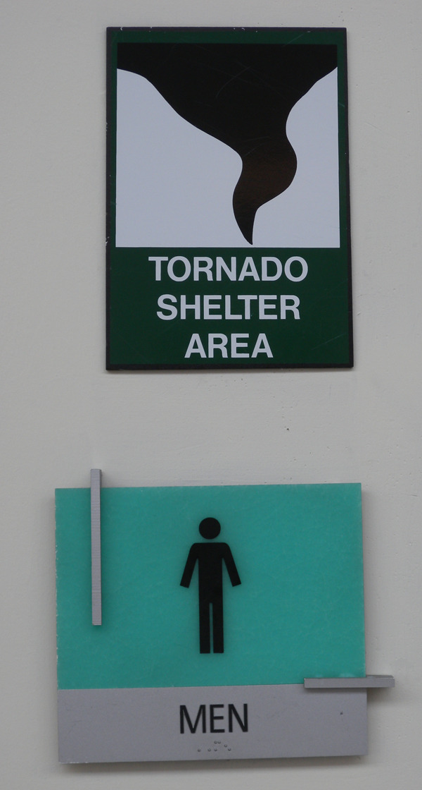
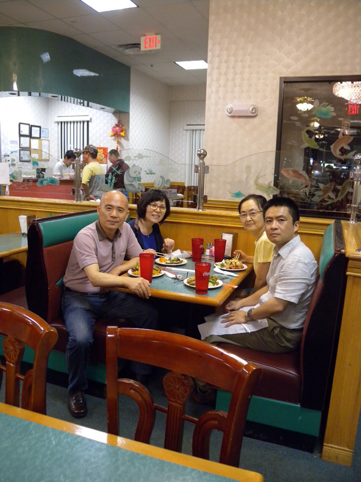

  
하늘에서 내려다 본 오클라호마시티 시가지

  
하늘에서 내려다 본 오클라호마 산하

  
한가한 오클라호마 공항에서

  
오클라호마 공항에서 확인한 자연의 위력

  
공항으로 픽업 나왔던 OSU의 Du 교수 내외와 스틸워터의 중국음식점에서 저녁식사를 하며

스틸워터(Stillwater), 그 평온과 정밀(靜謐)의 입체적 공간성

27일 오전 11시[한국 시각] 인천공항을 출발, 큰 원을 그리며 태평양 상공을 건넌 OZ236은 27일 오전 9시 50분[미국 시각] 시카고의 오헤어 공항에 우리를 내려주었다. 내외국인들로 장사진을 친 가운데 두 시간이 넘는 검색과 입국 수속을 거친 오후 2시 30분. 드디어 오클라호마로 가는 작은 비행기에 몸을 실었고, 그로부터 두 시간 후 한적한 오클라호마 공항에 도착했다. 이곳에 도착하기까지 비행기에서 내려다보이는 오클라호마의 산하(山河)엔 ‘산’이 없었다. 끝없이 펼쳐진 평원 뿐. 수없이 가로 세로 직선으로 그어진 도로망은 마치 신의 솜씨인 듯 망망한 평원을 바둑판처럼 분할하고 있었고, 그 위로 부드러운 구름뭉치들이 한가롭게 떠다니고 있었다. 평화 그 자체의 정물화였다. 그 위에 어찌 토네이도의 폭력을 상상할 수 있단 말인가. 바닷가 모래사장에 한참동안 공들여 ‘이쁜’ 성채를 만들어 놓은 어린아이가 갑자기 생겨난 심술로 마구 휘저어 놓듯, 인간의 앞에서 조화를 부리고픈 신의 의지도 그렇게 작동되는 것일까. 한적하면서도 요새같이 든든하게만 보이는 공항의 화장실 팻말 위쪽의 ‘토네이도 피난처[Tornado Shelter Area]’란 팻말을 보고서야 지난 5월의 악몽 같았을 토네이도의 현장이 바로 이 지역이었음을 깨닫게 되었다. 

\*\*\*

순식간에 짐을 찾은 뒤, 픽업 나온 OSU 역사과의 Du[Yongtao Du] 교수를 만난 것이 오후 5시 반. 한적한 길을 두 시간여 달려 드디어 스틸워터에 도착했다. 오클라호마가 카우보이의 본산이지만, 그 가운데서도 스틸워터는 소떼를 몰던 카우보이들이 소들과 함께 코를 박고 물을 마시며 갈증을 지웠을 만한, 조용한 평원이었다. 시차로 감기는 눈꺼풀을 들어 올리며 Du 교수 부부를 따라간 곳은 자신들의 홈 푸드를 대접하겠다며 데려간 대형 중국음식점이었다. 그들의 호의와 성의에 크게 미치지 못하는 그곳 식당의 음식을 통해 ‘강남의 유자를 강북에 옮겨 심으면 탱자가 된다’는 속담을 새삼 확인한다. 잔디 곱게 깔린 구릉에는 나지막한 대학 아파트들이 널찍널찍 앉아 있었는데, 그 중에서도 조용한 곳이 바로 우리가 들어갈 윌리엄스 아파트[101 N. University Place Apt #1]였다. 문을 열고 들어서기 무섭게 시차에 지친 아내는 곯아떨어지고, 나는 ‘나답게’ 불면의 새벽을 맞아야 했다.

공유하기

게시글 관리

**백규서옥\_Blog ver.**