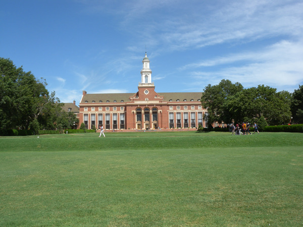
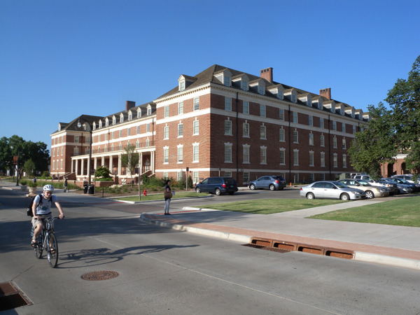
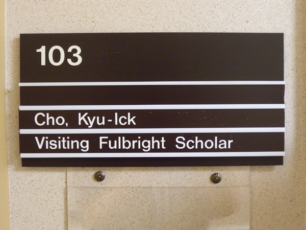
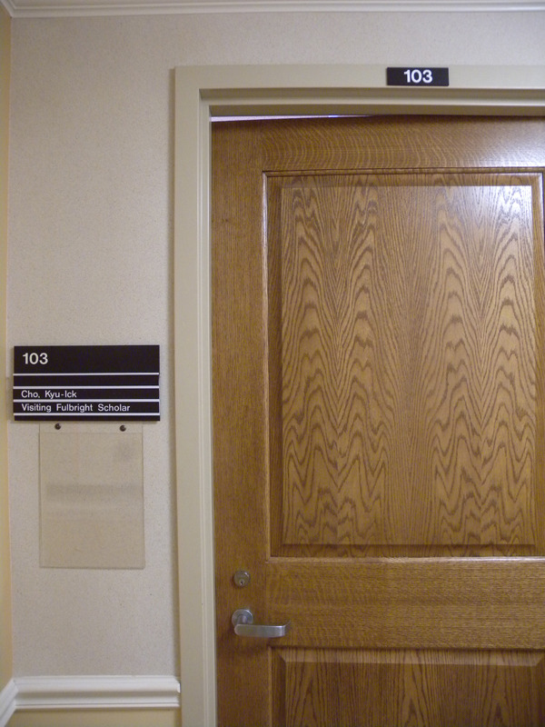
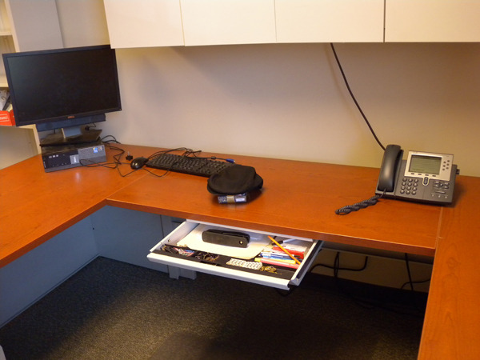
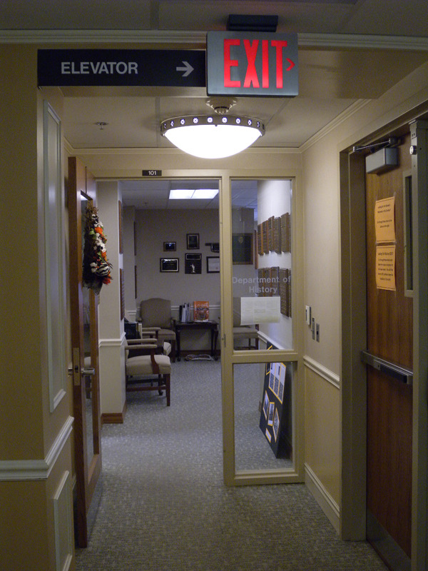
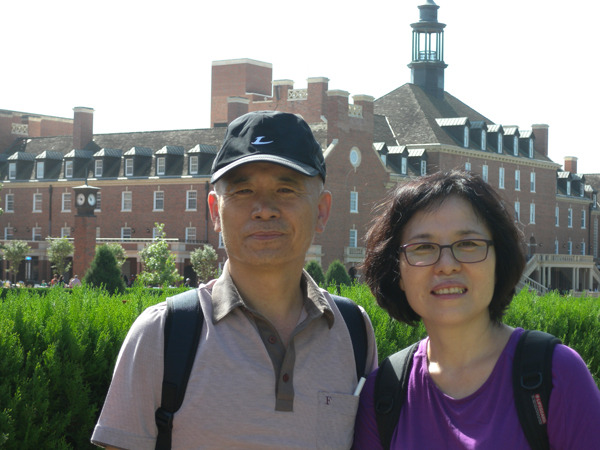
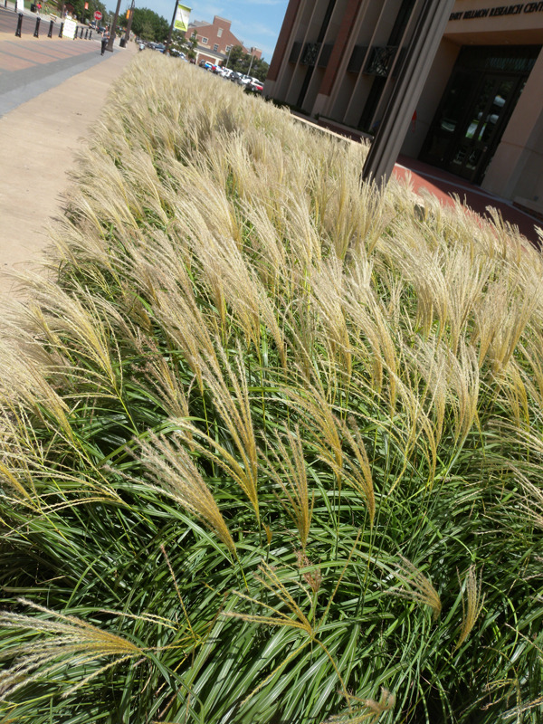
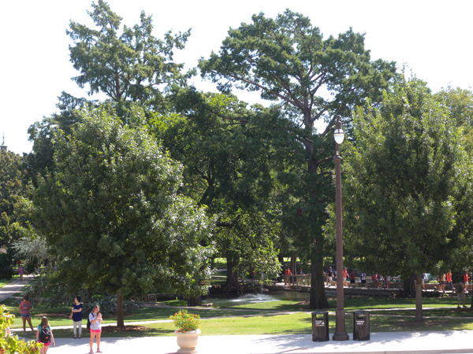

  
OSU 중앙도서관

  
역사학과가 들어있는 South Murray 홀

  
역사학과에 마련된 백규 연구실의 팻말

  
백규 연구실 출입문

  
백규연구실의 책상

  
역사학과 사무실 입구

  
OSU 캠퍼스에서(뒤쪽 건물이 Student Union Building)

  
교정을 걷던 도중 만난 억새풀

  
연구실 바깥으로 보이는 산책로

OSU 역사학과에 임시둥지를 틀고

자동차와 전화기 문제를 해결하지 못했고, 한국에서 부친 짐을 받지 못했으며, 무엇보다 끔찍한 시차조차 극복하지 못한 상황이었지만, 마냥 숙소에 머물러 있을 순 없었다. 우리가 도착했음을 알고 있을 학과장 로간(Michael F. Logan) 교수나 학과의 비서 미스 수잔(Susan, Oliver)과 다이아나(Diana Fury)의 존재가 궁금하고 미안하여 견딜 수 없었다. 도착 직후 보낸 이메일을 읽지 않고 있음을 확인한 다음 답답증을 견디다 못해 수전에게 전화를 하니 월요일은 근로자의 날이라 휴무란다. 이메일로 약속날짜를 잡는 등 제대로 된 의전(儀典)의 여유가 없는 상황. 우리는 집 앞으로 나가 셔틀버스에 몸을 실었다.

1890년 12월 25일 ‘오클라호마 지역 농업기술대학’으로 출범했기 때문일까. 한낮 40도에 육박하는 햇살 아래 걷기 어려울 만큼 OSU의 규모는 크고도 넓다. 어떤 지인의 말대로 한국에서 가장 넓은 캠퍼스를 자랑하는 K대학의 80배에 달한다니, 대학 자체가 말 그대로 하나의 타운이었다. 미국에서  들러 본 몇몇 대학들과 비교해도 월등하다. 파스텔 톤의 지붕에 붉은 벽돌로 지어진 건물들이 질서 있게 늘어서 있고, 건물들 사이사이로 파란 잔디와 무성한 교목(喬木)들이 열기를 식혀주고 있었다. 그 사이로 오렌지색 티셔츠를 간편하게 걸친 학생들이 삼삼오오 지나고 있었다. 대체로 '파스텔톤-레드-옐로우-그린'으로 어우러진 학교 전체의 색상은 파란 하늘과 아름다운 대비를 이루고 있었다. 

지도를 보며 학과 사무실과 연구실이 있다는 머레이(Murray)홀로 들어가니 건물 바로 1층에 널찍한 학과 사무실이 있었고, 비서 수잔과 다이아나가 우리를 반긴다. 그런데 학과 사무실 바로 옆에 낯익은 내 이름의 팻말이 걸린 ‘참한 연구실’이 마련되어 있는 것 아닌가. 참으로 반갑고도 고마운 일이었다. 수잔이 건네 준 열쇠로 문을 따고 들어가니 카펫 깔린 방 안에 정갈한 책상과 책장, 컴퓨터와 전화기 등 각종 사무용 비품들이 세심하게 갖추어져 있고, 나무 우거진 캠퍼스의 풍광이 한낮의 열기와 함께 창문 가득 밀려들고 있었다.

연구실을 확인한 뒤 학과장실로 찾아가니 중후한 노신사 로간 교수가 환대한다. 잠시 후 강의를 해야 한다는 그와 잠시 환담을 나눈 뒤 우리는 연구실로 돌아왔고, 아내는 ‘이런 멋진 곳에 단 6개월만 체류하는 게 아깝다’고 내내 아쉬워하는 표정이다. 이제 다음 주 화요일부터 이곳에서의 내 연구 활동은 본격적으로 시작된다!

공유하기

게시글 관리

**백규서옥\_Blog ver.**