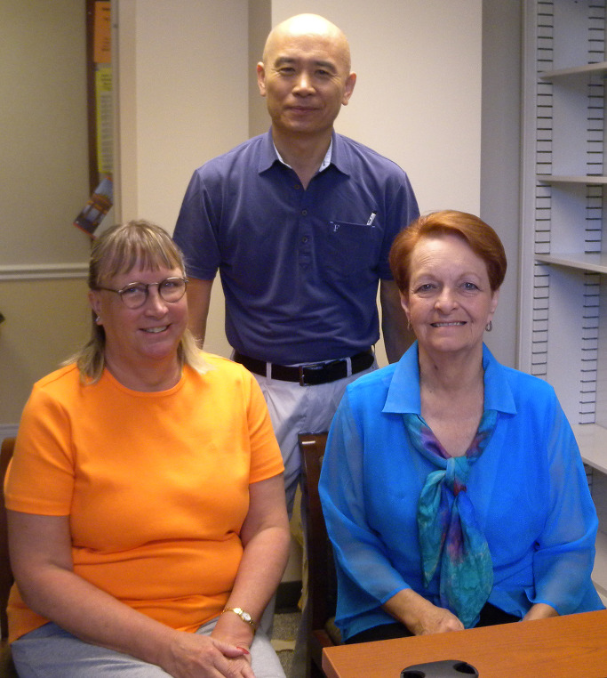
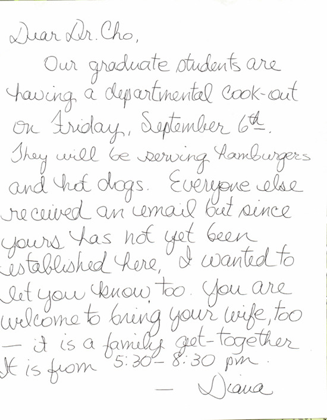

  
OSU의 백규 연구실에서. 왼쪽이 수잔, 오른쪽이 다이아나

  
둘쨋날 부재중에  다이아나가 써놓고 간 메모

학과 비서들과의 만남

Fulbright Scholar로 선정되었음을 통보 받은 뒤 미국 내의 연구기관을 정하고 그 책임자로부터 초청장을 받는 일이 가장 먼저 해결해야 할 일이었다. 간간이 들려오는 토네이도 소식이 좀 걸리긴 했으나, 학교의 자매대학들 가운데 하나였을 뿐 아니라 한적한 중남부에 위치해 있다는 점에서 ‘연구와 힐링’을 겸할 수 있다고 본 오클라호마 주립대학은 망설일 필요가 없는 적지(適地)였다.

우리의 인문대학에 해당하는 OSU의 ‘College of Arts and Sciences’의 대닐로위츠[Bret Danilowicz] 학장에게 이메일을 보내자 하루 만에 쾌락의 응답이 왔고, 그로부터 일주일 만에 역사학과 학과장 로간[Michael F. Logan] 교수로부터 초청장이 도착했다. 그런데 그 초청장 가운데 가장 감동적인 내용은 ‘선생님께서 이곳에 머무시는 동안 우리는 선생님께 연구실, 비서의 지원, 컴퓨터와 인터넷 서비스 등을 제공하게 될 것입니다’[During your stay here, we will be able to provide you with and office space, secretarial support and computer and internet access]라는 요지의 약속이었다. 그 중에서도 핵심은 ‘비서의 지원(secretarial support)’.

대학에서 ‘비서’는 으레 총장실에나 앉아 있는 묘령의 여직원으로 알고 있던 내 상식으로 ‘비서의 지원’을 제공하겠다는 로간 교수의 말은 묘한 감동과 호기심을 불러일으키기에 충분했다. 30년 가까이 한국에서 교수로 지내면서 제자 대학원생들이 대부분인 조교들로부터 강의와 연구에 도움을 받아오던 나로서는 학과 비서의 존재나 성격에 대하여 무지할 수밖에 없었다. 기억이 가물가물하지만, 우리나라에서 ‘하바드 대학의 공부벌레들’이란 제목의 책과 드라마로 번역・소개된 ‘The Paper Chase’가 한동안 대중의 인기를 끈 적이 있었다. 그 드라마의 주인공 킹스필드(Kingsfield) 교수에게 비서 노팅엄(Mrs. Nottingham)이 있었다. 외부인들 특히 학생들에게 타협을 모르던 고집스런 캐릭터였지만, 교수에겐 매우 충직한 비서였다. 이처럼 명비서 노팅엄[배우는 베티 하포드(Betty Harford)]의 존재 같은 간접자료를 통해 나는 겨우 미국 대학 학과들의 비서 상을 어렴풋이나마 파악하고 있었던 것이다.

이곳 역사학과의 비서는 수잔[Susan Oliver]과 다이아나[Diana Fury]인데, 한국에 있을 때 나는 주로 수잔과 메일을 주고받았다. 이메일을 보내자마자 간결하면서도 자상하게 답신을 보내주던 그녀 덕분에 나는 준비과정에서 많은 수고를 줄일 수 있었다. 그 과정에서 킹스필드 교수의 노팅엄을 잠시 잊은 채, 한결같이 ‘이쁘고’ 붙임성 좋은 한국의 비서들만 상상하게 되었던 것이다.

이곳으로 떠나오기 전 부친 짐의 배달과정에서 문제가 생겨 끙끙대다가 아무래도 학과 비서를 통해 알아보아야겠다는 계산으로 시차 적응도 안 된 사흘 만에 학과 사무실로 나가 수잔과 다이아나를 만났다. 중년 혹은 중년에 가까운 두 여성이 나를 맞았고, 그 가운데 약간 젊은 수잔이 매우 사무적으로 나를 배정된 연구실로 안내하면서 이런저런 설명을 하는 것 아닌가. 그 때서야 이곳이 미국이고, 미국 대학의 학과들에는 노팅엄만 있을 뿐, 한국의 비서들은 없음을 비로소 깨닫게 되었다. 내가 미국 우체국으로부터 받은 전화번호와 연락처를 주며 좀 알아봐 달라고 부탁하자 ‘Yes!’하며 나가더니 돌아올 기미가 없었다. 한참을 기다리다가 하는 수 없이 학과 사무실에 가서 다이아나에게 수잔의 행방을 물은 즉 짐을 찾으러 우체국에 나갔다는 것이다.

 아뿔싸, 엄청난 무게의 박스 두 개를 연약한 여성이 어찌 다룰 수 있단 말인가. 이곳 스틸워터(Stillwater)의 지리에 어두웠던 나는 다만 내 짐이 어느 우체국에 보관되어 있으며, 어떤 방법으로 그것을 찾아야 하는지만 알고자 했으나, 그녀는 내 말을 듣자마자 해당 우체국으로 달려간 것이었다. 조교에게 우체국 편지 심부름조차 시키길 꺼려하던 나인지라, 그 소식에 안절부절 할 수밖에 없었다. 40 만 원 이상의 탁송료가 들었던 박스 두 개의 중량이 미안함으로 내 마음을 짓눌렀다. 아무리 비서라지만, 첫 대면에 짐꾼 노릇을 명(命)한 셈이니, 마음이 편할 리 없었다. 남아 있던 다이아나에게 사실 내 의도는 그게 아니었노라고 구구하게 해명했지만, 그녀의 말은 간단했다. ‘It’s our duty!’란다. 결국 수잔을 만나지 못한 채 우리는 집으로 돌아왔고, 하루 뒤 다시 들른 내 연구실에는 태평양을 건너 온 박스 두 개가 오롯이 앉아 있었다. 그리고 다시 만난 수잔, 박스에 대한 언급은 입도 뻥긋 아니 한 채 우리를 맞아 주는 게 아닌가.

그 해프닝을 통해 ‘제 할 일에만 충실한’ 미국인들의 업무 철학을 어렴풋이나마 깨닫게 되었다. 연구실을 중심으로 일어나는 교수들의 일을 충실하게 거들고 해결해주는 것이 학과 비서들의 업무이고, 그것을 충실히 이행하는 것이 자신들의 본업임을 그들은 몸으로 보여주고 있었던 것이다. ‘그녀가 혹 생색이라도 내면 어쩌나?’하고 걱정하던 내게, 그녀는 ‘사무실의 꽃’이 아닌 충직한 전문가로서의 존재의미를 120% 보여주고 말았다. 미국 도착 이후 내 인식의 한계가 심각하게 도전을 받은 첫 사례였다.

공유하기

게시글 관리

**백규서옥\_Blog ver.**