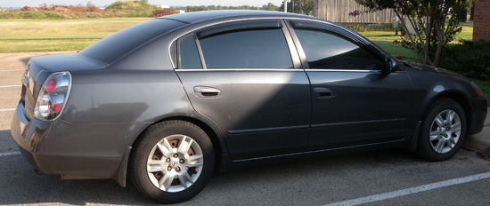

자동차를 구입하고

15년 전 미국에서 자동차 때문에 겪어야 했던 고생이 재미 동포들에 대한 부정적 인식의 한 요인으로 내 마음에 고착되어 있음을 이번에 확인하게 되었다. 당시 우리는 미국 도착 3일 만에 어떤 동포로부터 겁 없이 자동차를 구입했고, 그 자동차를 처분할 때까지 찜찜하게 1년을 보내야 했다. 시동이 안 걸린다거나 가다가 서는 등 심각한 문제는 결코 없었으되, 100% 말끔하지 않으면 만족할 수 없는 내 성격 탓에 당시 그 자동차는 모든 불쾌함과 스트레스의 근원이었다. 제반 조건들을 찬찬히 살피고 치밀하게 고려한 뒤 판단을 내려야 후회 없이 자동차를 살 수 있다는 것은 자동차의 천국 미국에서 그 때 얻은 교훈이기도 하다. 대도시 몇을 빼곤 대중교통이 거의 갖추어져 있지 않은 미국 땅에서 자동차 없이 살아간다는 것은 불가능에 가깝다. 옛날 우리네 부모님들이 하루를 꼬박 걸려 면 소재지 장터를 걸어서 다니셨듯 섭씨 40도를 육박하는 날씨에 걸어서 월마트니 베스트바이니 스테이플스니 세탁소니 학교 연구실 등을 돌아다닐 순 없는 일 아닌가. 특히 다른 도시나 지방을 가게 되는 경우엔 마땅한 방법이 없다. 이처럼 모든 것들에 앞서 해결해야 할 것이 자동차 구입인데, 워낙 돈 단위가 크고 신경 쓸 부분이 많아서인지 대부분 미국 정착 과정의 맨 나중에 자동차 문제를 해결하기 마련이다.

6개월 동안 탈 것이므로 새 차를 살 필요는 없고, 여러 조건들을 꼼꼼히 살핀 뒤에 같은 값이면 최상의 중고차를 구입하라면서 틈틈이 각종 사이트의 정보를 알려주시는 OSU 기계공학과 장영배 교수님의 조언을 토대로 자동차의 탐색에 나섰다.[사실 이 분의 조언이 아니었다면, 성미 급한 우리는 약간의 불편함을 참지 못하고 며칠 만에 덜컥 사버렸을 것이다!] 자동차의 대국답게 자동차를 거래하는 공적, 사적 사이트들이 엄청나게 발달되어 있는 미국이다. ‘연식, 제조사, 마일리지, 가격, 지역, 판매자 연락처’ 등을 달고 있는 신차 및 중고차들이 각 사이트마다 무수히 나열되어 있다. 간단히 연식과 제조사, 마일리지 및 자동차의 내・외관 등을 입력하면 상・중・하로 구분된 적정 구입가격까지 산정하여 보여주기도 하고, 그런 정보들을 입력하면 사고자 하는 자동차종에 어떤 문제들이 보고되었으며, 혹시 그 차종이 ‘사지 말아야 할 자동차’ 리스트에 속해 있는지 여부를 보여주기도 한다. 그 뿐 아니다. 약간의 돈을 내고 VIN[한국에서의 차대 번호?]을 조회하면 사고내용이나 수리 이력을 알려주기도 한다. 그러니 적당히 눈속임으로 자동차를 팔아먹을 엄두도 내지 못하는 것이 상식을 갖춘 이곳 사람들의 생각이다. 이렇게 가혹한 환경에서 근래 우리나라 자동차 회사들이 선전(善戰)하는 이면에 그들의 눈물겨운 노력이 있었음을 우리는 비로소 알게 되었다. 중고 자동차 한 대를 사기 위해 이곳 저곳 다니면서 우리는 미국사회를 지탱하는 힘의 한 부분이 투명성에 있다는 점 또한 깨닫게 되었다.

미국 도착 거의 한 주 만에 드디어 자동차 한 대를 구입하게 되었다. 작은 도시 스틸워터에 있는 딜러샵들을 대충 다 둘러보았을 뿐 아니라 개인적으로 팔기 위해 사이트에 내 놓은 차들을 여러 대 보고 나서도 만족스런 차를 발견하지 못한 우리였다. 이제 자동차 없이는 더 지탱할 수 없다는, 인내의 한계에 도달했을 즈음. 인근 에드몬드 시의 한인 교회 이종태 목자님이 운영하는 사이트에 사연을 올리자마자 좋은 차가 나타났다는 그 분의 답 글이 있었고, 우리는 장 교수님의 차로 한 시간 거리의 그곳에 가서 드디어 그 차를 사게 되었다. 장 교수님과 이 목자님의 적극적인 도움으로 딜러를 설득하여 조건이 좋은 중고차를 합리적인 가격에 구입할 수 있었던 것이다. 드넓은 미국 땅에서 드디어 날개를 달게 된 우리는 단 하루 만에 스틸워터의 도로망을 대충 섭렵하게 되었고, 땀 흘리지 않고 연구실에 나갈 수 있게 되었으니! 차 없는 동안 쌓인 스트레스가 날아가면서 덩달아 시차에서 오는 피로 또한 눈 녹듯 사라지는 어제 오늘이다.

공유하기

게시글 관리

**백규서옥\_Blog ver.**